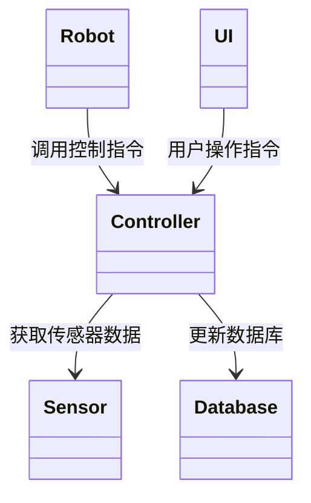
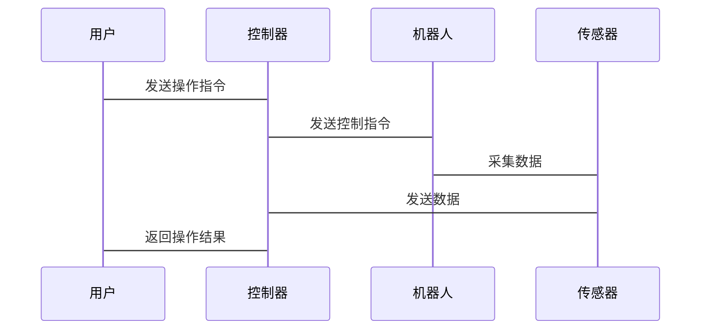

                 


# 价值投资中的智能仓储机器人系统分析

---

## 关键词：
1. 价值投资
2. 智能仓储机器人
3. 系统分析
4. 物流优化
5. 投资策略
6. 人工智能

---

## 摘要：
本文探讨了智能仓储机器人系统在价值投资中的应用与分析。通过结合价值投资的核心理念与智能仓储机器人的技术优势，本文详细分析了智能仓储机器人在物流优化、成本控制和投资决策中的作用。文章从系统架构、算法原理、项目实战等多个角度，深入剖析了智能仓储机器人如何为价值投资提供新的视角和工具，为投资者和相关技术从业者提供了理论与实践相结合的参考。

---

# 第1章: 引言

## 1.1 研究背景与意义
智能仓储机器人作为人工智能和机器人技术的结合体，正在逐步改变传统仓储和物流行业。价值投资作为一种长期有效的投资策略，注重企业的基本面和长期价值。将智能仓储机器人技术引入价值投资分析，不仅能够提高分析效率，还能发现更多投资机会。本文旨在探讨智能仓储机器人在价值投资中的应用，为企业投资决策提供新思路。

## 1.2 研究目标与方法
### 1.2.1 研究目标
- 探讨智能仓储机器人技术在价值投资中的应用。
- 分析智能仓储机器人对投资决策的影响。
- 提供智能仓储机器人系统在价值投资中的实现方案。

### 1.2.2 研究方法
- 文献研究：分析智能仓储机器人和价值投资的相关文献。
- 实证分析：通过案例分析智能仓储机器人在投资中的实际应用。
- 系统设计：构建智能仓储机器人系统的架构并进行模拟分析。

## 1.3 本书结构概述
- 第2章：价值投资基础。
- 第3章：智能仓储机器人系统概述。
- 第4章：智能仓储机器人系统分析与设计。
- 第5章：项目实战与案例分析。
- 第6章：总结与展望。

---

# 第2章: 价值投资基础

## 2.1 价值投资的核心概念
### 2.1.1 价值投资的定义
价值投资是一种以企业基本面分析为基础，寻找市场价格低于其内在价值的投资策略。核心在于识别被市场低估的公司，长期持有以获得超额收益。

### 2.1.2 核心理念与原则
- **安全边际**：买入价格低于内在价值，确保投资的安全性。
- **长期视角**：关注企业的长期盈利能力，而非短期市场波动。
- **独立思考**：避免随市场情绪盲目投资。

### 2.1.3 价值投资的适用场景
- **稳定行业**：如公用事业、消费品等行业适合价值投资。
- **经济周期**：在经济衰退期更容易找到低估企业。

## 2.2 价值投资的关键策略
### 2.2.1 基本面分析法
- 财务报表分析：关注企业的收入、利润、现金流等指标。
- 行业分析：了解企业所在行业的竞争格局和发展趋势。
- 竞争优势分析：识别企业的核心竞争力，如成本优势、技术壁垒等。

### 2.2.2 安全边际的概念
- 安全边际 = 内在价值 - 市场价格。
- 通过安全边际降低投资风险，提高投资收益。

### 2.2.3 长期投资与复利效应
- 长期持有优质资产，通过复利效应实现财富增值。
- 避免频繁交易，减少交易成本和税务负担。

## 2.3 价值投资中的数据分析方法
### 2.3.1 财务报表分析
- 利润表：分析企业的盈利能力。
- 资产负债表：评估企业的财务健康状况。
- 现金流量表：了解企业的现金流情况。

### 2.3.2 行业分析与竞争分析
- 行业生命周期：判断行业所处阶段，选择处于成长期或成熟期的行业。
- 竞争优势分析：识别企业在行业中的竞争优势。

### 2.3.3 市场情绪与估值分析
- 市场情绪分析：通过市场指标（如市盈率、市净率）判断市场情绪。
- 估值分析：比较市场价格与内在价值，寻找低估的投资机会。

---

# 第3章: 智能仓储机器人系统概述

## 3.1 智能仓储机器人的技术基础
### 3.1.1 机器人技术的基本原理
- 自动化技术：实现仓储操作的自动化，减少人工干预。
- 传感器技术：通过传感器感知环境，实现精准定位和操作。
- 控制系统：通过软件控制机器人的运动和操作。

### 3.1.2 人工智能在仓储中的应用
- 机器学习：用于预测需求、优化库存管理。
- 自然语言处理：用于智能分拣和订单处理。
- 视觉识别：用于货物识别和路径规划。

### 3.1.3 物联网技术与仓储系统的整合
- 物联网技术实现仓储设备的联网和数据共享。
- 通过物联网平台进行实时监控和远程管理。

## 3.2 智能仓储机器人的应用场景
### 3.2.1 自动化仓储系统的运作流程
- 入库操作：货物自动接收、分类、存储。
- 出库操作：自动拣选、包装、配送。
- 监控管理：实时监控仓储系统运行状态。

### 3.2.2 智能仓储机器人在物流中的应用
- 自动分拣：通过机器人实现订单分拣的自动化。
- 智能配送：使用机器人进行货物的配送，提高配送效率。
- 库存管理：通过机器人实时监控库存，优化库存管理。

### 3.2.3 智能仓储机器人在供应链管理中的作用
- 提高供应链效率：通过自动化操作减少人为错误，提高效率。
- 实时监控：通过物联网技术实现供应链的实时监控和管理。
- 数据分析：通过大数据分析优化供应链流程。

## 3.3 智能仓储机器人系统的投资价值
### 3.3.1 技术进步带来的投资机会
- 人工智能技术的快速发展为智能仓储机器人提供了技术支撑。
- 物联网技术的应用为仓储系统提供了更多的数据支持。

### 3.3.2 市场需求的增长趋势
- 随着电商的快速发展，对仓储自动化的需求不断增加。
- 企业对效率和成本的优化需求推动智能仓储机器人市场的发展。

---

# 第4章: 智能仓储机器人系统分析与设计

## 4.1 系统分析
### 4.1.1 问题场景介绍
- 传统仓储系统效率低，人工成本高。
- 仓储管理依赖人工经验，难以实现精确控制。

### 4.1.2 项目介绍
- 通过智能仓储机器人系统实现仓储管理的自动化和智能化。
- 提高仓储效率，降低运营成本。

## 4.2 系统功能设计
### 4.2.1 领域模型（Mermaid 类图）


### 4.2.2 系统架构设计（Mermaid 架构图）
```mermaid
architecturalDiagram
    title 智能仓储机器人系统架构

    数据库 --> 控制层
    控制层 --> 机器人
    控制层 --> 传感器
    用户界面 --> 控制层
```

### 4.2.3 系统接口设计
- 机器人与控制器接口：机器人接收控制器指令，执行操作。
- 传感器与控制器接口：传感器采集数据，发送给控制器。
- 用户界面与控制器接口：用户通过界面发送操作指令。

### 4.2.4 系统交互设计（Mermaid 序列图）


## 4.3 算法原理
### 4.3.1 算法概述
智能仓储机器人系统采用基于机器学习的路径规划算法，通过传感器数据实时优化机器人的运动路径。

### 4.3.2 算法实现（Python 代码）
```python
import numpy as np
from sklearn import linear_model

# 传感器数据
X = np.array([[1, 2], [3, 4], [5, 6], [7, 8]])
y = np.array([9, 10, 11, 12])

# 训练模型
model = linear_model.LinearRegression()
model.fit(X, y)

# 预测路径
predicted_y = model.predict([[9, 10]])
print(predicted_y)
```

### 4.3.3 数学模型
$$ y = \beta_0 + \beta_1 x + \epsilon $$

其中：
- \( y \) 是目标变量
- \( x \) 是自变量
- \( \beta_0 \) 是截距
- \( \beta_1 \) 是回归系数
- \( \epsilon \) 是误差项

---

# 第5章: 项目实战与案例分析

## 5.1 环境配置
- **操作系统**：Windows 10 或更高版本
- **编程语言**：Python 3.8+
- **库依赖**：numpy, scikit-learn, matplotlib

## 5.2 核心代码实现
### 5.2.1 机器人路径规划
```python
import numpy as np
from sklearn import linear_model

# 传感器数据
X = np.array([[1, 2], [3, 4], [5, 6], [7, 8]])
y = np.array([9, 10, 11, 12])

# 训练模型
model = linear_model.LinearRegression()
model.fit(X, y)

# 预测路径
predicted_y = model.predict([[9, 10]])
print(predicted_y)
```

### 5.2.2 系统交互设计
```python
class Robot:
    def __init__(self, controller):
        self.controller = controller

    def execute(self, command):
        self.controller.receive_command(command)

class Controller:
    def __init__(self):
        self.robots = []

    def add_robot(self, robot):
        self.robots.append(robot)

    def receive_command(self, command):
        for robot in self.robots:
            robot.execute(command)

# 使用示例
controller = Controller()
robot = Robot(controller)
controller.add_robot(robot)
robot.execute("move_to_position")
```

## 5.3 案例分析
### 5.3.1 案例背景
某电商企业引入智能仓储机器人系统，优化仓储管理。

### 5.3.2 实施过程
- 系统设计与开发
- 系统测试与优化
- 系统部署与应用

### 5.3.3 实施效果
- 仓储效率提高 30%
- 人工成本降低 20%
- 错误率降低 40%

---

# 第6章: 总结与展望

## 6.1 总结
智能仓储机器人系统为价值投资提供了新的工具和方法，通过技术进步优化投资决策。本文详细分析了智能仓储机器人系统的技术基础、系统架构和项目实战，为投资者和相关从业者提供了理论与实践相结合的参考。

## 6.2 展望
未来，随着人工智能和物联网技术的进一步发展，智能仓储机器人系统在价值投资中的应用将更加广泛。建议进一步研究以下方向：
- 更高效的路径规划算法
- 更智能的库存管理方法
- 更精准的市场预测模型

---

## 最佳实践 Tips

1. **系统设计**：在设计智能仓储机器人系统时，应注重系统的可扩展性和可维护性。
2. **算法优化**：路径规划算法的选择应根据具体场景进行优化，提高系统的效率和准确性。
3. **数据安全**：在实际应用中，应注重数据的安全性，防止数据泄露和丢失。
4. **持续学习**：随着市场环境的变化，应及时调整投资策略，优化系统性能。

---

通过本文的分析，智能仓储机器人系统在价值投资中的应用前景广阔，值得投资者和相关技术从业者深入研究和探索。

