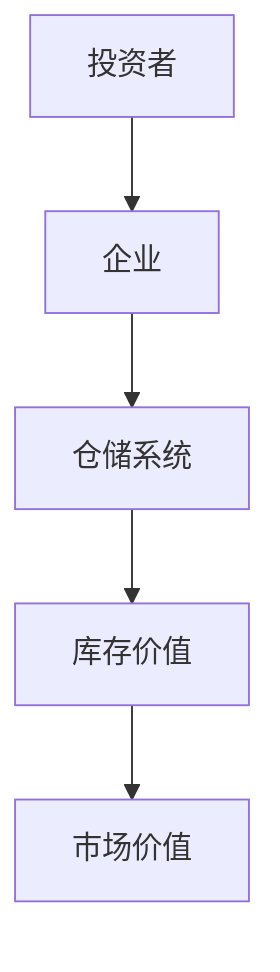
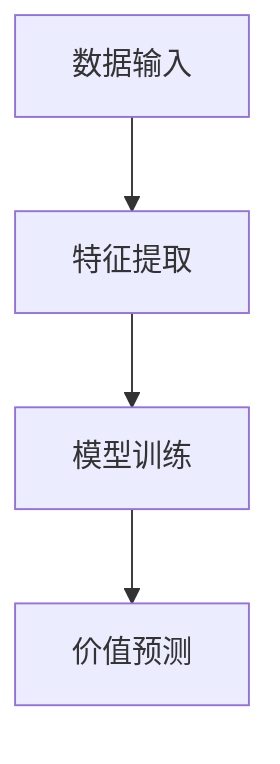
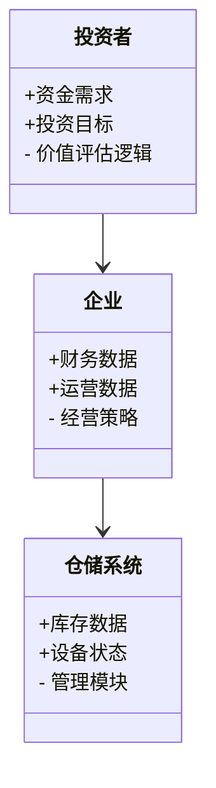
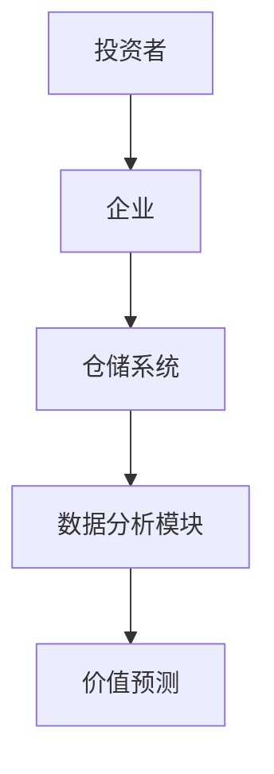

                 


# 价值投资中的智能仓储自动化系统分析

## 关键词：价值投资、智能仓储、自动化系统、算法原理、系统架构

## 摘要：本文探讨了智能仓储自动化系统在价值投资中的应用，分析其如何通过提高效率和降低成本影响企业价值，并结合算法和系统架构设计，提供投资决策的参考。

---

# 第一部分: 智能仓储自动化系统的背景与核心概念

## 第1章: 背景介绍

### 1.1 智能仓储自动化系统的概念与背景
- **定义与特点**：智能仓储系统利用自动化设备和AI技术，优化库存管理和货物处理。
- **演进历程**：从手动操作到半自动化，再到现在的智能化阶段。
- **与价值投资的结合**：通过提高效率和降低成本，增强企业盈利能力，吸引投资者。

### 1.2 价值投资的基本原理
- **核心概念**：寻找被低估的企业，长期持有。
- **在企业评估中的应用**：分析企业的财务表现、运营效率和市场地位。
- **仓储系统对企业价值的影响**：高效的仓储管理能提升库存周转率，降低成本，增强企业竞争力。

### 1.3 系统组成部分
- **仓储管理系统（WMS）**：管理库存、订单和货物跟踪。
- **自动化设备**：AGV、分拣机器人等提高处理效率。
- **数据分析系统**：利用大数据优化库存管理和预测销售。

---

## 第2章: 核心概念与联系

### 2.1 核心概念与联系
- **仓储系统属性对比**：表1展示了传统仓储与智能仓储在效率、成本和准确性的对比。

| 特性        | 传统仓储       | 智能仓储       |
|-------------|----------------|----------------|
| 效率        | 低             | 高             |
| 成本        | 高             | 低             |
| 准确性      | 中             | 高             |

- **ER实体关系图**：展示了投资者、企业、仓储系统和库存价值之间的关系。



---

## 第3章: 算法原理与系统架构

### 3.1 仓储价值预测算法
- **流程图**：展示数据输入、特征提取、模型训练和价值预测的步骤。



- **Python代码示例**：使用线性回归模型预测仓储价值。

```python
import pandas as pd
from sklearn.linear_model import LinearRegression

# 示例数据
data = pd.DataFrame({
    '自动化程度': [0.2, 0.3, 0.4, 0.5],
    '库存周转率': [1.2, 1.5, 1.8, 2.0]
})

# 模型训练
model = LinearRegression()
model.fit(data[['自动化程度']], data['库存周转率'])

# 预测新值
new_automatic = 0.6
predicted_turnover = model.predict([[new_automatic]])
print(f"预测的库存周转率为：{predicted_turnover[0]}")
```

- **数学模型**：使用回归分析预测仓储系统的投资回报。

$$ 预测价值 = \beta_0 + \beta_1 \times 自动化程度 $$

---

## 第4章: 系统架构与项目实战

### 4.1 系统架构设计
- **领域模型类图**：展示系统中各角色及关系。



- **系统架构图**：展示前端、后端和数据库的交互。



---

## 第5章: 项目实战与案例分析

### 5.1 项目实战
- **环境安装**：安装Python、Pandas、Scikit-learn等工具。
- **代码实现**：编写数据处理和预测模型的代码。

```python
import pandas as pd
from sklearn.ensemble import RandomForestRegressor

# 数据加载与预处理
data = pd.read_csv('storage_data.csv')
X = data[['自动化程度', '库存周转率']]
y = data['市场价值']

# 模型训练
model = RandomForestRegressor()
model.fit(X, y)

# 预测新数据
new_data = pd.DataFrame({
    '自动化程度': [0.7],
    '库存周转率': [2.2]
})
predicted_value = model.predict(new_data)
print(f"预测的市场价值为：{predicted_value[0]}")
```

### 5.2 案例分析
- **案例背景**：某企业引入智能仓储系统，分析其价值变化。
- **分析与结果**：仓储系统的引入显著提高了库存周转率，降低了成本，市场价值提升。

---

## 第6章: 总结与展望

### 6.1 总结
智能仓储系统通过提升效率和降低成本，直接影响企业的市场价值。价值投资者应关注企业的自动化转型，评估其对财务表现的积极影响。

### 6.2 展望
未来，AI和大数据将进一步优化仓储系统，预测模型将更精准，投资者需持续关注技术创新带来的投资机会。

---

## 第7章: 最佳实践与注意事项

### 7.1 投资建议
- **深入研究企业自动化转型**：评估其对财务指标的影响。
- **关注技术供应商**：选择可靠的技术合作伙伴。
- **风险评估**：考虑技术实施的风险和成本。

### 7.2 注意事项
- **数据质量**：确保数据的准确性和完整性。
- **模型局限性**：预测模型基于历史数据，未来变化可能影响准确性。

### 7.3 拓展阅读
推荐阅读《智能仓储系统的技术创新》和《价值投资实战策略》。

---

通过以上分析，投资者可以更好地理解智能仓储系统在价值投资中的重要性，并做出更明智的投资决策。

