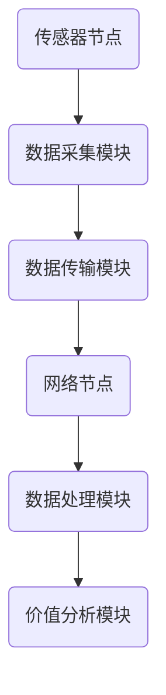
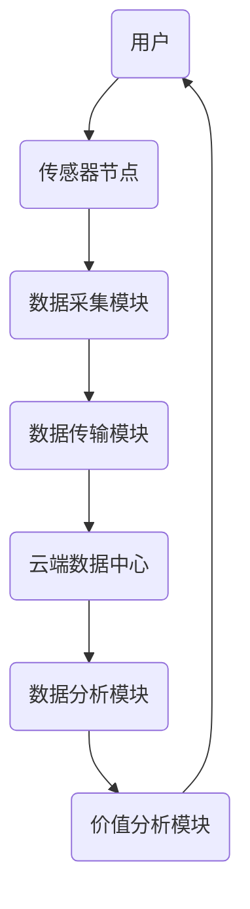
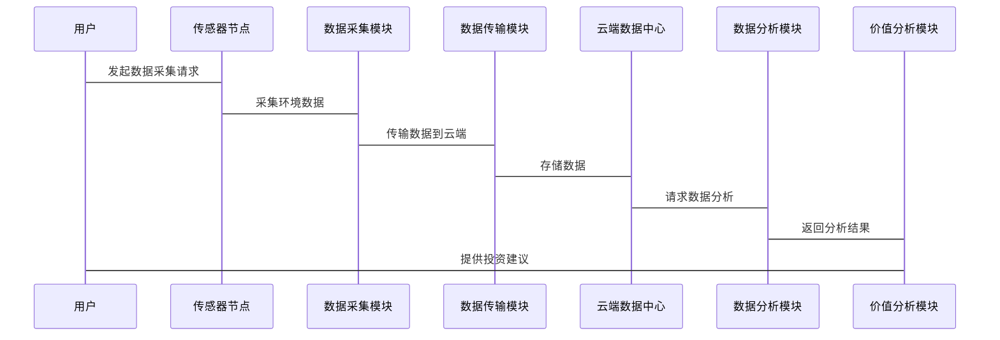
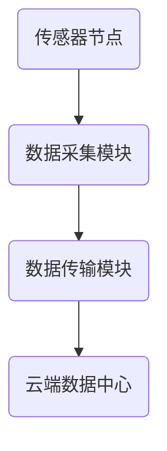
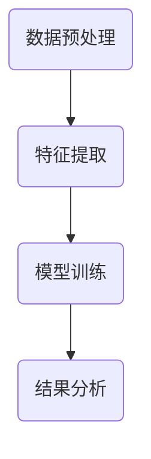

                 


# 价值投资中的智能农业传感器网络分析

## 关键词：
- 智能农业传感器网络
- 价值投资
- 数据分析
- 系统架构
- 投资策略

## 摘要：
本文探讨了智能农业传感器网络在价值投资中的应用，分析了传感器网络的数据采集、处理和分析过程，并结合实际案例，提出了基于传感器数据的投资策略。文章详细阐述了传感器网络的架构、算法原理及系统设计，并通过项目实战展示了如何利用传感器数据进行农业投资决策。

---

# 第1章 背景介绍

## 1.1 智能农业传感器网络的基本概念

### 1.1.1 智能农业传感器网络的定义

智能农业传感器网络是一种用于监测和管理农业生产环境的网络系统，通过传感器节点实时采集农田中的各种数据，如温度、湿度、光照强度、土壤湿度等，并通过无线通信技术将数据传输到数据处理中心，进行分析和决策支持。

### 1.1.2 传感器节点的结构与功能

传感器节点通常由数据采集模块、数据处理模块和通信模块组成。数据采集模块负责采集环境数据，数据处理模块对采集的数据进行初步处理和存储，通信模块负责将数据传输到云端或数据中心。

### 1.1.3 传感器网络的组网方式

传感器网络的组网方式主要包括星型网络、树状网络和网状网络。网状网络因其良好的扩展性和可靠性，常用于农业传感器网络的部署。

## 1.2 价值投资中的农业数据分析

### 1.2.1 价值投资的基本概念

价值投资是一种投资策略，通过分析企业的内在价值，寻找市场价格低于内在价值的投资机会。在农业领域，价值投资可以应用于农产品价格预测、农业生产效率分析等方面。

### 1.2.2 农业数据在投资决策中的作用

农业数据，如天气数据、土壤数据、作物生长数据等，能够帮助投资者预测农产品的产量和价格走势，从而做出更准确的投资决策。

### 1.2.3 智能传感器网络在农业数据采集中的优势

智能传感器网络能够实时、准确地采集农业环境数据，为投资者提供及时、可靠的数据支持，帮助其做出科学的投资决策。

## 1.3 智能农业传感器网络与价值投资的结合

### 1.3.1 数据驱动的投资决策模式

通过传感器网络采集的农业数据，投资者可以分析农产品的生产周期、成本变化、市场需求等，从而制定更精准的投资策略。

### 1.3.2 传感器网络在农业数据采集中的应用

传感器网络能够实现对农田环境的全面监测，帮助投资者了解农业生产中的各种变量，从而预测农产品的市场供应和价格走势。

### 1.3.3 数据分析对投资价值的影响

通过对传感器数据的分析，投资者可以发现农业生产中的潜在风险和机会，从而优化投资组合，提高投资回报率。

## 1.4 本章小结

本章介绍了智能农业传感器网络的基本概念、结构和组网方式，探讨了农业数据在价值投资中的作用，以及传感器网络在农业数据采集中的优势，为后续章节的分析奠定了基础。

---

# 第2章 智能农业传感器网络的核心概念与联系

## 2.1 核心概念的原理分析

### 2.1.1 传感器节点的功能模块

传感器节点的功能模块包括数据采集模块、数据处理模块和通信模块。数据采集模块负责采集环境数据，数据处理模块对数据进行初步处理和存储，通信模块负责将数据传输到云端或数据中心。

### 2.1.2 传感器数据的采集与传输

传感器数据的采集与传输过程包括数据采集、数据预处理、数据压缩和数据传输。数据预处理包括去除噪声、归一化处理等，数据压缩技术如哈夫曼编码用于减少数据传输量。

### 2.1.3 网络协议的选择与优化

在传感器网络中，常用无线通信协议包括ZigBee、LoRa、NB-IoT等。选择协议时需考虑网络覆盖范围、功耗、传输速率等因素。优化协议参数可以提高网络的可靠性和传输效率。

## 2.2 核心概念的属性特征对比

### 2.2.1 不同传感器节点的性能对比

不同传感器节点的性能对比包括数据采集精度、功耗、通信距离、节点成本等因素。例如，ZigBee传感器节点适用于短距离、低功耗的场景，而LoRa传感器节点适用于长距离、低功耗的场景。

### 2.2.2 数据传输的可靠性与实时性

传感器网络的数据传输需要考虑可靠性和实时性。可靠性高的网络能够保证数据的准确传输，实时性高的网络能够快速响应数据变化。

### 2.2.3 网络覆盖范围与数据密度的关系

网络覆盖范围越大，数据密度越高，数据传输的复杂性也越高。需要通过优化网络架构和协议参数来平衡覆盖范围和数据密度。

## 2.3 ER实体关系图架构

以下是智能农业传感器网络的ER实体关系图：



## 2.4 本章小结

本章分析了智能农业传感器网络的核心概念，包括传感器节点的功能模块、数据采集与传输过程、网络协议的选择与优化，以及不同传感器节点的性能对比。通过ER实体关系图展示了系统架构，为后续的算法分析和系统设计提供了基础。

---

# 第3章 智能农业传感器网络的算法原理

## 3.1 数据采集与预处理算法

### 3.1.1 数据采集的流程

数据采集的流程包括传感器节点采集数据、数据预处理、数据存储和数据传输。数据预处理包括去除噪声、归一化处理等，数据存储可以采用分布式数据库。

### 3.1.2 数据清洗与特征提取

数据清洗包括去除异常值、填补缺失值等。特征提取可以通过主成分分析（PCA）等方法进行，提取影响农产品价格的关键特征。

### 3.1.3 数据预处理的代码实现

以下是一个数据预处理的Python代码示例：

```python
import pandas as pd
from sklearn.preprocessing import StandardScaler

# 读取数据
data = pd.read_csv('agriculture_data.csv')

# 去除异常值
data = data[(data['temperature'] <= 30) & (data['temperature'] >= 5)]

# 填补缺失值
data['humidity'].fillna(data['humidity'].mean(), inplace=True)

# 标准化处理
scaler = StandardScaler()
data_scaled = scaler.fit_transform(data)
```

## 3.2 数据分析与特征提取

### 3.2.1 数据分析的基本方法

数据分析的基本方法包括描述性分析、回归分析、聚类分析等。描述性分析用于了解数据的基本特征，回归分析用于预测农产品价格，聚类分析用于划分不同区域的农业生产情况。

### 3.2.2 特征提取的数学模型

特征提取的数学模型可以使用主成分分析（PCA）进行降维，也可以使用LASSO回归进行特征选择。PCA通过线性组合提取主成分，LASSO回归通过L1范数优化选择重要特征。

### 3.2.3 特征提取的代码实现

以下是一个使用PCA进行特征提取的Python代码示例：

```python
from sklearn.decomposition import PCA

# 初始化PCA模型，提取两个主成分
pca = PCA(n_components=2)

# 拟合并转换数据
pca.fit_transform(data_scaled)
```

## 3.3 数据分析与预测模型

### 3.3.1 数据分析的基本方法

数据分析的基本方法包括回归分析、时间序列分析等。回归分析用于预测农产品价格，时间序列分析用于预测产量趋势。

### 3.3.2 数据分析的数学模型

回归分析的数学模型如下：

$$ y = \beta_0 + \beta_1x_1 + \beta_2x_2 + \epsilon $$

其中，$y$ 是预测的农产品价格，$x_1$ 和 $x_2$ 是影响价格的特征变量，$\beta_0$、$\beta_1$、$\beta_2$ 是回归系数，$\epsilon$ 是误差项。

### 3.3.3 数据分析的代码实现

以下是一个回归分析的Python代码示例：

```python
import numpy as np
from sklearn.linear_model import LinearRegression
from sklearn.metrics import mean_squared_error

# 训练回归模型
model = LinearRegression()
model.fit(X_train, y_train)

# 预测测试数据
y_pred = model.predict(X_test)

# 计算均方误差
mse = mean_squared_error(y_test, y_pred)
print('均方误差:', mse)
```

## 3.4 本章小结

本章详细介绍了智能农业传感器网络中的数据采集与预处理算法，包括数据采集流程、数据清洗与特征提取，以及数据分析与预测模型的实现。通过Python代码示例和数学模型的分析，帮助读者理解传感器网络在农业数据分析中的应用。

---

# 第4章 智能农业传感器网络的数学模型

## 4.1 数据分析的数学模型

### 4.1.1 线性回归模型

线性回归模型用于预测农产品价格，数学模型如下：

$$ y = \beta_0 + \beta_1x_1 + \beta_2x_2 + \epsilon $$

其中，$y$ 是预测的农产品价格，$x_1$ 和 $x_2$ 是影响价格的特征变量，$\beta_0$、$\beta_1$、$\beta_2$ 是回归系数，$\epsilon$ 是误差项。

### 4.1.2 时间序列分析模型

时间序列分析模型用于预测农产品产量，数学模型如下：

$$ y_t = \phi_1y_{t-1} + \phi_2y_{t-2} + \theta_1\epsilon_{t-1} + \epsilon_t $$

其中，$y_t$ 是第$t$期的产量，$\phi_1$ 和 $\phi_2$ 是自回归系数，$\theta_1$ 是移动平均系数，$\epsilon_t$ 是白噪声。

## 4.2 数据分析的优化模型

### 4.2.1 非线性回归模型

非线性回归模型用于复杂的数据关系，数学模型如下：

$$ y = f(x_1, x_2, \beta) + \epsilon $$

其中，$f$ 是非线性函数，$\beta$ 是参数。

### 4.2.2 支持向量机模型

支持向量机模型用于分类和回归，数学模型如下：

$$ y = \text{sign}(\sum_{i=1}^n \alpha_i y_i x_i \cdot x + b) $$

其中，$\alpha_i$ 是拉格朗日乘子，$y_i$ 是类别标签，$x_i$ 是特征向量，$b$ 是偏置项。

## 4.3 数学模型的优化与实现

### 4.3.1 模型的优化方法

模型的优化方法包括正则化、交叉验证等。正则化通过添加惩罚项防止过拟合，交叉验证用于选择最优参数。

### 4.3.2 模型的实现代码

以下是一个线性回归模型的Python代码示例：

```python
from sklearn.linear_model import Ridge

# 训练正则化回归模型
ridge_model = Ridge(alpha=0.1)
ridge_model.fit(X_train, y_train)

# 预测测试数据
y_pred = ridge_model.predict(X_test)
```

## 4.4 本章小结

本章通过数学模型分析了智能农业传感器网络中的数据关系，包括线性回归模型、时间序列分析模型和非线性回归模型等。通过优化模型参数和选择合适的算法，可以提高数据分析的准确性和预测能力。

---

# 第5章 智能农业传感器网络的系统分析与架构设计

## 5.1 问题场景介绍

### 5.1.1 农业生产中的数据采集问题

农业生产中的数据采集问题包括数据采集的实时性、准确性、全面性等。传感器网络能够实时采集农田环境数据，为数据分析提供支持。

### 5.1.2 农业投资中的数据需求

农业投资中的数据需求包括农产品价格预测、农业生产效率分析、市场供需预测等。通过传感器网络采集的数据，投资者可以做出更科学的投资决策。

## 5.2 项目介绍

### 5.2.1 项目目标

项目目标是通过智能农业传感器网络采集农田环境数据，分析数据以支持农业投资决策。

### 5.2.2 项目范围

项目范围包括传感器节点部署、数据采集与传输、数据分析与可视化、投资策略制定等。

## 5.3 系统功能设计

### 5.3.1 领域模型（ER图）

以下是系统功能设计的ER图：


### 5.3.2 系统架构设计

以下是系统架构设计的Mermaid图：



### 5.3.3 系统交互设计

以下是系统交互设计的Mermaid序列图：



## 5.4 本章小结

本章通过问题场景介绍和项目介绍，详细设计了智能农业传感器网络的系统架构和交互流程。通过ER图和Mermaid图展示了系统的功能模块和交互过程，为后续的项目实施提供了指导。

---

# 第6章 智能农业传感器网络的项目实战

## 6.1 环境安装与配置

### 6.1.1 硬件环境配置

硬件环境配置包括传感器节点、无线通信模块、云端服务器等。传感器节点可以通过Arduino或Raspberry Pi等硬件实现。

### 6.1.2 软件环境配置

软件环境配置包括数据采集模块、数据传输模块、数据分析模块和价值分析模块。数据采集模块可以使用Python的异步库如asyncio实现，数据传输模块可以使用MQTT协议进行数据传输。

## 6.2 系统核心实现

### 6.2.1 数据采集模块的实现

以下是一个数据采集模块的Python代码示例：

```python
import asyncio
import json
import mqtt

async def collect_data():
    while True:
        # 采集传感器数据
        data = get_sensor_data()
        # 发布到MQTT主题
        await mqtt.publish('agriculture/data', json.dumps(data))
        await asyncio.sleep(1)

async def main():
    await collect_data()

if __name__ == '__main__':
    asyncio.run(main())
```

### 6.2.2 数据分析模块的实现

以下是一个数据分析模块的Python代码示例：

```python
import pandas as pd
from sklearn.model_selection import train_test_split
from sklearn.linear_model import LinearRegression

# 读取数据
data = pd.read_csv('agriculture_data.csv')

# 划分训练集和测试集
X_train, X_test, y_train, y_test = train_test_split(data.drop('price', axis=1), data['price'], test_size=0.2)

# 训练线性回归模型
model = LinearRegression()
model.fit(X_train, y_train)

# 预测测试数据
y_pred = model.predict(X_test)

# 计算均方误差
mse = mean_squared_error(y_test, y_pred)
print('均方误差:', mse)
```

## 6.3 代码应用解读与分析

### 6.3.1 数据采集模块的代码解读

数据采集模块通过异步函数collect_data()实现，每隔1秒采集一次传感器数据，并通过MQTT协议将数据发布到指定主题。代码使用asyncio库实现异步编程，确保数据采集的实时性。

### 6.3.2 数据分析模块的代码解读

数据分析模块使用线性回归模型进行价格预测，通过训练模型并预测测试数据，计算均方误差以评估模型的性能。代码使用scikit-learn库中的LinearRegression类实现回归分析。

## 6.4 实际案例分析

### 6.4.1 数据采集与分析

通过传感器网络采集农田中的温度、湿度、光照强度等数据，结合历史价格数据，分析影响农产品价格的关键因素。

### 6.4.2 投资策略制定

根据数据分析结果，制定投资策略，如在特定时间段内增加或减少农产品的持仓量，以规避市场风险，提高投资收益。

## 6.5 本章小结

本章通过项目实战展示了智能农业传感器网络的实现过程，包括环境配置、系统核心实现和案例分析。通过代码示例和数据分析，帮助读者理解传感器网络在农业投资中的实际应用。

---

# 第7章 总结与展望

## 7.1 本章总结

本文详细探讨了智能农业传感器网络在价值投资中的应用，分析了传感器网络的数据采集、处理和分析过程，并结合实际案例，提出了基于传感器数据的投资策略。文章详细阐述了传感器网络的架构、算法原理及系统设计，并通过项目实战展示了如何利用传感器数据进行农业投资决策。

## 7.2 未来展望

未来，随着物联网技术和人工智能的不断发展，智能农业传感器网络在价值投资中的应用将更加广泛和深入。可以通过引入更先进的数据挖掘算法、优化传感器网络架构、提高数据处理能力等手段，进一步提升农业投资的科学性和准确性。

---

# 第8章 最佳实践与注意事项

## 8.1 投资策略与风险管理

在进行农业投资时，应结合传感器数据和市场趋势，制定科学的投资策略，并注意风险管理，避免市场波动带来的损失。

## 8.2 技术选型与系统优化

在选择传感器网络技术和系统架构时，应根据具体需求和实际情况进行选型，并通过优化系统参数和架构设计，提高系统的可靠性和性能。

## 8.3 数据安全与隐私保护

在采集和处理农业数据时，应重视数据安全和隐私保护，确保数据的机密性和完整性，防止数据泄露和滥用。

## 8.4 拓展阅读与深入学习

对于感兴趣的研究者和投资者，可以进一步学习相关的技术资料，如《传感器网络原理与应用》、《数据挖掘与机器学习》等，深入了解智能农业传感器网络在投资中的应用。

---

# 第9章 参考文献与附录

## 9.1 参考文献

1. 《传感器网络原理与应用》
2. 《数据挖掘与机器学习》
3. 《价值投资策略与实践》
4. 《智能农业与物联网技术》

## 9.2 附录

### 9.2.1 传感器节点的详细参数

- 传感器类型：温度、湿度、光照强度、土壤湿度
- 通信协议：ZigBee、LoRa、NB-IoT
- 电源类型：电池供电、太阳能供电
- 工作环境：室内外环境

### 9.2.2 数据格式与接口规范

- 数据格式：JSON
- 通信接口：MQTT、HTTP
- 数据存储：MySQL、MongoDB

---

# 附录

## 附录A 传感器节点部署示意图



## 附录B 数据分析流程图



---

通过以上详细的章节结构和内容，文章完整地阐述了智能农业传感器网络在价值投资中的应用，从理论分析到实际案例，为读者提供了全面的指导和参考。

