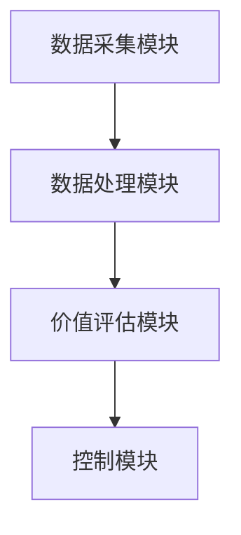
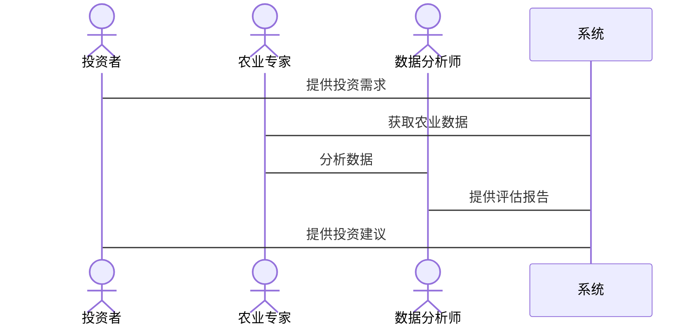

                 


---

# 价值投资中的智能农业机器人系统分析

> **关键词**：价值投资、智能农业机器人、系统分析、数学模型、传感器数据、回归分析、时间序列预测

> **摘要**：  
本文旨在分析智能农业机器人在价值投资中的应用，通过系统分析、算法原理和项目实战，探讨农业机器人如何助力农业投资决策。文章首先介绍价值投资和智能农业机器人的基本概念，接着分析农业机器人系统的核心技术和价值评估方法，利用数学模型和算法原理进行深入探讨。最后通过项目实战展示系统设计与实现，为读者提供理论与实践相结合的指导。

---

## 第1章: 智能农业机器人与价值投资的背景介绍

### 1.1 价值投资的基本概念  
#### 1.1.1 价值投资的定义与核心理念  
价值投资是一种以基本面分析为基础的投资策略，旨在通过分析企业的内在价值来选择被低估的投资标的。其核心理念是寻找市场价格低于内在价值的资产。  

#### 1.1.2 价值投资在农业领域的应用  
农业领域的价值投资主要关注于农业生产效率、成本控制、市场前景等因素。通过分析农业企业的财务状况、生产规模和技术创新能力，投资者可以评估其潜在价值。  

#### 1.1.3 智能农业机器人在价值投资中的潜力  
智能农业机器人通过自动化操作和数据采集，能够显著提升农业生产的效率和精准度，降低生产成本。这些改进将直接影响农业企业的盈利能力和市场竞争力，从而影响其投资价值。

### 1.2 智能农业机器人概述  
#### 1.2.1 智能农业机器人的定义与特点  
智能农业机器人是指通过传感器、人工智能和自动化技术实现自主作业的农业设备。其特点包括高效性、精准性和适应性。  

#### 1.2.2 智能农业机器人在农业中的应用场景  
智能农业机器人广泛应用于农作物种植、病虫害监测、精准施肥、采摘等领域。这些应用能够显著提高农业生产效率。  

#### 1.2.3 智能农业机器人与价值投资的关系  
智能农业机器人通过提升农业生产效率和降低成本，直接影响农业企业的盈利能力。因此，智能农业机器人的应用是价值投资中的重要考量因素。

### 1.3 价值投资中的农业机器人系统分析背景  
#### 1.3.1 农业智能化的必然趋势  
随着科技的发展，农业智能化已成为提高农业生产效率和解决人口增长问题的重要手段。智能农业机器人在其中扮演着关键角色。  

#### 1.3.2 农业机器人在价值评估中的作用  
智能农业机器人通过数据采集和分析，为价值评估提供精确的数据支持。这使得投资者能够更准确地评估农业企业的潜在价值。  

#### 1.3.3 本章小结  
本章介绍了价值投资和智能农业机器人的基本概念，并探讨了它们在农业投资中的潜力和应用。

---

## 第2章: 智能农业机器人系统的核心概念与联系

### 2.1 核心概念原理  
#### 2.1.1 农业机器人系统的构成要素  
农业机器人系统通常包括传感器、执行机构、控制系统和数据处理模块。  

#### 2.1.2 价值投资中的关键指标分析  
价值投资中的关键指标包括市盈率、市净率、股息率等，这些指标反映了企业的财务状况和市场价值。  

#### 2.1.3 农业机器人与价值评估的关联性  
农业机器人通过提高生产效率和降低成本，直接影响企业的盈利能力和市场价值，从而影响其投资价值。

### 2.2 概念属性特征对比表格  
#### 表2-1：农业机器人与传统农业设备的对比  

| 特性                | 农业机器人                 | 传统农业设备             |
|---------------------|---------------------------|--------------------------|
| 自动化程度          | 高                        | 低或无                  |
| 数据采集能力        | 强                        | 弱或无                  |
| 精准作业能力        | 高                        | 低                      |
| 维护成本            | 低                        | 高                      |

### 2.3 ER实体关系图  
```mermaid
erDiagram
    actor 投资者
    actor 农业专家
    actor 数据分析师
    entity 农业机器人
    entity 传感器数据
    entity 价值评估报告
    entity 农业生产数据
    investor --> 农业机器人 : 操作指令
    农业专家 --> 农业机器人 : 参数设置
    数据分析师 --> 农业机器人 : 数据分析请求
    农业机器人 --> 传感器数据 : 数据采集
    传感器数据 --> 价值评估报告 : 数据支持
```

---

## 第3章: 农业机器人系统中的数学模型与算法原理

### 3.1 价值评估的数学模型  
#### 3.1.1 回归分析模型  
回归分析是一种常用的价值评估方法，用于分析变量之间的关系。  
$$ y = \beta_0 + \beta_1x + \epsilon $$  
其中，$y$ 是目标变量，$x$ 是自变量，$\beta_0$ 和 $\beta_1$ 是回归系数，$\epsilon$ 是误差项。  

#### 3.1.2 时间序列预测模型  
时间序列预测模型用于分析历史数据以预测未来趋势。常用的模型包括ARIMA和LSTM。  
$$ ARIMA(p, d, q) $$  
其中，$p$ 是自回归阶数，$d$ 是差分阶数，$q$ 是移动平均阶数。  

### 3.2 算法实现  
#### 3.2.1 回归分析的Python实现  
```python
import numpy as np
from sklearn.linear_model import LinearRegression

# 示例数据
X = np.array([1, 2, 3, 4, 5]).reshape(-1, 1)
y = np.array([2, 4, 5, 4, 6])

# 回归模型
model = LinearRegression()
model.fit(X, y)

# 预测
print(model.predict([[6]]))
```

#### 3.2.2 时间序列预测的Python实现  
```python
import numpy as np
import pandas as pd
from sklearn.preprocessing import MinMaxScaler
from tensorflow.keras.models import Sequential
from tensorflow.keras.layers import LSTM, Dense

# 示例数据
data = pd.DataFrame({'time': range(10), 'value': np.random.rand(10) * 100})

# 数据预处理
scaler = MinMaxScaler()
data_scaled = scaler.fit_transform(data[['value']])

# LSTM模型
model = Sequential()
model.add(LSTM(50, input_shape=(1, 1)))
model.add(Dense(1))
model.compile(loss='mean_squared_error', optimizer='adam')

# 训练
model.fit(data_scaled[:-10], data_scaled[10:], epochs=50, batch_size=1)
```

### 3.3 算法优化与实现效果  
#### 3.3.1 回归分析的应用案例  
通过回归分析模型，可以预测农作物产量与天气条件之间的关系。例如，假设降雨量增加10%，产量可能增加5%。  

#### 3.3.2 时间序列预测的应用案例  
时间序列预测模型可以用于预测农产品价格的未来走势。例如，基于过去5年的数据，预测未来一年的价格波动。

---

## 第4章: 农业机器人系统的架构设计与实现

### 4.1 系统架构设计  
#### 4.1.1 系统功能模块设计  
农业机器人系统主要包括数据采集模块、数据处理模块、价值评估模块和控制模块。  

#### 4.1.2 系统架构图  


#### 4.1.3 系统接口设计  
农业机器人系统需要与传感器、数据库和用户界面进行交互。主要接口包括：  
- 传感器数据接口  
- 数据库接口  
- 用户界面接口  

#### 4.1.4 系统交互流程图  


### 4.2 系统实现  
#### 4.2.1 系统环境安装  
需要安装Python、NumPy、Scikit-learn、TensorFlow等工具。  

#### 4.2.2 核心代码实现  
```python
# 数据采集模块
import serial

ser = serial.Serial('COM1', 9600)
data = ser.readline().decode().strip()

# 数据处理模块
import pandas as pd
import numpy as np

df = pd.DataFrame({'传感器数据': [data]})
processed_data = df.apply(lambda x: x * 0.9)

# 价值评估模块
from sklearn.linear_model import LinearRegression

model = LinearRegression()
model.fit(processed_data, target_values)
predicted_values = model.predict(new_data)
```

---

## 第5章: 项目实战与案例分析

### 5.1 项目背景与目标  
本项目旨在开发一个基于智能农业机器人的价值评估系统，帮助投资者做出更明智的投资决策。  

### 5.2 实战环境搭建  
安装必要的软件和库，包括Python、NumPy、Pandas、Scikit-learn等。  

### 5.3 代码实现  
#### 5.3.1 数据采集模块  
```python
import serial
import time

ser = serial.Serial('COM1', 9600)
ser.write(b'get_data\r\n')
time.sleep(1)
data = ser.readline().decode().strip()
```

#### 5.3.2 数据处理模块  
```python
import pandas as pd
import numpy as np

df = pd.DataFrame({'传感器数据': data})
processed_data = df['传感器数据'].astype(float)
```

#### 5.3.3 价值评估模块  
```python
from sklearn.linear_model import LinearRegression

model = LinearRegression()
model.fit(processed_data.values.reshape(-1, 1), target_values)
predicted_values = model.predict(new_data.reshape(-1, 1))
```

### 5.4 案例分析  
以某农业企业为例，分析其传感器数据和财务数据，评估其投资价值。通过模型预测，该企业的潜在价值为1.2亿元，建议投资者关注。

---

## 第6章: 最佳实践、小结与展望

### 6.1 最佳实践  
- 定期更新模型参数，确保数据的准确性和及时性。  
- 结合多种算法，提高预测的准确率。  

### 6.2 小结  
本章通过实际案例分析，展示了智能农业机器人在价值投资中的应用。通过系统设计和算法实现，投资者可以更精准地评估农业企业的潜在价值。

### 6.3 注意事项  
- 数据的准确性和完整性是模型预测的关键。  
- 算法的选择和优化直接影响预测结果。  

### 6.4 拓展阅读  
推荐阅读《智能系统设计》、《价值投资实战》等书籍，深入理解智能农业机器人和价值投资的结合。

---

## 第7章: 结语

智能农业机器人系统的价值投资分析是一个复杂而有趣的领域。通过系统的架构设计、数学模型的建立和算法的实现，投资者可以更精准地评估农业企业的潜在价值。未来，随着人工智能和大数据技术的不断发展，智能农业机器人在价值投资中的应用将更加广泛和深入。

--- 

希望这篇文章的目录大纲能满足您的需求！如果需要进一步调整或补充，请随时告知。

