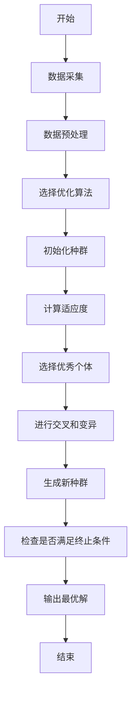
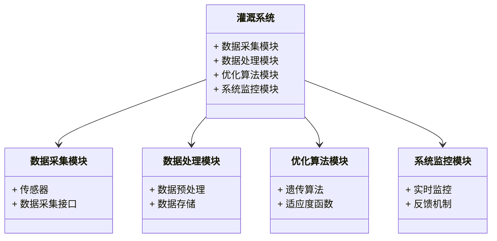
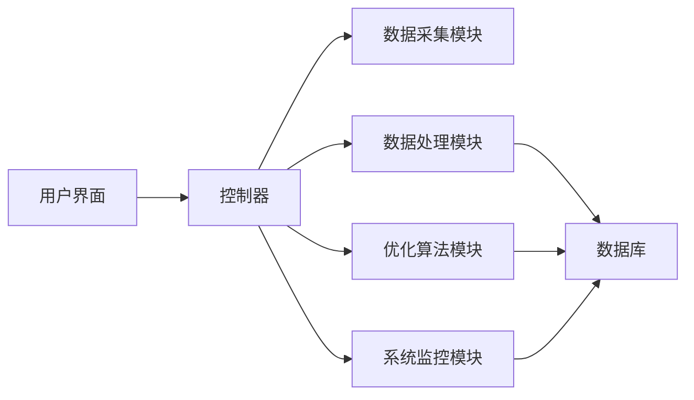

                 


# 价值投资中的智能农业灌溉优化系统分析

> 关键词：智能农业灌溉、优化系统、价值投资、算法原理、系统架构

> 摘要：本文深入分析了智能农业灌溉优化系统在价值投资中的应用潜力。通过介绍系统的背景、核心概念、算法原理、系统架构以及项目实战，详细阐述了如何利用智能化技术优化农业灌溉，进而实现投资回报的最大化。文章内容涵盖从理论到实践的全过程，旨在为投资者和技术开发者提供全面的指导。

---

## 第1章: 智能农业灌溉优化系统背景介绍

### 1.1 问题背景与描述
智能农业灌溉优化系统是将现代信息技术与农业灌溉相结合的产物，旨在通过智能化的手段提高灌溉效率、降低资源浪费，从而实现农业生产效率和水资源利用率的双提升。

#### 1.1.1 农业灌溉的现状与挑战
传统农业灌溉存在以下问题：
1. **水资源浪费**：由于缺乏精准的数据支持，灌溉往往基于经验而非实际需求，导致水资源浪费。
2. **效率低下**：人工操作的灌溉方式效率低，难以满足大规模农业生产的需要。
3. **环境影响**：过度灌溉会导致土壤盐渍化、地下水污染等问题。

#### 1.1.2 传统农业灌溉的痛点分析
- **数据孤岛**：各个灌溉点的数据分散，难以统一管理。
- **决策滞后**：缺乏实时数据支持，导致灌溉决策不够及时。
- **能源消耗**：传统灌溉方式能源消耗较高，增加了生产成本。

#### 1.1.3 智能化灌溉的必要性与发展趋势
智能化灌溉是解决上述问题的关键。通过物联网、大数据和人工智能等技术，可以实现精准灌溉，从而提高水资源利用率，降低生产成本，同时减少对环境的负面影响。

---

### 1.2 价值投资与农业灌溉的结合
价值投资的核心理念是通过分析企业的基本面，找到具有长期竞争优势的投资标的。智能农业灌溉优化系统作为一种技术创新，具有较高的投资价值。

#### 1.2.1 价值投资的核心理念
- **长期视角**：关注企业的长期盈利能力。
- **基本面分析**：通过财务数据、行业地位等因素评估企业的价值。
- **安全边际**：寻找市场价格低于内在价值的投资标的。

#### 1.2.2 农业灌溉在价值投资中的潜力
智能农业灌溉优化系统可以提高农业生产的效率和可持续性，从而降低生产成本，提升农产品的市场竞争力。这使得相关企业具有更高的盈利能力和发展潜力。

#### 1.2.3 智能化灌溉系统对投资回报的影响
通过优化灌溉系统，企业可以：
- **降低水资源消耗**，减少运营成本。
- **提高作物产量**，增加收入。
- **增强市场竞争力**，吸引更多的投资。

---

### 1.3 智能农业灌溉优化系统的边界与外延
#### 1.3.1 系统的边界定义
智能农业灌溉优化系统主要关注灌溉过程的优化，包括数据采集、分析、决策和执行四个环节。

#### 1.3.2 系统的外延与扩展性分析
- **扩展性**：系统可以与其他农业管理系统（如施肥系统、 pest control系统）集成，形成更完整的农业生产解决方案。
- **适应性**：系统可以适应不同地区的气候、土壤条件，支持多种农作物的种植。

#### 1.3.3 系统与外部环境的交互关系
智能农业灌溉优化系统与外部环境的交互主要通过传感器、数据库和用户界面实现。

---

### 1.4 智能农业灌溉优化系统的核心要素组成
智能农业灌溉优化系统由以下几个核心模块组成：
1. **数据采集与处理模块**：负责采集土壤湿度、气象数据等信息，并进行预处理。
2. **优化算法模块**：基于采集的数据，优化灌溉方案。
3. **系统监控与反馈机制**：实时监控灌溉过程，并根据反馈调整灌溉策略。

---

## 第2章: 智能农业灌溉优化系统的核心概念与联系

### 2.1 核心概念原理
#### 2.1.1 智能灌溉系统的定义
智能灌溉系统是一种利用物联网、大数据和人工智能技术，实现农业灌溉的智能化和自动化的系统。

#### 2.1.2 优化算法的基本原理
优化算法是一种数学方法，用于寻找问题的最优解。在智能灌溉系统中，优化算法用于确定最佳的灌溉时间和水量。

#### 2.1.3 价值投资与系统优化的关系
价值投资关注企业的长期盈利能力，而智能灌溉系统的优化可以提高企业的生产效率和盈利能力，从而增强其投资价值。

---

### 2.2 核心概念属性特征对比
以下是智能农业灌溉优化系统中几个核心概念的属性特征对比：

| 概念        | 数据采集 | 优化算法 | 系统监控 |
|-------------|----------|----------|----------|
| 准确性      | 高       | 高       | 高       |
| 实时性      | 高       | 中       | 高       |
| 可扩展性    | 中       | 高       | 高       |

---

### 2.3 ER实体关系图架构
以下是智能农业灌溉优化系统的实体关系图：

```mermaid
erd
    title 智能农业灌溉优化系统实体关系图
    灌溉系统 --|{many-to-many}--> 农作物
    农作物 --|{many-to-one}--> 农场
    灌溉系统 --|{many-to-one}--> 传感器
    传感器 --|{many-to-one}--> 数据采集模块
```

---

## 第3章: 智能农业灌溉优化系统的算法原理

### 3.1 算法原理概述
智能农业灌溉优化系统的核心算法是基于遗传算法的优化模型。遗传算法是一种模拟自然选择和遗传的优化算法，适用于复杂的非线性优化问题。

#### 3.1.1 优化算法的基本概念
遗传算法通过模拟生物的遗传和进化过程，寻找问题的最优解。其主要步骤包括：
1. 初始化种群。
2. 计算适应度。
3. 选择优秀个体。
4. 进行交叉和变异。
5. 重复上述步骤，直到满足终止条件。

#### 3.1.2 常见的优化算法介绍
除了遗传算法，常见的优化算法还包括模拟退火算法和粒子群优化算法。每种算法都有其优缺点，适用于不同的场景。

#### 3.1.3 智能灌溉优化算法的选择依据
选择优化算法时，需要考虑以下因素：
- **问题的复杂性**：复杂问题更适合使用遗传算法。
- **计算资源**：计算资源有限时，选择计算效率较高的算法。
- **适应度函数**：算法需要与适应度函数匹配。

---

### 3.2 算法实现流程
以下是基于遗传算法的智能灌溉优化系统实现流程：



---

## 第4章: 智能农业灌溉优化系统的系统分析与架构设计方案

### 4.1 系统分析
#### 4.1.1 问题场景介绍
智能农业灌溉优化系统的目标是通过优化灌溉方案，提高水资源利用率和农作物产量。

#### 4.1.2 项目介绍
本项目旨在开发一个基于物联网的智能农业灌溉优化系统，实现对灌溉过程的实时监控和优化。

---

### 4.2 系统功能设计
以下是系统功能设计的类图：



---

### 4.3 系统架构设计
以下是系统架构设计的架构图：



---

## 第5章: 项目实战

### 5.1 环境安装
以下是项目实战的环境安装说明：
1. **操作系统**：建议使用Linux系统。
2. **编程语言**：Python 3.8以上版本。
3. **依赖库**：安装numpy、pandas、scikit-learn等库。

---

### 5.2 系统核心实现源代码
以下是系统核心实现的Python代码：

```python
import numpy as np
import pandas as pd
from sklearn.model_selection import train_test_split

# 数据预处理
data = pd.read_csv('agriculture_data.csv')
X = data.drop('label', axis=1)
y = data['label']

# 划分训练集和测试集
X_train, X_test, y_train, y_test = train_test_split(X, y, test_size=0.2)

# 构建遗传算法模型
class GeneticAlgorithm:
    def __init__(self, X, y):
        self.X = X
        self.y = y
        self.population_size = 100
        self generations = 10

    def initialize_population(self):
        return np.random.randint(0, 2, size=(self.population_size, len(self.X.columns)))

    def calculate_fitness(self, individual):
        # 计算适应度函数
        return np.mean(self.y[self.X.dot(individual) > 0])

    def select_parents(self, population, fitness):
        # 选择优秀个体
        sorted_indices = np.argsort(-fitness)
        parents = population[sorted_indices[:int(len(population)/2)]]
        return parents

    def crossover(self, parents):
        # 单点交叉
        crossover_point = np.random.randint(1, len(parents[0]))
        new_population = []
        for i in range(0, len(parents), 2):
            parent1 = parents[i]
            parent2 = parents[i+1]
            child1 = np.concatenate((parent1[:crossover_point], parent2[crossover_point:]))
            child2 = np.concatenate((parent2[:crossover_point], parent1[crossover_point:]))
            new_population.append(child1)
            new_population.append(child2)
        return new_population

    def mutate(self, population):
        # 突变操作
        mutation_rate = 0.1
        for i in range(len(population)):
            for j in range(len(population[i])):
                if np.random.random() < mutation_rate:
                    population[i][j] = 1 - population[i][j]
        return population

    def optimize(self):
        population = self.initialize_population()
        for _ in range(self.generations):
            fitness = np.array([self.calculate_fitness(individual) for individual in population])
            parents = self.select_parents(population, fitness)
            new_population = self.crossover(parents)
            new_population = self.mutate(new_population)
            population = new_population
        best_individual = max([(self.calculate_fitness(individual), individual) for individual in population])[1]
        return best_individual

# 训练模型
ga = GeneticAlgorithm(X_train, y_train)
best_individual = ga.optimize()

# 模型评估
accuracy = ga.calculate_fitness(best_individual)
print(f'最优解适应度：{accuracy}')
```

---

### 5.3 代码应用解读与分析
1. **数据预处理**：使用pandas库对数据进行清洗和预处理。
2. **遗传算法实现**：通过自定义的遗传算法类实现灌溉优化。
3. **模型训练与评估**：通过训练集训练模型，并在测试集上评估模型的性能。

---

## 第6章: 最佳实践、小结与注意事项

### 6.1 最佳实践
1. **数据质量**：确保数据的准确性和完整性。
2. **算法选择**：根据具体问题选择合适的优化算法。
3. **系统维护**：定期维护和更新系统，确保其稳定运行。

### 6.2 小结
本文详细介绍了智能农业灌溉优化系统在价值投资中的应用。通过理论分析和实际案例，展示了如何利用智能化技术优化农业灌溉，从而实现投资回报的最大化。

### 6.3 注意事项
1. **数据隐私**：注意保护农业生产数据的隐私和安全。
2. **系统稳定性**：确保系统的稳定运行，避免因故障导致生产损失。
3. **环境适应性**：系统应具备较强的环境适应性，能够适应不同的气候和土壤条件。

---

## 第7章: 拓展阅读

### 7.1 相关技术
1. **物联网技术**：用于数据的实时采集和传输。
2. **大数据分析**：用于数据的深度挖掘和分析。
3. **人工智能**：用于优化算法的设计和实现。

### 7.2 行业动态
1. **智能农业的发展趋势**：随着技术的进步，智能农业将更加普及。
2. **政策支持**：政府对智能农业的政策支持力度不断加大。

### 7.3 学术研究
1. **优化算法的研究进展**：遗传算法、模拟退火算法等优化算法的研究进展。
2. **智能灌溉系统的学术论文**：国内外相关学术论文的综述。

---

## 结语
智能农业灌溉优化系统作为一项新兴技术，具有广阔的应用前景。通过本文的分析，读者可以深入了解其技术原理和应用价值，为未来的投资和技术创新提供参考。

