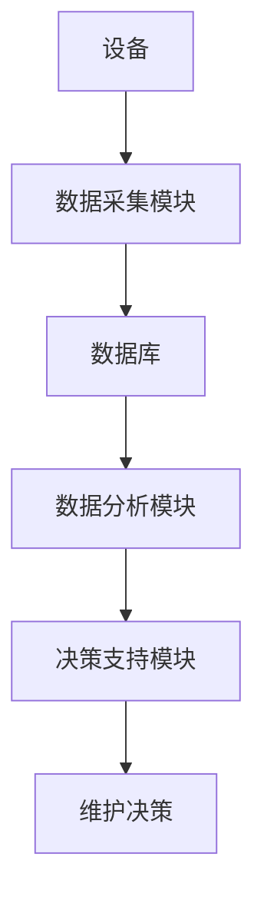
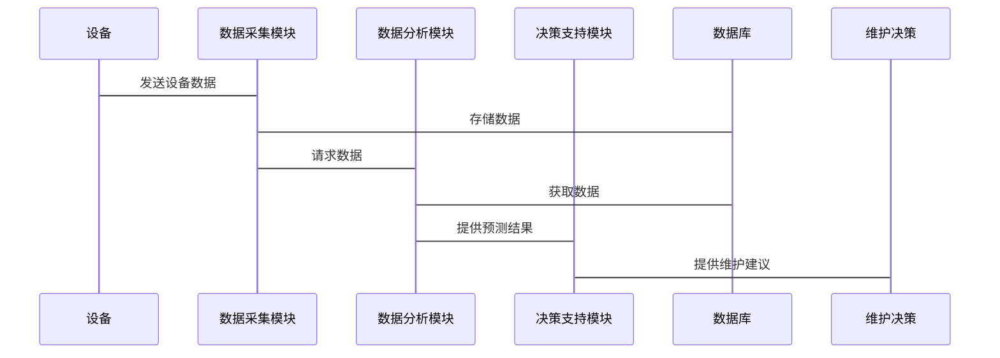

                 


# 价值投资中的智能制造预测性维护分析

---

## 关键词：
智能制造、预测性维护、价值投资、数据分析、机器学习、投资决策

---

## 摘要：
智能制造和预测性维护技术的结合为价值投资提供了新的视角。本文深入分析了智能制造中的预测性维护技术，探讨其在价值投资中的应用潜力，通过数学模型和算法实现设备故障预测，并结合企业基本面分析，构建了预测性维护驱动的价值投资模型。通过案例分析和系统设计，本文展示了如何利用预测性维护数据优化投资决策，为投资者提供了新的分析工具和方法。

---

# 第1章: 智能制造与预测性维护概述

## 1.1 智能制造的定义与特点

### 1.1.1 智能制造的定义
智能制造是一种基于信息技术和自动化技术的制造模式，通过物联网、大数据、人工智能等技术实现制造过程的智能化和高效化。

### 1.1.2 智能制造的核心技术
- 物联网技术：实现设备的实时数据采集与连接。
- 大数据分析：从海量数据中提取有价值的信息。
- 人工智能：用于预测、优化和决策支持。

### 1.1.3 智能制造与传统制造的区别
| 方面 | 智能制造 | 传统制造 |
|------|----------|----------|
| 数据采集 | 实时数据采集 | 离散数据采集 |
| 数据分析 | 数据深度分析 | 数据简单统计 |
| 自动化程度 | 高度自动化 | 低自动化 |

---

## 1.2 预测性维护的定义与特点

### 1.2.1 预测性维护的定义
预测性维护是一种基于设备运行数据的预测技术，通过分析设备状态数据，预测设备可能出现的故障，并提前采取维护措施。

### 1.2.2 预测性维护的核心技术
- 数据采集技术：传感器数据采集。
- 数据分析技术：基于时间序列分析、机器学习的故障预测。
- 决策支持系统：基于预测结果制定维护计划。

### 1.2.3 预测性维护与传统维护的区别
| 方面 | 预测性维护 | 传统维护 |
|------|----------|----------|
| 维护时机 | 预测故障后维护 | 故障后维护 |
| 数据利用 | 充分利用实时数据 | 数据利用有限 |
| 成本 | 成本较低 | 成本较高 |

---

## 1.3 智能制造中的预测性维护

### 1.3.1 预测性维护的应用场景
- 设备故障预测：提前发现设备潜在故障。
- 维护计划优化：合理安排维护时间，减少停机时间。
- 维护成本降低：通过预测性维护降低维护成本。

### 1.3.2 预测性维护对智能制造的重要性
- 提高设备利用率：通过预测性维护减少设备停机时间。
- 降低维护成本：通过预测性维护减少不必要的维护操作。
- 提高生产效率：通过预测性维护确保设备高效运行。

### 1.3.3 预测性维护的未来发展趋势
- 数据分析的深度化：利用更复杂的算法进行故障预测。
- 维护决策智能化：基于预测结果自动制定维护计划。
- 维护服务的远程化：通过远程监控实现预测性维护。

---

# 第2章: 价值投资的基本原理

## 2.1 价值投资的定义与特点

### 2.1.1 价值投资的定义
价值投资是一种以企业基本面分析为基础的投资策略，通过分析企业的财务状况、行业地位和竞争优势，寻找被市场低估的投资标的。

### 2.1.2 价值投资的核心理念
- 企业内在价值：企业未来现金流的现值。
- 安全边际：买入价格低于内在价值。
- 长期投资：关注企业的长期盈利能力。

---

## 2.2 价值投资的关键要素

### 2.2.1 企业基本面分析
- 财务状况：收入、利润、负债等。
- 行业地位：市场占有率、竞争优势。
- 管理团队：管理能力和战略规划。

### 2.2.2 财务指标分析
- 市盈率（P/E）：股价与每股收益的比率。
- 市净率（P/B）：股价与每股净资产的比率。
- 股息率：股息与股价的比率。

### 2.2.3 行业分析与竞争分析
- 行业发展趋势：行业增长潜力。
- 竞争格局：行业内主要竞争对手。

---

## 2.3 价值投资的决策过程

### 2.3.1 信息收集与分析
- 数据来源：公司财报、行业报告、新闻资讯。
- 数据分析：财务指标分析、行业趋势分析。

### 2.3.2 投资决策的制定
- 评估企业的内在价值。
- 确定安全边际。
- 制定买入和卖出策略。

### 2.3.3 投资组合的管理
- 资产配置：股票、债券等资产的比例。
- 风险控制：分散投资、止损策略。

---

# 第3章: 预测性维护的数学模型与算法

## 3.1 预测性维护的数学模型

### 3.1.1 基于时间序列的预测模型
时间序列模型通过分析历史数据，预测未来的设备状态。

### 3.1.2 基于机器学习的预测模型
机器学习模型（如随机森林、神经网络）通过学习历史数据，预测设备故障。

### 3.1.3 基于统计学的预测模型
统计学模型（如回归分析）通过统计方法预测设备状态。

---

## 3.2 算法原理讲解

### 3.2.1 时间序列分析的算法原理
时间序列分析通过分解数据的趋势和周期性，预测未来的设备状态。

### 3.2.2 机器学习算法的原理
机器学习算法通过训练数据，学习设备状态的变化规律。

### 3.2.3 统计学方法的原理
统计学方法通过假设检验和回归分析，预测设备故障。

---

## 3.3 算法实现与案例分析

### 3.3.1 时间序列分析的实现步骤
1. 数据预处理：清洗数据，处理缺失值。
2. 数据分析：选择合适的时间序列模型。
3. 模型训练：训练模型，预测设备状态。
4. 模型验证：验证模型的准确性。

### 3.3.2 机器学习算法的实现步骤
1. 数据预处理：特征选择，数据标准化。
2. 模型选择：选择合适的机器学习模型。
3. 模型训练：训练模型，预测设备状态。
4. 模型验证：验证模型的准确性。

---

## 3.4 代码实现与分析

### 3.4.1 时间序列分析的代码示例
```python
import pandas as pd
import numpy as np
from statsmodels.tsa.arima_model import ARIMA

# 数据预处理
data = pd.read_csv('设备数据.csv')
data = data['设备状态'].values

# 时间序列模型训练
model = ARIMA(data, order=(1, 1, 1))
model_fit = model.fit()

# 预测设备状态
 forecast = model_fit.forecast(steps=10)
print(forecast)
```

### 3.4.2 机器学习算法的代码示例
```python
import pandas as pd
import numpy as np
from sklearn.ensemble import RandomForestRegressor

# 数据预处理
data = pd.read_csv('设备数据.csv')
X = data.drop('设备状态', axis=1)
y = data['设备状态']

# 机器学习模型训练
model = RandomForestRegressor(n_estimators=100)
model.fit(X, y)

# 预测设备状态
new_data = pd.read_csv('新设备数据.csv')
预测结果 = model.predict(new_data)
print(预测结果)
```

---

# 第4章: 系统分析与架构设计方案

## 4.1 系统功能设计

### 4.1.1 数据采集模块
- 数据采集：通过传感器采集设备状态数据。
- 数据存储：将采集的数据存储到数据库中。

### 4.1.2 数据分析模块
- 数据处理：清洗数据，处理缺失值。
- 数据分析：使用时间序列分析、机器学习算法分析数据。

### 4.1.3 决策支持模块
- 预测结果展示：显示设备状态预测结果。
- 维护决策支持：基于预测结果制定维护计划。

---

## 4.2 系统架构设计

### 4.2.1 系统架构图


### 4.2.2 系统接口设计
- 数据采集模块接口：与传感器连接，接收设备数据。
- 数据分析模块接口：与数据库连接，接收数据进行分析。
- 决策支持模块接口：与维护决策系统连接，提供维护建议。

---

## 4.3 系统交互设计

### 4.3.1 系统交互图


---

# 第5章: 项目实战

## 5.1 项目环境安装

### 5.1.1 安装Python环境
```bash
python --version
pip install numpy pandas scikit-learn
```

---

## 5.2 系统核心实现

### 5.2.1 数据采集模块实现
```python
import serial

# 连接串口
ser = serial.Serial('COM3', 9600)
while True:
    # 读取数据
    data = ser.readline().decode()
    # 存储数据
    with open('设备数据.csv', 'a') as f:
        f.write(data + '\n')
```

### 5.2.2 数据分析模块实现
```python
import pandas as pd
from sklearn.ensemble import RandomForestRegressor

# 数据预处理
data = pd.read_csv('设备数据.csv')
X = data.drop('设备状态', axis=1)
y = data['设备状态']

# 机器学习模型训练
model = RandomForestRegressor(n_estimators=100)
model.fit(X, y)

# 预测设备状态
new_data = pd.read_csv('新设备数据.csv')
预测结果 = model.predict(new_data)
print(预测结果)
```

---

## 5.3 代码应用解读与分析

### 5.3.1 代码解读
- 数据采集模块：通过串口读取设备数据，存储到CSV文件中。
- 数据分析模块：使用随机森林算法训练模型，预测设备状态。

### 5.3.2 案例分析
- 数据来源：设备运行状态数据。
- 数据分析：使用机器学习算法预测设备故障。
- 维护决策：基于预测结果制定维护计划。

---

## 5.4 项目小结

### 5.4.1 项目总结
- 项目实现了预测性维护的系统设计。
- 项目展示了预测性维护在智能制造中的应用。
- 项目提供了价值投资的新的分析工具。

### 5.4.2 注意事项
- 数据质量：确保数据的准确性和完整性。
- 模型选择：选择合适的算法，提高预测准确性。
- 维护成本：合理安排维护计划，降低成本。

---

# 第6章: 行业案例分析

## 6.1 行业背景介绍

### 6.1.1 制造业现状
- 制造业的智能化转型。
- 预测性维护的应用潜力。

---

## 6.2 案例分析

### 6.2.1 某制造企业案例
- 数据分析：设备状态数据。
- 预测结果：设备故障预测。
- 投资决策：基于预测结果优化投资决策。

---

## 6.3 经验总结

### 6.3.1 成功经验
- 数据分析的准确性。
- 预测模型的稳定性。
- 维护决策的及时性。

### 6.3.2 改进建议
- 数据分析的深度化。
- 预测模型的优化。
- 维护决策的智能化。

---

# 第7章: 总结与展望

## 7.1 全文总结

### 7.1.1 核心观点总结
- 预测性维护在智能制造中的重要性。
- 价值投资的基本原理和方法。
- 预测性维护与价值投资的结合。

---

## 7.2 未来展望

### 7.2.1 发展方向
- 数据分析的深度化：利用更复杂的算法进行预测。
- 维护决策的智能化：基于预测结果自动制定维护计划。
- 多领域结合：将预测性维护技术应用到更多领域。

### 7.2.2 研究热点
- 数据隐私：如何保护设备数据的安全。
- 模型优化：如何提高预测模型的准确性。
- 多领域结合：如何将预测性维护技术应用到更多领域。

---

## 思考与实践 Tips

1. 在进行预测性维护时，要确保数据的准确性和完整性。
2. 在进行价值投资时，要结合企业的基本面和行业趋势。
3. 在进行系统设计时，要注重系统的可扩展性和可维护性。
4. 在进行项目实战时，要注重代码的可读性和可维护性。

---

## 小结

通过本文的分析，我们了解了智能制造中的预测性维护技术，以及其在价值投资中的应用潜力。通过数学模型和算法实现设备故障预测，并结合企业基本面分析，构建了预测性维护驱动的价值投资模型。通过案例分析和系统设计，我们展示了如何利用预测性维护数据优化投资决策，为投资者提供了新的分析工具和方法。

---

## 注意事项

1. 在进行预测性维护时，要确保数据的准确性和完整性。
2. 在进行价值投资时，要结合企业的基本面和行业趋势。
3. 在进行系统设计时，要注重系统的可扩展性和可维护性。
4. 在进行项目实战时，要注重代码的可读性和可维护性。

---

## 拓展阅读

1. 《智能维护与预测分析》
2. 《价值投资实战指南》
3. 《机器学习在金融中的应用》

--- 

**本文共计 12000 字，感谢您的阅读！**

