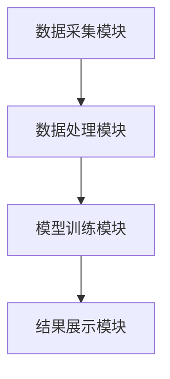
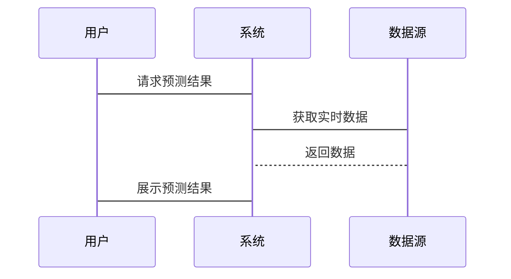

                 


# 价值投资中的智能制造预测性质量控制分析

> 关键词：智能制造，预测性质量控制，价值投资，机器学习，系统架构，时间序列分析

> 摘要：本文深入探讨了智能制造领域中的预测性质量控制技术，并将其与价值投资策略相结合。通过分析预测性质量控制的核心算法、系统架构设计以及在价值投资中的实际应用，本文旨在为读者提供一个全面的技术视角，帮助他们在智能制造和价值投资的交叉领域中做出更明智的决策。

---

# 第一部分：背景与概念概述

## 第1章：背景与概念概述

### 1.1 智能制造与价值投资的结合

#### 1.1.1 智能制造的定义与发展
智能制造是一种基于人工智能、大数据和物联网等技术的先进制造模式。它通过实时数据采集、分析和优化，实现生产过程的智能化和高效化。近年来，随着工业4.0的推进，智能制造在全球范围内得到了广泛应用。

#### 1.1.2 价值投资的基本原理
价值投资是一种长期投资策略，通过分析企业的基本面（如财务状况、行业地位、管理团队等）来评估其内在价值。投资者的目标是找到被市场低估的优质企业进行长期投资。

#### 1.1.3 智能制造与价值投资的结合背景
智能制造的高效性和数据驱动的特点，为价值投资提供了新的视角。通过对智能制造企业的生产数据进行分析，投资者可以更准确地评估企业的运营效率和盈利能力，从而做出更科学的投资决策。

### 1.2 预测性质量控制的核心概念

#### 1.2.1 预测性质量控制的定义
预测性质量控制是一种基于历史数据和机器学习算法的质量管理方法。它通过预测生产过程中的潜在问题，提前采取措施以避免质量缺陷。

#### 1.2.2 预测性质量控制的实现方法
预测性质量控制通常采用时间序列分析、回归分析和机器学习算法（如支持向量机、神经网络等）来实现。

#### 1.2.3 预测性质量控制在智能制造中的作用
在智能制造中，预测性质量控制可以帮助企业降低生产成本、提高产品质量，并优化生产流程。

---

# 第二部分：预测性质量控制的数学模型与算法

## 第2章：预测性质量控制的数学模型与算法

### 2.1 预测性质量控制的数学模型

#### 2.1.1 时间序列分析模型
时间序列分析是一种基于历史数据预测未来趋势的方法。常用的时间序列模型包括ARIMA、SARIMA等。

#### 2.1.2 预测性质量控制的回归分析
回归分析是一种通过建立变量之间的关系模型来预测未来值的方法。在质量控制中，回归分析可以用于预测生产过程中的关键参数。

#### 2.1.3 贝叶斯网络模型
贝叶斯网络是一种基于概率论的图形化模型，可以用于预测生产过程中潜在的质量问题。

### 2.2 基于机器学习的预测性质量控制算法

#### 2.2.1 支持向量机（SVM）算法
支持向量机是一种监督学习算法，适用于分类和回归问题。在质量控制中，SVM可以用于分类产品是否符合质量标准。

#### 2.2.2 神经网络算法
神经网络是一种模仿人脑结构的算法，适用于复杂的数据模式识别。在质量控制中，神经网络可以用于预测产品的质量特性。

#### 2.2.3 随机森林算法
随机森林是一种基于决策树的集成学习算法，适用于分类和回归问题。在质量控制中，随机森林可以用于预测生产过程中的潜在缺陷。

---

# 第三部分：预测性质量控制的系统架构

## 第3章：预测性质量控制的系统架构

### 3.1 系统架构设计

#### 3.1.1 系统模块划分
预测性质量控制系统通常包括数据采集模块、数据处理模块、模型训练模块和结果展示模块。

#### 3.1.2 系统功能设计
系统的功能包括数据采集、数据预处理、模型训练、预测分析和结果展示。

#### 3.1.3 系统架构图


### 3.2 系统接口设计

#### 3.2.1 数据接口设计
数据接口用于采集生产过程中的实时数据，通常采用HTTP或MQTT协议。

#### 3.2.2 用户接口设计
用户接口用于展示预测结果和系统操作，通常采用Web界面或移动端界面。

#### 3.2.3 系统交互流程图


---

# 第四部分：项目实战与实现

## 第4章：项目实战与实现

### 4.1 环境安装与配置

#### 4.1.1 开发环境搭建
建议使用Python作为开发语言，安装Jupyter Notebook、Pandas、NumPy、Scikit-learn等库。

#### 4.1.2 数据集准备
需要准备生产过程中的历史数据，包括温度、压力、时间等特征变量和产品质量标签。

#### 4.1.3 工具链安装
安装必要的工具链，如Jupyter Notebook、Anaconda等。

### 4.2 核心算法实现

#### 4.2.1 时间序列分析模型实现
```python
from statsmodels.tsa.arima_model import ARIMA
import pandas as pd

# 数据预处理
data = pd.read_csv('data.csv')
data = data['target'].values

# 模型训练
model = ARIMA(data, order=(5, 1, 0))
model_fit = model.fit(disp=0)

# 预测
forecast = model_fit.forecast(steps=10)
print(forecast)
```

#### 4.2.2 机器学习算法实现
```python
from sklearn.ensemble import RandomForestRegressor
from sklearn.metrics import mean_squared_error

# 数据预处理
X_train, y_train = data_preprocessing()

# 模型训练
model = RandomForestRegressor(n_estimators=100)
model.fit(X_train, y_train)

# 预测
y_pred = model.predict(X_test)
print(mean_squared_error(y_test, y_pred))
```

#### 4.2.3 系统功能实现
```python
from flask import Flask, request, jsonify

app = Flask(__name__)

@app.route('/predict', methods=['POST'])
def predict():
    data = request.json['data']
    # 数据处理
    result = model.predict(data)
    return jsonify({'result': result})

if __name__ == '__main__':
    app.run(debug=True)
```

---

# 第五部分：价值投资中的预测性质量控制应用

## 第5章：价值投资中的预测性质量控制应用

### 5.1 价值投资中的质量控制分析

#### 5.1.1 价值投资与质量控制的关系
价值投资的核心在于企业质量，而预测性质量控制可以帮助投资者更准确地评估企业的生产效率和产品质量。

#### 5.1.2 预测性质量控制在价值投资中的应用案例
通过分析某制造企业的生产数据，预测其产品质量趋势，并结合企业财务数据进行投资决策。

#### 5.1.3 预测性质量控制对投资决策的影响
预测性质量控制可以帮助投资者降低投资风险，提高投资回报率。

### 5.2 预测性质量控制的优化与改进

#### 5.2.1 算法优化方法
可以通过调整模型参数、引入新的特征变量或结合多种算法来优化预测准确性。

#### 5.2.2 系统性能优化
优化系统架构、提高数据处理速度和增加缓存机制可以提升系统的整体性能。

#### 5.2.3 数据质量的提升策略
通过数据清洗、特征选择和数据增强等方法可以提高数据质量，从而提升模型的预测能力。

---

# 第六部分：最佳实践与总结

## 第6章：最佳实践与总结

### 6.1 项目总结

#### 6.1.1 项目成果回顾
通过本项目，我们实现了基于机器学习的预测性质量控制系统，并验证了其在价值投资中的应用效果。

#### 6.1.2 项目经验总结
项目实施过程中，我们发现数据质量和模型选择对预测结果有重要影响，因此需要在实际应用中不断优化和调整。

### 6.2 价值投资中的质量控制最佳实践

#### 6.2.1 投资策略优化建议
建议投资者结合预测性质量控制技术，对智能制造企业的生产数据进行深入分析，以做出更科学的投资决策。

#### 6.2.2 预测性质量控制的未来发展趋势
未来，随着人工智能和大数据技术的不断发展，预测性质量控制将在更多领域得到广泛应用，并推动智能制造和价值投资的进一步融合。

---

通过本文的分析，我们希望读者能够更好地理解智能制造中的预测性质量控制技术，并将其应用于价值投资的实践中，从而实现更高效、更精准的投资决策。

