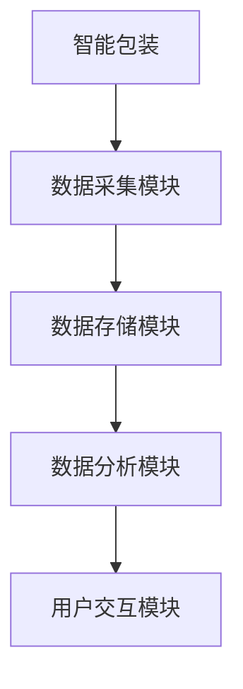

                 


```markdown
# 价值投资中的智能包装与溯源系统分析

## 关键词
智能包装、溯源系统、价值投资、区块链、数据加密

## 摘要
本文探讨了智能包装与溯源系统在价值投资中的应用，分析了其核心概念、技术原理和系统设计，通过实际案例展示了系统的实现过程，并提出了最佳实践建议。

---

## 第一部分：价值投资中的智能包装与溯源系统概述

### 第1章：背景介绍

#### 1.1 智能包装与溯源系统的概念
- **智能包装**：利用物联网技术，能够感知环境变化并提供实时反馈的包装系统。
- **溯源系统**：通过技术手段追踪产品生命周期的系统，确保数据的真实性和透明性。

#### 1.2 价值投资中的问题背景
- **信息不对称**：投资者难以获取产品的真实信息。
- **数据透明度**：缺乏有效的数据追踪机制，影响投资决策。
- **解决途径**：智能包装与溯源系统通过技术手段提高数据透明度，解决信息不对称问题。

### 第2章：核心概念与联系

#### 2.1 智能包装的核心要素
- 感知模块：实时采集环境数据。
- 反馈模块：通过传感器反馈数据变化。
- 通信模块：数据传输至云端。

#### 2.2 溯源系统的核心要素
- 数据采集：记录产品生产、运输、销售各环节的数据。
- 数据存储：利用区块链技术确保数据不可篡改。
- 数据分析：通过算法分析数据，辅助投资决策。

#### 2.3 智能包装与溯源系统的协同关系
- 数据采集：智能包装采集环境数据，溯源系统记录数据。
- 数据关联：通过区块链技术实现数据的关联和验证。
- 数据应用：分析数据，辅助价值投资决策。

### 第3章：算法原理讲解

#### 3.1 数据加密与签名算法
- **哈希函数**：用于生成数据的唯一标识。
  $$ hash = H(message) $$
- **签名验证**：确保数据来源的合法性。
  $$ signature = sign(private_key, hash) $$

#### 3.2 区块链共识机制
- **工作量证明（PoW）**：通过计算找到符合条件的哈希值。
- **权益证明（PoS）**：基于持币者的权益分配记账权。
- **实用拜占庭共识（PBFT）**：适用于高性能场景的共识算法。

#### 3.3 数据关联性分析
- **相似度计算**：使用余弦相似度衡量数据间的关联程度。
  $$ similarity = \cos(\theta) = \frac{\sum{X_i Y_i}}{\sqrt{\sum{X_i^2}} \sqrt{\sum{Y_i^2}}} $$
- **聚类分析**：将相似的数据进行分组，便于分析。

### 第4章：系统分析与架构设计

#### 4.1 系统应用场景
- **生产环节**：实时监控生产环境数据。
- **运输环节**：跟踪物流信息，确保产品安全。
- **销售环节**：提供消费者透明的产品信息。

#### 4.2 系统功能设计
- **数据采集模块**：通过传感器采集环境数据。
- **数据存储模块**：利用区块链技术存储数据。
- **数据分析模块**：对数据进行关联性分析，辅助投资决策。
- **用户交互模块**：提供用户友好的数据查询界面。

#### 4.3 系统架构图


### 第5章：项目实战

#### 5.1 环境安装与配置
- **开发环境**：安装Python、区块链框架（如Ethereum）。
- **工具安装**：安装传感器、数据库和区块链节点。
- **数据库配置**：选择合适的数据库（如MongoDB）。

#### 5.2 核心代码实现
- **数据加密**：实现哈希函数和签名验证。
  ```python
  def hash(message):
      return hashlib.sha256(message.encode()).hexdigest()

  def sign(private_key, hash_value):
      return eth_account.sign_hash(hash_value, private_key).hex()
  ```

- **区块链共识**：实现工作量证明机制。
  ```python
  def proof_of_work(block):
      nonce = 0
      while True:
          if int(hashlib.sha256(str(block).encode()).hexdigest(), 16) < 2**256 / 10000:
              break
          nonce += 1
      return nonce
  ```

- **数据关联性分析**：实现余弦相似度计算。
  ```python
  def cosine_similarity(vec1, vec2):
      dot_product = sum(vec1[i] * vec2[i] for i in range(len(vec1)))
      magnitude1 = math.sqrt(sum(vec1[i]**2 for i in range(len(vec1))))
      magnitude2 = math.sqrt(sum(vec2[i]**2 for i in range(len(vec2))))
      return dot_product / (magnitude1 * magnitude2)
  ```

#### 5.3 代码解读与分析
- **关键代码段解读**：解释代码的功能和实现逻辑。
- **功能分析**：分析代码在系统中的作用和影响。

#### 5.4 实际案例分析
- **案例介绍**：选择一个具体的价值投资案例，分析智能包装与溯源系统在其中的应用。
- **数据分析**：通过实际数据，验证系统的有效性和准确性。

#### 5.5 项目小结
- **项目总结**：总结项目实施的过程和成果。
- **经验教训**：分享项目中的经验和教训，为后续项目提供参考。

---

## 第六部分：最佳实践与总结

### 6.1 最佳实践
- **数据安全**：确保数据加密和签名的正确性。
- **系统维护**：定期更新系统和修复漏洞。
- **用户教育**：提高用户对系统的认知和使用能力。

### 6.2 小结
- **总结全文**：回顾文章的核心内容和主要观点。
- **未来展望**：展望智能包装与溯源系统在价值投资中的未来发展。

### 6.3 注意事项
- **数据隐私**：注意数据隐私保护，遵守相关法律法规。
- **系统兼容性**：确保系统在不同环境下的兼容性。

### 6.4 拓展阅读
- **推荐书籍**：推荐相关领域的优秀书籍和文献。
- **技术博客**：推荐相关技术博客和资源。

---

## 结语
智能包装与溯源系统在价值投资中的应用前景广阔，通过技术创新和系统优化，可以有效解决信息不对称问题，提升投资决策的准确性和透明度。未来，随着技术的不断进步，智能包装与溯源系统将在价值投资领域发挥更大的作用。
```

