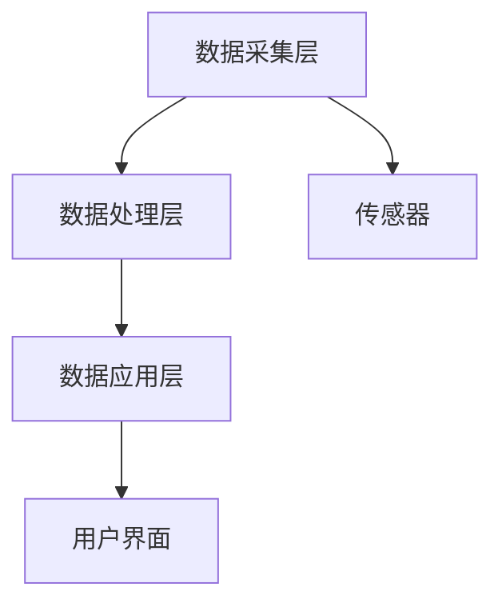
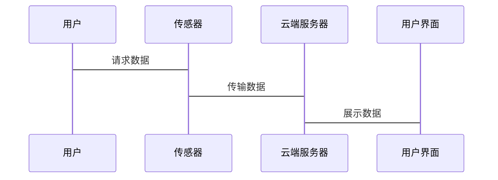

                 


# 《价值投资中的智能包装技术发展趋势》

---

## 关键词：

- 价值投资
- 智能包装技术
- 技术趋势
- 市场分析
- 投资策略

---

## 摘要：

智能包装技术作为一种新兴的科技，正在改变传统包装行业的同时，也为价值投资带来了新的机遇和挑战。本文通过分析智能包装技术的核心概念、算法原理、数学模型以及系统架构，探讨其在价值投资中的应用潜力和发展趋势。文章结合实际案例，深入解读智能包装技术如何通过实时数据采集、数据分析和市场预测，帮助投资者做出更明智的投资决策。最终，本文旨在为投资者和相关技术从业者提供有价值的参考和启示。

---

## # 第一部分：引言

## # 第1章：价值投资与智能包装技术的结合

### ## 1.1 价值投资的基本概念

价值投资是一种长期投资策略，强调以低于内在价值的价格买入优质资产。其核心在于深入分析企业的基本面，寻找那些被市场低估的投资标的。传统价值投资依赖于财务报表分析、行业研究和市场趋势判断。

### ## 1.2 智能包装技术的定义与特征

智能包装技术是一种将传感器、物联网（IoT）和数据通信技术集成到包装中的创新解决方案。它能够实时监测包装内部的环境条件（如温度、湿度、压力等）并将其传输到云端，供消费者或企业查看。

### ## 1.3 价值投资与智能包装技术的结合背景

随着智能包装技术的快速发展，它不仅改变了传统包装行业的运作方式，还为价值投资提供了新的视角。通过智能包装技术，投资者可以更实时、更全面地了解企业的生产流程和产品质量，从而做出更准确的价值评估。

---

## # 第二部分：智能包装技术的核心概念与联系

## # 第2章：智能包装技术的定义与核心要素

### ## 2.1 智能包装技术的定义

智能包装技术是指将传感器、数据采集和通信模块集成到包装中，实时监测和传递包装内部环境数据的技术。它通过物联网和大数据分析，为消费者和企业提供更智能化的包装解决方案。

### ## 2.2 智能包装技术的核心要素

智能包装技术的核心要素包括：
1. **传感器**：用于采集环境数据（如温度、湿度、压力）。
2. **数据采集与传输**：通过传感器将数据传输到云端或终端设备。
3. **数据分析与可视化**：利用大数据技术对数据进行分析，并以可视化的方式呈现。

### ## 2.3 智能包装技术与价值投资的关系

智能包装技术通过实时监测和传递数据，帮助企业优化生产流程、提高产品质量。对于投资者而言，这些数据可以作为评估企业价值的重要依据，帮助投资者更准确地判断企业的内在价值和成长潜力。

---

## # 第三部分：智能包装技术的算法原理与数学模型

## # 第3章：智能包装技术的算法原理

### ## 3.1 数据采集与预处理算法

智能包装技术的核心在于数据采集与预处理。通过传感器采集包装内部的环境数据，并利用算法对数据进行清洗和归一化处理。

```python
import pandas as pd
import numpy as np

# 示例数据
data = pd.DataFrame({
    '温度': [25, 26, 24, 25, 26],
    '湿度': [60, 65, 58, 62, 63],
    '时间': ['2023-10-01', '2023-10-02', '2023-10-03', '2023-10-04', '2023-10-05']
})

# 数据清洗与预处理
data = data.dropna()  # 删除缺失值
data = data[ data['温度'] > 20 ]  # 删除温度过低的记录
```

### ## 3.2 智能算法与数据分析

通过机器学习算法对传感器数据进行分析，识别潜在的质量问题或异常情况。例如，可以使用时间序列分析算法预测包装产品的保质期。

```python
from sklearn.preprocessing import MinMaxScaler
from keras.models import Sequential
from keras.layers import LSTM, Dense

# 数据归一化
scaler = MinMaxScaler()
data_normalized = scaler.fit_transform(data[['温度', '湿度']])

# 构建LSTM模型
model = Sequential()
model.add(LSTM(50, input_shape=(1, 2)))
model.add(Dense(1))
model.compile(loss='mean_squared_error', optimizer='adam')

# 训练模型
model.fit(data_normalized, epochs=50, batch_size=32)
```

### ## 3.3 智能包装系统的整体架构

智能包装系统的整体架构包括数据采集层、数据处理层和数据应用层。数据采集层负责传感器数据的采集，数据处理层对数据进行清洗和分析，数据应用层则将结果应用于实际投资决策。

---

## # 第四部分：系统分析与架构设计方案

## # 第4章：智能包装技术的系统架构设计

### ## 4.1 问题场景介绍

智能包装技术的应用场景包括食品、药品和电子产品等对存储环境要求较高的行业。通过智能包装，企业可以实时监控产品的存储条件，确保产品质量。

### ## 4.2 系统功能设计

智能包装系统的功能设计包括：
1. **数据采集**：实时采集包装内的环境数据。
2. **数据分析**：对数据进行处理和分析，识别潜在问题。
3. **数据可视化**：将分析结果以可视化的方式呈现给用户。

### ## 4.3 系统架构设计

以下是智能包装系统的架构设计：



### ## 4.4 系统接口设计

智能包装系统需要与企业的ERP系统、供应链管理系统等进行对接，确保数据的实时传输和共享。

### ## 4.5 系统交互设计

以下是系统交互流程图：



---

## # 第五部分：项目实战

## # 第5章：智能包装技术的项目实现

### ## 5.1 环境安装

以下是项目所需的环境配置：

```bash
Python 3.8+
Jupyter Notebook
Pandas, NumPy, Scikit-learn, Keras
```

### ## 5.2 核心实现

以下是核心代码实现：

```python
import pandas as pd
import numpy as np
from sklearn.preprocessing import MinMaxScaler
from keras.models import Sequential
from keras.layers import LSTM, Dense

# 示例数据
data = pd.DataFrame({
    '温度': [25, 26, 24, 25, 26],
    '湿度': [60, 65, 58, 62, 63],
    '时间': ['2023-10-01', '2023-10-02', '2023-10-03', '2023-10-04', '2023-10-05']
})

# 数据预处理
data = data[['温度', '湿度', '时间']]
data = data.set_index('时间')

# 数据归一化
scaler = MinMaxScaler()
data_normalized = scaler.fit_transform(data)

# 构建LSTM模型
model = Sequential()
model.add(LSTM(50, input_shape=(1, 2)))
model.add(Dense(1))
model.compile(loss='mean_squared_error', optimizer='adam')

# 训练模型
model.fit(data_normalized, epochs=50, batch_size=32)
```

### ## 5.3 代码应用解读与分析

通过上述代码，我们可以实现对智能包装数据的实时监测和预测。模型可以预测未来的环境条件，帮助企业提前采取措施，确保产品质量。

### ## 5.4 实际案例分析

以食品行业为例，智能包装技术可以帮助企业实时监测食品的存储条件，确保食品在运输和销售过程中的质量。投资者可以通过这些数据，更准确地评估企业的运营能力和产品质量。

### ## 5.5 项目小结

通过本项目，我们可以看到智能包装技术在实际应用中的潜力。它不仅可以帮助企业优化生产流程，还可以为投资者提供更丰富的数据支持，帮助他们做出更明智的投资决策。

---

## # 第六部分：总结与展望

## # 第6章：总结与展望

### ## 6.1 价值投资中的智能包装技术总结

智能包装技术通过实时监测和传递数据，为价值投资提供了更丰富的信息和更准确的评估工具。它可以帮助投资者更全面地了解企业的生产流程和产品质量，从而做出更明智的投资决策。

### ## 6.2 智能包装技术的未来发展趋势

随着物联网和大数据技术的不断发展，智能包装技术将更加智能化和普及化。未来，智能包装技术将与人工智能、区块链等技术结合，为企业和投资者提供更全面、更精准的数据支持。

### ## 6.3 对投资者的建议

投资者应密切关注智能包装技术的发展趋势，积极学习相关知识，提升自身的技术分析能力。同时，应选择那些在智能包装技术领域具有领先地位的企业进行投资，以获取超额收益。

### ## 6.4 对技术从业者的建议

技术从业者应深入了解智能包装技术的核心算法和系统架构，积极参与智能包装技术的开发和应用。通过技术创新，推动智能包装技术在更多领域的应用，为企业和投资者创造更大的价值。

### ## 6.5 拓展阅读

以下是推荐阅读的书籍和资源：
- 《智能包装技术的发展与应用》
- 《价值投资实战指南》
- 《物联网技术入门与应用》

---

## # 结语

智能包装技术作为一种新兴的技术，正在为价值投资带来新的机遇和挑战。通过本文的分析和解读，我们相信智能包装技术将在未来发挥更大的作用，帮助投资者做出更明智的投资决策。我们期待智能包装技术在未来的进一步发展，为价值投资注入更多活力。

--- 

**注：由于篇幅限制，以上内容为部分章节的简要概述，具体内容可根据实际需求进行扩展和补充。**

