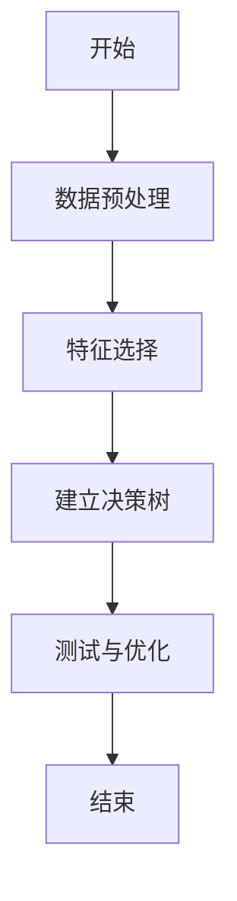

                 


# 价值投资中的智能化精准农业系统分析

## 关键词：价值投资，精准农业，智能化系统，数据分析，投资决策，农业优化

## 摘要：  
本文深入分析了价值投资在智能化精准农业系统中的应用，探讨了如何通过智能化技术优化农业生产，提升投资回报。文章从价值投资的基本概念出发，结合精准农业的发展现状，详细阐述了智能化精准农业系统的架构、算法原理及实际应用案例。通过对比分析和实例说明，展示了智能化技术如何帮助投资者做出更科学的决策，实现农业生产的精准化和高效化。  

---

## 第一部分: 价值投资中的智能化精准农业系统背景

## 第1章: 价值投资与精准农业的背景

### 1.1 价值投资的基本概念

#### 1.1.1 价值投资的定义与核心理念
价值投资是一种投资策略，强调以低于内在价值的价格购买优质资产，长期持有，追求稳定收益。其核心理念是通过分析企业的基本面，寻找被市场低估的投资标的。  
**关键词**：内在价值、低估、长期持有  

#### 1.1.2 价值投资在农业领域的应用潜力
农业作为国民经济的基础产业，具有较高的投资价值。通过价值投资策略，投资者可以筛选出具有稳定收益、抗风险能力强的农业企业或项目，实现长期稳健的投资回报。  

#### 1.1.3 精准农业的定义与特点
精准农业是一种以数据驱动、技术支撑的农业生产模式，通过精确测量和控制农业生产过程中的各项因素，优化资源配置，提高生产效率。其特点包括：  
- 数据驱动：依赖传感器、物联网等技术获取实时数据。  
- 精准控制：根据数据进行精细化管理。  
- 高效产出：最大化资源利用效率，减少浪费。  

---

### 1.2 精准农业的发展现状

#### 1.2.1 精准农业的概念演变
从传统农业到现代化农业，精准农业的概念逐步发展。早期的精准农业主要依赖人工经验，随着科技的进步，逐渐引入了自动化、智能化技术。  

#### 1.2.2 精准农业在现代农业中的应用
现代精准农业广泛应用于作物种植、畜禽养殖、渔业等领域。例如，通过物联网技术实时监测土壤湿度、温度等环境参数，优化灌溉和施肥方案。  

#### 1.2.3 精准农业与智能化技术的结合
智能化技术（如人工智能、大数据分析）的引入，使精准农业更加高效和精准。例如，使用机器学习算法预测作物生长周期，优化种植计划。  

---

### 1.3 智能化精准农业系统的重要性

#### 1.3.1 精准农业系统的核心目标
- 提高农业生产效率。  
- 减少资源浪费。  
- 增强抗风险能力。  

#### 1.3.2 智能化技术在精准农业中的作用
- 数据采集与处理：通过传感器和物联网技术获取农田实时数据。  
- 智能分析与决策：利用机器学习算法分析数据，提供最优解决方案。  
- 系统输出与反馈：根据分析结果，自动调整农业生产参数。  

#### 1.3.3 精准农业系统的社会与经济价值
- 有助于提高农产品质量，满足市场需求。  
- 降低农业生产成本，提高投资回报率。  
- 促进农业可持续发展，保护生态环境。  

---

## 第2章: 智能化精准农业系统的概念与框架

### 2.1 智能化精准农业系统的定义

#### 2.1.1 系统的核心概念
智能化精准农业系统是一种基于数据驱动的农业生产管理系统，通过整合物联网、人工智能等技术，实现农业生产过程的精准化和智能化。  

#### 2.1.2 系统的主要功能模块
- 数据采集模块：负责采集农田环境数据（如温度、湿度、光照等）。  
- 数据分析模块：对采集的数据进行处理和分析，提供决策支持。  
- 决策执行模块：根据分析结果，自动调整农业生产参数（如灌溉、施肥等）。  

---

### 2.2 系统的核心要素分析

#### 2.2.1 数据采集与处理
- 数据采集：通过传感器、无人机等设备获取农田数据。  
- 数据处理：对采集的数据进行清洗、整合和分析。  

#### 2.2.2 智能分析与决策
- 数据分析：利用机器学习算法（如决策树、随机森林）进行预测和分类。  
- 决策支持：根据分析结果，生成最优生产方案。  

#### 2.2.3 系统输出与反馈
- 输出决策：系统根据分析结果，输出灌溉、施肥等指令。  
- 反馈机制：根据执行结果，调整系统参数，优化后续操作。  

---

### 2.3 系统的架构与设计

#### 2.3.1 系统架构的层次划分
智能化精准农业系统的架构通常分为三层：  
- 数据采集层：负责数据的采集和传输。  
- 数据处理层：对数据进行分析和处理。  
- 应用层：根据分析结果，生成决策指令。  

#### 2.3.2 系统功能模块的实体关系图
```mermaid
er
actor: 投资者
system: 智能化精准农业系统
database: 农田数据
actor --> system: 提出投资需求
system --> database: 数据采集与处理
database --> system: 返回分析结果
system --> actor: 输出投资建议
```

---

## 第3章: 精准农业系统中的价值投资分析

### 3.1 价值投资在农业中的应用

#### 3.1.1 价值投资的基本原理
- 寻找被低估的农业资产。  
- 分析企业的盈利能力、成长潜力和财务状况。  

#### 3.1.2 农业领域的投资机会
- 农业科技企业：如智能农业设备、农业大数据公司。  
- 农业供应链：如物流、仓储等领域。  
- 农产品加工：如有机食品、功能性食品等。  

---

### 3.2 精准农业系统中的数据驱动投资

#### 3.2.1 数据在价值投资中的作用
- 数据是投资决策的重要依据。  
- 通过数据分析，发现潜在的投资机会。  

#### 3.2.2 精准农业数据的特征分析
- 数据的实时性：农田数据需要实时采集和分析。  
- 数据的多样性：包括环境数据、生产数据、市场数据等。  
- 数据的动态性：农业生产环境不断变化，数据需要动态更新。  

---

### 3.3 精准农业系统中的风险控制

#### 3.3.1 风险评估的基本方法
- 通过数据分析识别潜在风险。  
- 建立风险预警机制。  

#### 3.3.2 精准农业系统的风险管理
- 数据监控：实时监测农田环境，及时发现异常情况。  
- 系统优化：根据历史数据，不断优化系统算法，降低风险。  

---

## 第4章: 智能化精准农业系统的算法与实现

### 4.1 价值投资中的算法选择

#### 4.1.1 常见的机器学习算法
- 决策树：用于分类和回归分析。  
- 随机森林：用于特征重要性分析和数据分类。  
- 神经网络：用于复杂非线性关系的建模。  

---

### 4.2 算法实现与案例分析

#### 4.2.1 决策树算法的实现


#### 4.2.2 算法的数学模型
- 决策树分类原理：通过特征分裂，逐步划分数据集，最终形成分类结果。  
- 随机森林算法：通过构建多棵决策树，利用投票机制进行分类。  

---

## 第5章: 智能化精准农业系统的实际应用

### 5.1 系统的环境安装与配置

#### 5.1.1 系统运行环境
- 操作系统：Linux 或 Windows。  
- 开发工具：Python、Jupyter Notebook。  
- 数据库：MySQL 或 MongoDB。  

---

### 5.2 核心代码实现

#### 5.2.1 数据采集模块
```python
import pandas as pd
import numpy as np

# 示例数据：农田传感器数据
data = {
    '时间': ['2023-10-01', '2023-10-02', '2023-10-03'],
    '温度': [25, 26, 24],
    '湿度': [65, 60, 70],
    '光照强度': [1200, 1100, 1300]
}

df = pd.DataFrame(data)
print(df)
```

#### 5.2.2 数据分析模块
```python
from sklearn.tree import DecisionTreeClassifier
from sklearn.model_selection import train_test_split

# 示例数据：农田环境数据
X = df[['温度', '湿度', '光照强度']]
y = df['作物类型']

X_train, X_test, y_train, y_test = train_test_split(X, y, test_size=0.2)
clf = DecisionTreeClassifier()
clf.fit(X_train, y_train)

print("训练准确率：", clf.score(X_train, y_train))
print("测试准确率：", clf.score(X_test, y_test))
```

---

## 第6章: 总结与展望

### 6.1 本章小结
- 价值投资与智能化精准农业系统的结合，为农业投资提供了新的思路。  
- 通过数据分析和算法优化，可以提高投资决策的科学性和精准性。  

### 6.2 投资注意事项
- 数据质量是关键：确保数据的准确性和完整性。  
- 系统优化：根据实际需求，不断优化系统功能。  
- 风险控制：建立完善的风险预警机制，降低投资风险。  

### 6.3 拓展阅读
- 《机器学习实战》：学习更多机器学习算法。  
- 《精准农业与大数据分析》：深入了解农业大数据的应用。  

---

## 结语  
智能化精准农业系统的应用，不仅提高了农业生产的效率，也为投资者提供了更多的投资机会。通过价值投资的理念，结合智能化技术，可以在农业领域实现长期稳健的投资回报。

