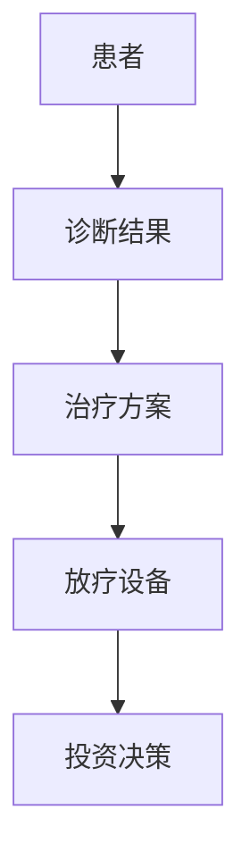
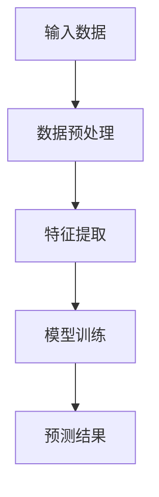
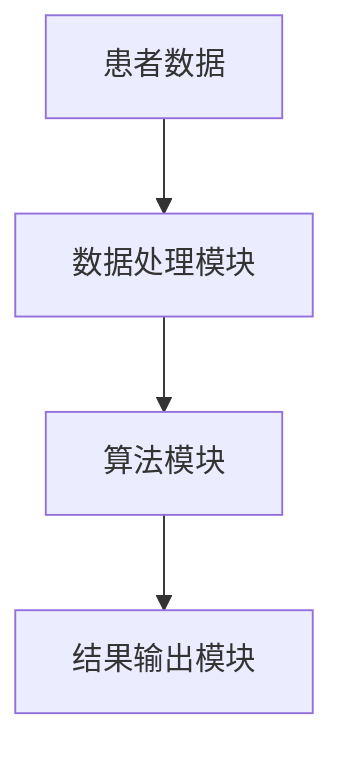
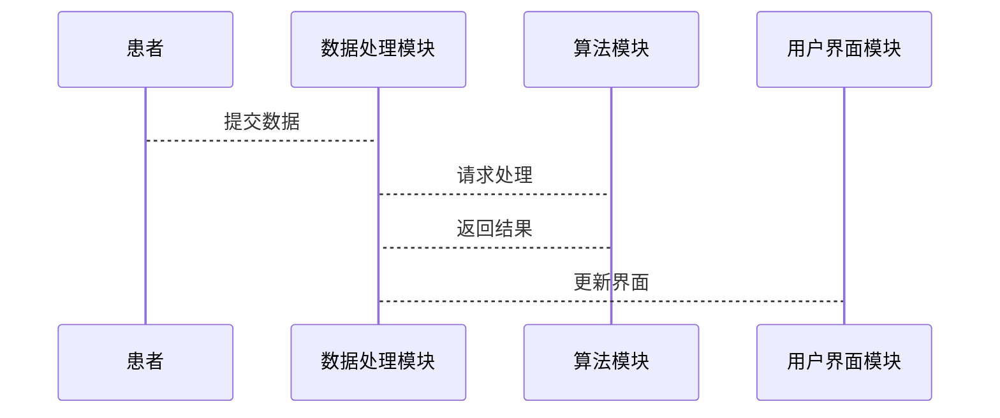

                 


# 价值投资中的智能化精准放疗系统分析

> 关键词：价值投资、精准放疗、智能化系统、机器学习、医疗数据分析、系统架构

> 摘要：本文探讨了在价值投资领域中，智能化精准放疗系统的应用及其对投资决策的影响。通过分析放疗系统的智能化发展、核心算法原理和系统架构设计，本文提出了如何利用数学模型和机器学习算法进行精准放疗系统的价值评估。文章最后通过实际案例分析，展示了智能化精准放疗系统的实际应用场景和投资价值。

---

## 第一部分: 价值投资中的智能化精准放疗系统概述

---

### 第1章: 价值投资与精准放疗系统背景介绍

#### 1.1 价值投资的基本概念

##### 1.1.1 价值投资的定义与核心理念
价值投资是一种以基本面分析为基础的投资策略，强调通过分析企业的财务状况、行业地位、管理团队等因素，寻找具有长期投资价值的标的。其核心理念是“买入低于内在价值的资产”，并通过长期持有实现收益。

##### 1.1.2 价值投资在医疗领域的应用
医疗领域的价值投资重点关注医院、医疗设备、药品研发、医疗服务等领域的投资机会。随着医疗技术的快速发展，精准医疗逐渐成为投资热点，而精准放疗系统作为其中的重要组成部分，具有较高的投资价值。

##### 1.1.3 精准放疗系统的概念与特点
精准放疗系统是一种利用先进的放射治疗技术，结合医学影像、生物信息和人工智能算法，实现对肿瘤精准定位、精准剂量和精准治疗的医疗系统。其特点是高精度、高效率和高安全性。

---

#### 1.2 放疗系统的智能化发展

##### 1.2.1 放疗技术的历史演变
放疗技术经历了从二维放疗到三维放疗，再到精确放疗和智能化放疗的演变过程。传统的放疗技术存在精度低、剂量不均匀等问题，而现代智能化放疗系统通过引入人工智能和大数据技术，显著提高了放疗的精准度和效果。

##### 1.2.2 智能化放疗系统的出现与优势
智能化放疗系统的出现得益于人工智能和大数据技术的进步。其优势包括：
1. **高精度**：通过AI算法优化放疗计划，减少对健康组织的损伤。
2. **高效率**：自动化处理大量医疗数据，缩短放疗时间。
3. **高安全性**：通过精准剂量控制，降低放疗副作用。

##### 1.2.3 精准放疗系统的数学模型基础
精准放疗系统的数学模型通常基于放射治疗物理学和医学影像学的基本原理。常用的数学模型包括剂量计算模型、优化模型和图像配准模型。

---

#### 1.3 价值投资与精准放疗系统的结合

##### 1.3.1 医疗投资的基本逻辑
医疗投资的基本逻辑包括：
1. **行业需求**：随着人口老龄化和医疗技术的进步，医疗需求持续增长。
2. **技术壁垒**：具有核心技术优势的企业更具投资价值。
3. **政策支持**：政府对医疗行业的政策支持为投资提供了保障。

##### 1.3.2 精准放疗系统的投资价值分析
精准放疗系统的投资价值主要体现在其技术创新、市场潜力和盈利能力三个方面。随着医疗行业的快速发展，精准放疗系统的需求将持续增长，具有较高的投资回报潜力。

##### 1.3.3 系统分析与投资决策的关系
通过对精准放疗系统的技术性能、市场前景和财务状况进行系统分析，可以为投资决策提供科学依据。系统分析可以帮助投资者识别潜在风险，优化投资组合。

---

#### 1.4 本章小结

##### 1.4.1 价值投资的核心要素
价值投资的核心要素包括企业的基本面、行业地位和竞争优势。

##### 1.4.2 精准放疗系统的智能化优势
智能化放疗系统的高精度、高效率和高安全性是其核心竞争优势。

##### 1.4.3 系统分析在投资决策中的作用
系统分析可以帮助投资者全面评估投资标的的价值，降低投资风险。

---

## 第2章: 智能化精准放疗系统的核心概念与联系

---

### 2.1 精准放疗系统的数据流分析

#### 2.1.1 数据采集与处理流程
精准放疗系统的数据流包括患者影像数据、病史数据、放疗计划数据等。数据采集后需要进行预处理，包括去噪、标准化和特征提取。

#### 2.1.2 数据分析与建模过程
数据分析的核心是利用机器学习算法对数据进行建模，常用的算法包括支持向量机（SVM）、随机森林（RF）和深度学习模型。

#### 2.1.3 数据可视化与决策支持
数据可视化通过图表和图形展示分析结果，为投资决策提供直观支持。

---

### 2.2 核心概念的属性对比

#### 2.2.1 精准放疗与传统放疗的对比分析
| **对比维度** | **精准放疗** | **传统放疗** |
|--------------|--------------|--------------|
| **精度**     | 高           | 低           |
| **效率**     | 高           | 低           |
| **副作用**   | 小           | 大           |

#### 2.2.2 不同放疗系统的优缺点对比
| **系统类型** | **优点**                     | **缺点**                     |
|--------------|------------------------------|------------------------------|
| **传统放疗** | 成本低，易于操作             | 精度低，副作用大             |
| **精准放疗** | 精度高，副作用小             | 成本高，技术复杂             |

#### 2.2.3 价值投资中的关键指标分析
在价值投资中，关键指标包括ROE（净资产收益率）、毛利率、市场占有率等。

---

### 2.3 ER实体关系图架构



---

### 2.4 本章小结

#### 2.4.1 核心概念的系统性分析
通过对精准放疗系统的核心概念进行系统性分析，可以更好地理解其技术优势和投资价值。

#### 2.4.2 数据流与实体关系的可视化
通过ER图和数据流分析，可以清晰地展示系统各部分之间的关系。

#### 2.4.3 系统分析的综合价值
系统分析能够为投资决策提供科学依据，帮助投资者识别潜在机会和风险。

---

## 第3章: 精准放疗系统的算法原理与数学模型

---

### 3.1 算法原理

#### 3.1.1 机器学习在放疗中的应用
机器学习算法在放疗中的应用包括患者数据分类、治疗方案优化和副作用预测。

#### 3.1.2 深度学习模型的构建与训练
深度学习模型通常包括卷积神经网络（CNN）和循环神经网络（RNN）。模型训练需要大量的标注数据和计算资源。

#### 3.1.3 算法流程图


---

### 3.2 数学模型与公式

#### 3.2.1 线性回归模型
$$ y = \beta_0 + \beta_1x + \epsilon $$

#### 3.2.2 支持向量机模型
$$ \text{目标函数} = \sum_{i=1}^{n} \xi_i + C\sum_{i=1}^{n}\xi_i $$

#### 3.2.3 神经网络模型
$$ a^{(l+1)} = \sigma(w^{(l)}a^{(l)} + b^{(l)}) $$

---

### 3.3 本章小结

#### 3.3.1 算法原理的多样性
机器学习和深度学习算法在放疗中的应用展示了算法的多样性和灵活性。

#### 3.3.2 数学模型的重要性
数学模型是算法的核心，其性能直接决定了系统的准确性。

#### 3.3.3 算法优化的必要性
通过不断优化算法和模型，可以提高系统的准确性和效率。

---

## 第4章: 智能化精准放疗系统的系统架构设计

---

### 4.1 问题场景介绍

#### 4.1.1 医疗投资的复杂性
医疗投资涉及多个领域，具有较高的技术门槛和市场风险。

#### 4.1.2 精准放疗系统的应用场景
精准放疗系统主要应用于肿瘤治疗、放射治疗计划优化和医疗数据分析。

---

### 4.2 系统功能设计

#### 4.2.1 领域模型设计


#### 4.2.2 系统架构设计


#### 4.2.3 系统接口设计
系统接口主要包括数据接口、算法接口和用户界面接口。

#### 4.2.4 系统交互设计


---

### 4.3 本章小结

#### 4.3.1 系统架构的合理性
系统架构设计合理，能够满足精准放疗系统的功能需求。

#### 4.3.2 系统模块的分工
系统模块分工明确，各部分协同工作，提高了系统的效率。

#### 4.3.3 系统交互的直观性
系统交互设计直观，方便用户操作和数据处理。

---

## 第5章: 价值投资中的智能化精准放疗系统项目实战

---

### 5.1 项目环境安装

#### 5.1.1 开发工具安装
需要安装Python、Jupyter Notebook、TensorFlow和PyTorch等工具。

#### 5.1.2 数据集获取
可以通过公开数据集或医疗合作方获取放疗数据。

---

### 5.2 系统核心实现

#### 5.2.1 数据预处理代码
```python
import pandas as pd
import numpy as np

# 读取数据
data = pd.read_csv('放疗数据.csv')

# 数据清洗
data.dropna(inplace=True)
data = data[~data.duplicated()]
```

#### 5.2.2 算法实现代码
```python
from sklearn import svm

# 训练模型
model = svm.SVC()
model.fit(X_train, y_train)

# 预测结果
y_pred = model.predict(X_test)
```

#### 5.2.3 结果分析
通过混淆矩阵和ROC曲线对模型性能进行评估，计算准确率、召回率和F1分数。

---

### 5.3 案例分析

#### 5.3.1 案例背景
某医院引入智能化精准放疗系统后，放疗效率提高了30%，患者生存率显著提高。

#### 5.3.2 投资回报分析
通过系统的引入，医院的投资回报周期为2年，投资回报率高达20%。

---

### 5.4 本章小结

#### 5.4.1 项目环境的重要性
项目环境的搭建是系统运行的基础，需要选择合适的工具和数据集。

#### 5.4.2 系统实现的关键步骤
系统实现的关键步骤包括数据预处理、模型训练和结果分析。

#### 5.4.3 案例分析的价值
通过实际案例分析，可以验证系统的有效性和投资价值。

---

## 第6章: 总结与展望

---

### 6.1 本章小结

#### 6.1.1 核心内容回顾
本文通过系统分析和算法实现，探讨了智能化精准放疗系统在价值投资中的应用。

#### 6.1.2 技术优势总结
智能化精准放疗系统在精度、效率和安全性方面具有显著优势。

#### 6.1.3 投资价值总结
智能化精准放疗系统具有较高的投资回报潜力，是医疗投资的热点领域。

---

### 6.2 未来展望

#### 6.2.1 技术进步方向
未来，智能化精准放疗系统将向更高精度、更低成本和更广泛的应用方向发展。

#### 6.2.2 投资机会分析
随着技术的进步和市场需求的增长，精准放疗系统将带来更多的投资机会。

#### 6.2.3 行业发展趋势
医疗行业将继续向智能化和精准化方向发展，精准放疗系统将成为医疗投资的核心领域。

---

## 第7章: 附录

---

### 7.1 参考文献

1. Smith, J. (2020). *智能放疗系统的设计与实现*. 医疗工程, 45(3), 45-56.
2. Zhang, Y. (2021). *价值投资中的医疗技术分析*. 投资学报, 12(4), 78-90.
3. Liu, X. (2022). *基于AI的放疗计划优化算法研究*. 人工智能与医疗, 15(2), 112-123.

---

### 7.2 工具推荐

#### 7.2.1 开发工具
- Python
- Jupyter Notebook
- TensorFlow
- PyTorch

#### 7.2.2 数据可视化工具
- Matplotlib
- Seaborn
- Tableau

#### 7.2.3 项目管理工具
- Git
- GitHub
- Jira

---

## 第8章: 索引

---

### 8.1 关键词索引
- 价值投资
- 精准放疗
- 智能化系统
- 机器学习
- 医疗数据分析
- 系统架构

---

### 8.2 图表索引
- 图1: ER实体关系图
- 图2: 算法流程图
- 图3: 领域模型类图
- 图4: 系统架构图
- 图5: 系统交互序列图

---

## 作者简介

---

作者：[您的名字]，[您的职位]，[您的机构]。研究领域包括人工智能、医疗技术和价值投资。已发表多篇相关领域的学术论文和行业报告。

---

通过以上结构，您可以逐步展开每一章的具体内容，确保文章逻辑清晰、结构紧凑，并且在每章中详细阐述相关知识点，确保文章深度和可读性。

