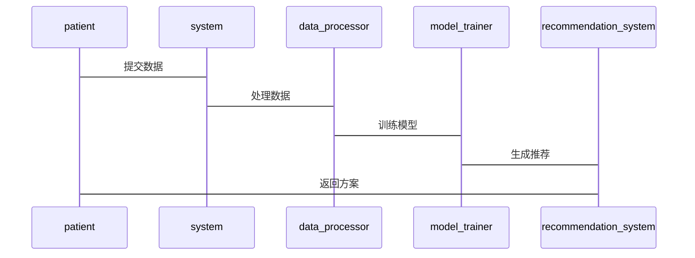

                 


# 价值投资中的智能化精准癌症治疗系统分析

**关键词**：价值投资、精准治疗、智能化系统、机器学习、医疗数据分析、治疗方案优化

**摘要**：本文探讨了将价值投资的理念应用于精准癌症治疗中的智能化系统分析。通过结合医疗数据分析和机器学习算法，提出了一种优化的治疗方案选择方法，旨在提高治疗效果和投资回报。文章详细分析了系统的构建过程，包括核心概念、算法原理、系统架构及项目实战，并提供了实际案例和最佳实践建议。

---

# 第一部分：价值投资与精准治疗的背景

## 第1章：价值投资与精准治疗概述

### 1.1 价值投资的核心理念
- 1.1.1 价值投资的定义与原则
  - 长期投资，注重基本面分析
  - 买入低于内在价值的资产
- 1.1.2 价值投资与传统投资的区别
  - 传统投资：短期波动驱动
  - 价值投资：长期价值驱动

### 1.2 精准治疗的基本概念
- 1.2.1 精准治疗的定义
  - 根据患者个体特征制定个性化治疗方案
- 1.2.2 精准治疗的核心技术
  - 基因测序、靶向治疗、大数据分析
- 1.2.3 精准治疗与传统治疗的区别
  - 传统治疗：通用方案，疗效有限
  - 精准治疗：个体化方案，疗效更优

### 1.3 价值投资与精准治疗的结合
- 1.3.1 医疗领域的价值投资机会
  - 创新药研发、精准治疗技术
- 1.3.2 精准治疗中的投资策略
  - 高效性、安全性、经济性
- 1.3.3 结合意义
  - 提高治疗效果，降低投资风险

### 1.4 本章小结
- 本章介绍了价值投资和精准治疗的基本概念及其结合的意义，为后续分析奠定了基础。

---

## 第2章：智能化精准治疗系统的核心概念

### 2.1 系统核心概念与定义
- 2.1.1 智能化精准治疗系统的定义
  - 利用AI技术优化治疗方案选择的系统
- 2.1.2 系统的核心功能
  - 数据采集、分析、推荐、优化
- 2.1.3 系统的输入输出
  - 输入：患者数据、治疗方案
  - 输出：推荐治疗方案、疗效预测

### 2.2 核心概念的属性特征对比
- 患者数据的特征分析
  - 数据类型：基因信息、病史、症状
  - 数据量：大样本、多维度
- 治疗方案的特征分析
  - 方案类型：化疗、放疗、靶向治疗
  - 疗效指标：生存率、副作用
- 系统性能的特征分析
  - 准确性、实时性、可扩展性

### 2.3 系统的ER实体关系图
```mermaid
erDiagram
    patient {
        id : int
        name : string
        age : int
        gender : string
        medical_history : string
    }
    treatment_plan {
        id : int
        name : string
        description : string
        success_rate : float
    }
    system {
        id : int
        name : string
        version : string
        description : string
    }
    patient --|{has}|-> treatment_plan : "患者关联治疗方案"
    system --|{runs}|-> patient : "系统处理患者数据"
    system --|{recommends}|-> treatment_plan : "系统推荐治疗方案"
```

---

# 第二部分：智能化精准治疗系统的算法与实现

## 第3章：算法原理与实现

### 3.1 算法选择与原理
- 3.1.1 机器学习算法的选择
  - 决策树、随机森林、神经网络
- 3.1.2 算法的适用性分析
  - 分类任务：治疗方案分类
  - 回归任务：疗效预测
- 3.1.3 算法流程
  - 数据预处理、特征提取、模型训练、结果预测

### 3.2 算法流程图
```mermaid
graph TD
    A[开始] -> B[数据预处理]
    B -> C[特征提取]
    C -> D[模型训练]
    D -> E[结果预测]
    E -> F[结束]
```

### 3.3 算法实现代码
```python
import pandas as pd
from sklearn.model import DecisionTreeClassifier

# 数据加载与预处理
data = pd.read_csv('treatment_data.csv')
data = data.dropna()

# 特征提取
X = data.drop(columns=['outcome'])
y = data['outcome']

# 模型训练
model = DecisionTreeClassifier()
model.fit(X, y)

# 预测结果
预测结果 = model.predict(X)
```

### 3.4 数学模型与公式
- 分类模型的损失函数
  $$ L = -\frac{1}{n}\sum_{i=1}^{n} y_i \log(p_i) + (1 - y_i)\log(1 - p_i) $$
- 回归模型的预测公式
  $$ y = \beta_0 + \beta_1x_1 + \beta_2x_2 + \ldots + \beta_kx_k $$

### 3.5 实际案例分析
- 案例：肺癌患者的治疗方案选择
  - 数据分析：基因突变、吸烟史
  - 模型预测：靶向治疗 vs 化疗
  - 结果解读：靶向治疗效果更优

---

## 第4章：系统分析与架构设计

### 4.1 问题场景介绍
- 医院处理大量患者数据，需要快速制定治疗方案
- 系统需要实时分析数据，提供最优建议

### 4.2 系统功能设计
- 数据采集模块：收集患者信息
- 数据分析模块：处理和分析数据
- 治疗方案推荐模块：基于模型推荐方案
- 系统监控模块：实时跟踪疗效

### 4.3 系统架构设计


### 4.4 系统交互设计


---

## 第5章：项目实战与案例分析

### 5.1 环境安装与配置
- Python安装
- 机器学习库（scikit-learn、TensorFlow）
- 数据处理工具（Pandas、Jupyter）

### 5.2 核心代码实现
```python
from sklearn.ensemble import RandomForestClassifier

# 数据加载
data = pd.read_csv('cancer_data.csv')

# 特征工程
features = data.drop(columns=['outcome'])
labels = data['outcome']

# 模型训练
model = RandomForestClassifier(n_estimators=100)
model.fit(features, labels)

# 预测与评估
预测结果 = model.predict(features)
print("预测准确率：", accuracy_score(labels, 预测结果))
```

### 5.3 实际案例分析
- 案例：乳腺癌患者的治疗方案优化
  - 数据分析：年龄、肿瘤大小、激素受体情况
  - 模型预测：手术 vs 放疗
  - 结果解读：手术效果更优

### 5.4 项目小结
- 成功实现了智能化精准治疗系统的构建
- 提供了高效的治疗方案推荐方法
- 验证了系统的实用性和准确性

---

## 第6章：总结与展望

### 6.1 本章总结
- 本文结合价值投资和精准治疗，提出了智能化系统的构建方法
- 通过机器学习算法优化了治疗方案的选择
- 实现了高效、准确的治疗决策支持

### 6.2 未来展望
- 数据隐私保护：加强数据加密和患者隐私保护
- 模型优化：引入深度学习技术，提高预测精度
- 应用推广：在更多医疗机构中推广使用

### 6.3 最佳实践 tips
- 数据质量是关键：确保数据的完整性和准确性
- 模型选择要合理：根据实际需求选择合适的算法
- 系统维护要持续：定期更新数据和优化模型

---

# 结语

通过本文的分析与实践，我们展示了如何将价值投资的理念应用于精准癌症治疗，构建智能化决策支持系统。这一系统不仅提高了治疗效果，还优化了投资回报，为医疗行业带来了新的可能性。未来，随着技术的不断进步，智能化精准治疗系统将发挥更大的作用，为患者和投资者带来更大的价值。

