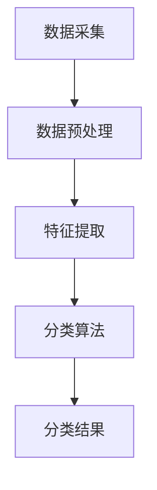
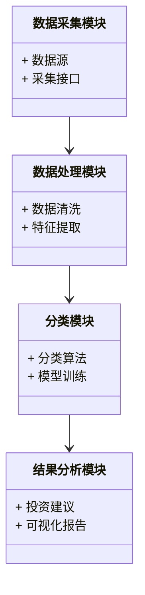
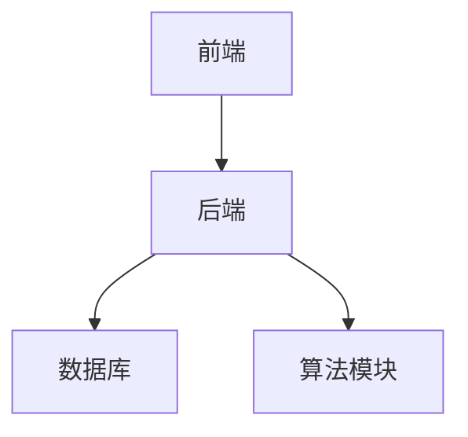
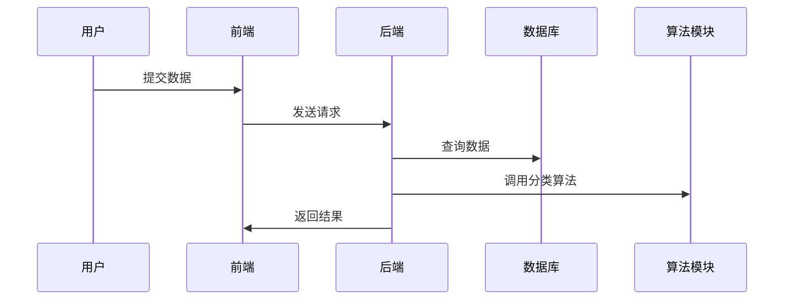

                 


```markdown
# 价值投资中的智能垃圾分类系统分析

> 关键词：价值投资，智能垃圾分类，机器学习，算法，系统架构

> 摘要：本文分析了智能垃圾分类系统在价值投资中的应用，探讨了其核心概念、算法原理、系统架构及实战项目，旨在为投资者和技术人员提供深度见解。

---

# 第一部分: 智能垃圾分类系统背景介绍

## 第1章: 智能垃圾分类系统概述

### 1.1 智能垃圾分类的背景与现状

#### 1.1.1 垃圾分类的背景介绍
垃圾处理是全球关注的环境问题，智能垃圾分类系统利用技术手段提升效率，减少人工成本，推动可持续发展。

#### 1.1.2 智能垃圾分类技术的发展历程
从早期的机械分拣到现代的AI算法，技术进步显著提升了垃圾分类的准确性和效率。

#### 1.1.3 当前垃圾分类系统的现状与挑战
现有系统面临数据不足、算法优化等问题，需结合价值投资理念优化资源配置。

### 1.2 价值投资中的智能垃圾分类系统

#### 1.2.1 价值投资的定义与特点
价值投资强调长期回报，通过分析企业内在价值进行投资决策。

#### 1.2.2 智能垃圾分类系统在价值投资中的应用
系统帮助投资者识别高价值企业，优化投资组合，降低风险。

#### 1.2.3 智能垃圾分类系统的投资价值分析
通过技术提升效率，降低成本，为企业创造价值，进而影响投资决策。

### 1.3 本章小结
智能垃圾分类系统在价值投资中具有重要地位，技术进步推动了投资效率和准确性。

---

## 第2章: 智能垃圾分类系统的核心概念

### 2.1 数据采集与处理

#### 2.1.1 数据采集方式
多源数据采集，包括企业财务数据、市场表现、行业趋势等。

#### 2.1.2 数据预处理方法
数据清洗、特征提取、标准化等步骤确保数据质量。

#### 2.1.3 数据特征提取
识别关键特征，如市盈率、ROE等，用于分类和价值评估。

### 2.2 分类算法原理

#### 2.2.1 分类算法的定义与特点
分类算法用于将企业分为不同类别，如高价值、中价值、低价值。

#### 2.2.2 常见分类算法对比
| 算法 | 优点 | 缺点 |
|------|------|------|
| KNN | 简单，适合小数据 | 数据量大时效率低 |
| SVM | 高准确性 | 参数敏感 |
| RF | 抗噪声，高效率 | 解释性差 |

#### 2.2.3 分类算法的优缺点分析
不同算法适用于不同场景，选择需考虑数据量、准确性和计算资源。

### 2.3 系统架构与流程

#### 2.3.1 系统架构设计


#### 2.3.2 系统流程图


#### 2.3.3 系统模块划分
- 数据采集模块：收集企业数据。
- 数据处理模块：清洗和预处理数据。
- 特征提取模块：提取关键特征。
- 分类模块：应用算法进行分类。
- 结果分析模块：输出投资建议。

---

## 第3章: 分类算法的原理与实现

### 3.1 K-近邻算法（KNN）

#### 3.1.1 KNN算法的原理
基于距离计算，找到k个最近邻，多数投票决定分类。

#### 3.1.2 KNN算法的实现步骤
1. 计算数据点间的距离。
2. 选取k个最近的数据点。
3. 统计各类别数量，选择最多类别作为结果。

#### 3.1.3 KNN算法的优缺点
- 优点：简单，无需训练。
- 缺点：计算复杂度高，适合小数据集。

### 3.2 支持向量机（SVM）

#### 3.2.1 SVM算法的原理
通过找到超平面，最大化分类间隔，处理非线性问题。

#### 3.2.2 SVM算法的实现步骤
1. 数据映射到高维空间。
2. 寻找最优超平面。
3. 分类数据点。

#### 3.2.3 SVM算法的优缺点
- 优点：高准确性，处理非线性问题。
- 缺点：参数敏感，计算复杂。

### 3.3 随机森林（Random Forest）

#### 3.3.1 随机森林算法的原理
构建多棵决策树，通过投票或平均结果进行分类。

#### 3.3.2 随机森林算法的实现步骤
1. 随机抽取样本和特征，构建决策树。
2. 多数投票决定最终分类。

#### 3.3.3 随机森林算法的优缺点
- 优点：高准确性和鲁棒性。
- 缺点：解释性较差。

---

## 第4章: 分类算法的数学模型

### 4.1 K-近邻算法的数学模型
距离计算公式：
$$
d(x_i, x_j) = \sqrt{\sum_{k=1}^{n} (x_{ik} - x_{jk})^2}
$$

### 4.2 支持向量机的数学模型
拉格朗日对偶：
$$
\max_{\alpha} \sum_{i=1}^{n} \alpha_i y_i - \sum_{i,j} \alpha_i \alpha_j y_i y_j x_i \cdot x_j
$$

### 4.3 随机森林的数学模型
决策树模型：
$$
y = \text{sign}(\sum_{j=1}^{M} \text{Tree}_j(x))
$$

---

## 第5章: 系统分析与架构设计

### 5.1 系统需求分析

#### 5.1.1 功能需求
- 数据采集与处理
- 特征提取与分类
- 投资建议输出

#### 5.1.2 性能需求
高准确性，实时处理，可扩展性。

#### 5.1.3 用户需求
投资者和数据科学家需要直观的结果和操作界面。

### 5.2 系统功能设计

#### 5.2.1 领域模型类图


### 5.3 系统架构设计

#### 5.3.1 系统架构图


### 5.4 系统接口设计

#### 5.4.1 API接口
- POST /api/train: 训练模型
- GET /api/predict: 预测结果

### 5.5 系统交互设计

#### 5.5.1 序列图


---

## 第6章: 项目实战

### 6.1 环境安装

#### 6.1.1 安装Python和必要的库
```bash
pip install numpy scikit-learn matplotlib
```

### 6.2 系统核心实现源代码

#### 6.2.1 数据处理代码
```python
import pandas as pd
from sklearn.preprocessing import StandardScaler

# 数据加载
data = pd.read_csv('data.csv')

# 数据预处理
X = data.drop('target', axis=1)
y = data['target']

# 特征标准化
scaler = StandardScaler()
X_scaled = scaler.fit_transform(X)
```

#### 6.2.2 分类算法实现
```python
from sklearn.neighbors import KNeighborsClassifier

# 模型训练
knn = KNeighborsClassifier(n_neighbors=3)
knn.fit(X_scaled, y)

# 预测
new_data = scaler.transform(new_sample)
prediction = knn.predict(new_data)
```

### 6.3 代码应用解读与分析
代码实现数据预处理和分类，展示如何将理论应用于实际项目。

### 6.4 案例分析
通过具体案例分析，展示系统如何帮助投资者做出决策。

### 6.5 项目小结
总结项目成果，讨论可能的优化方向。

---

## 第7章: 最佳实践

### 7.1 小结
智能垃圾分类系统在价值投资中的应用潜力巨大，技术进步推动投资效率提升。

### 7.2 注意事项
- 数据质量影响结果，需谨慎处理。
- 选择合适的算法，避免过拟合。
- 定期更新模型，适应市场变化。

### 7.3 拓展阅读
推荐相关书籍和论文，鼓励深入学习。

---

## 附录

### 附录A: 术语表
解释文中出现的专业术语。

### 附录B: 参考文献
列出所有引用的文献和资源。

---

# 结语

智能垃圾分类系统的价值投资应用展示了技术与金融的深度融合，未来随着技术进步，其应用将更加广泛和深入。
```

