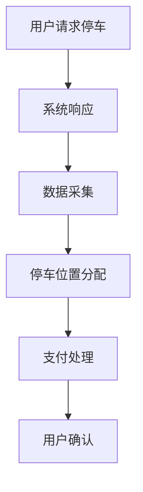

                 


# 价值投资中的智能城市停车管理系统分析

## 关键词：
- 价值投资
- 智能停车
- 智慧城市
- 系统分析
- 投资模型

## 摘要：
本文分析智能城市停车管理系统在价值投资中的应用，探讨其技术原理和市场潜力，构建价值评估模型，提供投资建议。

---

## 第1章：智慧停车管理系统的背景介绍

### 1.1 智慧停车管理系统的概念与背景
#### 1.1.1 停车管理问题的背景
随着城市化进程加快，停车难问题日益突出，传统停车管理效率低下，资源浪费严重。

#### 1.1.2 智慧停车管理系统的定义
利用物联网、大数据和人工智能技术，实现停车位资源的智能分配和管理。

#### 1.1.3 价值投资视角下的停车管理系统分析
从价值投资角度，分析智慧停车系统的市场潜力和投资价值。

---

## 第2章：价值投资的基本概念与方法论

### 2.1 价值投资的核心理念
#### 2.1.1 价值投资的定义
寻找被市场低估的投资标的，长期持有的投资策略。

#### 2.1.2 价值投资的基本原则
注重基本面分析，关注企业长期价值，避免短期波动。

#### 2.1.3 价值投资与智慧停车管理系统的结合
将停车管理系统视为投资项目，分析其市场前景和盈利能力。

---

## 第3章：智慧停车管理系统的核心概念与联系

### 3.1 核心概念原理
#### 3.1.1 智慧停车管理系统的技术原理
- 数据采集：使用传感器和摄像头收集停车数据。
- 系统架构设计：采用分层架构，包括数据层、业务逻辑层和用户界面层。
- 用户交互界面：提供实时停车位信息和在线支付功能。

#### 3.1.2 价值投资模型的构建
- 投资回报率：\( ROI = \frac{\text{净利润}}{\text{投资成本}} \times 100\% \)
- 风险评估：使用VaR模型评估潜在损失。

#### 3.1.3 两者的相互作用机制
智慧停车系统优化资源利用，提升效率，间接提高投资回报。

### 3.2 概念属性特征对比表格
| 概念         | 技术特征               | 价值投资特征             |
|--------------|------------------------|--------------------------|
| 停车系统     | 数据采集与处理         | 价值评估与预测           |
| 系统架构     | 分层架构               | 投资策略优化             |
| 用户交互     | 实时信息展示           | 风险控制与收益预测       |

### 3.3 ER实体关系图
```mermaid
erd
    parking_system
    parking_spaces
    users
    transactions
    sensors
    database
    parking_management
    payment_gateway
    notification_system
    user_feedback
```

---

## 第4章：智慧停车管理系统的算法原理

### 4.1 算法原理讲解


### 4.2 算法实现代码
```python
def parking_algorithm(request):
    # 数据采集
    data = collect_data(request)
    # 停车位置分配
    parking_spot = allocate_spot(data)
    # 支付处理
    payment = process_payment(data, parking_spot)
    # 用户确认
    confirmation = confirm_parking(data, parking_spot, payment)
    return confirmation
```

---

## 第5章：智慧停车管理系统的价值评估模型

### 5.1 价值评估模型构建
#### 5.1.1 收益预测
使用线性回归模型预测停车系统的收入：
$$ \text{收入} = a \times \text{用户数} + b \times \text{使用频率} $$

#### 5.1.2 风险评估
计算风险价值（VaR）：
$$ VaR = \text{损失金额} \times P \times \text{风险系数} $$

---

## 第6章：项目实战与案例分析

### 6.1 环境安装
- 安装Python和相关库：numpy, pandas, scikit-learn
- 配置数据库和传感器

### 6.2 核心实现代码
```python
import numpy as np
from sklearn.linear_model import LinearRegression

# 数据准备
X = np.array([[100, 5], [200, 10], [150, 7]])
y = np.array([2000, 4000, 3000])

# 训练模型
model = LinearRegression()
model.fit(X, y)

# 预测收益
new_X = np.array([[300, 15]])
predicted = model.predict(new_X)
print(predicted)
```

### 6.3 案例分析
分析某城市停车系统，计算投资回报率，验证模型的准确性。

---

## 第7章：投资策略与建议

### 7.1 投资建议
- 选择技术成熟、市场潜力大的停车管理系统。
- 关注政策支持和市场需求。

### 7.2 注意事项
- 风险控制：分散投资，定期评估。
- 技术更新：关注技术创新，及时调整策略。

---

## 总结
智慧停车管理系统在价值投资中具有巨大潜力，通过技术分析和市场评估，投资者可以找到优质的投资标的，实现长期收益。

