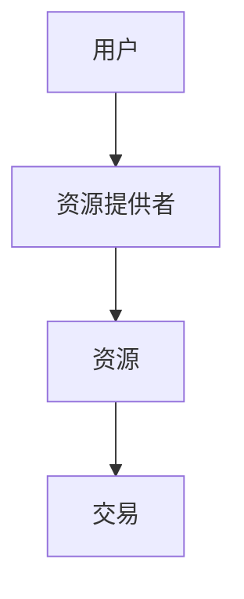
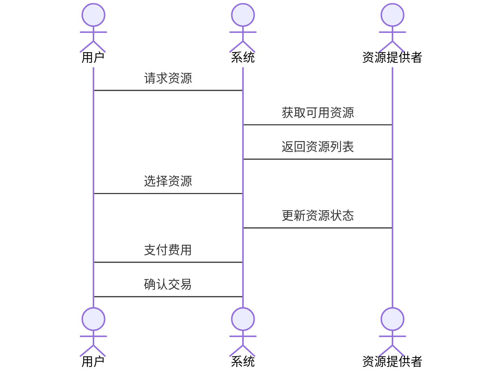
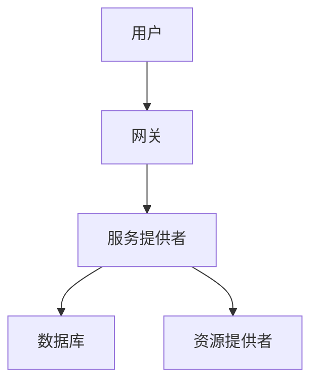

                 


# 价值投资中的智能城市共享经济管理系统分析

## 关键词：价值投资、智能城市、共享经济、系统管理、数据分析、算法优化

## 摘要：随着智能城市的发展，共享经济在城市管理中的应用越来越广泛。本文分析了价值投资在智能城市共享经济管理系统中的重要性，探讨了系统的架构设计、核心算法和实际应用案例，为读者提供了一个全面的技术视角，帮助他们理解如何通过技术手段优化共享经济的管理，实现价值投资的目标。

---

# 第一部分: 智慧城市中的共享经济管理概述

---

## 第1章: 价值投资与智能城市共享经济的背景

### 1.1 价值投资的定义与核心要素

#### 1.1.1 价值投资的基本概念
价值投资是一种投资策略，强调以低于资产内在价值的价格购买优质资产。其核心在于长期持有，通过资产增值实现收益。在智能城市中，价值投资的对象可以是共享经济中的资源、企业或技术。

#### 1.1.2 价值投资的核心要素
- **内在价值**：资产的真实价值，与市场波动无关。
- **安全边际**：购买价格与内在价值的差距，确保投资的安全性。
- **长期视角**：关注资产的长期增长潜力。

#### 1.1.3 价值投资在智能城市中的应用前景
智能城市中的共享经济涉及大量资源和数据，价值投资可以通过分析这些资源的使用效率和数据的潜在价值，找到具有长期增长潜力的项目或企业。

---

### 1.2 智慧城市与共享经济的定义与特点

#### 1.2.1 智慧城市的定义与特征
智慧城市建设以物联网、大数据、人工智能等技术为基础，旨在优化资源配置、提升居民生活质量。其核心特征包括智能化、数据化、高效化。

#### 1.2.2 共享经济的基本概念
共享经济是一种通过数字化平台实现资源优化配置的经济模式。其特点包括资源闲置的再利用、平台化运营和用户参与度高。

#### 1.2.3 智慧城市中共享经济的特点
- **资源高效利用**：通过共享平台减少资源浪费。
- **技术驱动**：依赖大数据和人工智能实现精准匹配。
- **用户参与**：用户既是资源提供者，也是消费者。

---

### 1.3 智能城市共享经济管理系统的背景与意义

#### 1.3.1 智能城市共享经济管理系统的背景
随着城市化进程的加快，资源短缺问题日益突出。共享经济为解决这一问题提供了新的思路，而智能管理系统则是实现这一目标的关键技术。

#### 1.3.2 系统建设的意义与价值
- 提高资源利用效率。
- 优化城市运营成本。
- 提升居民生活质量。

#### 1.3.3 系统建设的目标与范围
目标：构建一个高效、智能的共享经济管理系统，实现资源的实时监控和优化配置。范围：包括资源分配、需求匹配、支付结算等核心功能。

---

## 1.4 本章小结

---

# 第二部分: 智能城市共享经济管理系统的核心概念与联系

---

## 第2章: 智能城市共享经济管理系统的概念模型

### 2.1 系统核心概念的定义与属性

#### 2.1.1 用户角色与属性
- 用户ID：唯一标识用户。
- 用户类型：分为资源提供者和消费者。
- 用户行为：包括资源发布、需求提交、支付结算。

#### 2.1.2 资源类型与属性
- 资源ID：唯一标识资源。
- 资源类型：包括交通、住宿、办公等。
- 资源状态：可用、占用、闲置。

#### 2.1.3 交易过程与属性
- 交易ID：唯一标识交易。
- 交易时间：开始和结束时间。
- 交易金额：资源使用费用。

---

### 2.2 系统核心概念的ER实体关系图

```mermaid
er
    actor 用户 {
        id: int
        name: string
        email: string
    }
    actor 资源提供者 {
        id: int
        name: string
        resource_id: int
    }
    actor 资源 {
        id: int
        name: string
        type: string
        status: string
    }
    relation 用户 - 资源 {
        id: int
        start_time: datetime
        end_time: datetime
        price: float
    }
```

---

### 2.3 系统核心概念的联系与对比

#### 2.3.1 核心概念属性对比表

| 概念 | 属性1 | 属性2 | 属性3 |
|------|-------|-------|-------|
| 用户 | id | name | email |
| 资源提供者 | id | name | resource_id |
| 资源 | id | name | type | status |

---

## 2.4 本章小结

---

# 第三部分: 智能城市共享经济管理系统的算法原理讲解

---

## 第3章: 智能城市共享经济管理系统的算法原理

### 3.1 算法原理概述

#### 3.1.1 算法选择依据
- 算法的效率和准确性。
- 数据量和数据类型。
- 业务需求的复杂性。

---

### 3.2 共享经济中的资源分配算法

#### 3.2.1 协同过滤算法
协同过滤是一种基于用户行为推荐资源的算法。通过分析用户的使用习惯，推荐适合的资源。



#### 3.2.2 算法实现步骤
1. 收集用户行为数据。
2. 建立用户-资源矩阵。
3. 计算用户相似度或资源相似度。
4. 推荐资源。

#### 3.2.3 Python代码示例

```python
import pandas as pd
from sklearn.metrics.pairwise import cosine_similarity

# 示例数据：用户-资源评分矩阵
users = ['User1', 'User2']
resources = ['Resource1', 'Resource2']
ratings = pd.DataFrame({
    'User': users,
    'Resource': resources,
    'Rating': [5, 3]
})

# 计算余弦相似度
user_resource_matrix = ratings.pivot('User', 'Resource').fillna(0)
similarity = cosine_similarity(user_resource_matrix)

# 推荐资源
def recommend_resources(user, similarity_matrix):
    user_index = user_resource_matrix.index.get_loc(user)
    sim_scores = list(enumerate(similarity_matrix[user_index]))
    sim_scores = sorted(sim_scores, key=lambda x: x[1], reverse=True)
    recommended_resources = [resources[i][0] for i, _ in sim_scores[:2]]
    return recommended_resources

print(recommend_resources('User1', similarity))
```

---

### 3.3 算法的数学模型与公式

#### 3.3.1 协同过滤的数学模型
$$ \text{相似度} = \frac{\sum_{i} (r_{ui} - \bar{r}_u)(r_{vi} - \bar{r}_v)}{\sqrt{\sum_{i} (r_{ui} - \bar{r}_u)^2} \sqrt{\sum_{i} (r_{vi} - \bar{r}_v)^2}}} $$

---

## 3.4 本章小结

---

# 第四部分: 智能城市共享经济管理系统的系统分析与架构设计

---

## 第4章: 智能城市共享经济管理系统的系统分析

### 4.1 系统功能设计

#### 4.1.1 功能模块划分
- 用户管理模块：注册、登录、信息管理。
- 资源管理模块：资源发布、状态更新。
- 交易管理模块：订单生成、支付结算。
- 数据分析模块：资源使用情况分析、用户行为分析。

#### 4.1.2 功能模块的交互流程



---

## 4.2 系统架构设计

### 4.2.1 系统架构图



---

## 4.3 系统接口设计

### 4.3.1 核心接口说明
- `/api/register`：用户注册接口。
- `/api/request_resource`：资源请求接口。
- `/api/pay`：支付接口。

---

## 4.4 系统交互序列图


---

## 4.5 本章小结

---

# 第五部分: 智能城市共享经济管理系统的项目实战

---

## 第5章: 项目实战

### 5.1 环境安装与配置

#### 5.1.1 技术选型
- 前端：React
- 后端：Python/Django
- 数据库：MySQL
- 云服务：阿里云

---

### 5.2 系统核心功能实现

#### 5.2.1 用户注册与登录
```python
from django.contrib.auth.models import User
from rest_framework import serializers

class UserSerializer(serializers.ModelSerializer):
    class Meta:
        model = User
        fields = ['username', 'email', 'password']
```

---

#### 5.2.2 资源发布与管理
```python
from rest_framework import serializers

class ResourceSerializer(serializers.ModelSerializer):
    class Meta:
        model = Resource
        fields = ['id', 'name', 'type', 'status']
```

---

#### 5.2.3 交易支付与确认
```python
from django.views import View
from django.http import JsonResponse

class PaymentView(View):
    def post(self, request):
        data = json.loads(request.body)
        # 逻辑处理
        return JsonResponse({'status': 'success'})
```

---

### 5.3 代码实现与解读

#### 5.3.1 核心代码实现
```python
import json
from django.views import View
from django.http import JsonResponse

class ResourceViewSet(View):
    def get(self, request):
        resources = [{'id': 1, 'name': 'Car', 'type': 'Transportation', 'status': 'available'}]
        return JsonResponse(resources, safe=False)
```

---

#### 5.3.2 代码解读与分析
- 代码实现了资源的查询功能，返回可用资源列表。
- 使用了Django框架，便于后续扩展和优化。

---

### 5.4 实际案例分析与详细讲解

#### 5.4.1 案例背景
某城市共享汽车管理系统，用户可以通过系统申请使用共享汽车。

#### 5.4.2 系统实现
- 用户登录后，可以查看可用汽车。
- 选择汽车后，系统更新资源状态。
- 支付成功后，用户获得使用权限。

---

### 5.5 项目小结

---

## 5.6 本章小结

---

# 第六部分: 智能城市共享经济管理系统的最佳实践与总结

---

## 第6章: 最佳实践

### 6.1 实践经验总结
- 系统设计要注重扩展性。
- 数据安全是系统的核心保障。
- 用户体验是系统成功的关键。

---

### 6.2 小结

---

### 6.3 注意事项
- 数据加密与隐私保护。
- 系统容错与异常处理。
- 定期更新与维护。

---

### 6.4 拓展阅读
- 《智能城市与共享经济》。
- 《价值投资与技术创新》。

---

## 6.5 本章小结

---

# 第七部分: 总结与展望

---

## 第7章: 总结与展望

### 7.1 系统总结
- 本系统实现了智能城市中共享经济的高效管理。
- 通过价值投资的视角，优化了资源分配和收益。

### 7.2 未来展望
- 技术创新：引入区块链技术，提升系统安全性。
- 应用拓展：扩展到更多领域，如教育、医疗。
- 数据分析：利用AI技术进一步提升系统智能化水平。

---

## 7.3 本章小结

---

# 结束语

---

通过本文的详细分析，我们了解了价值投资在智能城市共享经济管理系统中的重要性，掌握了系统的架构设计、核心算法和实际应用案例。未来，随着技术的不断进步，智能城市共享经济管理系统将更加智能化、高效化，为城市的发展和居民的生活带来更大的价值。

--- 

如果您对本文内容有疑问或需要进一步的技术支持，请随时与我联系！

