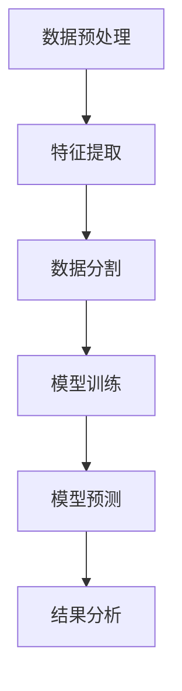
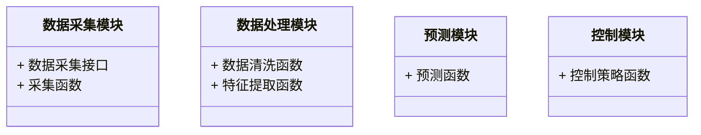
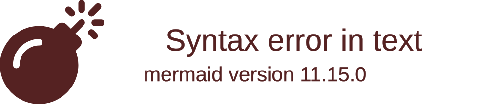
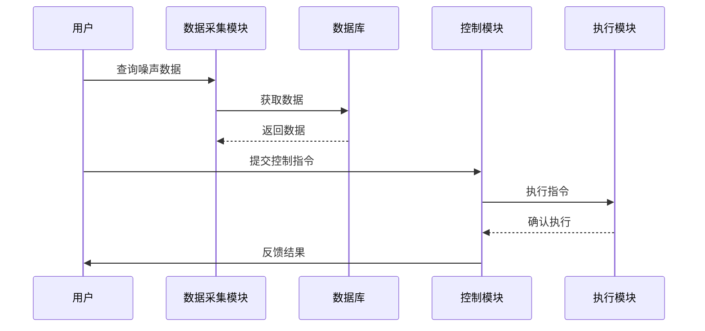

                 


# 价值投资中的智能城市噪声污染控制系统分析

## 关键词：
智能城市，噪声污染，价值投资，控制系统，数据挖掘，机器学习

## 摘要：
本文探讨了在智能城市背景下，噪声污染控制系统作为一项重要环保技术的投资价值。通过分析系统的组成、算法原理和系统架构，结合价值投资的方法，为投资者提供科学的决策依据。文章详细讲解了系统的功能模块、数据处理流程，并通过案例分析展示了实际应用，最后给出了投资建议和未来研究方向。

---

# 文章正文

## 第1章：智能城市噪声污染控制系统的背景

### 1.1 城市噪声污染的现状
城市化进程加速，交通、工业和建筑活动导致噪声污染日益严重。长期暴露在高噪声环境中会影响居民健康，降低生活质量和工作效率。噪声污染还可能引发社会稳定问题，如居民投诉和社区矛盾。

### 1.2 智能城市的发展背景
智能城市利用物联网、大数据和人工智能技术，优化城市资源管理和公共服务。噪声污染控制系统作为智能城市的重要组成部分，通过实时监测和智能调控，有效降低噪声污染，提升城市环境质量。

### 1.3 价值投资的基本概念
价值投资强调长期投资策略，关注企业的内在价值和成长潜力。通过基本面分析，识别具有竞争优势和良好治理的企业，获得超额收益。在智能城市领域，技术创新和市场前景是价值投资的关键因素。

---

## 第2章：智能城市噪声污染控制系统的分析框架

### 2.1 系统组成与工作原理
#### 2.1.1 系统组成
- **噪声监测设备**：安装在城市各区域，实时采集噪声数据。
- **数据采集与传输系统**：将数据传输到中央控制系统。
- **中央控制系统**：分析数据，制定控制策略。
- **用户界面与反馈系统**：向用户展示数据和控制结果。

#### 2.1.2 实体关系图
```mermaid
er
actor 噪声监测设备: 采集噪声数据
actor 数据采集系统: 传输数据
actor 中央控制系统: 分析数据
actor 用户: 查询数据
```

### 2.2 系统工作原理
- 数据采集：噪声传感器实时采集噪声数据。
- 数据传输：通过网络将数据传输到中央控制系统。
- 数据分析：使用机器学习算法预测噪声变化趋势。
- 控制策略：根据分析结果，调整噪声源或采取隔音措施。

---

## 第3章：噪声监测数据处理算法

### 3.1 数据预处理
- 数据清洗：去除异常值和错误数据。
- 数据标准化：统一数据格式，便于后续分析。
- 数据特征提取：提取影响噪声的主要特征，如频率和强度。

#### 3.1.1 数据清洗代码
```python
import pandas as pd

# 读取数据
data = pd.read_csv('noise_data.csv')

# 删除异常值
data = data[(data['noise_level'] < 100) & (data['noise_level'] > 50)]
```

### 3.2 基于机器学习的噪声预测模型
- 使用随机森林算法预测噪声水平。
- 通过训练模型，识别影响噪声的主要因素。

#### 3.2.1 随机森林算法流程图


#### 3.2.2 随机森林实现代码
```python
from sklearn.ensemble import RandomForestRegressor

# 数据分割
X_train, X_test, y_train, y_test = train_test_split(X, y, test_size=0.2)

# 模型训练
model = RandomForestRegressor(n_estimators=100)
model.fit(X_train, y_train)

# 预测结果
y_pred = model.predict(X_test)
```

#### 3.2.3 模型评估
- 均方误差（MSE）：衡量预测值与真实值的差异。
  $$MSE = \frac{1}{n}\sum_{i=1}^{n}(y_i - \hat{y_i})^2$$
- R平方值（R²）：衡量模型解释能力。
  $$R^2 = 1 - \frac{\sum_{i=1}^{n}(y_i - \hat{y_i})^2}{\sum_{i=1}^{n}(y_i - \bar{y})^2}$$

---

## 第4章：系统分析与架构设计

### 4.1 系统功能设计
- **数据采集模块**：实时采集噪声数据。
- **数据处理模块**：清洗和特征提取。
- **预测模块**：使用机器学习模型预测噪声。
- **控制模块**：根据预测结果调整措施。

#### 4.1.1 功能模块类图


### 4.2 系统架构设计
- **分层架构**：数据采集层、数据处理层、应用层。
- **通信协议**：使用MQTT协议进行数据传输。

#### 4.2.1 系统架构图


### 4.3 系统接口设计
- 数据接口：REST API提供噪声数据。
- 控制接口：接收控制指令，调整噪声源。

#### 4.3.1 REST API示例
```python
from flask import Flask
from flask_restful import Resource, Api

app = Flask(__name__)
api = Api(app)

class NoiseData(Resource):
    def get(self):
        return {'data': 'noise_level'}

api.add_resource(NoiseData, '/noise')
app.run(debug=True)
```

### 4.4 系统交互流程
- 用户查询噪声数据。
- 系统返回实时数据。
- 用户提交控制指令。
- 系统执行控制策略。

#### 4.4.1 系统交互流程图


---

## 第5章：项目实战

### 5.1 项目环境安装
- 安装Python和必要的库：scikit-learn、pandas、flask、mermaid。

#### 5.1.1 安装代码
```bash
pip install scikit-learn pandas flask flask-restful
```

### 5.2 核心代码实现
#### 5.2.1 数据采集模块
```python
import time
import serial

# 连接串口
ser = serial.Serial('COM3', 9600)

def read_noise():
    while True:
        data = ser.readline().decode().strip()
        print(f'Noise level: {data}')
        time.sleep(1)
```

#### 5.2.2 数据处理模块
```python
import pandas as pd
from sklearn.ensemble import RandomForestRegressor

# 数据处理
data = pd.read_csv('noise_data.csv')
X = data.drop('noise_level', axis=1)
y = data['noise_level']

# 模型训练
model = RandomForestRegressor()
model.fit(X, y)
```

#### 5.2.3 应用接口
```python
from flask import Flask
from flask_restful import Resource, Api

app = Flask(__name__)
api = Api(app)

class NoisePredict(Resource):
    def get(self):
        return {'prediction': model.predict(X_test)[0]}

api.add_resource(NoisePredict, '/predict')
app.run(debug=True)
```

### 5.3 案例分析与详细解读
以某城市主干道为例，部署噪声监测设备，实时采集交通噪声数据。通过模型预测，识别噪声高峰时段，并制定降噪措施，如调整交通信号灯和优化道路设计。

---

## 第6章：总结与展望

### 6.1 总结
智能城市噪声污染控制系统具有广阔的应用前景，价值投资需要关注技术创新和市场潜力。通过本文的分析，投资者可以识别具有竞争优势的企业，获得长期收益。

### 6.2 未来展望
随着人工智能和物联网技术的发展，噪声污染控制系统将更加智能化和高效。未来研究可以关注多源数据融合和自适应控制策略。

---

## 附录
### 投资建议
- 关注技术领先的企业。
- 评估企业的市场前景和财务状况。
- 长期持有优质资产，避免短期波动。

### 拓展阅读
- 建议阅读《智能城市的发展与挑战》和《价值投资实战指南》。

---

通过以上内容，本文为投资者提供了智能城市噪声污染控制系统的详细分析，帮助他们在技术驱动的市场中做出明智的投资决策。

