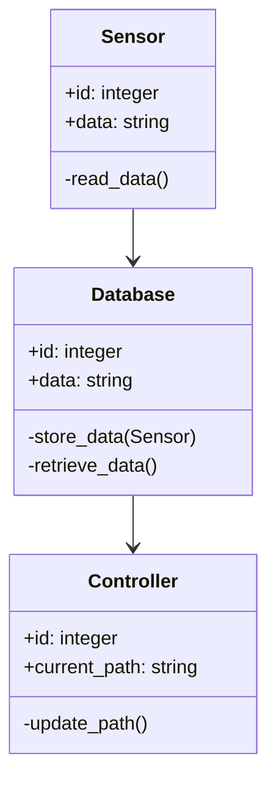

                 


# 价值投资中的智能城市地下物流系统分析

> 关键词：价值投资，智能城市，地下物流系统，物流技术，投资分析

> 摘要：本文从价值投资的角度分析智能城市地下物流系统的技术与经济价值。通过探讨系统的构成、技术原理、经济效益和投资策略，结合实际案例，为投资者提供深度分析和投资建议。

---

## 第1章 价值投资的基本概念与分析框架

### 1.1 价值投资的核心理念

#### 1.1.1 价值投资的定义与起源

价值投资是一种以基本面分析为基础的投资策略，起源于20世纪初，由本杰明·格雷厄姆和戴维·多德提出。其核心理念是寻找市场估值低于其内在价值的股票，长期持有，等待其价值回归。

#### 1.1.2 价值投资的基本原则

- **安全边际**：买入价格低于内在价值，以降低风险。
- **长期持有**：关注企业的长期价值，而非短期波动。
- **深入分析**：研究企业的财务状况、行业地位和竞争优势。

#### 1.1.3 价值投资的适用场景

- 稳定的行业：如公用事业、制造业。
- 具有竞争优势的企业：如低成本、高市场占有率。

---

### 1.2 智能城市地下物流系统的概念与特点

#### 1.2.1 智能物流系统的基本概念

智能物流系统通过物联网、大数据和人工智能技术，实现物流过程的智能化管理，提高效率和降低成本。

#### 1.2.2 地下物流系统的独特优势

- **空间利用**：利用地下空间，避免交通拥堵。
- **高效运输**：自动化操作，减少人为错误，提高运输效率。
- **环境友好**：减少碳排放，符合绿色物流趋势。

#### 1.2.3 智能城市地下物流系统的构成要素

- **传感器**：实时监测物流状态。
- **自动化设备**：如无人车、机器人。
- **数据处理系统**：分析数据，优化物流路径。

---

## 第2章 智能城市地下物流系统的经济价值分析

### 2.1 系统的经济效益

#### 2.1.1 成本优势

- **降低运输成本**：通过优化路径和自动化操作。
- **减少人工成本**：自动化设备减少人力需求。

#### 2.1.2 效率优势

- **快速响应**：实时监控和快速决策。
- **减少物流时间**：通过优化路径和自动化操作。

#### 2.1.3 市场竞争力

- **提升客户满意度**：准时交付和高效服务。
- **增强企业竞争力**：快速响应市场需求。

---

### 2.2 价值投资的核心要素与分析框架

#### 2.2.1 企业价值的评估方法

- **市盈率（P/E）**：股价与每股收益的比率。
- **市净率（P/B）**：股价与每股净资产的比率。
- **现金流**：企业产生的自由现金流。

#### 2.2.2 竞争优势的分析维度

- **成本优势**：生产成本低。
- **技术优势**：拥有核心技术。
- **市场优势**：高市场占有率。

#### 2.2.3 行业趋势与周期性分析

- **行业增长**：智能物流行业的快速发展。
- **周期性**：物流行业受经济周期影响较小。

---

## 第3章 智能城市地下物流系统的技术分析

### 3.1 系统的关键技术与实现原理

#### 3.1.1 自动化仓储技术

- **无人搬运车（AGV）**：用于货物的自动搬运。
- **自动化分拣系统**：通过传感器和机器视觉实现快速分拣。

#### 3.1.2 智能调度算法

- **路径优化算法**：基于遗传算法或蚁群算法优化物流路径。
- **调度系统**：实时调整运输计划，避免拥堵。

#### 3.1.3 物流路径优化模型

- **模型目标**：最小化运输成本和时间。
- **约束条件**：货物重量、车辆容量、交通限制。

---

### 3.2 系统的算法原理与数学模型

#### 3.2.1 物流路径优化的数学模型

$$\text{目标函数: } \min \sum_{i=1}^{n} c_i x_i$$

$$\text{约束条件: } \sum_{i=1}^{n} x_i = 1$$

其中，$c_i$为第$i$条路径的成本，$x_i$为是否选择该路径的变量。

#### 3.2.2 智能调度算法的实现流程

1. **初始化**：设定初始参数和路径。
2. **计算路径成本**：评估每条路径的总成本。
3. **优化路径**：使用遗传算法优化路径。
4. **输出最优路径**。

---

## 第4章 智能城市地下物流系统的系统架构设计

### 4.1 系统功能设计

- **数据采集层**：传感器采集物流信息。
- **数据处理层**：分析数据，优化路径。
- **执行层**：自动化设备执行运输任务。

#### 4.1.1 系统功能设计的ER类图



### 4.2 系统架构设计

#### 4.2.1 系统架构图

```mermaid
archiecture
    节点1：Sensor
    节点2：Database
    节点3：Controller
    边1：Sensor -> Database
    边2：Database -> Controller
```

---

## 第5章 价值投资中的智能城市地下物流系统分析

### 5.1 价值投资的核心逻辑

- **长期视角**：关注企业的长期价值。
- **安全边际**：买入价格低于内在价值。
- **竞争优势**：选择具有技术优势和成本优势的企业。

---

## 第6章 项目实战与总结

### 6.1 项目实战

#### 6.1.1 环境配置

- **编程语言**：Python
- **框架**：Django
- **数据库**：MySQL

#### 6.1.2 核心代码实现

```python
def optimize_path(costs):
    n = len(costs)
    # 初始化路径
    path = list(range(n))
    # 使用遗传算法优化路径
    for _ in range(100):
        # 选择两个路径进行交换
        i, j = random.sample(range(n), 2)
        new_path = path[:i] + path[j] + path[i:j] + path[i+1:j] + path[j+1:]
        # 计算成本
        old_cost = sum(costs[i][path[k]] for k in range(i, j))
        new_cost = sum(costs[i][new_path[k]] for k in range(i, j))
        if new_cost < old_cost:
            path = new_path
    return path
```

### 6.2 总结与展望

智能城市地下物流系统具有广阔的发展前景，其技术优势和经济效益为投资者提供了良好的投资机会。通过深入分析企业的竞争优势和行业趋势，投资者可以在价值投资中获得长期稳定的收益。

---

## 第7章 价值投资中的最佳实践

### 7.1 投资策略

- **分散投资**：降低风险。
- **长期持有**：关注企业的长期价值。
- **持续学习**：更新知识，适应市场变化。

### 7.2 注意事项

- **风险控制**：设定止损点。
- **市场波动**：避免短期波动影响决策。

---

通过以上分析，价值投资中的智能城市地下物流系统具有较高的投资价值，投资者应结合技术分析和经济分析，选择具有竞争优势的企业进行投资。

