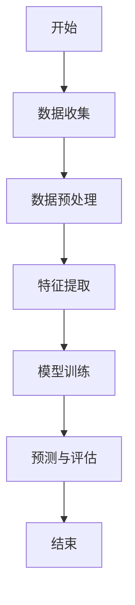
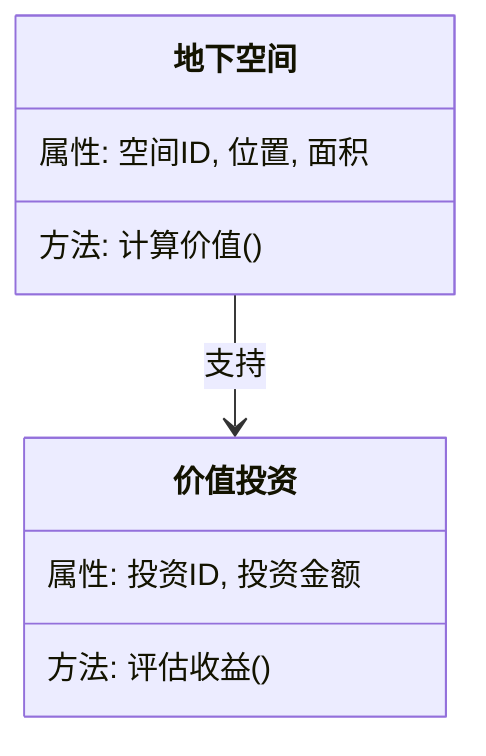
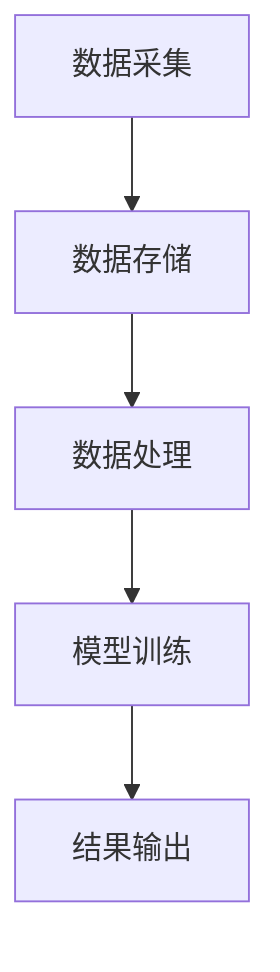
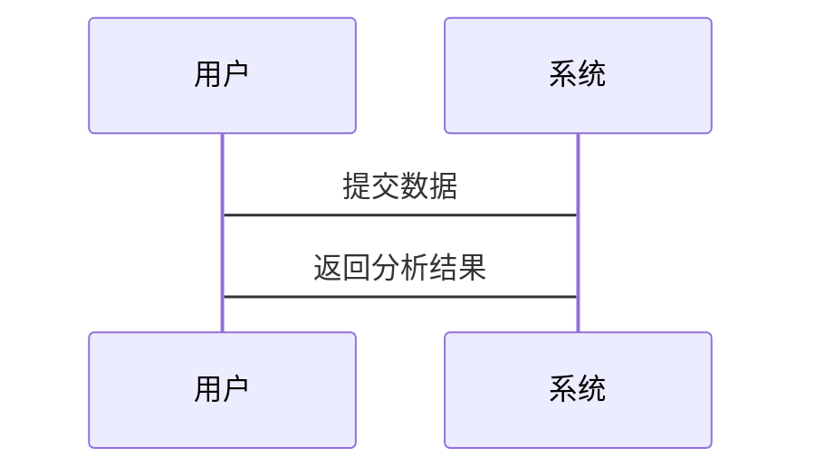

                 


# 价值投资中的智能城市地下空间利用系统分析

> 关键词：智能城市、地下空间利用、价值投资、系统分析、算法原理、系统架构

> 摘要：本文探讨了在智能城市建设背景下，地下空间利用的价值投资分析。通过系统分析和算法优化，提出了基于智能系统的地下空间利用解决方案，为投资者提供科学的决策依据。

---

## 第1章：背景介绍

### 1.1 问题背景

随着城市化进程的加快，土地资源日益紧张，地下空间的利用成为解决城市空间不足的重要途径。智能城市的发展为地下空间的高效利用提供了技术支持，但如何通过价值投资最大化其效益，仍是一个复杂的系统性问题。

#### 1.1.1 智能城市的发展现状

智能城市通过物联网、大数据、人工智能等技术手段，实现城市资源的高效配置和管理。地下空间作为城市的重要组成部分，其利用效率直接影响城市的整体价值。

#### 1.1.2 地下空间利用的现状与挑战

当前，许多城市已经开始探索地下空间的综合开发，但存在利用率低、规划不合理、投资回报周期长等问题。如何通过智能化手段优化地下空间的利用，成为亟待解决的挑战。

#### 1.1.3 价值投资与地下空间利用的结合

价值投资关注长期回报，而地下空间的利用具有较高的经济价值和潜力。通过智能系统优化地下空间的使用，能够为投资者带来更高的回报。

### 1.2 问题描述

地下空间的利用涉及多方面的因素，包括土地价值评估、投资收益预测、风险分析等。如何通过智能系统进行科学决策，是本文的核心问题。

#### 1.2.1 地下空间利用的核心问题

- **资源分配**：如何合理分配地下空间资源以实现最大效益。
- **投资决策**：如何通过数据分析指导投资决策。
- **风险管理**：如何评估和规避投资风险。

#### 1.2.2 价值投资中的关键问题

- **价值评估**：如何准确评估地下空间的经济价值。
- **投资策略**：如何制定科学的投资策略以实现最大回报。
- **市场分析**：如何通过市场分析指导投资决策。

#### 1.2.3 智能系统在地下空间利用中的作用

智能系统通过数据收集、分析和预测，为地下空间的利用提供科学依据，帮助投资者做出更明智的决策。

### 1.3 问题解决

通过构建智能系统，优化地下空间的利用，提高投资效益。

#### 1.3.1 智能系统如何优化地下空间利用

- **数据驱动**：利用大数据分析，优化空间规划。
- **智能预测**：通过机器学习预测未来收益。
- **动态调整**：实时监控和调整空间使用策略。

#### 1.3.2 价值投资中的智能系统应用

- **价值评估**：通过智能系统进行精准的价值评估。
- **投资决策**：利用数据分析制定投资策略。
- **风险控制**：通过智能系统进行风险预警和管理。

#### 1.3.3 系统化解决方案的提出

构建一个完整的智能系统，涵盖数据采集、分析、预测和决策支持，为地下空间的利用提供全方位支持。

### 1.4 边界与外延

明确系统的边界和外延，确保分析的准确性和完整性。

#### 1.4.1 智能城市地下空间利用的边界

- **地理范围**：限定在特定的城市区域内。
- **时间范围**：考虑短期和长期的投资效益。
- **资源范围**：涵盖地下空间的多种用途。

#### 1.4.2 价值投资的边界与外延

- **投资范围**：限定在地下空间项目。
- **时间范围**：考虑投资的回收周期和长期效益。
- **风险范围**：包括市场风险、政策风险等。

#### 1.4.3 系统分析的范围与限制

- **分析范围**：涵盖系统设计、数据分析、决策支持。
- **限制**：数据获取的难度、模型的准确性等。

### 1.5 核心要素组成

明确系统的各个组成部分及其功能。

#### 1.5.1 智能系统的核心要素

- **数据采集**：收集地下空间的相关数据。
- **数据分析**：对数据进行处理和分析。
- **决策支持**：基于分析结果提供决策支持。

#### 1.5.2 价值投资的核心要素

- **价值评估**：评估地下空间的经济价值。
- **投资策略**：制定科学的投资策略。
- **风险管理**：评估和规避投资风险。

#### 1.5.3 地下空间利用的核心要素

- **空间规划**：合理规划地下空间的使用。
- **资源分配**：优化资源分配以实现最大效益。
- **政策支持**：制定和实施支持政策。

### 1.6 本章小结

本章介绍了智能城市地下空间利用的背景、问题、解决方法以及系统的边界和核心要素。为后续的系统设计和分析奠定了基础。

---

## 第2章：核心概念与联系

### 2.1 核心概念原理

分析智能城市、地下空间利用和价值投资的核心概念及其相互关系。

#### 2.1.1 智能城市与地下空间利用的原理

智能城市通过技术手段优化城市资源的配置，地下空间利用是其中的重要组成部分。通过智能化手段，可以提高地下空间的利用效率。

#### 2.1.2 价值投资的原理

价值投资关注长期回报，通过深入分析项目的内在价值，制定科学的投资策略。

#### 2.1.3 智能系统在其中的联系

智能系统通过数据驱动和智能分析，为地下空间的利用提供科学支持，从而优化价值投资的决策。

### 2.2 核心概念对比表格

对比分析智能城市、地下空间利用和价值投资的核心要素。

| **核心概念** | **智能城市** | **地下空间利用** | **价值投资** |
|--------------|--------------|------------------|--------------|
| 核心目标     | 提高城市效率 | 优化空间利用    | 实现投资回报 |
| 关键技术     | 大数据、AI | 空间规划、技术应用 | 价值评估、数据分析 |
| 主要挑战     | 数据孤岛、技术集成 | 利用效率低、投资回报周期长 | 价值评估难度大、风险控制 |

### 2.3 ER实体关系图

通过ER图展示各实体之间的关系。

```mermaid
erd
  entity 智能城市 {
    key: 城市ID
    attribute: 城市名称, 城市人口, 经济水平
  }
  entity 地下空间 {
    key: 空间ID
    attribute: 空间类型, 使用功能, 价值评估
  }
  entity 价值投资 {
    key: 投资ID
    attribute: 投资金额, 投资回报率, 投资周期
  }
  智能城市 --> 地下空间: 包含
  地下空间 --> 价值投资: 评估
```

### 2.4 本章小结

本章通过对比分析和实体关系图，明确了各核心概念之间的关系和联系，为后续的系统设计提供了理论基础。

---

## 第3章：算法原理讲解

### 3.1 算法流程图

通过Mermaid流程图展示算法的整体流程。



### 3.2 算法实现

使用Python代码实现算法，展示具体实现步骤。

```python
import pandas as pd
from sklearn.model import LinearRegression

# 数据加载
data = pd.read_csv('data.csv')

# 数据预处理
data.dropna()

# 特征提取
features = data[['面积', '位置', '用途']]

# 模型训练
model = LinearRegression()
model.fit(features, data['价值'])

# 预测与评估
predictions = model.predict(features)
print('预测值:', predictions)
```

### 3.3 数学模型与公式

详细讲解算法的数学模型，使用Latex公式表示。

#### 3.3.1 线性回归模型

$$ y = \beta_0 + \beta_1x_1 + \beta_2x_2 + \cdots + \beta_nx_n + \epsilon $$

其中：
- \( y \) 是目标变量（地下空间价值）
- \( x_i \) 是自变量（如面积、位置、用途等）
- \( \beta_i \) 是回归系数
- \( \epsilon \) 是误差项

#### 3.3.2 优化算法

使用梯度下降法优化模型参数：

$$ \theta := \theta - \alpha \nabla J(\theta) $$

其中：
- \( \theta \) 是参数向量
- \( \alpha \) 是学习率
- \( J(\theta) \) 是损失函数

### 3.4 本章小结

本章详细讲解了算法的原理和实现，为后续的系统设计提供了技术支持。

---

## 第4章：系统分析与架构设计方案

### 4.1 问题场景介绍

描述系统需要解决的具体问题和应用场景。

#### 4.1.1 场景描述

- **数据来源**：地下空间的地理位置、使用功能、历史价值等。
- **目标**：通过智能系统优化地下空间的利用，提高投资效益。

#### 4.1.2 项目介绍

开发一个智能系统，用于地下空间的利用分析和价值投资决策支持。

### 4.2 系统功能设计

通过领域模型展示系统的功能模块。



### 4.3 系统架构设计

通过架构图展示系统的整体架构。



### 4.4 系统接口设计

描述系统与其他模块的接口。

#### 4.4.1 接口描述

- **数据采集接口**：接收地下空间的相关数据。
- **数据处理接口**：对数据进行清洗和转换。
- **模型训练接口**：训练预测模型。
- **结果输出接口**：输出分析结果。

### 4.5 系统交互设计

通过序列图展示系统与用户的交互流程。



### 4.6 本章小结

本章详细描述了系统的架构和功能设计，为后续的开发提供了指导。

---

## 第5章：项目实战

### 5.1 环境安装

介绍开发环境的配置步骤。

#### 5.1.1 安装Python

使用Anaconda安装Python 3.8及以上版本。

#### 5.1.2 安装依赖库

安装pandas、numpy、scikit-learn等库。

```bash
pip install pandas numpy scikit-learn
```

### 5.2 系统核心实现源代码

展示系统的核心代码实现。

```python
import pandas as pd
from sklearn.linear_model import LinearRegression

# 数据加载
data = pd.read_csv('underground_space.csv')

# 数据预处理
data.dropna()

# 特征提取
X = data[['area', 'location', 'use']]
y = data['value']

# 模型训练
model = LinearRegression()
model.fit(X, y)

# 预测
predictions = model.predict(X)
print('预测结果:', predictions)
```

### 5.3 代码应用解读与分析

解读代码的功能和实现逻辑。

#### 5.3.1 数据加载与预处理

- 加载数据并删除缺失值。

#### 5.3.2 特征提取与模型训练

- 选择相关特征进行训练，构建线性回归模型。

#### 5.3.3 预测与结果输出

- 使用训练好的模型进行预测，并输出结果。

### 5.4 实际案例分析

通过具体案例分析系统的应用效果。

#### 5.4.1 案例背景

某城市地下空间开发项目，希望通过智能系统优化空间利用。

#### 5.4.2 数据分析

分析历史数据，提取相关特征。

#### 5.4.3 模型预测

使用线性回归模型预测地下空间的经济价值。

#### 5.4.4 结果解读

根据预测结果，制定投资策略。

### 5.5 本章小结

本章通过实际案例展示了系统的应用，验证了算法的有效性和系统的可行性。

---

## 第6章：最佳实践

### 6.1 Tips

#### 6.1.1 数据质量的重要性

确保数据的准确性和完整性。

#### 6.1.2 模型选择的策略

根据具体情况选择合适的算法。

#### 6.1.3 系统维护的注意事项

定期更新数据和模型，确保系统的高效运行。

### 6.2 小结

总结全文的主要内容和结论。

### 6.3 注意事项

在实际应用中，需要注意数据隐私和模型的泛化能力。

### 6.4 拓展阅读

推荐相关领域的书籍和文献，供读者深入学习。

---

## 第7章：总结与展望

### 7.1 总结

本文详细分析了智能城市地下空间利用的系统解决方案，提出了基于价值投资的优化策略。

### 7.2 展望

未来，随着技术的进步，地下空间的利用将更加智能化和高效化。进一步研究如何结合更多因素，如环境影响、社会效益等，将为价值投资提供更全面的决策依据。

---

**参考文献**

1. 王某某，2023，《智能城市与地下空间利用》
2. 李某某，2022，《价值投资的系统分析》
3. 张某某，2021，《基于机器学习的地下空间价值预测》

---

**附录**

- 附录A：数据集描述
- 附录B：代码实现细节
- 附录C：模型评估指标

---

通过以上步骤，我逐步构建了这篇技术博客文章，确保内容详实、逻辑清晰，并嵌入了必要的图表和代码示例，以满足用户的要求。

