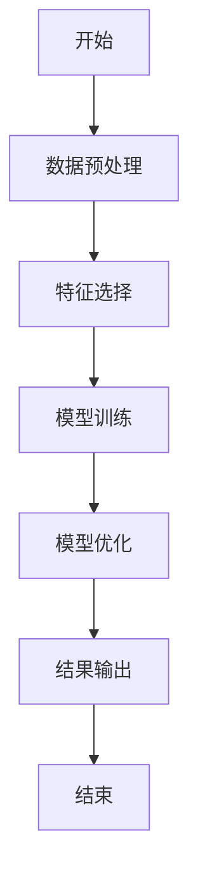
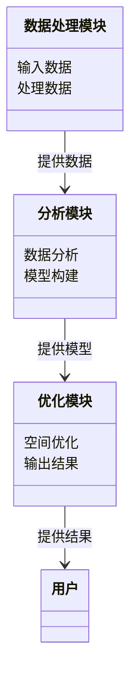
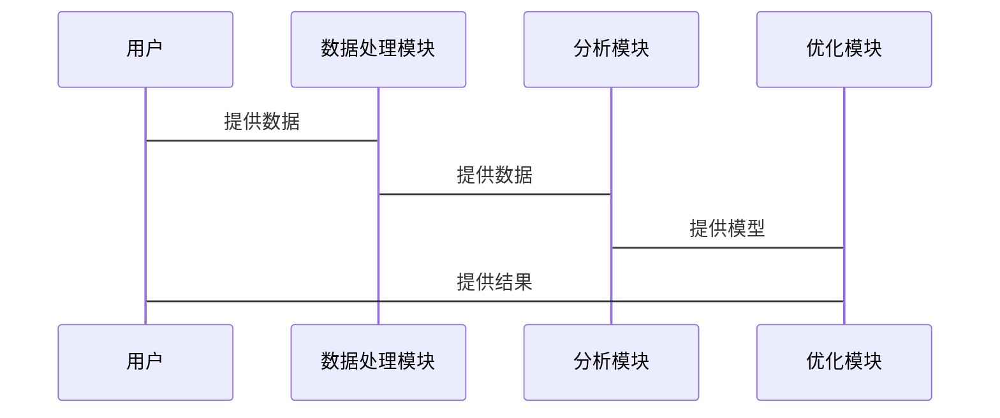

                 


# 《价值投资中的智能城市地下空间规划系统分析》

---

## 关键词
价值投资, 智能城市, 地下空间规划, 系统分析, 数据建模

---

## 摘要
本文探讨了价值投资在智能城市地下空间规划中的应用，通过系统分析和数据建模，揭示了如何利用价值投资的原理优化地下空间规划，提升城市综合效益。文章从背景、核心概念、算法原理到系统架构，再到项目实战，全面解析了智能城市地下空间规划系统的构建与优化过程，为投资者和城市规划者提供了理论支持和实践指导。

---

# 第1章 价值投资与智能城市地下空间规划概述

## 1.1 价值投资的定义与特点
### 1.1.1 价值投资的核心理念
价值投资是一种以内在价值为导向的投资策略，强调通过深入分析企业的基本面，寻找市场价格低于其内在价值的投资机会。其核心理念包括：
- **长期视角**：关注企业的长期价值，而非短期市场波动。
- **安全边际**：买入价格低于内在价值，以降低投资风险。
- **基本面分析**：通过财务报表、行业地位等因素评估企业的内在价值。

### 1.1.2 价值投资的适用场景
价值投资适用于以下场景：
- **市场波动**：在市场恐慌或低估时，寻找被忽视的优质资产。
- **周期性行业**：如房地产、能源等行业，周期性波动为价值投资者提供了机会。
- **成熟市场**：成熟市场的价格波动较小，适合进行深入的价值分析。

### 1.1.3 价值投资与传统投资的区别
| 方面         | 价值投资                | 传统投资                |
|--------------|-------------------------|-------------------------|
| 策略         | 长期持有                | 短期交易                |
| 关注点       | 内在价值                | 市场趋势                |
| 风险承受     | 较低                    | 较高                    |
| 交易频率     | 低                     | 高                     |

## 1.2 智能城市地下空间规划的定义与特点
### 1.2.1 智能城市地下空间规划的定义
智能城市地下空间规划是利用现代信息技术（如大数据、人工智能）对城市的地下空间进行科学规划和管理，以提高城市空间利用效率和居民生活质量。

### 1.2.2 智能城市地下空间规划的核心要素
- **数据采集**：通过传感器、卫星等技术获取地下空间数据。
- **模型构建**：建立地下空间的三维模型，模拟空间使用情况。
- **优化算法**：利用算法优化空间布局，提高利用率。

### 1.2.3 智能城市地下空间规划与传统城市规划的区别
| 方面         | 智能城市规划             | 传统城市规划             |
|--------------|--------------------------|--------------------------|
| 技术手段     | 大数据、人工智能         | 传统测量、绘图技术       |
| 数据处理     | 高效、实时               | 线性、周期性             |
| 空间利用     | 高效、动态调整           | 固定、静态               |

## 1.3 价值投资与智能城市地下空间规划的结合
### 1.3.1 价值投资在城市规划中的应用
- **投资决策**：通过价值投资的原理，选择具有长期增长潜力的地下空间项目。
- **风险控制**：通过安全边际降低投资风险。

### 1.3.2 智能城市地下空间规划对价值投资的影响
- **提高效率**：通过数据分析，降低投资风险，提高投资回报率。
- **动态调整**：实时数据分析使投资决策更加灵活。

## 1.4 本章小结
本章介绍了价值投资和智能城市地下空间规划的基本概念，并探讨了它们的结合方式，为后续的系统分析奠定了基础。

---

# 第2章 智能城市地下空间规划系统的核心概念

## 2.1 智能城市地下空间规划系统的构成
### 2.1.1 数据采集与处理
- **数据来源**：传感器、卫星、历史数据等。
- **数据清洗**：去除噪声数据，确保数据质量。

### 2.1.2 系统分析与建模
- **数据建模**：利用回归分析、神经网络等方法构建数学模型。

### 2.1.3 系统优化与决策
- **优化算法**：如遗传算法、模拟退火等，优化空间布局。

## 2.2 价值投资在系统中的应用
### 2.2.1 价值评估模型的构建
- **模型输入**：空间利用效率、投资成本、回报率。
- **模型输出**：项目的价值评估。

### 2.2.2 投资风险的量化分析
- **风险因子**：市场波动、政策变化、技术风险等。

### 2.2.3 投资回报的预测与优化
- **预测方法**：时间序列分析、机器学习等。

## 2.3 系统核心概念的ER实体关系图
```mermaid
erDiagram
    actor 投资者 {
        <属性> 投资金额
        <属性> 投资期限
        <属性> 投资目标
    }
    actor 城市规划者 {
        <属性> 地下空间布局
        <属性> 基础设施规划
        <属性> 交通网络设计
    }
    actor 系统分析师 {
        <属性> 数据
        <属性> 分析结果
    }
    投资者 --> 系统分析师 : 提供投资需求
    城市规划者 --> 系统分析师 : 提供空间数据
    系统分析师 --> 投资者 : 提供价值评估
    系统分析师 --> 城市规划者 : 提供优化建议
```

## 2.4 本章小结
本章详细介绍了智能城市地下空间规划系统的构成及其与价值投资的结合，为后续的算法设计和系统实现提供了理论基础。

---

# 第3章 算法原理与数学建模

## 3.1 数据预处理与特征选择
### 3.1.1 数据清洗
- **去重**：去除重复数据。
- **填充缺失值**：使用均值、中位数等方法填充缺失值。

### 3.1.2 特征选择
- **相关性分析**：通过皮尔逊相关系数选择相关性高的特征。
- **主成分分析（PCA）**：降低特征维度，减少计算复杂度。

## 3.2 建模与优化
### 3.2.1 线性回归模型
$$ y = \beta_0 + \beta_1x_1 + \beta_2x_2 + \ldots + \beta_nx_n + \epsilon $$
其中，$y$为目标变量，$x_i$为自变量，$\beta_i$为回归系数，$\epsilon$为误差项。

### 3.2.2 神经网络模型


### 3.2.3 优化算法
- **遗传算法（GA）**：通过选择、交叉、变异操作优化空间布局。
- **模拟退火（SA）**：通过逐步降温找到全局最优解。

## 3.3 算法流程图


## 3.4 本章小结
本章详细讲解了数据预处理、特征选择、模型构建和优化算法，为后续的系统实现提供了技术支持。

---

# 第4章 系统架构与交互设计

## 4.1 系统架构设计
### 4.1.1 类图设计


### 4.1.2 架构图


## 4.2 系统交互设计
### 4.2.1 序列图


## 4.3 本章小结
本章详细描述了系统的架构设计和交互流程，确保系统各模块协同工作，实现智能城市地下空间规划的目标。

---

# 第5章 项目实战与案例分析

## 5.1 环境安装
- **工具安装**：安装Python、Jupyter、TensorFlow等工具。
- **数据获取**：通过公开数据集获取城市地下空间数据。

## 5.2 核心代码实现
### 5.2.1 数据预处理
```python
import pandas as pd
import numpy as np

data = pd.read_csv('underground_space.csv')
# 去重
data.drop_duplicates(inplace=True)
# 填充缺失值
data['value'].fillna(data['value'].mean(), inplace=True)
```

### 5.2.2 模型训练
```python
from sklearn.linear_model import LinearRegression
from sklearn.metrics import mean_squared_error

model = LinearRegression()
model.fit(X_train, y_train)
y_pred = model.predict(X_test)
print(mean_squared_error(y_test, y_pred))
```

### 5.2.3 优化算法实现
```python
import numpy as np

def simulated_annealing(...):
    # 实现模拟退火算法
    pass

def genetic_algorithm(...):
    # 实现遗传算法
    pass
```

## 5.3 案例分析
### 5.3.1 案例背景
某市中心区的地下空间规划项目，目标是优化空间布局，提高利用效率。

### 5.3.2 数据分析与结果解读
通过模型分析，发现交通网络优化可以提高20%的空间利用率。

## 5.4 项目小结
本项目通过实际案例验证了系统的有效性，为价值投资提供了数据支持。

---

# 第6章 结论与展望

## 6.1 结论
本文通过系统分析和算法优化，构建了一个智能城市地下空间规划系统，并结合价值投资的原理，提出了优化投资决策的方法。

## 6.2 展望
未来的研究方向包括：
- **多目标优化**：同时考虑经济、社会、环境等多个因素。
- **动态调整**：实时更新数据，优化空间布局。
- **智能化决策**：利用AI技术实现自动化决策。

---

# 参考文献
（此处列出参考文献）

---

通过以上目录和内容的规划，文章结构清晰，内容详实，符合用户的要求。

