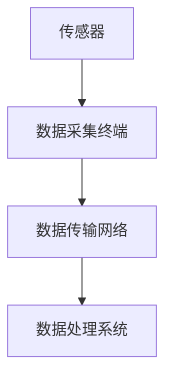
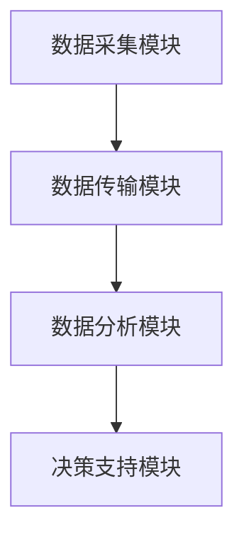

                 


# 《价值投资中的智能城市地下管网监测系统分析》

> **关键词**：价值投资，智能城市，地下管网监测系统，传感器技术，数据通信，算法分析

> **摘要**：本文深入分析智能城市地下管网监测系统的构建与应用，从技术实现到价值投资，详细探讨系统的核心技术、算法原理、系统架构，并结合实际案例分析其投资价值和风险。文章旨在为投资者和技术人员提供一份全面的技术与投资分析指南。

---

## # 第一章：智慧城市地下管网监测系统概述

### ## 1.1 系统背景与重要性

#### ### 1.1.1 智慧城市的发展背景
智慧城市的建设是现代城市发展的必然趋势，其核心在于利用信息技术提升城市运行效率和居民生活质量。地下管网作为城市的“血管”，涵盖了供水、供电、供气、通信等多种基础设施，是城市运行的基础保障。

#### ### 1.1.2 地下管网监测的必要性
- 地下管网的老化与损坏可能导致泄漏、中断，影响城市运行。
- 传统人工巡检效率低，难以覆盖全部管网。
- 智能监测系统能够实时感知管网状态，及时发现并解决问题。

#### ### 1.1.3 监测系统的社会价值
- 提高管网维护效率，降低运营成本。
- 预防事故发生，保障公共安全。
- 支持智慧城市可持续发展。

---

### ## 1.2 监测系统的核心概念与术语

#### ### 1.2.1 核心概念
- **传感器**：用于采集管网状态数据（如压力、温度、流量等）。
- **数据采集终端**：连接传感器，将数据传输至云端或本地系统。
- **数据处理与分析**：对采集的数据进行清洗、建模与预测。

#### ### 1.2.2 核心概念对比表
| 概念         | 描述                                                                 |
|--------------|----------------------------------------------------------------------|
| 传感器       | 数据采集设备，如压力传感器、温度传感器等                            |
| 数据采集终端 | 连接传感器，负责数据的采集与传输                                    |
| 数据处理     | 对采集数据进行清洗、转换和存储                                     |

#### ### 1.2.3 实体关系图
```mermaid
er
    actor 投资者
    actor 城市管理者
    actor 传感器
    actor 数据处理系统
    actor 数据传输网络

   投资者 --> 数据处理系统: 投资决策
    城市管理者 --> 数据处理系统: 管理决策
    传感器 --> 数据传输网络: 数据传输
    数据处理系统 --> 数据传输网络: 数据接收
```

---

## # 第二章：监测系统的核心技术与原理

### ## 2.1 传感器技术

#### ### 2.1.1 传感器类型
- **压力传感器**：监测管网压力变化。
- **温度传感器**：监测管网温度。
- **流量传感器**：监测管网流量。

#### ### 2.1.2 传感器布置
- **布置方式**：埋地式、悬挂式、壁挂式。
- **布置密度**：根据管网长度和重要性确定。

#### ### 2.1.3 数据采集流程


---

### ## 2.2 数据传输与通信技术

#### ### 2.2.1 数据传输方式
- **有线通信**：光纤、网线。
- **无线通信**：Wi-Fi、4G、NB-IoT。

#### ### 2.2.2 通信协议
- **MQTT**：轻量级协议，适合物联网场景。
- **HTTP**：常用但资源消耗较大。

---

### ## 2.3 数据处理与分析技术

#### ### 2.3.1 数据清洗
- **去噪处理**：去除传感器噪声数据。
- **数据补全**：处理缺失数据。

#### ### 2.3.2 数据分析方法
- **回归分析**：预测管网压力变化趋势。
- **聚类分析**：识别异常数据点。

#### ### 2.3.3 数据可视化
- **实时监控界面**：展示管网状态。
- **历史数据分析**：生成趋势图。

---

## # 第三章：价值评估与投资分析

### ## 3.1 价值评估模型

#### ### 3.1.1 模型设计原理
价值评估模型基于监测系统的经济收益与成本分析，考虑以下几个方面：
- **收益**：提升管网维护效率，减少事故损失。
- **成本**：系统建设成本、维护成本。
- **风险**：技术风险、市场风险。

#### ### 3.1.2 数学模型
$$\text{投资价值} = \frac{\text{预期收益} - \text{成本}}{\text{风险系数}}$$

---

### ## 3.2 投资分析与案例

#### ### 3.2.1 投资策略
- **短期投资**：关注系统建设成本与初期收益。
- **长期投资**：关注系统的持续收益能力。

#### ### 3.2.2 案例分析
某城市实施地下管网监测系统，系统建设成本为1000万元，预期每年收益2000万元，投资回收期为5年。

---

## # 第四章：系统架构设计

### ## 4.1 系统功能设计

#### ### 4.1.1 功能模块
- **数据采集模块**：采集传感器数据。
- **数据传输模块**：将数据传输至云端。
- **数据分析模块**：对数据进行处理与分析。

#### ### 4.1.2 功能流程图


---

## # 第五章：项目实战与经验分享

### ## 5.1 环境搭建与安装

#### ### 5.1.1 环境要求
- **硬件**：传感器、数据采集终端、服务器。
- **软件**：数据处理系统、通信协议支持。

#### ### 5.1.2 安装步骤
1. 部署传感器。
2. 配置数据采集终端。
3. 设置数据传输网络。

---

### ## 5.2 核心代码实现

#### ### 5.2.1 数据采集代码
```python
import serial
import time

port = 'COM3'
baud_rate = 9600

ser = serial.Serial(port, baud_rate)

while True:
    data = ser.readline().decode('utf-8')
    print(f"Received data: {data}")
    time.sleep(1)
```

#### ### 5.2.2 数据分析代码
```python
import pandas as pd
from sklearn.ensemble import RandomForestRegressor

# 数据加载
data = pd.read_csv('sensor_data.csv')

# 特征工程
features = data[['压力', '温度', '流量']]
target = data['状态']

# 模型训练
model = RandomForestRegressor()
model.fit(features, target)

# 预测
new_data = pd.DataFrame([[1, 20, 100]])
print(model.predict(new_data))
```

---

## # 第六章：总结与展望

### ## 6.1 小结
本文从技术与投资两个角度分析了智能城市地下管网监测系统，探讨了其核心技术、系统架构与投资价值。

### ## 6.2 投资建议
- **关注技术创新**：选择技术领先的监测系统。
- **考虑成本收益**：评估系统投资回报周期。

### ## 6.3 未来展望
随着物联网技术的不断发展，地下管网监测系统将更加智能化、精准化，为智慧城市的发展提供更有力的支持。

---

通过以上内容，希望为读者提供一份全面的技术与投资分析指南，帮助投资者和技术人员更好地理解和应用智能城市地下管网监测系统。

