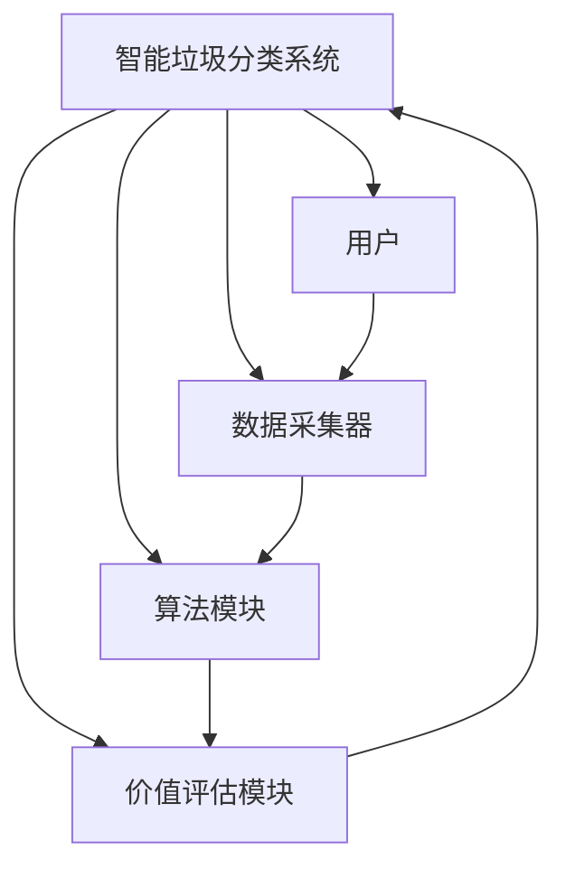
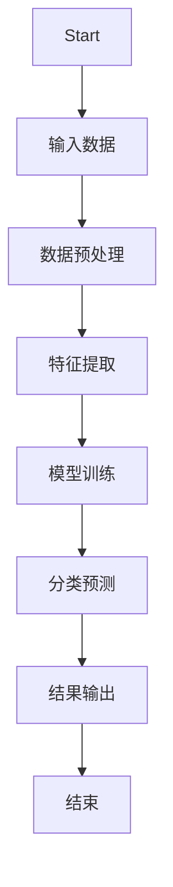
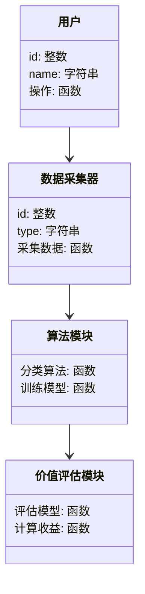
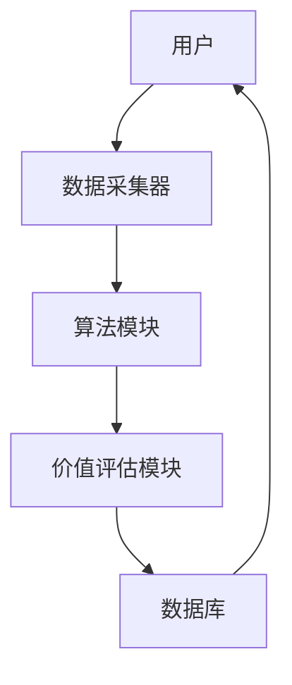
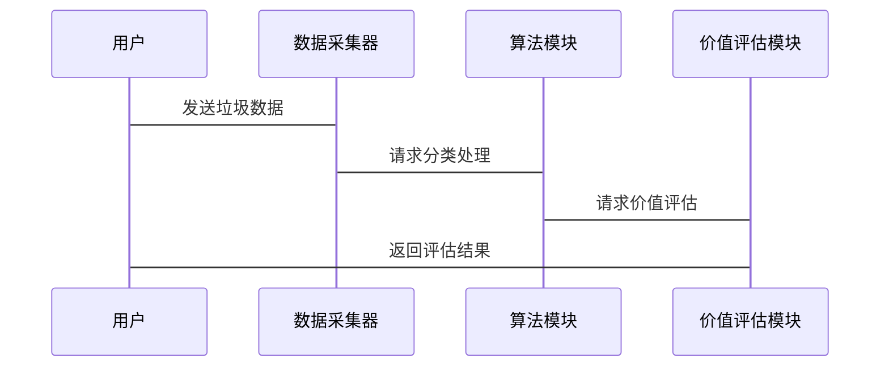

                 


# 价值投资中的智能城市垃圾分类系统分析

> 关键词：价值投资，智能城市，垃圾分类系统，算法原理，系统架构

> 摘要：本文深入探讨了智能城市垃圾分类系统在价值投资中的潜力和挑战。通过分析系统的算法原理、系统架构和实际案例，揭示了如何通过价值投资优化垃圾分类系统的经济效益和环境效益。

---

## 第一部分：价值投资与智能城市垃圾分类系统的背景

### 第1章：问题背景

#### 1.1 城市垃圾分类的现状与挑战
- **城市垃圾处理的现状**：随着城市化进程的加快，垃圾量急剧增加，传统的人工分类方式效率低下，成本高昂。
- **挑战**：垃圾处理的效率低下导致环境污染，资源浪费，且人工分类存在健康风险。

#### 1.2 智慧城市发展的趋势
- **智慧城市的核心目标**：通过技术手段优化资源配置，提升城市运行效率。
- **垃圾分类系统的智能化需求**：智能垃圾分类系统是智慧城市建设的重要组成部分。

#### 1.3 价值投资在智慧城市中的角色
- **价值投资的定义**：通过长期分析和评估，选择具有持续增长潜力的项目进行投资。
- **智能垃圾分类系统的投资价值**：高效、智能的垃圾分类系统具有显著的经济效益和社会效益。

---

### 第2章：问题描述

#### 2.1 智能垃圾分类系统的复杂性
- **系统模块**：包括数据采集、分类算法、用户交互等多个模块。
- **数据处理**：需要处理大量异构数据，包括图像、传感器数据等。

#### 2.2 价值投资中的关键问题
- **投资风险**：技术不确定性、市场接受度、政策变化等。
- **收益评估**：如何量化系统的经济效益和社会效益。

#### 2.3 系统与投资的结合点
- **技术与经济的结合**：通过技术创新降低系统成本，提升收益。
- **政策与市场的结合**：利用政策支持和市场潜力推动系统普及。

---

### 第3章：问题解决

#### 3.1 智能垃圾分类系统的解决方案
- **技术路线**：采用机器学习算法实现智能分类。
- **实施步骤**：数据采集、算法训练、系统部署。

#### 3.2 价值投资的策略选择
- **长期视角**：关注系统的长期收益和可持续性。
- **风险管理**：建立风险评估模型，降低投资风险。

#### 3.3 系统与投资的协同优化
- **技术优化**：通过技术创新降低成本。
- **市场优化**：通过市场推广提升收益。

---

### 第4章：系统的边界与外延

#### 4.1 系统的边界定义
- **功能边界**：仅考虑垃圾分类功能，不涉及垃圾处理的其他环节。
- **数据边界**：仅处理与垃圾分类相关的数据。

#### 4.2 投资范围的外延
- **技术扩展**：延伸至相关技术领域，如人工智能、物联网。
- **市场扩展**：拓展至更多城市和社区。

#### 4.3 系统与投资的相互影响
- **系统对投资的影响**：通过提高效率和降低成本，增强投资吸引力。
- **投资对系统的影响**：通过资金支持推动技术创新和系统优化。

---

### 第5章：系统的概念结构与核心要素

#### 5.1 系统组成模块
- **数据采集模块**：摄像头、传感器等。
- **算法模块**：分类算法、数据处理。
- **用户交互模块**：人机交互界面。

#### 5.2 投资关键要素
- **技术可行性**：系统的可行性和成熟度。
- **市场潜力**：目标市场的规模和增长潜力。
- **政策支持**：政府的政策支持和法规环境。

#### 5.3 两者的关联性分析
- **技术与市场的关联**：技术成熟度影响市场接受度。
- **成本与收益的关联**：系统成本影响投资回报率。

---

## 第二部分：智能城市垃圾分类系统的核心概念与价值投资联系

### 第6章：核心概念原理

#### 6.1 智能垃圾分类系统的原理
- **数据采集**：通过摄像头和传感器获取垃圾图像和位置数据。
- **算法处理**：利用机器学习算法进行分类。
- **用户交互**：通过移动APP或物联网设备实现人机交互。

#### 6.2 价值投资的基本原理
- **价值评估**：通过分析系统的技术、市场、财务等多方面因素，评估其投资价值。
- **长期投资**：关注系统的长期收益和可持续性。

---

### 第7章：概念属性特征对比

#### 7.1 系统属性对比表
| 属性       | 智能垃圾分类系统                          | 价值投资                              |
|------------|------------------------------------------|---------------------------------------|
| 核心目标   | 提高垃圾分类效率                          | 最大化投资收益                        |
| 关键因素   | 技术性能、数据质量                      | 技术可行性、市场潜力、政策支持        |
| 评估指标   | 分类准确率、运行成本、用户满意度        | 净现值、内部收益率、回收期              |

#### 7.2 对比分析与总结
- **技术与经济的结合**：系统的技术性能直接影响其经济效益。
- **数据与决策的关联**：系统的数据处理能力影响投资决策的准确性。

---

### 第8章：ER实体关系图



---

## 第三部分：智能城市垃圾分类系统的算法原理与数学模型

### 第9章：算法原理

#### 9.1 分类算法概述
- **常用算法**：决策树、随机森林、支持向量机（SVM）等。
- **算法选择**：根据数据特点和分类需求选择合适的算法。

#### 9.2 垃圾分类的常用算法
- **决策树**：适用于类别不平衡的数据。
- **随机森林**：适用于高维数据，具有较强的鲁棒性。

#### 9.3 算法流程图



---

### 第10章：数学模型与公式

#### 10.1 垃圾分类的数学模型
- **决策树模型**：基于信息增益构建决策树。
- **随机森林模型**：基于袋装技术和特征选择构建多个决策树。

#### 10.2 价值评估的数学公式
- **净现值（NPV）公式**：
  $$ NPV = \sum_{t=0}^{n} \frac{C_t}{(1 + r)^t} $$
  其中，\( C_t \) 是第 \( t \) 年的现金流，\( r \) 是折现率。

---

## 第四部分：智能城市垃圾分类系统的系统分析与架构设计

### 第11章：系统分析

#### 11.1 系统功能设计
- **数据采集**：实时采集垃圾图像和位置数据。
- **分类处理**：自动识别垃圾种类并分类。
- **用户交互**：提供友好的用户界面，支持用户查询和反馈。

#### 11.2 领域模型类图



---

### 第12章：系统架构设计

#### 12.1 系统架构图



---

### 第13章：接口设计与交互流程

#### 13.1 系统接口设计
- **数据采集接口**：提供REST API，接收传感器数据。
- **用户交互接口**：提供Web或移动APP，支持用户查询和反馈。

#### 13.2 交互流程图



---

## 第五部分：价值投资中的智能城市垃圾分类系统项目实战

### 第14章：环境安装与系统实现

#### 14.1 环境安装
- **开发环境**：Python 3.8以上版本，安装必要的库如scikit-learn、TensorFlow等。
- **运行环境**：服务器端部署，使用Docker容器化。

#### 14.2 核心代码实现
```python
import numpy as np
from sklearn.tree import DecisionTreeClassifier

# 数据预处理
X = np.array([[...], [...]])  # 特征数据
y = np.array([...])             # 标签数据

# 模型训练
clf = DecisionTreeClassifier()
clf.fit(X, y)

# 分类预测
predicted = clf.predict(X_test)
```

---

### 第15章：案例分析与总结

#### 15.1 实际案例分析
- **案例背景**：某城市试点智能垃圾分类系统，投资回报率为20%。
- **分析结果**：通过价值投资策略，系统在两年内收回成本，后续收益持续增长。

#### 15.2 项目总结
- **技术总结**：决策树算法在分类任务中表现优异，随机森林在处理高维数据时更具优势。
- **投资总结**：价值投资策略帮助识别高潜力项目，优化投资组合。

---

## 第六部分：价值投资中的智能城市垃圾分类系统的最佳实践

### 第16章：小结与注意事项

#### 16.1 小结
- **系统价值**：智能垃圾分类系统通过技术创新和数据驱动，显著提升城市垃圾处理效率。
- **投资价值**：价值投资策略帮助识别和优化高潜力项目，实现经济效益和社会效益的双赢。

#### 16.2 注意事项
- **技术风险**：算法选择和模型调优需谨慎，避免过度依赖单一技术。
- **市场风险**：需关注政策变化和市场接受度，及时调整投资策略。

---

### 第17章：拓展阅读与资源推荐

#### 17.1 拓展阅读
- **书籍推荐**：
  1. 《The Intelligent City: Transforming Urban Systems with Data and Technology》
  2. 《Value Investing: The Classic Theory and Modern Practice》
- **技术资源**：
  1. scikit-learn官方文档
  2. TensorFlow官方文档

#### 17.2 资源链接
- **GitHub仓库**：[智能垃圾分类系统开源项目](https://github.com/example/repo)
- **在线课程**：[机器学习与价值投资](https://www.example.com/course)

---

## 结论

智能城市垃圾分类系统作为智慧城市建设的重要组成部分，不仅在技术上具有创新性，也在经济上具有投资价值。通过价值投资的方法，可以更好地识别和优化高潜力项目，实现经济效益和社会效益的双赢。未来，随着技术的不断进步和市场的扩展，智能垃圾分类系统将在更多的城市中得到广泛应用，为价值投资带来新的机遇。

--- 

**全文完**。

