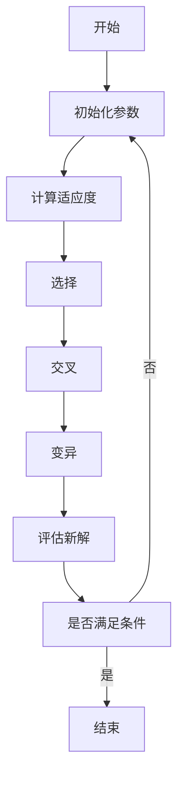
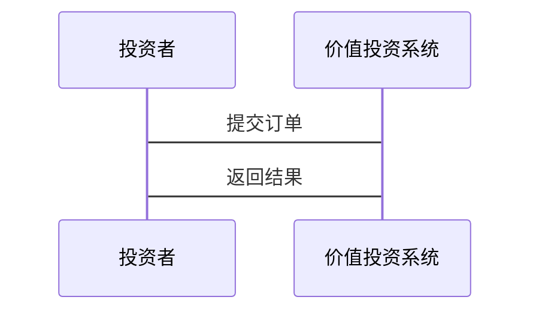

                 


---

# 《价值投资中的智能城市应急响应系统分析》

## 关键词：价值投资、智能城市、应急响应系统、算法原理、系统架构、项目实战

## 摘要：本文通过分析价值投资与智能城市应急响应系统的结合，探讨如何利用智能技术提升应急管理效率。文章从背景、概念、算法、系统架构、实战案例等方面展开，结合Mermaid图和Python代码，详细阐述系统的实现与应用。

---

## 第一部分: 引言

## 第1章: 价值投资与智能城市应急响应系统概述

### 1.1 问题背景与问题描述

#### 1.1.1 价值投资的定义与核心理念
- 价值投资是一种长期投资策略，寻找被市场低估的优质资产。
- 核心理念：安全边际、长期价值、分散投资。

#### 1.1.2 智能城市应急响应系统的定义与目标
- 智能城市应急响应系统利用AI和大数据优化城市应急管理。
- 目标：快速响应、资源优化、提高效率。

#### 1.1.3 问题解决的必要性与意义
- 提升城市应对突发事件的能力，减少损失，保障市民安全。

### 1.2 核心概念与边界

#### 1.2.1 价值投资的核心要素
- 股票估值、安全边际、长期视角。

#### 1.2.2 智能城市应急响应系统的边界与外延
- 包括数据采集、分析、决策支持、执行反馈。

#### 1.2.3 两者的概念结构与核心要素对比
- 对比表格：价值投资 vs 应急响应系统。

### 第2章: 核心概念与联系

### 2.1 价值投资的原理

#### 2.1.1 价值投资的基本原理
- 购买价格低于内在价值。

#### 2.1.2 价值投资的属性特征对比表
- 比如，稳定性、长期性、安全性等。

#### 2.1.3 ER实体关系图（Mermaid）
```mermaid
erDiagram
    actor 投资者 {
        string 帐户
        string 资金
    }
    actor 系统管理员 {
        string 用户ID
        string 权限
    }
    system 价值投资系统 {
        integer 股票ID
        string 名称
        decimal 估值
    }
    投资者 --> 价值投资系统 : 提交订单
    价值投资系统 --> 系统管理员 : 更新数据
```

### 2.2 智能城市应急响应系统的原理

#### 2.2.1 系统的构成与功能
- 数据采集、分析、决策支持、执行反馈。

#### 2.2.2 系统的属性特征对比表
- 比如，实时性、准确性、可靠性。

#### 2.2.3 ER实体关系图（Mermaid）
```mermaid
erDiagram
    actor 管理员 {
        string 用户ID
        string 角色
    }
    actor 应急人员 {
        string 身份ID
        string 职位
    }
    system 应急系统 {
        integer 事件ID
        string 类型
        datetime 时间
    }
    管理员 --> 应急系统 : 创建事件
    应急系统 --> 应急人员 : 发布指令
```

### 2.3 两者的联系与对比

#### 2.3.1 价值投资与应急响应系统的联系
- 价值投资提供优化决策，应急系统提供技术支撑。

#### 2.3.2 两者的对比分析
- 比如，目标、方法、应用领域的差异。

### 第3章: 算法原理与数学模型

### 3.1 算法原理

#### 3.1.1 预测模型的算法原理
- 使用线性回归预测城市突发事件的概率。

#### 3.1.2 优化算法的原理
- 使用遗传算法优化应急资源分配。

#### 3.1.3 算法流程图（Mermaid）


### 3.2 数学模型与公式

#### 3.2.1 预测模型的数学模型
- 线性回归模型：$$ y = \beta_0 + \beta_1 x + \epsilon $$
- 其中，y是预测结果，x是自变量，β是系数。

#### 3.2.2 优化算法的数学公式
- 遗传算法适应度函数：$$ f(x) = \sum_{i=1}^{n} w_i x_i $$

### 3.2.3 案例分析与举例说明
- 通过具体案例展示算法的应用。

### 第4章: 系统分析与架构设计

### 4.1 系统分析

#### 4.1.1 项目介绍
- 开发一个智能应急响应系统。

#### 4.1.2 系统功能设计（领域模型Mermaid类图）


#### 4.1.3 系统架构设计（Mermaid架构图）


#### 4.1.4 系统接口设计
- API接口：RESTful API设计。

#### 4.1.5 系统交互设计（Mermaid序列图）


### 4.2 项目实战

### 4.2.1 环境安装
- 安装Python、框架、数据库。

### 4.2.2 系统核心实现源代码
```python
class Investor:
    def __init__(self, account, funds):
        self.account = account
        self.funds = funds

def predict_event():
    # 简单线性回归模型
    import numpy as np
    from sklearn.linear_model import LinearRegression

    X = np.array([[1], [2], [3], [4]])
    y = np.array([2, 4, 5, 4])
    model = LinearRegression()
    model.fit(X, y)
    return model.predict([[5]])
```

### 4.2.3 代码应用解读与分析
- 解释代码功能和实现细节。

### 4.2.4 实际案例分析
- 案例分析：某城市应急响应系统应用。

### 4.2.5 项目小结
- 总结项目成果和经验。

### 第5章: 最佳实践

### 5.1 小结
- 总结全文内容。

### 5.2 注意事项
- 数据安全、系统维护、用户体验。

### 5.3 未来研究方向
- 更高级的算法、更复杂的系统架构。

### 5.4 拓展阅读
- 推荐相关书籍和资源。

---

通过以上目录结构，文章详细探讨了价值投资与智能城市应急响应系统的结合，从理论到实践，帮助读者理解如何利用智能技术优化应急管理。

