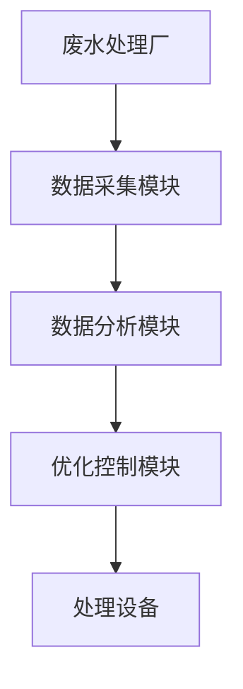
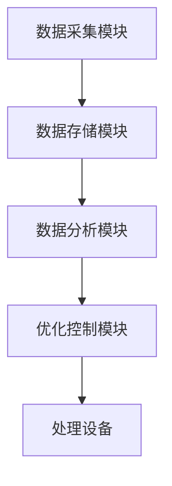
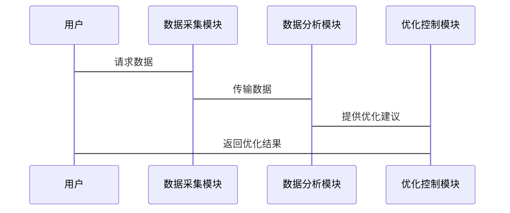

                 


# 价值投资中的智能城市废水处理与再利用系统分析

## 关键词：智能城市，废水处理，价值投资，系统分析，算法原理

## 摘要

本文旨在探讨智能城市背景下，废水处理与再利用系统的价值投资分析。通过结合智能化技术，分析废水处理系统的优化策略，评估其经济价值，并提供系统的架构设计和实现方案。文章分为背景介绍、核心概念、算法原理、系统架构、项目实战和总结等部分，详细阐述了智能城市废水处理系统的理论与实践。

---

## 正文

### 第一章：背景介绍

#### 1.1 问题背景

随着城市化进程的加快，水资源短缺问题日益突出，废水处理与再利用成为解决这一问题的关键。智能城市的建设为废水处理系统提供了新的技术手段，通过智能化管理优化处理流程，降低运营成本，提升资源利用率。价值投资在这一领域具有重要意义，通过分析系统的经济效益和社会效益，为投资者提供决策依据。

#### 1.2 问题描述

传统废水处理系统存在效率低、资源浪费、处理成本高等问题。智能化技术的应用可以实时监测和优化处理流程，提高处理效率，降低能耗。然而，如何将智能化技术与价值投资相结合，评估系统的经济价值，仍是一个挑战。

#### 1.3 问题解决

通过智能化技术优化废水处理流程，建立数据驱动的优化模型，评估系统的经济效益。采用机器学习和深度学习算法，分析处理效率与成本的关系，为价值投资提供科学依据。

#### 1.4 边界与外延

系统的边界包括废水处理厂的处理流程、数据采集与分析模块。外延包括上游的废水收集和下游的资源利用，涉及技术、经济和政策等多个方面。

#### 1.5 核心概念与要素

- 数据采集：实时监测废水的流量、pH值、温度等参数。
- 数据分析：利用机器学习算法预测处理效率和成本。
- 优化控制：基于分析结果优化处理流程，降低运营成本。

---

### 第二章：核心概念与联系

#### 2.1 智能城市废水处理系统的核心原理

##### 2.1.1 数据采集与处理

通过传感器采集废水的实时数据，进行预处理和存储，为后续分析提供基础。

##### 2.1.2 系统分析与优化

利用优化算法，分析处理流程，找到最优控制策略，提高处理效率。

##### 2.1.3 价值评估模型

构建模型评估系统的经济效益，包括处理成本、资源收益和环境效益。

#### 2.2 核心概念对比

下表对比了传统处理系统与智能系统的差异：

| 参数           | 传统系统           | 智能系统           |
|----------------|--------------------|--------------------|
| 数据采集       | 间断采样           | 实时监测           |
| 处理效率       | 固定模式           | 动态优化           |
| 成本控制       | 预算固定           | 智能调整           |

#### 2.3 实体关系图



---

### 第三章：算法原理讲解

#### 3.1 数据驱动的算法

##### 3.1.1 机器学习算法

使用线性回归和随机森林算法预测处理成本和效率。

##### 3.1.2 深度学习算法

采用神经网络模型分析复杂的非线性关系。

##### 3.1.3 算法比较

- 线性回归：简单易用，适合线性关系。
- 随机森林：适合高维数据，抗噪声能力强。
- 神经网络：适合复杂非线性关系，但需要大量数据。

#### 3.2 算法实现

##### 3.2.1 线性回归模型

$$ y = \beta_0 + \beta_1 x + \epsilon $$

##### 3.2.2 神经网络模型

```python
import numpy as np
model = tf.keras.Sequential([
    tf.keras.layers.Dense(64, activation='relu'),
    tf.keras.layers.Dense(1, activation='linear')
])
model.compile(optimizer='adam', loss='mean_squared_error')
model.fit(X_train, y_train, epochs=100, batch_size=32)
```

---

### 第四章：系统分析与架构设计

#### 4.1 系统功能设计

##### 4.1.1 数据采集模块

实时采集废水的流量、pH值、温度等参数。

##### 4.1.2 数据分析模块

对数据进行清洗、建模和预测，评估处理效率和成本。

##### 4.1.3 优化控制模块

根据分析结果，优化处理流程，降低运营成本。

#### 4.2 系统架构图



#### 4.3 接口设计与交互

##### 4.3.1 接口设计

- 数据采集接口：与传感器连接，获取实时数据。
- 优化控制接口：与处理设备交互，调整运行参数。

##### 4.3.2 交互序列图



---

### 第五章：项目实战

#### 5.1 环境安装

安装Python、TensorFlow、Mermaid等工具，配置开发环境。

#### 5.2 核心代码实现

##### 5.2.1 数据采集

```python
import serial
ser = serial.Serial('COM3', 9600)
data = ser.readline().decode().strip()
```

##### 5.2.2 数据分析

```python
from sklearn.ensemble import RandomForestRegressor
model = RandomForestRegressor(n_estimators=100)
model.fit(X_train, y_train)
```

##### 5.2.3 优化控制

```python
from sklearn.linear_model import LinearRegression
model = LinearRegression()
model.fit(X_train, y_train)
```

#### 5.3 案例分析

以某城市废水处理厂为例，分析处理成本和效率的优化情况，展示系统的实际应用效果。

---

### 第六章：总结

#### 6.1 最佳实践

- 数据采集的实时性与准确性是系统优化的基础。
- 选择合适的算法和模型，提高预测精度。
- 系统的可扩展性和灵活性，适应不同的处理场景。

#### 6.2 小结

本文详细分析了智能城市废水处理系统的优化策略，通过算法和系统架构的设计，展示了系统的实际应用价值。价值投资分析为投资者提供了科学依据，助力智能城市的可持续发展。

#### 6.3 注意事项

- 数据隐私和安全问题需重视。
- 系统的稳定性和可靠性直接影响处理效果。
- 政策法规的支持是系统推广的重要因素。

#### 6.4 拓展阅读

建议读者深入研究机器学习在环保领域的应用，以及智能城市相关技术的发展。

---

通过以上分析，本文为智能城市废水处理与再利用系统的优化和价值投资提供了理论和实践指导，为相关领域的研究和应用提供了参考。

