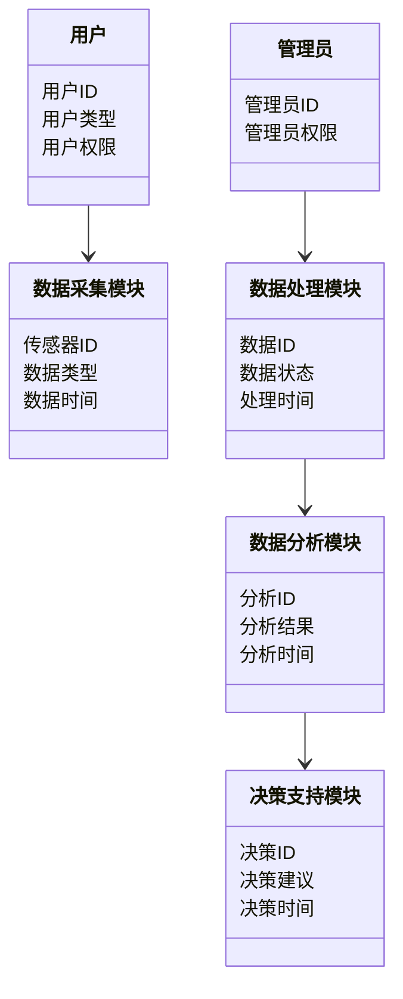

                 


# 价值投资中的智能城市废物管理系统分析

> 关键词：价值投资、智能城市、废物管理系统、投资分析、系统优化

> 摘要：本文从价值投资的角度，分析智能城市废物管理系统的投资价值、优化算法和实际应用场景。通过系统设计、案例分析和投资建议，揭示该领域的投资机会和优化方向。

---

## 第1章 价值投资与智能城市废物管理概述

### 1.1 价值投资的基本概念

#### 1.1.1 价值投资的定义

价值投资是一种长期投资策略，主要关注企业或项目的内在价值，寻找市场价格低于其内在价值的投资机会。其核心在于分析企业的财务状况、行业地位、竞争优势和发展潜力。

#### 1.1.2 价值投资的核心原则

- **安全边际**：买入价格低于内在价值，确保投资的安全性。
- **长期视角**：关注企业的长期盈利能力，而非短期波动。
- **深入分析**：通过基本面分析，识别具有持续竞争优势的企业。

#### 1.1.3 价值投资与传统投资的区别

- 传统投资关注短期市场波动，而价值投资关注长期价值。
- 传统投资可能依赖技术分析，而价值投资依赖基本面分析。
- 传统投资风险较高，而价值投资注重安全边际。

### 1.2 智能城市废物管理系统的定义与特点

#### 1.2.1 智能城市废物管理系统的定义

智能城市废物管理系统是一种利用物联网、大数据和人工智能等技术，优化城市废物收集、运输和处理的智能化系统。

#### 1.2.2 智能城市废物管理系统的组成部分

- **数据采集模块**：通过传感器、摄像头等设备，采集废物产生、运输和处理的数据。
- **数据处理模块**：对采集的数据进行清洗、存储和初步分析。
- **数据分析模块**：利用大数据和人工智能技术，分析数据，优化废物管理流程。
- **决策支持模块**：根据分析结果，提供最优决策建议，如路径优化、资源分配等。

#### 1.2.3 智能城市废物管理系统的优缺点

- **优点**：
  - 提高废物管理效率，降低成本。
  - 减少环境污染，推动可持续发展。
  - 提高城市智能化水平，提升居民生活质量。
- **缺点**：
  - 初期投入较高。
  - 技术复杂，需要专业团队支持。
  - 数据隐私和安全风险。

### 1.3 价值投资与智能城市废物管理的结合

#### 1.3.1 智能城市废物管理系统的投资价值

- **市场需求**：随着城市化进程加快，废物管理需求日益增长。
- **技术驱动**：智能技术的应用可以显著提高废物管理效率。
- **政策支持**：政府鼓励智能城市建设和环保事业发展。

#### 1.3.2 价值投资在智能城市废物管理中的应用

- **投资标的**：智能废物管理系统的研发、建设和运营企业。
- **投资逻辑**：
  - 选择具有技术优势和市场竞争力的企业。
  - 关注企业的财务状况和盈利模式。
  - 分析行业政策和市场前景。

#### 1.3.3 智能城市废物管理系统的未来发展趋势

- **技术创新**：人工智能、大数据和物联网技术的深度融合。
- **政策支持**：政府将继续出台支持智能城市建设的政策。
- **市场扩张**：智能废物管理系统将从试点城市向全国推广。

---

## 第2章 智能城市废物管理系统的核心概念与联系

### 2.1 智能城市废物管理系统的组成与功能

#### 2.1.1 数据采集模块

- **传感器**：用于监测垃圾桶的填充状态、环境参数等。
- **摄像头**：用于识别垃圾类型和分类。

#### 2.1.2 数据处理模块

- **数据清洗**：去除噪声数据，确保数据准确性。
- **数据存储**：将数据存储在数据库中，方便后续分析。

#### 2.1.3 数据分析模块

- **分类算法**：如随机森林、支持向量机，用于垃圾分类。
- **路径优化算法**：如遗传算法，用于垃圾收集路径优化。

#### 2.1.4 决策支持模块

- **优化建议**：基于数据分析结果，提供最优决策建议。
- **可视化界面**：便于用户直观查看数据和决策结果。

### 2.2 智能城市废物管理系统的功能

#### 2.2.1 垃圾分类与识别功能

- **图像识别**：通过摄像头识别垃圾类型，实现自动化分类。
- **数据记录**：记录垃圾分类结果，便于后续分析。

#### 2.2.2 垃圾收集与运输优化功能

- **路径优化**：通过算法优化垃圾收集路径，减少运输成本。
- **实时监控**：实时监控垃圾收集车辆的位置和状态。

#### 2.2.3 垃圾处理与资源化利用功能

- **资源化利用**：将可回收物转化为再生资源。
- **数据分析**：分析垃圾成分，优化处理流程。

#### 2.2.4 系统监控与预警功能

- **系统监控**：实时监控系统运行状态。
- **预警功能**：当系统出现异常时，及时发出预警。

### 2.3 核心概念的ER实体关系图

```mermaid
erDiagram
    actor 用户 {
        <属性> 用户ID
        <属性> 用户类型
        <属性> 用户权限
    }
    actor 管理员 {
        <属性> 管理员ID
        <属性> 管理员权限
    }
    class 数据采集模块 {
        <属性> 传感器ID
        <属性> 数据类型
        <属性> 数据时间
    }
    class 数据处理模块 {
        <属性> 数据ID
        <属性> 数据状态
        <属性> 处理时间
    }
    class 数据分析模块 {
        <属性> 分析ID
        <属性> 分析结果
        <属性> 分析时间
    }
    class 决策支持模块 {
        <属性> 决策ID
        <属性> 决策建议
        <属性> 决策时间
    }
    用户 --> 数据采集模块 : 提供数据
    管理员 --> 数据处理模块 : 处理数据
    数据处理模块 --> 数据分析模块 : 分析数据
    数据分析模块 --> 决策支持模块 : 提供决策建议
```

---

## 第3章 智能城市废物管理系统的核心算法与优化

### 3.1 数据分析与优化算法

#### 3.1.1 垃圾收集路径优化算法

- **遗传算法**：通过模拟自然选择和遗传机制，优化路径。
- **数学模型**：目标是最小化运输成本和时间。

$$
\text{目标函数：} \min \sum_{i=1}^{n} c_i \cdot x_i
$$

$$
\text{约束条件：} \sum_{i=1}^{n} x_i = 1, \forall i \in \{1,2,...,n\}
$$

#### 3.1.2 垃圾分类算法

- **随机森林**：通过特征提取和投票机制，实现垃圾分类。
- **支持向量机**：通过非线性分类，实现垃圾精准分类。

### 3.2 算法实现与优化

#### 3.2.1 垃圾收集路径优化的实现

```python
import numpy as np
from sklearn.svm import SVC
from sklearn.ensemble import RandomForestClassifier

# 示例数据：垃圾类型和位置
data = {
    '位置': [(0,0), (1,1), (2,2), (3,3)],
    '类型': ['可回收物', '有害垃圾', '湿垃圾', '干垃圾']
}

# 垃圾分类模型
model = RandomForestClassifier()
X = np.array(data['位置'])
y = np.array(data['类型'])
model.fit(X, y)

# 垃圾收集路径优化
def optimize_path(locations):
    # 简单的路径优化算法，返回最优路径
    pass

# 示例调用
optimize_path(data['位置'])
```

#### 3.2.2 算法优化与改进

- **算法选择**：根据实际需求选择合适的算法。
- **参数调优**：通过网格搜索等方法，优化算法参数。
- **性能优化**：通过并行计算等技术，提高算法效率。

---

## 第4章 智能城市废物管理系统的系统分析与架构设计

### 4.1 系统功能设计

#### 4.1.1 领域模型设计



#### 4.1.2 系统架构设计


### 4.2 系统接口设计

#### 4.2.1 数据接口

- **输入接口**：传感器、摄像头等设备的数据输入。
- **输出接口**：决策支持模块的输出结果。

#### 4.2.2 交互接口

- **用户界面**：用户提供输入和查看结果。
- **管理员界面**：管理员进行系统管理和配置。

---

## 第5章 项目实战与案例分析

### 5.1 环境安装与配置

#### 5.1.1 安装Python环境

```bash
# 安装Python和pip
# 已经包含在大多数Python安装中
```

#### 5.1.2 安装必要的库

```bash
pip install numpy scikit-learn
```

### 5.2 核心代码实现

#### 5.2.1 垃圾分类模型实现

```python
from sklearn.ensemble import RandomForestClassifier
from sklearn.metrics import accuracy_score

# 示例数据
X = [[0, 0], [1, 1], [2, 2], [3, 3]]
y = ['可回收物', '有害垃圾', '湿垃圾', '干垃圾']

# 创建模型
model = RandomForestClassifier()
model.fit(X, y)

# 预测
new_data = [[4, 4]]
print("预测结果：", model.predict(new_data))
print("预测概率：", model.predict_proba(new_data))
```

#### 5.2.2 路径优化算法实现

```python
import numpy as np
from scipy.optimize import minimize

# 示例优化问题
def optimize_path(x):
    return np.sum(x**2)

# 初始猜测
x0 = [1, 1]

# 最优化
result = minimize(optimize_path, x0, method='BFGS')

print("优化结果：", result.x)
```

### 5.3 案例分析与效果评估

#### 5.3.1 数据收集与分析

- 数据来源：垃圾桶的位置、填充状态、垃圾类型等。
- 数据分析：通过分类和优化算法，分析垃圾管理效率。

#### 5.3.2 实施效果评估

- 成本节约：通过路径优化，降低运输成本。
- 时间优化：减少垃圾收集和处理时间。
- 环境效益：减少环境污染，提高资源利用率。

---

## 第6章 最佳实践与投资建议

### 6.1 投资策略

#### 6.1.1 选择具有技术优势的企业

- 关注企业的研发投入和技术储备。
- 选择具有成功案例的企业。

#### 6.1.2 关注政策支持

- 关注政府政策，选择符合政策导向的企业。

### 6.2 系统优化建议

#### 6.2.1 技术优化

- 持续优化算法和系统架构。
- 加强数据安全和隐私保护。

#### 6.2.2 运营优化

- 提高用户参与度。
- 加强系统监控和维护。

### 6.3 投资注意事项

- 风险分析：技术风险、市场风险、政策风险。
- 长期持有：价值投资需要长期持有，避免短期波动。
- 定期复盘：定期评估投资组合，调整策略。

---

## 第7章 总结与展望

### 7.1 本章总结

本文从价值投资的角度，分析了智能城市废物管理系统的投资价值、优化算法和实际应用场景。通过系统设计、案例分析和投资建议，揭示了该领域的投资机会和优化方向。

### 7.2 未来展望

随着技术进步和政策支持，智能城市废物管理系统将更加智能化和高效化。未来，价值投资将更多地关注技术创新和可持续发展的企业。

---

## 关键词

价值投资、智能城市、废物管理系统、投资分析、系统优化

## 摘要

本文从价值投资的角度，分析智能城市废物管理系统的投资价值、优化算法和实际应用场景。通过系统设计、案例分析和投资建议，揭示了该领域的投资机会和优化方向。

