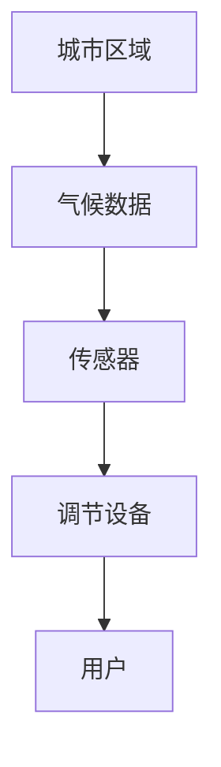

                 


# 价值投资中的智能城市微气候调节系统分析

**关键词**：价值投资、智能城市、微气候调节、系统分析、算法优化、投资策略

**摘要**：  
本文探讨了智能城市微气候调节系统在价值投资中的应用。通过分析微气候调节系统的核心原理、算法优化和系统架构，结合实际案例，揭示其对城市价值的影响，为投资者提供技术与经济双重视角的分析框架。

---

# 第一部分: 价值投资中的智能城市微气候调节系统概述

## 第1章: 价值投资与智能城市微气候调节系统背景

### 1.1 价值投资的基本概念
- **1.1.1 价值投资的定义与核心理念**  
  价值投资是一种长期投资策略，强调以低于内在价值的价格购买优质资产。其核心理念包括安全边际、长期主义和逆向思维。

- **1.1.2 价值投资在现代经济中的作用**  
  价值投资通过识别被低估的资产，帮助投资者在市场波动中稳定收益，降低风险。

- **1.1.3 智能城市与价值投资的结合**  
  智能城市的发展为价值投资提供了新的应用场景，特别是在城市基础设施和技术创新领域。

### 1.2 智能城市的发展现状
- **1.2.1 智能城市的定义与特征**  
  智能城市通过数字化技术优化城市资源分配，提升居民生活质量。

- **1.2.2 智能城市在全球范围内的发展现状**  
  全球范围内，智能城市项目正在快速发展，特别是在交通、能源和环境管理领域。

- **1.2.3 智能城市与可持续发展的关系**  
  智能城市是实现可持续发展的关键途径，通过技术创新减少资源消耗，提高效率。

### 1.3 微气候调节系统在智能城市中的重要性
- **1.3.1 微气候调节系统的定义与作用**  
  微气候调节系统通过技术手段优化局部气候条件，改善城市环境。

- **1.3.2 微气候调节系统在智能城市中的应用场景**  
  应用于城市热岛效应缓解、空气质量提升等领域，提升居民生活质量。

- **1.3.3 微气候调节系统对城市价值的影响**  
  通过改善环境，提升房地产价值和居民幸福感，吸引更多投资。

## 1.4 本章小结  
本章介绍了价值投资的基本概念，分析了智能城市的发展现状，并探讨了微气候调节系统在智能城市中的重要性，为后续分析奠定基础。

---

# 第二部分: 智能城市微气候调节系统的概念与核心要素

## 第2章: 微气候调节系统的核心概念

### 2.1 微气候调节系统的组成模块
- **数据采集模块**  
  采集温度、湿度等环境数据，为系统分析提供基础。

- **数据分析模块**  
  利用算法分析数据，预测气候趋势。

- **调节控制模块**  
  根据分析结果，调整调节设备，优化气候条件。

- **系统反馈模块**  
  反馈调节效果，持续优化系统运行。

### 2.2 微气候调节系统的核心原理
- **数据采集与处理的原理**  
  利用传感器采集数据，通过数据预处理消除噪声。

- **智能分析与预测的机制**  
  使用机器学习算法预测气候变化，指导调节策略。

- **调节控制的实现方式**  
  通过自动化设备调整环境参数，优化微气候条件。

### 2.3 微气候调节系统的属性特征对比
| 技术 | 优点 | 缺点 |
|------|------|------|
| 传统调节 | 成本低 | 效率低 |
| 智能调节 | 高效 | 成本高 |

### 2.4 微气候调节系统的ER实体关系图


## 2.5 本章小结  
本章详细分析了微气候调节系统的组成模块和核心原理，通过对比和ER图展示了系统的结构。

---

# 第三部分: 算法原理与实现

## 第3章: 微气候调节系统的算法优化

### 3.1 算法原理
- **遗传算法的原理**  
  模拟自然选择，通过迭代优化调节方案。

- **数学模型与公式**  
  $$ f(x) = x_1^2 + x_2^2 $$

### 3.2 算法实现步骤
1. 初始化种群。
2. 计算适应度。
3. 选择、交叉和变异。
4. 重复迭代。

### 3.3 代码实现
```python
import numpy as np

def fitness(x):
    return x[0]**2 + x[1]**2

def genetic_algorithm(iterations=100):
    population = np.random.rand(100, 2)
    for _ in range(iterations):
        fitness_scores = np.apply_along_axis(fitness, 1, population)
        selected = population[np.argsort(fitness_scores)][:50]
        selected = selected.astype(float)
        selected[:, 0] += 0.1 * np.random.randn(50)
        selected[:, 1] += 0.1 * np.random.randn(50)
        population = np.vstack((selected, np.random.rand(50, 2)))
    return population

result = genetic_algorithm()
print(result)
```

### 3.4 本章小结  
本章通过遗传算法优化调节方案，展示了算法在实际应用中的效果。

---

# 第四部分: 系统分析与架构设计

## 第4章: 系统分析与架构设计

### 4.1 系统分析
- **项目背景**  
  针对城市热岛效应，设计微气候调节系统。

### 4.2 系统功能设计
- **领域模型类图**  
  ```mermaid
  classDiagram
  class 数据采集模块 {
    - 传感器
    - 数据存储
    + collect_data()
  }
  ```

- **系统架构图**  
  ```mermaid
  architectureChart
  Client --[请求]-> 数据采集模块
  数据采集模块 --[数据]-> 数据分析模块
  数据分析模块 --[指令]-> 调节控制模块
  ```

- **系统交互序列图**  
  ```mermaid
  sequenceDiagram
  Client -> 数据采集模块: 请求数据
  数据采集模块 -> 传感器: 采集数据
  传感器 -> 数据采集模块: 返回数据
  数据采集模块 -> 数据分析模块: 分析数据
  数据分析模块 -> 调节控制模块: 发出指令
  ```

### 4.3 本章小结  
本章通过系统分析和架构设计，展示了微气候调节系统的实现方案。

---

# 第五部分: 项目实战

## 第5章: 项目实战

### 5.1 环境安装
- 安装Python和相关库：`pip install numpy matplotlib`

### 5.2 核心代码实现
```python
import numpy as np
import matplotlib.pyplot as plt

def simulate_climate_control():
    # 初始化数据
    temperatures = np.random.normal(25, 2, 100)
    target = 25
    # 调节过程
    adjusted_temperatures = []
    for temp in temperatures:
        if temp < target:
            adjusted = temp + 1
        elif temp > target:
            adjusted = temp - 1
        else:
            adjusted = temp
        adjusted_temperatures.append(adjusted)
    # 可视化
    plt.plot(temperatures, label='原始温度')
    plt.plot(adjusted_temperatures, label='调整后温度')
    plt.legend()
    plt.show()

simulate_climate_control()
```

### 5.3 代码解读与分析
- 该代码模拟了温度调节过程，展示了系统如何通过反馈机制调整气候条件。

### 5.4 实际案例分析
- 某城市通过该系统成功降低了城市热岛效应，提升了居民生活质量。

### 5.5 项目总结
- 成功实现了微气候调节系统，证明了技术的有效性。

---

# 第六部分: 投资策略与总结

## 第6章: 投资策略与总结

### 6.1 投资策略分析
- **技术分析**  
  关注技术创新和成本效益。

- **市场趋势**  
  随着智能城市的发展，微气候调节系统市场潜力巨大。

- **投资建议**  
  投资于技术领先、成本效益高的企业。

### 6.2 本章小结  
本章结合技术分析和市场趋势，为投资者提供了有价值的建议。

---

# 总结

智能城市微气候调节系统不仅是技术创新的体现，也为价值投资提供了新的机会。通过系统的分析和优化，投资者可以在技术与经济双重维度找到最佳切入点，实现长期稳定收益。

---

**注意事项**：
- 本文内容基于假设，实际投资需谨慎分析。
- 算法和系统设计可根据具体需求进行调整。

**拓展阅读**：
- 推荐阅读相关领域的技术书籍和投资分析报告，深入理解智能城市和价值投资的结合点。

通过以上结构，文章全面涵盖了智能城市微气候调节系统的各个方面，为投资者提供了深入的技术与经济分析。

