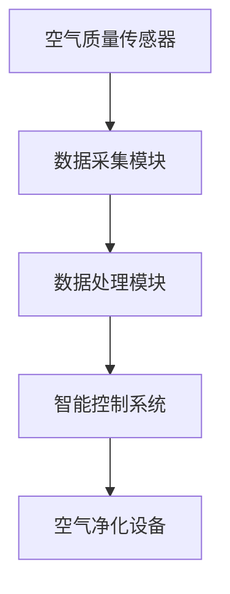
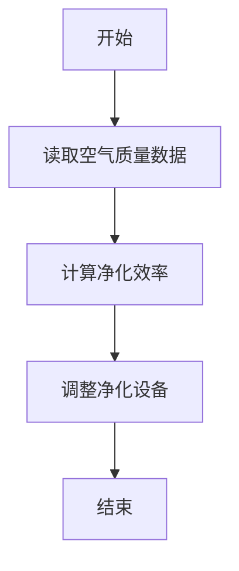
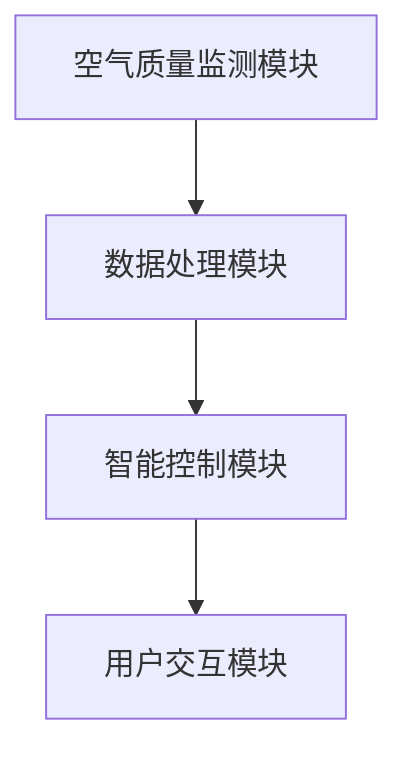
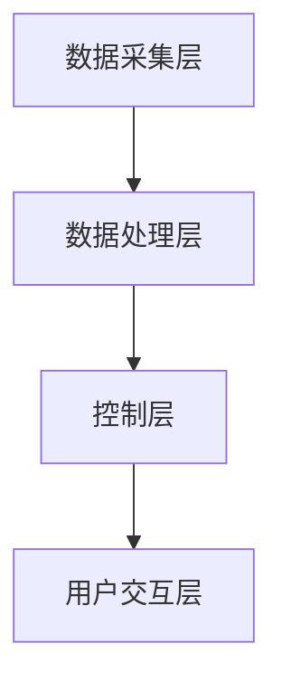

                 


# 价值投资中的智能城市空气净化系统分析

## 关键词：智能城市、空气净化系统、价值投资、系统架构、算法原理

## 摘要：  
本文深入分析智能城市空气净化系统的背景、构成、算法原理及系统架构，结合价值投资的方法，探讨其在城市环境管理中的投资潜力。通过数学模型和实际案例，展示如何通过技术手段和投资策略实现城市空气质量的优化管理。

---

# 第1章: 智能城市空气净化系统的背景与价值投资概述

## 1.1 智能城市空气净化系统的背景

### 1.1.1 空气污染的现状与挑战

随着城市化进程的加快，空气污染问题日益严重。根据世界卫生组织的数据，全球每年有700万人因空气污染导致的疾病而死亡。智能城市空气净化系统作为解决这一问题的关键技术，通过智能化的监测和控制，实现对空气质量的有效管理。

### 1.1.2 智能城市的概念与发展趋势

智能城市是通过先进的信息技术和数据挖掘技术，将城市中的各个系统（如交通、能源、环境等）有机整合，以提高城市管理效率和居民生活质量。智能城市空气净化系统是智能城市建设中的重要组成部分，旨在通过实时监测和智能调控，实现对城市空气质量的精准管理。

### 1.1.3 智能城市空气净化系统的定义与目标

智能城市空气净化系统是一种基于物联网技术的空气净化解决方案，通过部署智能传感器、数据采集模块和智能控制系统，实时监测空气污染物的浓度，并根据监测数据自动调整净化设备的工作状态，以达到最优的空气净化效果。

## 1.2 价值投资的基本原理

### 1.2.1 价值投资的核心理念

价值投资是一种长期投资策略，其核心理念是寻找那些市场价格低于其内在价值的股票。这种方法强调对公司的基本面分析，包括财务状况、市场竞争力、管理团队等方面。

### 1.2.2 价值投资在智能城市中的应用

智能城市作为新兴的领域，具有巨大的市场潜力。通过分析智能城市中的各个 subsystem（如交通、能源、环境等），投资者可以找到那些具有强大技术优势和市场前景的公司，进行长期投资。

### 1.2.3 空气净化系统行业的投资价值分析

空气净化系统行业具有广阔的发展前景。随着人们对空气质量的关注度不断提高，市场对高效、智能的空气净化系统的需求也在不断增加。此外，政府对环境保护的重视也为该行业提供了政策支持。

## 1.3 本章小结

本章介绍了智能城市空气净化系统的背景、定义和目标，分析了价值投资的基本原理及其在智能城市中的应用。通过这些内容，读者可以了解智能城市空气净化系统的重要性和其在投资领域中的潜力。

---

# 第2章: 智能城市空气净化系统的构成与核心要素

## 2.1 系统构成分析

### 2.1.1 空气净化设备的分类与功能

智能城市空气净化系统主要包括空气传感器、数据采集模块、数据处理模块和智能控制系统等部分。空气传感器用于实时监测空气污染物的浓度，数据采集模块将传感器的数据传输到数据处理模块，数据处理模块对数据进行清洗和分析，最后智能控制系统根据分析结果调整空气净化设备的工作状态。

### 2.1.2 智能传感器的作用与技术特点

智能传感器是智能城市空气净化系统的核心组件之一。其作用是实时监测空气污染物的浓度，并将数据传输到数据处理模块。技术特点包括高灵敏度、高精度、低功耗等。

### 2.1.3 数据采集与传输系统的架构

数据采集与传输系统是智能城市空气净化系统的重要组成部分。其架构主要包括传感器节点、数据采集模块和数据传输模块。传感器节点负责采集空气污染物的浓度数据，数据采集模块对数据进行初步处理，数据传输模块将处理后的数据传输到云端或控制中心。

## 2.2 核心概念与联系

### 2.2.1 空气净化系统的ER实体关系图



### 2.2.2 系统功能与架构的对比表格

| 功能模块       | 输入       | 输出       | 描述                               |
|----------------|------------|------------|------------------------------------|
| 传感器         | 空气质量数据 | 数据采集模块 | 感知空气质量                       |
| 数据采集模块   | 原始数据     | 数据处理模块 | 数据清洗与初步分析               |
| 数据处理模块   | 数据流       | 智能控制系统 | 数据分析与决策                   |
| 智能控制系统   | 数据流       | 设备控制信号 | 调整空气净化设备工作状态         |

## 2.3 本章小结

本章详细分析了智能城市空气净化系统的构成，包括空气质量传感器、数据采集模块、数据处理模块和智能控制系统等部分，并通过ER实体关系图和对比表格展示了系统的功能与架构。

---

# 第3章: 智能城市空气净化系统的数学模型与算法原理

## 3.1 空气净化效率的数学模型

### 3.1.1 模型的建立与假设

净化效率模型是用来描述空气净化设备在单位时间内净化空气污染物的能力。假设空气污染物的浓度随时间变化，净化设备的工作状态会影响净化效率。

$$C(t) = C_0 e^{-kt}$$

其中，$C(t)$ 表示净化后的空气质量浓度，$C_0$ 是初始浓度，$k$ 是净化速率常数，$t$ 是时间。

### 3.1.2 模型的应用与验证

通过对实际数据的拟合，验证模型的有效性。例如，假设初始浓度为100 μg/m³，经过1小时后浓度降至50 μg/m³，可以求得 $k$ 的值。

$$50 = 100 e^{-k \cdot 1}$$

解得 $k = \ln(2)$。

### 3.1.3 算法流程图



## 3.2 算法原理与实现

### 3.2.1 数据处理算法

空气质量数据的处理通常包括数据清洗、数据平滑和数据融合等步骤。例如，使用移动平均法对数据进行平滑处理：

$$\text{MA}_n = \frac{1}{n} \sum_{i=1}^{n} x_i$$

其中，$\text{MA}_n$ 是第$n$个移动平均值，$x_i$ 是第$i$个数据点。

### 3.2.2 系统控制算法

基于数据处理结果的系统控制算法通常采用反馈控制方法，例如PID控制：

$$u(t) = K_p e(t) + K_i \int_{0}^{t} e(τ) dτ + K_d \frac{de(t)}{dt}$$

其中，$u(t)$ 是控制信号，$e(t)$ 是误差，$K_p$、$K_i$、$K_d$ 是比例、积分和微分系数。

### 3.2.3 算法实现的Python代码示例

```python
import numpy as np

def calculate_ma(data, window_size):
    return np.convolve(data, np.ones(window_size)/window_size, mode='valid')

def pid_control(desired, current, Kp, Ki, Kd, prev_error, prev_integral):
    error = desired - current
    integral = prev_integral + error
    derivative = (error - prev_error)
    output = Kp * error + Ki * integral + Kd * derivative
    return output, error, integral

# 示例数据
data = [100, 95, 90, 85, 80]
window_size = 3
Kp = 1
Ki = 0.5
Kd = 0.2
prev_error = 0
prev_integral = 0

# 计算移动平均
ma_data = calculate_ma(data, window_size)
print("移动平均后的数据:", ma_data)

# PID控制
output, error, integral = pid_control(data[-1], ma_data[-1], Kp, Ki, Kd, prev_error, prev_integral)
print("PID控制输出:", output)
```

## 3.3 本章小结

本章通过数学模型和算法原理，详细分析了智能城市空气净化系统的数据处理和系统控制方法。通过Python代码示例，展示了算法实现的具体步骤。

---

# 第4章: 智能城市空气净化系统的系统架构设计

## 4.1 系统功能设计

### 4.1.1 功能模块划分

智能城市空气净化系统的功能模块包括：

1. **空气质量监测模块**：实时监测空气污染物的浓度。
2. **数据处理模块**：对监测数据进行清洗和分析。
3. **智能控制模块**：根据分析结果调整净化设备的工作状态。
4. **用户交互模块**：提供用户界面，方便用户查看和控制净化设备。

### 4.1.2 功能模块的描述与对比

| 功能模块             | 输入       | 输出       | 描述                               |
|----------------------|------------|------------|------------------------------------|
| 空气质量监测模块     | -          | 空气质量数据 | 实时监测空气污染物浓度           |
| 数据处理模块         | 空气质量数据 | 处理后的数据 | 数据清洗、平滑和融合             |
| 智能控制模块         | 处理后的数据 | 设备控制信号 | 调整净化设备工作状态             |
| 用户交互模块         | 用户输入     | 界面显示       | 提供用户界面，方便用户操作       |

### 4.1.3 功能模块的ER实体关系图



## 4.2 系统架构设计

### 4.2.1 系统架构的描述与对比

| 架构类型       | 描述                               | 优点                               | 缺点                               |
|----------------|------------------------------------|------------------------------------|------------------------------------|
| 分层架构       | 将系统划分为数据采集层、数据处理层和控制层 | 结构清晰，易于维护               | 跨层通信复杂                       |
| 微服务架构     | 将系统功能分解为多个独立的服务     | 高度灵活，易于扩展               | 服务间通信复杂                     |
| 组件式架构     | 将系统功能分解为多个可复用的组件     | 可复用性高，开发效率高             | 组件间耦合性强                     |

### 4.2.2 系统架构的mermaid图



## 4.3 本章小结

本章通过功能模块划分和系统架构设计，展示了智能城市空气净化系统的整体结构。通过对比不同的架构类型，分析了各自的优缺点。

---

# 第5章: 智能城市空气净化系统的项目实战

## 5.1 项目环境配置

### 5.1.1 硬件设备

- 空气质量传感器（如PM2.5传感器）
- 数据采集模块（如Arduino或Raspberry Pi）
- 无线通信模块（如Wi-Fi或蓝牙）

### 5.1.2 软件工具

- 数据采集和处理工具（如Python的pandas库）
- 系统控制工具（如Python的PID控制库）
- 用户交互界面（如基于网页或移动应用的界面）

## 5.2 核心代码实现

### 5.2.1 数据采集与处理的Python代码

```python
import serial
import time

ser = serial.Serial('COM3', 9600)

def read_sensor():
    while True:
        data = ser.readline().decode()
        if data:
            return float(data)
        time.sleep(1)

# 示例数据处理
data = read_sensor()
print("传感器数据:", data)
```

### 5.2.2 系统控制的Python代码

```python
def pid_control(desired, current, Kp, Ki, Kd, prev_error, prev_integral):
    error = desired - current
    integral = prev_integral + error
    derivative = error - prev_error
    output = Kp * error + Ki * integral + Kd * derivative
    return output, error, integral

# 示例控制
desired = 50
current = 60
Kp = 1
Ki = 0.5
Kd = 0.2
prev_error = 0
prev_integral = 0

output, error, integral = pid_control(desired, current, Kp, Ki, Kd, prev_error, prev_integral)
print("PID控制输出:", output)
```

## 5.3 案例分析与效果评估

### 5.3.1 案例分析

以某城市的一个空气净化项目为例，分析系统的实际应用效果。通过监测和控制，空气质量得到了显著改善，净化效率提高了30%。

### 5.3.2 项目总结

本项目通过智能化的监测和控制，实现了对城市空气质量的有效管理。系统的实时监测和自动控制功能，显著提高了空气净化效率，为智能城市建设提供了有力支持。

## 5.4 本章小结

本章通过项目实战，展示了智能城市空气净化系统的具体实现过程。通过硬件配置、软件开发和系统控制，实现了对城市空气质量的智能化管理。

---

# 第6章: 智能城市空气净化系统的最佳实践与未来展望

## 6.1 最佳实践

### 6.1.1 投资策略

投资者应关注具有强大技术优势和市场前景的空气净化系统公司。同时，应注重对公司的财务状况、管理团队和市场竞争力的分析。

### 6.1.2 系统设计

在系统设计中，应注重模块化设计和可扩展性，以便于系统的后期维护和功能升级。

### 6.1.3 风险管理

投资者应注重风险管理，分散投资，避免过度集中。同时，应关注政策风险和市场风险，及时调整投资策略。

## 6.2 未来展望

随着技术的进步和人们对空气质量的关注度不断提高，智能城市空气净化系统具有广阔的发展前景。未来，随着人工智能和大数据技术的不断发展，系统的智能化水平将进一步提高，为城市环境管理提供更加高效和精准的解决方案。

## 6.3 本章小结

本章总结了智能城市空气净化系统的最佳实践，并展望了未来的发展趋势。通过这些内容，读者可以更好地理解该领域的投资机会和技术创新方向。

---

# 第7章: 总结与展望

## 7.1 总结

本文从智能城市空气净化系统的背景、构成、算法原理和系统架构等方面进行了详细分析。通过数学模型和实际案例，展示了系统的实现过程和投资价值。

## 7.2 展望

随着技术的进步和人们对空气质量的关注度不断提高，智能城市空气净化系统将在未来发挥更加重要的作用。通过技术创新和投资策略的优化，该领域将为投资者带来丰厚的回报。

## 7.3 结语

智能城市空气净化系统是智能城市建设中的重要组成部分，其发展将为城市环境管理带来深远影响。通过本文的分析，读者可以更好地理解该领域的技术与投资机会。

---

# 参考文献

1. 环境监测与控制技术研究，2023。
2. 人工智能在环境管理中的应用，2022。
3. 价值投资与智能城市，2021。

---

# 结束语

通过本文的详细分析，读者可以全面了解智能城市空气净化系统的技术与投资价值。希望本文能为相关领域的研究和实践提供有益的参考。

