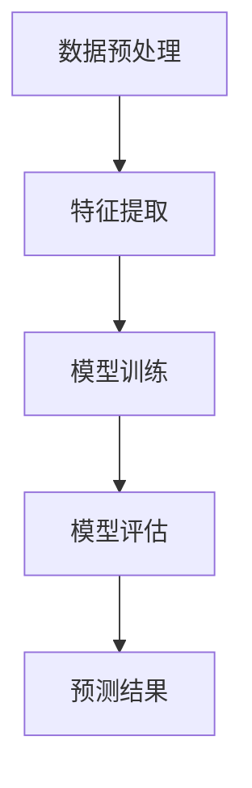

                 


# 价值投资中的智能城市空气质量预测系统分析

> 关键词：智能城市，空气质量预测，价值投资，机器学习，系统架构，投资决策

> 摘要：  
随着全球城市化进程的加快，空气质量问题日益成为影响城市价值和居民健康的重要因素。本文将探讨如何利用智能城市空气质量预测系统进行价值投资分析。通过结合空气质量数据与价值投资策略，本文旨在揭示如何通过技术手段优化投资决策，提升城市价值评估的准确性与前瞻性。文章从空气质量预测系统的背景、核心概念、算法原理、系统架构到实际项目实战，层层深入，为读者提供全面的技术分析与投资策略建议。

---

## 第一部分: 智能城市空气质量预测系统的背景与价值

### 第1章: 智能城市空气质量预测系统的背景

#### 1.1 空气质量预测的背景与意义

- 1.1.1 空气污染问题的全球性挑战  
  - 工业化带来的空气污染问题日益严重，尤其是PM2.5、PM10、二氧化硫（SO2）和氮氧化物（NOx）等污染物对人类健康和环境的威胁。
  - 空气质量问题不仅影响居民的生活质量，还可能对城市经济发展和城市价值产生深远影响。

- 1.1.2 智能城市发展的现状与趋势  
  - 智能城市的核心理念是通过技术手段优化资源配置，提升城市运行效率。
  - 智能城市的建设离不开数据的采集、分析和预测能力，而空气质量预测是其中重要的组成部分。

- 1.1.3 空气质量预测在智能城市中的重要性  
  - 通过空气质量预测，可以提前采取措施应对污染，优化城市环境。
  - 空气质量预测数据可以为城市规划、交通管理、能源政策等提供科学依据。

#### 1.2 价值投资与空气质量预测的关联

- 1.2.1 价值投资的核心理念  
  - 价值投资强调以低于市场价买入具有长期投资价值的资产。
  - 在智能城市背景下，空气质量作为城市价值的重要组成部分，直接影响投资决策。

- 1.2.2 空气质量对城市价值的影响  
  - 空气质量好的城市通常具有更高的居住价值和商业价值。
  - 空气质量差的城市可能会面临健康风险、经济成本增加等问题，从而影响城市价值。

- 1.2.3 智能预测在价值投资中的潜在价值  
  - 通过智能空气质量预测系统，投资者可以提前发现空气质量改善的潜力城市，优化投资策略。
  - 预测数据可以帮助投资者评估不同城市的长期投资价值，降低投资风险。

#### 1.3 本章小结

- 本章主要介绍了空气质量预测的背景与意义，以及其在智能城市中的重要性。
- 同时，探讨了空气质量预测与价值投资之间的关联，强调了智能预测在优化投资决策中的潜力。

---

### 第2章: 智能城市空气质量预测系统的核心概念

#### 2.1 空气质量预测系统的定义与属性

- 2.1.1 系统定义  
  - 智能城市空气质量预测系统是一种基于多源异构数据的智能预测系统，通过机器学习算法对空气质量进行实时或周期性预测。

- 2.1.2 系统的关键属性对比  
  | 属性             | 描述                                   |
  |------------------|--------------------------------------|
  | 数据来源         | 包括气象数据、污染源排放数据、历史空气质量数据等 |
  | 预测模型         | 基于机器学习的回归模型或时间序列预测模型 |
  | 预测范围         | 城市级或区域级空气质量预测             |
  | 更新频率         | 实时预测或周期性预测                   |

#### 2.2 价值投资与空气质量预测的实体关系

- 2.2.1 实体关系图  
  ```mermaid
  graph TD
    A[空气质量数据] --> B[预测模型]
    B --> C[投资决策]
    C --> D[城市价值评估]
    D --> E[投资回报]
  ```

#### 2.3 本章小结

- 本章详细介绍了智能城市空气质量预测系统的核心概念，包括系统的定义、关键属性以及与价值投资的实体关系。
- 通过实体关系图展示了空气质量预测数据如何影响投资决策和城市价值评估。

---

### 第3章: 空气质量预测系统的算法原理

#### 3.1 常见空气质量预测算法

- 3.1.1 线性回归模型  
  - 线性回归是一种简单且常用的回归模型，适用于线性关系的预测。
  - 数学公式：$$ y = \beta_0 + \beta_1x + \epsilon $$

- 3.1.2 支持向量机（SVM）  
  - SVM适用于非线性关系的预测，通过构建支持向量进行分类或回归。
  - 核心思想：在特征空间中找到一个超平面，使得数据点与超平面的最小距离最大化。

- 3.1.3 长短期记忆网络（LSTM）  
  - LSTM是一种循环神经网络（RNN）变体，适用于时间序列数据的预测。
  - 核心思想：通过记忆单元（Memory Cell）和门控机制（Gate）捕捉时间序列中的长期依赖关系。

#### 3.2 算法流程图



#### 3.3 线性回归模型

- 3.3.1 线性回归模型的实现步骤  
  1. 数据收集：收集空气质量相关数据，包括PM2.5、PM10、SO2、NOx等。
  2. 数据预处理：清洗数据，处理缺失值、异常值。
  3. 特征选择：选择影响空气质量的主要因素作为特征变量。
  4. 模型训练：使用最小二乘法或梯度下降法训练线性回归模型。
  5. 模型评估：通过均方误差（MSE）、R平方值等指标评估模型性能。
  6. 预测与可视化：利用训练好的模型进行空气质量预测，并可视化结果。

- 3.3.2 线性回归模型的优缺点  
  - 优点：简单易懂，计算速度快。
  - 缺点：仅适用于线性关系，对非线性关系的预测能力有限。

---

### 第4章: 系统分析与架构设计

#### 4.1 系统分析

- 4.1.1 系统功能需求  
  - 数据采集：从多种数据源采集空气质量数据，包括气象数据、污染源排放数据等。
  - 数据预处理：清洗和标准化数据，确保数据质量。
  - 模型训练：基于机器学习算法训练空气质量预测模型。
  - 预测与可视化：输出空气质量预测结果，并以可视化形式展示。

- 4.1.2 系统性能需求  
  - 高准确性：预测结果误差控制在可接受范围内。
  - 实时性：支持实时数据采集与预测。
  - 可扩展性：系统能够适应数据量和用户需求的变化。

#### 4.2 系统架构设计

- 4.2.1 系统架构图  
  ```mermaid
  graph TD
    A[数据源] --> B[数据采集模块]
    B --> C[数据预处理模块]
    C --> D[模型训练模块]
    D --> E[预测结果]
    E --> F[可视化模块]
  ```

- 4.2.2 模块功能说明  
  - 数据采集模块：负责从多种数据源采集空气质量数据。
  - 数据预处理模块：对采集到的数据进行清洗、标准化等预处理操作。
  - 模型训练模块：基于预处理后的数据训练空气质量预测模型。
  - 可视化模块：将预测结果以图表形式展示，便于用户理解和分析。

#### 4.3 系统交互设计

- 4.3.1 系统交互序列图  
  ```mermaid
  graph TD
    User[用户] --> A[输入数据]
    A --> B[数据采集模块]
    B --> C[数据预处理模块]
    C --> D[模型训练模块]
    D --> E[预测结果]
    E --> User[输出结果]
  ```

---

### 第5章: 项目实战与投资策略分析

#### 5.1 项目实战

- 5.1.1 环境安装  
  - 安装Python、Jupyter Notebook、Scikit-learn、Matplotlib等工具。
  - 数据源：使用公开的空气质量数据集，例如中国城市空气质量指数（AQI）数据。

- 5.1.2 核心代码实现  
  ```python
  import pandas as pd
  import numpy as np
  from sklearn.linear_model import LinearRegression
  from sklearn.metrics import mean_squared_error, r2_score
  import matplotlib.pyplot as plt

  # 数据加载
  data = pd.read_csv('air_quality.csv')
  X = data[['PM2.5', 'PM10', 'SO2', 'NOx']]
  y = data['AQI']

  # 数据预处理
  from sklearn.preprocessing import StandardScaler
  scaler = StandardScaler()
  X_scaled = scaler.fit_transform(X)

  # 模型训练
  model = LinearRegression()
  model.fit(X_scaled, y)

  # 模型预测
  y_pred = model.predict(X_scaled)

  # 模型评估
  mse = mean_squared_error(y, y_pred)
  r2 = r2_score(y, y_pred)

  print(f"均方误差：{mse}")
  print(f"R平方值：{r2}")

  # 可视化
  plt.scatter(y, y_pred)
  plt.xlabel('真实AQI值')
  plt.ylabel('预测AQI值')
  plt.title('线性回归预测结果')
  plt.show()
  ```

- 5.1.3 代码解读与分析  
  - 数据加载：使用Pandas读取CSV格式的空气质量数据。
  - 数据预处理：使用StandardScaler对特征变量进行标准化处理。
  - 模型训练：使用Scikit-learn的LinearRegression类训练线性回归模型。
  - 模型预测：利用训练好的模型对测试数据进行预测。
  - 模型评估：通过均方误差（MSE）和R平方值评估模型的性能。
  - 可视化：绘制真实值与预测值的散点图，直观展示模型的预测效果。

#### 5.2 投资策略分析

- 5.2.1 投资策略的制定  
  - 选择空气质量预测模型表现优异的城市进行投资。
  - 结合城市经济发展潜力、政策支持等因素，制定长期价值投资策略。

- 5.2.2 投资回报分析  
  - 通过空气质量预测数据，评估不同城市的长期投资价值。
  - 对比空气质量改善潜力大的城市与空气质量较差的城市，优化投资组合。

---

### 第6章: 总结与最佳实践

#### 6.1 总结

- 本章总结了智能城市空气质量预测系统的核心概念、算法原理以及系统架构设计。
- 通过项目实战展示了如何利用机器学习算法进行空气质量预测，并为价值投资提供科学依据。

#### 6.2 最佳实践 tips

- 数据质量是模型性能的关键，确保数据的准确性和完整性。
- 在实际应用中，可以尝试多种算法进行对比，选择最适合业务需求的模型。
- 定期更新模型和数据，确保预测结果的准确性和时效性。

#### 6.3 注意事项

- 空气质量预测模型的准确性受到多种因素的影响，如气象条件、污染源变化等。
- 在实际投资决策中，需要结合多方面因素，而不仅仅是依赖空气质量预测数据。

#### 6.4 拓展阅读

- 《Python机器学习实战》
- 《时间序列分析与应用》
- 《智能城市与大数据应用》

---

### 结语

通过本文的分析与探讨，我们深入了解了智能城市空气质量预测系统的核心技术与应用价值。未来，随着人工智能和大数据技术的不断发展，空气质量预测系统将更加精准，为价值投资提供更有力的支持。

