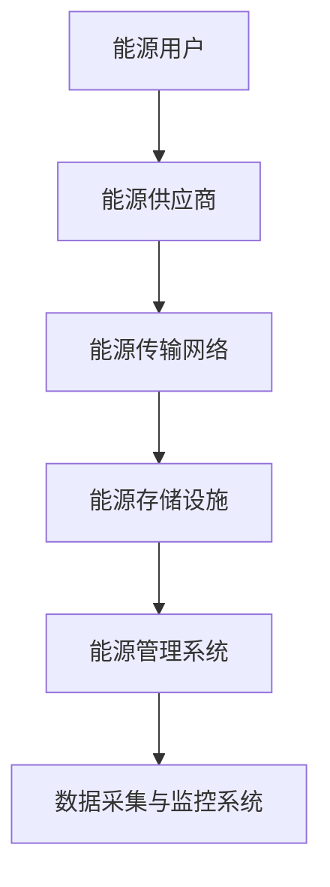
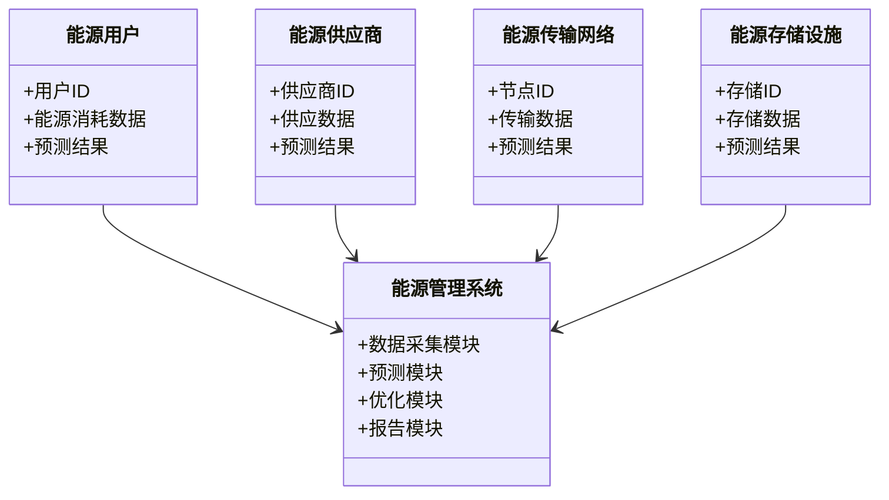
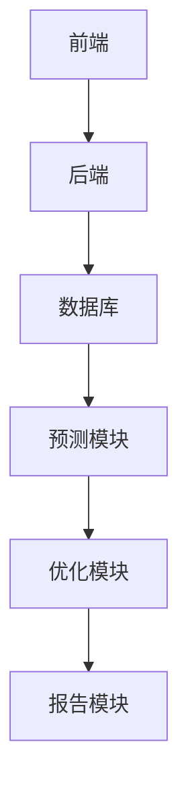

                 


# 价值投资中的智能城市能源管理系统分析

## 关键词：
- 价值投资
- 智能城市
- 能源管理系统
- 数据分析
- 优化算法
- 投资策略
- 可持续发展

## 摘要：
本文旨在分析智能城市能源管理系统在价值投资中的应用。通过探讨能源管理系统的核心概念、算法原理、系统架构，以及实际案例分析，本文揭示了如何利用智能能源管理技术优化投资决策，提升投资收益。文章从背景介绍、核心概念、算法原理、系统设计、项目实战等多方面展开，结合理论与实践，为价值投资者提供新的视角和工具。

---

## 第1章: 价值投资与智能城市能源管理的背景

### 1.1 价值投资的背景与概念
价值投资是一种长期投资策略，强调通过分析企业的基本面，寻找被市场低估的投资标的。其核心在于识别具有长期增长潜力的企业，并在市场低谷时买入，市场高点时卖出。随着经济全球化和科技的进步，价值投资的工具和方法也在不断演变。

#### 1.1.1 价值投资的核心理念
价值投资强调安全边际和长期稳健的回报，而非短期市场波动。投资者需要关注企业的财务健康、盈利能力、行业地位等因素。

#### 1.1.2 价值投资的演变
从格雷厄姆的经典价值投资到现代量化投资的演变，价值投资逐渐融入更多科技手段，如大数据分析和人工智能。

### 1.2 智能城市能源管理的背景
智能城市是指通过信息技术优化城市资源的配置和管理，提升居民生活质量。能源管理是智能城市的重要组成部分，涉及能源的生产、传输、分配和使用。

#### 1.2.1 智能城市能源管理的重要性
能源管理的智能化可以提高能源利用效率，降低能源浪费，减少碳排放，推动可持续发展。

#### 1.2.2 智能城市能源管理的挑战
能源管理涉及复杂的系统和多方利益，需要解决数据孤岛、技术整合、政策协调等问题。

### 1.3 价值投资与智能城市能源管理的结合
智能城市能源管理的智能化和数据化为价值投资提供了新的机会。通过分析能源管理系统的数据，投资者可以发现潜在的投资机会，优化投资组合。

#### 1.3.1 智能城市能源管理对价值投资的影响
通过数据分析，投资者可以更准确地评估企业的能源管理能力，从而做出更明智的投资决策。

#### 1.3.2 价值投资视角下的能源管理分析
从价值投资的角度，能源管理系统的效率和成本优化能力是评估企业的重要指标。

### 1.4 本书的核心问题与研究目标
本书旨在探讨智能城市能源管理系统如何辅助价值投资，通过分析系统的数据处理、预测模型和优化算法，揭示其在投资决策中的应用价值。

---

## 第2章: 智能城市能源管理系统的概念与结构

### 2.1 智能城市能源管理系统的定义
智能城市能源管理系统是一种利用信息技术优化能源生产和消费的系统，涵盖能源的全生命周期管理。

#### 2.1.1 系统的核心功能
- 数据采集与监控
- 能源消耗预测
- 优化调度
- 报告生成

#### 2.1.2 系统的组成要素
- 数据采集终端
- 中央控制系统
- 用户界面
- 数据存储与分析模块

### 2.2 价值投资视角下的能源管理分析
从价值投资的角度，能源管理系统的效率和成本优化能力是评估企业的重要指标。

#### 2.2.1 系统的实体关系分析



---

## 第3章: 数据处理与预测算法

### 3.1 数据处理算法
数据清洗与预处理是能源管理系统的核心步骤，包括数据的采集、清洗、转换和集成。

#### 3.1.1 数据清洗与预处理
- 数据去重
- 填补缺失值
- 异常值处理
- 数据标准化

#### 3.1.2 时间序列数据的特征提取
- 均值、方差、趋势分析
- 季节性分析
- 周期性分析

### 3.2 能源需求预测模型
能源需求预测是智能城市能源管理系统的重要功能，常用的方法包括线性回归和时间序列预测。

#### 3.2.1 线性回归模型
线性回归模型用于预测能源需求与时间的关系。

$$ y = a x + b $$

其中，y为预测值，x为自变量，a为斜率，b为截距。

#### 3.2.2 时间序列预测模型
时间序列预测模型用于分析能源需求的周期性变化。

$$ ARIMA(p, d, q) $$

其中，p为自回归阶数，d为差分阶数，q为移动平均阶数。

### 3.3 优化算法
优化算法用于能源管理系统的调度优化。

#### 3.3.1 线性规划模型
线性规划模型用于能源分配的优化。

$$ \text{minimize } c^T x $$
$$ \text{subject to } A x \leq b $$

其中，x为决策变量，c为成本向量，A为约束矩阵，b为约束向量。

#### 3.3.2 动态规划算法
动态规划算法用于多阶段优化问题。

---

## 第4章: 系统分析与架构设计

### 4.1 系统功能设计
系统功能设计包括数据采集、预测、优化和报告生成。

#### 4.1.1 领域模型设计



### 4.2 系统架构设计
系统架构设计包括前端、后端和数据库。

#### 4.2.1 系统架构图



### 4.3 接口设计
系统接口设计包括数据接口、API接口和用户界面。

---

## 第5章: 项目实战

### 5.1 环境安装
项目实战需要安装Python、Jupyter Notebook、数据库和相关库。

#### 5.1.1 安装Python
使用Anaconda安装Python环境。

#### 5.1.2 安装Jupyter Notebook
通过命令 `jupyter notebook install` 安装。

### 5.2 核心代码实现
核心代码实现包括数据处理、预测模型和优化算法。

#### 5.2.1 数据处理代码

```python
import pandas as pd
import numpy as np

# 数据加载
data = pd.read_csv('energy.csv')

# 数据清洗
data.dropna(inplace=True)
data = data[~data['value'].isin([0])]
```

#### 5.2.2 预测模型代码

```python
from sklearn.linear_model import LinearRegression

# 模型训练
model = LinearRegression()
model.fit(X_train, y_train)

# 模型预测
y_pred = model.predict(X_test)
```

### 5.3 案例分析
通过具体案例分析，验证系统的实际应用效果。

#### 5.3.1 案例分析
分析某智能城市能源管理系统的实际运行数据，验证模型的预测精度和优化效果。

### 5.4 项目小结
总结项目实施的经验和教训，提出改进建议。

---

## 第6章: 总结与展望

### 6.1 总结
本文分析了智能城市能源管理系统在价值投资中的应用，探讨了系统的数据处理、预测模型和优化算法。

### 6.2 最佳实践 tips
- 数据处理要注重实时性和准确性
- 模型选择要结合实际场景
- 系统设计要注重可扩展性和可维护性

### 6.3 未来展望
未来，随着人工智能和大数据技术的发展，智能城市能源管理系统将更加智能化和自动化，为价值投资提供更强大的工具。

---

## 参考文献
1. 格雷厄姆《 Intelligent Investor》
2. 王伟. 《智能城市能源管理系统的优化与实现》
3. 李明. 《价值投资与大数据分析》

---

## 结语
智能城市能源管理系统是价值投资的重要工具，通过数据分析和优化算法，可以帮助投资者做出更明智的决策，实现长期稳健的收益。

