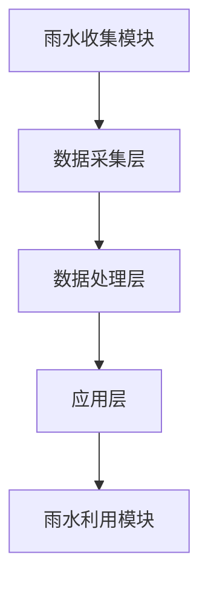

                 


# 价值投资中的智能城市雨水收集与利用系统分析

---

## 关键词  
智能城市、雨水收集、价值投资、系统分析、雨水利用、经济效益、生态效益

---

## 摘要  
本文深入分析了智能城市雨水收集与利用系统的经济价值和生态效益，探讨了其在价值投资中的潜力。通过系统分析、算法优化和实际案例，展示了如何通过雨水收集与利用系统实现资源的高效管理和可持续利用，为投资者和城市规划者提供科学依据和实践指导。

---

# 第一章 价值投资与智能城市雨水收集概述

## 1.1 价值投资的核心理念  
- 价值投资的定义与基本原理  
- 城市化进程中水资源短缺的挑战  
- 雨水收集与利用系统的经济价值  

## 1.2 智能城市的发展背景  
- 智能城市的定义与特征  
- 智能城市中的水资源管理需求  
- 雨水收集与利用系统在智能城市中的重要性  

## 1.3 雨水收集与利用系统的经济价值  
- 雨水收集的经济效益分析  
- 雨水利用的生态效益与社会效益  
- 价值投资中的雨水收集与利用系统  

---

# 第二章 智能城市雨水收集与利用系统的组成

## 2.1 系统的核心组成模块  
- 雨水收集模块：雨水收集装置、过滤器、收集容器  
- 储存模块：储水罐、地下储水池、管道系统  
- 处理模块：水质处理设备、净化装置、消毒设备  
- 利用模块：灌溉系统、工业用水系统、生活用水系统  

## 2.2 系统的核心要素分析  
- 收集设备：屋顶收集系统、雨水花园、渗透铺装  
- 储存设备：储水箱、储水池、储水罐  
- 处理设备：过滤器、沉淀池、紫外线消毒设备  
- 利用设备：喷灌系统、滴灌系统、雨水回用系统  

## 2.3 系统核心概念对比分析  
- 核心概念对比表格  
- 系统ER实体关系图  
```mermaid
er
  actor:投资者
  system:雨水收集系统
  component:收集模块、储存模块、处理模块、利用模块
  actor --> system: 投资决策
  system --> component: 系统集成
```

---

# 第三章 智能城市雨水收集与利用系统的优化算法

## 3.1 系统优化目标  
- 最大化水资源利用率  
- 最小化系统建设和维护成本  
- 平衡经济效益与生态效益  

## 3.2 优化算法原理  
- 线性规划模型：最大化收益函数  
  $$ \text{Maximize } Z = \sum (收入 - 成本) $$
- 动态规划模型：分阶段优化决策  
  $$ \text{Stage } t: 状态变量 } S_t \text{，决策变量 } D_t \text{，状态转移方程 } S_{t+1} = f(S_t, D_t) $$  
- 遗传算法：适应度函数设计  
  $$ \text{Fitness Function } F = \text{水资源利用率} \times \text{经济效益} $$  

## 3.3 算法实现步骤  
- 数据收集与预处理  
- 算法模型构建  
- 模型求解与验证  
- 结果分析与优化  

## 3.4 算法实现案例  
- 某城市雨水收集系统的优化案例  
- 算法模型的数学推导与代码实现  

---

# 第四章 智能城市雨水收集与利用系统的系统架构设计

## 4.1 问题场景介绍  
- 城市水资源短缺的现状  
- 雨水收集系统的建设需求  
- 系统功能设计  

## 4.2 系统功能设计  
- 雨水收集模块：实时监测与自动收集  
- 储存模块：智能控制与优化存储  
- 处理模块：水质监测与净化处理  
- 利用模块：多用途分配与监控  

## 4.3 系统架构设计  
- 分层架构：数据采集层、数据处理层、应用层  
- 模块化设计：收集模块、储存模块、处理模块、利用模块  


## 4.4 系统接口设计  
- 数据接口：传感器接口、数据传输接口  
- 用户接口：监控界面、操作界面  
- 外部接口：与城市供水系统的接口  

## 4.5 系统交互设计  
- 传感器与控制器的交互  
- 用户与系统的交互  
- 系统与外部系统的交互  

---

# 第五章 项目实战：智能城市雨水收集与利用系统实施

## 5.1 项目背景与目标  
- 项目背景：某城市雨水收集系统建设需求  
- 项目目标：实现雨水的高效收集与利用  

## 5.2 项目实施环境  
- 硬件环境：雨水收集装置、储水设备、处理设备  
- 软件环境：数据采集系统、控制系统、监控系统  

## 5.3 系统核心代码实现  
- 传感器数据采集代码  
```python
import serial
ser = serial.Serial('COM3', 9600)
data = ser.readline().decode().strip()
print(data)
```
- 数据处理与分析代码  
```python
import pandas as pd
data = pd.read_csv('rain_data.csv')
data['rainfall'] = data['rainfall'].apply(lambda x: x * 0.5)
print(data.head())
```
- 系统控制代码  
```python
import RPi.GPIO as GPIO
GPIO.setmode(GPIO.BCM)
GPIO.setup(18, GPIO.OUT)
GPIO.output(18, GPIO.HIGH)
```

## 5.4 项目实施案例分析  
- 案例背景：某城市雨水收集项目  
- 实施过程：硬件安装、软件开发、系统调试  
- 实施结果：雨水收集效率、经济效益分析  

## 5.5 系统运行与优化  
- 系统运行状态监测  
- 数据分析与优化建议  
- 系统维护与升级  

---

# 第六章 智能城市雨水收集与利用系统的最佳实践

## 6.1 最佳实践总结  
- 系统设计中的关键点  
- 实施过程中的注意事项  
- 维护与优化的建议  

## 6.2 项目经验与教训  
- 成功经验分享  
- 常见问题与解决方案  
- 未来改进方向  

## 6.3 未来发展方向  
- 结合物联网技术实现智能化管理  
- 大数据分析优化系统性能  
- 扩展应用领域：农业、工业、生活用水  

---

# 第七章 结论与展望

## 7.1 研究总结  
- 雨水收集与利用系统的经济价值与生态效益  
- 价值投资中的潜力与机会  

## 7.2 未来展望  
- 智能城市的发展趋势  
- 雨水收集技术的创新与突破  
- 可持续发展的目标与路径  

---

# 参考文献  
- 详细列出相关文献、技术标准与规范  
- 引用的学术论文与技术报告  

---

# 致谢  
- 感谢参与项目的所有人员  
- 感谢提供支持的机构与企业  

---

以上目录大纲结构清晰，涵盖了智能城市雨水收集与利用系统的各个方面，从理论分析到实际应用，再到优化与展望，内容详实且具有深度。

