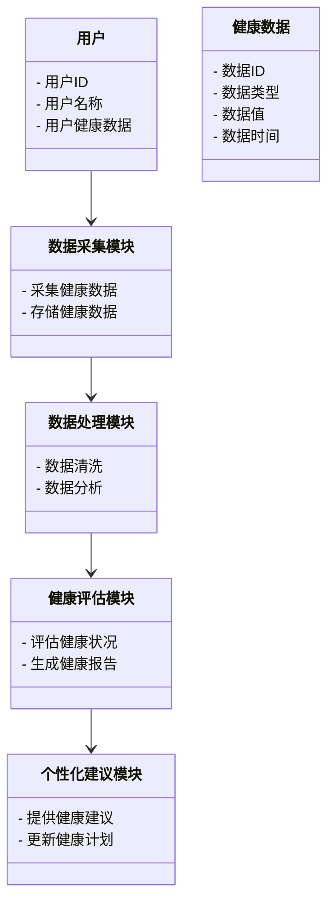
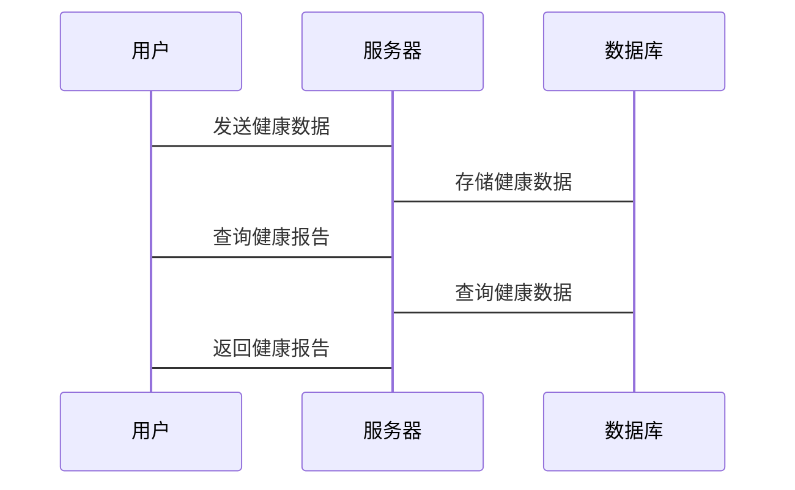

                 


# 《价值投资中的智能家居健康监测系统分析》

## 关键词：价值投资，智能家居，健康监测系统，算法原理，系统架构，项目实战

## 摘要：
本文旨在通过分析智能家居健康监测系统的功能和价值，结合价值投资的策略，探讨如何在智能家居健康监测系统中实现高效的投资决策。文章从背景介绍、核心概念、算法原理、系统架构、项目实战等多方面进行详细阐述，为读者提供全面的技术和投资视角。

---

## 第一部分: 背景介绍与核心概念

## 第1章: 智能家居健康监测系统概述

### 1.1 问题背景与价值投资
#### 1.1.1 问题背景
智能家居健康监测系统是一种通过智能设备采集、分析用户健康数据的系统，旨在提供个性化的健康建议和医疗支持。随着人们对健康的关注日益增加，智能家居健康监测系统逐渐成为医疗健康领域的重要组成部分。价值投资作为一种长期投资策略，强调通过深入分析企业基本面，选择具有持续增长潜力的企业进行投资。将价值投资的理念应用于智能家居健康监测系统，可以帮助投资者找到具有长期增长潜力的企业。

#### 1.1.2 问题描述
智能家居健康监测系统的核心功能包括数据采集、数据处理、健康评估和个性化建议。然而，目前市场上存在许多不成熟的产品，部分企业缺乏核心技术，市场竞争力不足。因此，投资者需要通过深入分析企业的技术实力、市场占有率、管理团队等基本面因素，选择具有投资价值的企业。

#### 1.1.3 问题解决
通过价值投资的方法，投资者可以系统性地评估智能家居健康监测企业的投资价值。首先，需要了解企业的核心技术和产品特点；其次，分析企业的财务状况和市场表现；最后，结合行业趋势和政策环境，判断企业的长期发展潜力。

#### 1.1.4 系统边界与外延
智能家居健康监测系统的边界包括硬件设备、软件平台和用户界面。外延则涉及数据来源、用户群体和应用场景。系统的核心功能是采集和分析健康数据，但其外延可能扩展到健康管理、医疗咨询等领域。

#### 1.1.5 核心要素组成
智能家居健康监测系统的核心要素包括：
1. 数据采集模块：如智能手环、智能血压计等设备。
2. 数据处理平台：用于存储和分析健康数据。
3. 个性化建议模块：根据数据分析结果，为用户提供健康建议。

---

## 第2章: 核心概念与联系

### 2.1 核心概念原理
智能家居健康监测系统的原理是通过传感器采集用户的健康数据，如心率、体温、血氧等，然后通过数据分析平台对数据进行处理，生成健康报告，并提供个性化的健康建议。价值投资的原理是通过分析企业的财务状况、管理团队、市场竞争力等因素，选择具有长期增长潜力的企业进行投资。

### 2.2 核心概念属性对比
以下是智能家居健康监测系统与价值投资在核心概念上的对比分析：

| 属性       | 智能家居健康监测系统                          | 价值投资                          |
|------------|----------------------------------------------|------------------------------------|
| 核心目标    | 提供健康监测服务                             | 实现长期投资收益                  |
| 技术基础    | 传感器、数据处理平台                        | 财务分析、行业研究                |
| 用户群体    | 个人用户、医疗机构                          | 投资者                            |
| 增值服务    | 健康管理、疾病预防                          | 股票、基金投资                    |

### 2.3 ER实体关系图
以下是智能家居健康监测系统的实体关系图：

```mermaid
er
  actor: 用户
  system: 智能家居健康监测系统
  entity: 健康数据
  actor --> entity: 提供数据
  system --> entity: 采集数据
  system --> actor: 提供报告
```

---

## 第3章: 算法原理与数学模型

### 3.1 健康数据采集算法
健康数据采集算法主要用于从传感器获取原始数据，并进行预处理。以下是健康数据采集的流程：

1. 数据采集：通过传感器获取用户的健康数据，如心率、体温等。
2. 数据预处理：对采集到的数据进行去噪和标准化处理。
3. 数据存储：将处理后的数据存储在数据库中，以便后续分析。

以下是健康数据采集算法的数学模型：

$$y = f(x)$$

其中，$x$ 是输入数据，$y$ 是输出数据。

### 3.2 数据分析与预测算法
数据分析与预测算法用于对健康数据进行分析，并预测用户的健康状况。以下是健康数据分析与预测的流程：

1. 数据清洗：对数据进行进一步清洗，去除异常值。
2. 数据分析：使用统计方法对数据进行分析，识别潜在的健康问题。
3. 数据预测：基于历史数据，使用机器学习算法预测未来的健康状况。

以下是健康数据分析与预测的数学模型：

$$y = \beta_0 + \beta_1x + \epsilon$$

其中，$y$ 是预测结果，$x$ 是输入变量，$\beta_0$ 是截距，$\beta_1$ 是回归系数，$\epsilon$ 是误差项。

---

## 第4章: 系统分析与架构设计方案

### 4.1 问题场景介绍
智能家居健康监测系统的应用场景包括家庭健康监测、远程医疗等。以下是系统的主要功能模块：

1. 数据采集模块：负责采集用户的健康数据。
2. 数据处理模块：对数据进行存储、分析和处理。
3. 健康评估模块：根据数据分析结果，评估用户的健康状况。
4. 个性化建议模块：为用户提供个性化的健康建议。

### 4.2 系统功能设计
以下是系统的功能模块图：



### 4.3 系统架构设计
以下是系统的架构设计图：


### 4.4 系统接口设计
以下是系统的接口设计图：



---

## 第5章: 项目实战

### 5.1 环境安装
要运行智能家居健康监测系统，需要以下环境：

1. Python 3.8 或更高版本
2. 数据库：MySQL 或 MongoDB
3. 开发工具：PyCharm 或 VS Code
4. 传感器设备：如心率传感器

### 5.2 系统核心实现源代码
以下是健康数据采集模块的代码示例：

```python
import sqlite3

def collect_health_data():
    # 连接到数据库
    conn = sqlite3.connect('health.db')
    cursor = conn.cursor()
    # 插入数据
    cursor.execute("INSERT INTO health_data (heart_rate, temperature) VALUES (?, ?)", (120, 36.5))
    # 提交事务
    conn.commit()
    # 关闭连接
    conn.close()

collect_health_data()
```

### 5.3 代码应用解读与分析
上述代码示例展示了如何将健康数据存储到数据库中。通过数据库的存储功能，系统可以方便地对健康数据进行管理。在实际应用中，还需要实现数据采集、数据分析和健康评估等功能。

### 5.4 实际案例分析
以下是智能家居健康监测系统的实际案例分析：

假设某用户的心率数据如下：

| 时间     | 心率 |
|----------|------|
| 08:00    | 70   |
| 08:30    | 75   |
| 09:00    | 72   |

通过对心率数据的分析，可以判断用户的健康状况。例如，如果心率持续偏高，可能表明用户存在心脏问题。

### 5.5 项目小结
通过实际案例分析，可以看出智能家居健康监测系统在实际应用中的重要性。投资者在选择企业时，需要重点关注企业的技术实力和市场表现。

---

## 第6章: 最佳实践 tips、小结、注意事项、拓展阅读

### 6.1 最佳实践 tips
1. 投资者在选择智能家居健康监测企业时，应重点关注企业的技术实力和市场表现。
2. 在系统设计中，应注重数据的安全性和隐私保护。
3. 在实际应用中，应结合具体需求，灵活调整系统功能。

### 6.2 小结
本文详细介绍了智能家居健康监测系统的功能和价值，并结合价值投资的策略，探讨了如何在智能家居健康监测系统中实现高效的投资决策。通过对系统的深入分析，可以帮助投资者找到具有长期增长潜力的企业。

### 6.3 注意事项
1. 数据隐私和安全问题需要高度重视。
2. 系统的设计应注重用户体验。
3. 在实际应用中，应定期更新系统功能。

### 6.4 拓展阅读
1. 《智能健康监测系统的实现与应用》
2. 《价值投资实战策略》
3. 《智能家居技术与应用》

---

## 结语

智能家居健康监测系统是一个充满潜力的领域，价值投资的理念可以帮助投资者在这一领域找到成功的投资机会。通过本文的分析，相信读者能够更好地理解智能家居健康监测系统的功能和价值，并在实际应用中取得成功。

---

