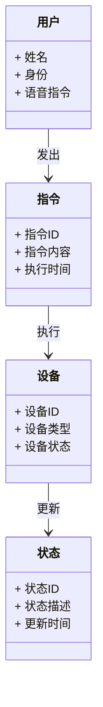
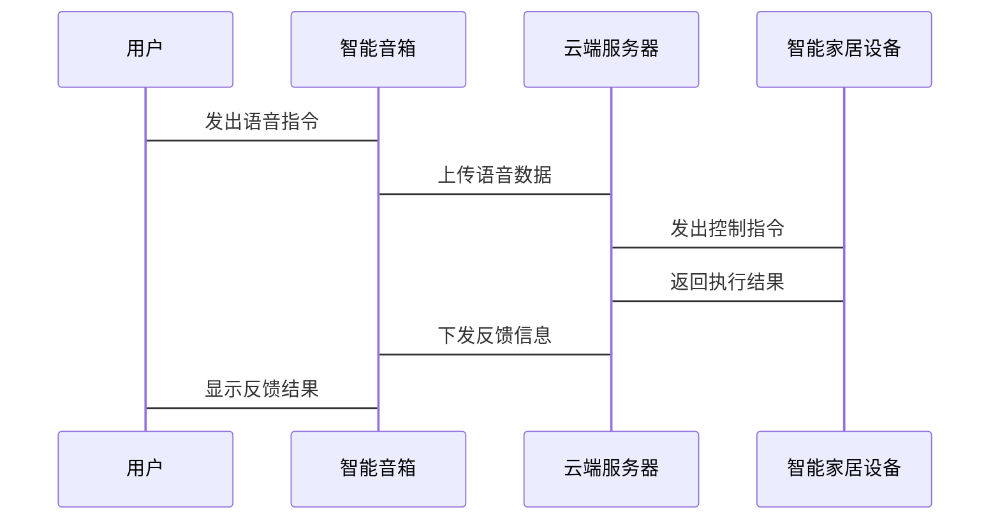

                 


# 价值投资中的智能家居语音控制系统分析

> 关键词：智能家居，语音控制系统，价值投资，语音识别，自然语言处理

> 摘要：本文从价值投资的角度，深入分析了智能家居语音控制系统的技术原理、系统架构、算法实现及市场前景。通过背景介绍、核心概念、技术分析、算法原理、系统架构、项目实战和总结等多维度的探讨，揭示了智能家居语音控制系统在投资中的潜力和挑战，并为投资者和技术开发者提供了有益的建议和指导。

---

## 第1章: 智能家居与语音控制系统的现状

### 1.1 智能家居的发展历程

#### 1.1.1 智能家居的定义与特征
智能家居是指通过物联网技术将家中的设备（如灯光、空调、安防系统等）连接到一起，实现远程控制和自动化管理的居住环境。其主要特征包括：
- **智能化**：通过传感器和智能设备实现自动化控制。
- **互联互通**：设备之间通过网络进行通信和数据交换。
- **用户友好**：提供便捷的用户交互界面，提升用户体验。
- **安全性**：具备防盗、防火等安全功能。

#### 1.1.2 智能家居技术的发展阶段
智能家居的发展经历了以下几个阶段：
1. **单一设备阶段**：每个设备独立工作，无法与其他设备联动。
2. **局域网阶段**：设备通过局域网实现互联，但缺乏统一的控制界面。
3. **智能中枢阶段**：引入智能中枢（如智能音箱）作为控制中心，实现多设备联动。
4. **全屋智能阶段**：所有设备无缝连接，实现真正的智能化家居体验。

#### 1.1.3 当前智能家居市场的现状
当前智能家居市场呈现以下特点：
- **市场规模大**：智能家居市场持续增长，预计未来几年将保持两位数的增长率。
- **产品多样化**：市场上涌现出各种智能家居设备，包括智能音箱、智能灯泡、智能门锁等。
- **技术标准化**：各大厂商积极推动智能家居技术的标准化，以实现不同品牌设备的互联互通。

---

### 1.2 语音控制系统的技术背景

#### 1.2.1 语音识别技术的演进
语音识别技术经历了从简单的语音命令识别到复杂语义理解的演变。当前主流的语音识别技术基于深度学习，特别是循环神经网络（RNN）和卷积神经网络（CNN）。

#### 1.2.2 自然语言处理在语音控制中的应用
自然语言处理（NLP）技术用于理解用户的意图，例如通过词袋模型、TF-IDF和深度学习模型（如BERT）来实现语义理解。

#### 1.2.3 语音控制系统的核心技术与挑战
- **核心技术**：语音信号处理、语音识别、自然语言理解、语音合成。
- **主要挑战**：噪声干扰、语义理解的准确性、多语言支持等。

---

### 1.3 价值投资与智能家居的结合

#### 1.3.1 价值投资的基本概念
价值投资是一种投资策略，通过分析企业的基本面（如财务状况、市场地位、盈利能力等）来评估其内在价值，寻找被市场低估的投资标的。

#### 1.3.2 智能家居行业的投资价值分析
智能家居行业具有广阔的发展前景，特别是在5G、物联网和人工智能技术的推动下，市场规模持续扩大，技术创新加速，行业壁垒逐渐形成。

#### 1.3.3 语音控制系统在智能家居中的价值体现
语音控制系统作为智能家居的核心交互界面，其技术性能和用户体验直接影响产品的市场竞争力和投资价值。

---

## 第2章: 智能家居语音控制系统的核心概念

### 2.1 智能家居语音控制系统的构成

#### 2.1.1 系统组成部分与功能模块
智能家居语音控制系统主要包括以下几个部分：
- **语音采集模块**：负责采集用户的语音输入。
- **语音识别模块**：将语音信号转换为文本或命令。
- **语义理解模块**：分析用户的意图并生成相应的指令。
- **执行模块**：根据指令控制智能家居设备的执行。

#### 2.1.2 语音控制系统的输入输出流程
- **输入**：用户发出语音指令。
- **处理**：系统对语音进行识别和理解。
- **输出**：系统根据理解结果执行相应的操作。

#### 2.1.3 系统的核心技术指标
- **识别准确率**：系统对语音指令的正确识别率。
- **响应时间**：系统从接收到指令到执行完成的时间。
- **支持语言**：系统支持的语音输入语言种类。

---

### 2.2 语音识别与自然语言处理原理

#### 2.2.1 语音识别的基本原理
语音识别的过程包括语音信号处理、特征提取、模型训练和识别结果输出。

#### 2.2.2 自然语言处理的核心算法
自然语言处理算法包括词性标注、句法分析、语义理解等。

#### 2.2.3 语音控制系统的工作流程
1. **语音采集**：通过麦克风采集用户的语音输入。
2. **特征提取**：将语音信号转换为频谱图、梅尔频谱等特征。
3. **模型训练**：使用深度学习模型（如LSTM）进行训练。
4. **识别与理解**：将语音转换为文本并理解其含义。
5. **执行指令**：根据理解结果控制智能家居设备。

---

### 2.3 智能家居语音控制系统的价值评估

#### 2.3.1 系统性能的评估标准
- **识别准确率**：系统对语音指令的正确识别率。
- **用户体验**：用户对系统的满意度和使用便捷性。
- **稳定性**：系统在不同环境下的运行稳定性。

#### 2.3.2 价值投资中的关键指标分析
- **市场占有率**：企业在市场中的份额。
- **技术先进性**：企业的技术优势和创新能力。
- **财务状况**：企业的盈利能力和发展潜力。

#### 2.3.3 系统优化与价值提升策略
- **技术优化**：持续改进语音识别和语义理解算法。
- **用户体验优化**：提升系统的响应速度和交互体验。
- **市场拓展**：加强品牌推广和渠道建设。

---

## 第3章: 智能家居语音控制系统的技术分析

### 3.1 语音识别技术的实现原理

#### 3.1.1 声学模型的构建与训练
声学模型通常使用深度神经网络（DNN）或卷积神经网络（CNN）进行训练。

#### 3.1.2 语音特征的提取方法
常用特征包括梅尔频谱、MFCC（Mel-Frequency Cepstral Coefficients）等。

#### 3.1.3 语音识别算法的优化策略
- **数据增强**：通过数据增强技术提高模型的鲁棒性。
- **模型优化**：使用更高效的模型结构（如Transformer）提升识别性能。

---

### 3.2 自然语言处理在语音控制中的应用

#### 3.2.1 语言模型的构建与优化
语言模型通过概率统计方法预测下一个词的概率，常用的模型有n-gram模型和基于神经网络的语言模型。

#### 3.2.2 意图识别的核心算法
意图识别常用的支持向量机（SVM）和深度学习模型（如LSTM）。

#### 3.2.3 对话系统的实现与优化
对话系统包括意图识别、对话管理、自然语言生成等模块。

---

### 3.3 智能家居语音控制系统的架构设计

#### 3.3.1 系统整体架构的分析
系统架构通常分为前端采集、后端处理和执行模块。

#### 3.3.2 功能模块的交互流程
- **前端采集**：接收用户的语音输入。
- **后端处理**：进行语音识别和语义理解。
- **执行模块**：根据指令控制智能家居设备。

---

## 第4章: 智能家居语音控制系统的算法实现

### 4.1 语音识别算法的实现

#### 4.1.1 基于深度学习的语音识别模型
深度学习模型（如CTC和Transformer）在语音识别中表现出色。

#### 4.1.2 端到端语音识别模型
端到端模型（如Transformer）可以直接将语音信号转换为文本，无需复杂的特征提取步骤。

---

### 4.2 自然语言处理算法的实现

#### 4.2.1 基于BERT的语义理解模型
BERT（Bidirectional Encoder Representations from Transformers）是一种强大的预训练语言模型，广泛应用于语义理解任务。

#### 4.2.2 对话系统的实现
对话系统通常基于生成式模型（如GPT）实现自然语言生成。

---

## 第5章: 智能家居语音控制系统的系统架构与接口设计

### 5.1 问题场景介绍
智能家居语音控制系统需要在复杂的环境中稳定运行，支持多种设备和用户需求。

### 5.2 系统功能设计

#### 5.2.1 领域模型设计
智能家居语音控制系统的领域模型包括用户、设备、指令和状态四个核心实体。



### 5.3 系统架构设计


### 5.4 系统接口设计



---

## 第6章: 项目实战与案例分析

### 6.1 环境安装与配置

#### 6.1.1 开发环境的安装
- **操作系统**：建议使用Linux或macOS系统。
- **开发工具**：安装Python、PyTorch、TensorFlow等工具。

#### 6.1.2 依赖库的安装
```bash
pip install numpy
pip install scikit-learn
pip install transformers
```

### 6.2 系统核心实现

#### 6.2.1 语音识别模块的实现
```python
import numpy as np
from sklearn.metrics import accuracy_score

# 示例语音识别模型
def speech_recognition(audio_features):
    # 假设audio_features是提取的语音特征
    # 使用简单的KNN算法进行分类
    predicted_labels = model.predict(audio_features)
    return predicted_labels
```

#### 6.2.2 自然语言处理模块的实现
```python
from transformers import BertTokenizer, BertModel

tokenizer = BertTokenizer.from_pretrained('bert-base-chinese')
model = BertModel.from_pretrained('bert-base-chinese')

def text_understanding(text):
    inputs = tokenizer(text, return_tensors='np')
    outputs = model(**inputs)
    return outputs.last_hidden_state
```

#### 6.2.3 系统交互模块的实现
```python
import serial

# 示例智能家居设备控制模块
def send_command(device_id, command):
    ser = serial.Serial('COM3', 9600)
    command_str = f'{device_id},{command}'
    ser.write(command_str.encode())
    ser.close()
```

### 6.3 实际案例分析与解读

#### 6.3.1 案例背景
某智能家居公司开发了一款基于语音控制的智能音箱，市场反响良好。

#### 6.3.2 案例分析
通过对该产品的市场表现、技术指标和用户反馈进行分析，评估其投资价值。

---

## 第7章: 总结与展望

### 7.1 本章小结
智能家居语音控制系统在技术、市场和用户需求方面具有广阔的前景，但也面临诸多挑战。

### 7.2 未来发展方向
- **技术优化**：进一步提升语音识别和语义理解的准确率。
- **产品创新**：开发更智能、更便捷的智能家居设备。
- **生态建设**：推动智能家居设备的互联互通，构建开放的生态系统。

### 7.3 投资建议
对于投资者而言，智能家居语音控制系统是一个值得长期关注的领域。建议关注具有技术优势、市场占有率高且财务状况良好的企业。

---

## 附录: 最佳实践与注意事项

### A.1 最佳实践
- **技术选型**：选择成熟且易于实现的技术方案。
- **用户体验**：注重产品的易用性和用户体验设计。
- **安全性**：确保系统的数据安全和用户隐私保护。

### A.2 注意事项
- **技术风险**：关注语音识别和自然语言处理技术的最新发展。
- **市场竞争**：密切关注市场的竞争态势和行业动态。
- **法律法规**：遵守相关法律法规，确保产品的合规性。

### A.3 拓展阅读
- **推荐书籍**：《人工智能：一种现代的方法》
- **推荐文章**：《智能家居：未来生活的新方向》
- **推荐网站**：智能家居行业资讯网站和开发者论坛。

---

以上就是《价值投资中的智能家居语音控制系统分析》的完整目录和内容框架。接下来，我会根据以上结构撰写完整的技术博客文章，确保每一部分都详细展开，满足用户的需求。

