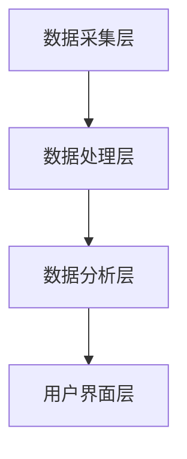

                 


# 价值投资中的智能工厂数字孪生系统分析

> 关键词：数字孪生系统、价值投资、智能工厂、制造业、数据建模、预测算法、系统架构

> 摘要：本文深入分析了数字孪生系统在价值投资中的应用，探讨了数字孪生系统的核心概念、算法原理、系统架构以及在智能工厂中的实际应用案例。通过详细的技术分析和案例解读，展示了数字孪生系统如何帮助投资者做出更明智的决策。

---

# 第1章: 数字孪生系统与价值投资概述

## 1.1 数字孪生系统的定义与特点

### 1.1.1 数字孪生系统的定义

数字孪生系统（Digital Twin）是一种通过物理实体的数字化模型，实时反映其状态、性能和过程的技术。它利用传感器、云计算、大数据和人工智能等技术，将物理世界与数字世界进行实时连接和交互。

### 1.1.2 数字孪生系统的核心特点

- **实时性**：能够实时采集和更新物理实体的数据。
- **数据驱动**：基于海量数据进行建模和分析。
- **可扩展性**：适用于不同规模和复杂度的系统。
- **智能化**：结合人工智能技术，实现预测和优化。

### 1.1.3 数字孪生系统与传统制造业的区别

传统制造业依赖人工经验进行决策，而数字孪生系统通过数据驱动的方式，提供更精准和高效的分析。

---

## 1.2 价值投资的基本原理

### 1.2.1 价值投资的定义

价值投资是一种投资策略，通过分析企业的基本面，寻找被市场低估的投资标的。

### 1.2.2 价值投资的核心原则

- **长期视角**：关注企业的长期价值。
- **安全边际**：寻找价格低于内在价值的企业。
- **优质企业**：选择具有竞争优势的企业。

### 1.2.3 价值投资在现代企业中的应用

价值投资广泛应用于股票投资、资产配置等领域。

---

## 1.3 数字孪生系统在价值投资中的应用前景

### 1.3.1 数字孪生系统在制造业中的潜在应用

- **生产优化**：通过实时监控和分析生产数据，优化生产流程。
- **预测维护**：通过预测设备故障，减少停机时间。
- **成本控制**：通过数据分析，降低生产成本。

### 1.3.2 价值投资与数字孪生系统的结合

- **数据驱动的决策**：利用数字孪生系统提供的实时数据和预测模型，辅助投资决策。
- **动态评估**：通过数字孪生系统的动态分析，评估企业的实际价值。

### 1.3.3 数字孪生系统在价值投资中的优势与挑战

- **优势**：提高分析效率，降低投资风险。
- **挑战**：数据质量和模型准确性的问题。

---

## 1.4 本章小结

本章介绍了数字孪生系统的核心概念和价值投资的基本原理，并探讨了两者结合的应用前景。数字孪生系统通过实时数据和智能化分析，为价值投资提供了新的工具和方法。

---

# 第2章: 数字孪生系统的数据流与建模

## 2.1 数字孪生系统的数据流分析

### 2.1.1 数据采集与处理流程

数据采集：通过传感器实时采集设备运行数据。

数据处理：对采集的数据进行清洗、转换和存储。

### 2.1.2 数据存储与管理

数据库设计：采用关系型数据库和非关系型数据库结合的方式。

数据管理：通过数据仓库进行存储和管理。

### 2.1.3 数据分析与建模

数据建模：基于机器学习算法进行数据分析。

---

## 2.2 数字孪生系统的建模原理

### 2.2.1 数据驱动的建模方法

- **监督学习**：基于已知数据进行预测。
- **无监督学习**：发现数据中的隐含模式。

### 2.2.2 模型的验证与优化

- **验证方法**：交叉验证、准确率、召回率。
- **优化方法**：超参数调优、模型融合。

### 2.2.3 模型的实时更新与维护

动态更新：根据实时数据不断优化模型。

---

## 2.3 价值投资中的数据特征提取

### 2.3.1 制造业数据的特征提取方法

- **时间序列特征**：设备运行状态、生产效率。
- **统计特征**：均值、方差、相关系数。

### 2.3.2 数据特征对价值投资的影响

- **设备利用率**：影响企业的生产能力。
- **生产成本**：影响企业的盈利能力。

### 2.3.3 数据特征的动态变化分析

通过动态分析，发现数据特征的变化趋势。

---

## 2.4 本章小结

本章详细介绍了数字孪生系统的数据流与建模方法，并探讨了数据特征在价值投资中的应用。数据特征的提取和分析是数字孪生系统的核心，也是价值投资的重要基础。

---

# 第3章: 数字孪生系统的预测算法

## 3.1 常见预测算法概述

### 3.1.1 线性回归

$$ y = \beta_0 + \beta_1x + \epsilon $$

### 3.1.2 支持向量机

### 3.1.3 随机森林

### 3.1.4 神经网络

$$ f(x) = \sigma(w_2 \cdot \sigma(w_1 x + b_1) + b_2) $$

---

## 3.2 价值投资中的预测模型构建

### 3.2.1 基于数字孪生系统的预测模型

- **输入数据**：设备运行数据、生产成本数据。
- **输出结果**：企业价值预测、投资建议。

### 3.2.2 模型的训练与优化

- **训练数据**：历史数据。
- **优化方法**：交叉验证、超参数调优。

### 3.2.3 模型的评估与验证

- **评估指标**：准确率、召回率、F1分数。

---

## 3.3 数学模型与公式

### 3.3.1 线性回归模型

$$ \text{预测值} = \beta_0 + \beta_1 \times \text{输入特征} + \epsilon $$

### 3.3.2 神经网络模型

$$ f(x) = \sigma(w_2 \cdot \sigma(w_1 x + b_1) + b_2) $$

---

## 3.4 本章小结

本章介绍了数字孪生系统中常用的预测算法，并构建了基于数字孪生系统的预测模型。通过数学公式和算法流程图，详细展示了预测模型的实现过程。

---

# 第4章: 数字孪生系统的系统架构与实现

## 4.1 系统架构概述

### 4.1.1 数据采集层

- **功能**：实时采集设备数据。
- **技术**：传感器、物联网技术。

### 4.1.2 数据处理层

- **功能**：数据清洗、转换。
- **技术**：数据流处理框架（如Flume）。

### 4.1.3 数据分析层

- **功能**：数据建模、预测。
- **技术**：机器学习框架（如TensorFlow）。

### 4.1.4 用户界面层

- **功能**：数据可视化、结果展示。
- **技术**：数据可视化工具（如Tableau）。

---

## 4.2 系统功能设计

### 4.2.1 数据采集与管理

- **模块功能**：采集、存储、管理数据。
- **实现技术**：数据库、数据仓库。

### 4.2.2 模型构建与优化

- **模块功能**：构建、优化预测模型。
- **实现技术**：机器学习算法、超参数调优。

### 4.2.3 预测与分析

- **模块功能**：进行预测分析，生成投资建议。
- **实现技术**：预测模型、数据可视化。

---

## 4.3 系统架构图（Mermaid）



---

## 4.4 本章小结

本章详细介绍了数字孪生系统的系统架构与实现方法。通过分层设计和功能模块化，确保了系统的高效性和可扩展性。

---

# 第5章: 数字孪生系统在价值投资中的应用案例

## 5.1 项目背景

### 5.1.1 项目背景介绍

某制造企业希望通过数字孪生系统优化生产流程，提高企业价值。

### 5.1.2 项目目标

构建数字孪生系统，进行生产优化和价值评估。

---

## 5.2 系统实现

### 5.2.1 数据采集与处理

- **传感器数据采集**：实时采集设备运行数据。
- **数据处理**：清洗、转换、存储。

### 5.2.2 模型构建与预测

- **模型构建**：基于历史数据构建预测模型。
- **模型预测**：预测设备故障、生产成本。

---

## 5.3 项目实战

### 5.3.1 环境配置

- **硬件**：高性能服务器。
- **软件**：Python、TensorFlow、Mermaid。

### 5.3.2 系统核心实现

```python
import numpy as np
from sklearn.linear_model import LinearRegression

# 示例代码：基于线性回归的生产成本预测
X = np.array([[1], [2], [3], [4], [5]])
y = np.array([1, 3, 5, 7, 9])
model = LinearRegression()
model.fit(X, y)
print(model.predict([[6]]))  # 输出：[[11]]
```

### 5.3.3 案例分析与结果解读

通过数字孪生系统，企业实现了生产成本的精准预测，优化了生产流程。

---

## 5.4 项目小结

本章通过实际案例展示了数字孪生系统在价值投资中的应用。通过系统实现和案例分析，验证了数字孪生系统的有效性和实用性。

---

## 5.5 本章小结

本章通过实际案例展示了数字孪生系统在价值投资中的应用。通过系统实现和案例分析，验证了数字孪生系统的有效性和实用性。

---

# 第6章: 数字孪生系统在价值投资中的最佳实践

## 6.1 小结

数字孪生系统为价值投资提供了新的工具和方法。

## 6.2 注意事项

- 数据质量：确保数据的准确性和完整性。
- 模型优化：不断优化预测模型。
- 技术选型：选择合适的技术和工具。

## 6.3 拓展阅读

- 数字孪生系统的最新研究。
- 人工智能在投资中的应用。

---

# 第7章: 结语

数字孪生系统与价值投资的结合，为制造业的智能化和数字化转型提供了新的方向。未来，随着技术的不断发展，数字孪生系统在价值投资中的应用将更加广泛和深入。

---

通过以上内容，我们详细分析了数字孪生系统在价值投资中的应用，从理论到实践，从系统架构到算法实现，为读者提供了一个全面的视角。

