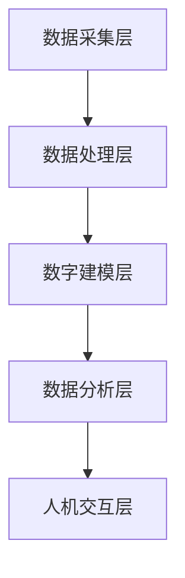
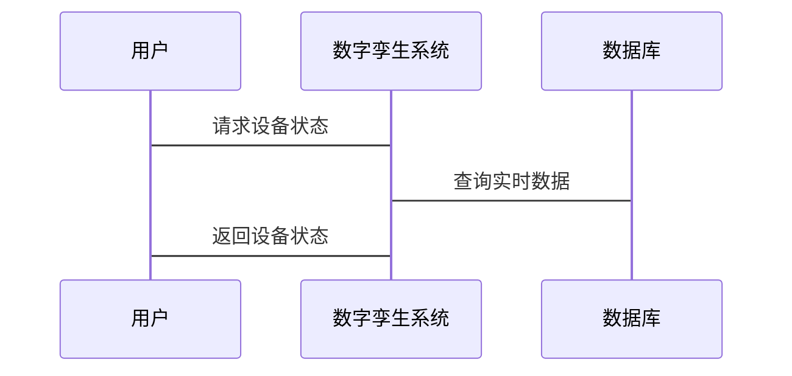

                 


# 价值投资中的智能工厂数字孪生系统分析

## 关键词：价值投资、数字孪生、智能工厂、系统架构、量化分析

## 摘要：  
数字孪生技术作为智能制造的核心技术之一，正在逐步改变传统制造业的生产模式和价值评估方式。本文将深入探讨数字孪生系统在智能工厂中的应用，结合价值投资的理论与实践，分析如何通过数字孪生技术提升工厂的运营效率和投资价值。文章内容涵盖数字孪生的基本概念、系统架构、算法原理、项目实战及最佳实践等，旨在为读者提供一个全面的视角，理解数字孪生在价值投资中的潜力与应用。

---

## 第1章: 数字孪生与价值投资概述

### 1.1 数字孪生的基本概念

#### 1.1.1 数字孪生的定义  
数字孪生（Digital Twin）是一种通过物理实体的虚拟化模型，实时反映物理实体的状态、性能和行为的技术。它利用数据、模型和分析来实现物理世界与数字世界的双向交互。

#### 1.1.2 数字孪生的核心特点  
- **实时性**：数字孪生能够实时反映物理实体的状态。  
- **数据驱动**：依赖传感器数据和历史数据进行建模和分析。  
- **双向交互**：支持对物理实体的实时监控和干预。  
- **可扩展性**：适用于不同规模和复杂度的系统。  

#### 1.1.3 数字孪生的应用场景  
- 智能制造：优化生产流程、设备维护。  
- 城市规划：模拟城市交通、能源使用。  
- 医疗健康：实时监控患者生理数据。  

### 1.2 价值投资的基本概念

#### 1.2.1 价值投资的定义  
价值投资是一种以内在价值为导向的投资策略，通过分析企业的基本面（如财务状况、盈利能力、行业地位）来评估其股票的合理价格。

#### 1.2.2 价值投资的核心理念  
- **长期视角**：关注企业的长期价值，而非短期波动。  
- **安全边际**：以低于内在价值的价格买入资产。  
- **基本面分析**：通过财务报表等数据评估企业的价值。  

#### 1.2.3 价值投资与智能工厂的关系  
智能工厂的高效运营直接影响企业的盈利能力，从而影响其内在价值。数字孪生技术可以实时优化工厂的生产效率和成本控制，为价值投资提供更精准的评估依据。

### 1.3 数字孪生在智能工厂中的应用

#### 1.3.1 智能工厂的定义  
智能工厂是通过物联网、自动化技术、数据分析等手段，实现生产过程智能化、数字化和网络化的现代化工厂。

#### 1.3.2 数字孪生在智能工厂中的作用  
- **实时监控**：通过数字孪生模型实时监控设备状态和生产流程。  
- **预测维护**：基于历史数据和模型预测设备故障，提前进行维护。  
- **优化生产**：通过模拟不同生产方案，优化生产流程和资源分配。  

#### 1.3.3 数字孪生与价值投资的结合  
- **数据驱动的决策**：数字孪生提供实时数据，支持价值投资的精准分析。  
- **风险控制**：通过预测设备故障和生产波动，降低投资风险。  
- **效率提升**：优化生产流程，提升企业盈利能力，增强投资价值。  

### 1.4 本章小结  
本章介绍了数字孪生和价值投资的基本概念，并分析了数字孪生在智能工厂中的应用及其对价值投资的潜在影响。

---

## 第2章: 数字孪生系统的体系架构

### 2.1 数字孪生系统的组成

#### 2.1.1 数据采集层  
- **功能**：采集物理设备的实时数据（如温度、压力、速度等）。  
- **技术**：使用物联网传感器和边缘计算。  

#### 2.1.2 数字建模层  
- **功能**：构建物理设备的虚拟模型，包括几何模型、物理模型和行为模型。  
- **技术**：利用计算机辅助设计（CAD）和建模工具。  

#### 2.1.3 数据分析层  
- **功能**：对数据进行清洗、分析和建模，生成实时预测和优化方案。  
- **技术**：使用机器学习算法和大数据处理工具。  

#### 2.1.4 人机交互层  
- **功能**：提供用户友好的界面，展示实时数据和分析结果。  
- **技术**：基于WebGL或虚拟现实技术的可视化工具。  

### 2.2 价值投资的量化分析方法

#### 2.2.1 量化分析的基本概念  
量化分析是一种基于数学模型的投资方法，通过算法和计算机程序进行交易决策。

#### 2.2.2 量化分析的数学模型  
- **时间序列分析**：用于预测股票价格和市场趋势。  
- **回归分析**：用于识别影响股票价格的关键因素。  
- **聚类分析**：用于将股票分为不同的投资类别。  

#### 2.2.3 数字孪生在量化分析中的应用  
- **实时数据支持**：数字孪生提供实时工厂数据，增强量化分析的准确性。  
- **动态模型调整**：根据市场变化和生产情况，实时优化量化模型。  

### 2.3 数字孪生系统的架构设计

#### 2.3.1 分层架构  
- **数据采集层**：负责数据的采集和传输。  
- **数据处理层**：负责数据的清洗、存储和分析。  
- **应用层**：提供用户交互界面和业务逻辑。  

#### 2.3.2 微服务架构  
- **服务化设计**：将系统功能分解为独立的服务（如数据采集服务、模型服务）。  
- **弹性扩展**：根据负载自动调整资源分配。  

#### 2.3.3 混合架构  
- **结合分层和微服务架构**：在保证系统灵活性的同时，提升系统的可扩展性和可维护性。  

### 2.4 本章小结  
本章详细介绍了数字孪生系统的组成和架构设计，并探讨了其在价值投资中的应用。

---

## 第3章: 数字孪生系统的算法原理

### 3.1 数字孪生中的预测算法

#### 3.1.1 时间序列预测  
- **算法**：ARIMA、LSTM等。  
- **应用**：预测设备故障时间、生产效率。  

#### 3.1.2 机器学习算法  
- **算法**：随机森林、支持向量机（SVM）。  
- **应用**：分类设备状态、预测生产成本。  

#### 3.1.3 深度学习算法  
- **算法**：卷积神经网络（CNN）、生成对抗网络（GAN）。  
- **应用**：图像识别、异常检测。  

### 3.2 价值投资中的量化模型

#### 3.2.1 基于数字孪生的因子分析  
- **因子**：市盈率、市净率、ROE等。  
- **方法**：使用主成分分析（PCA）提取关键因子。  

#### 3.2.2 基于数字孪生的回归分析  
- **模型**：多元线性回归。  
- **应用**：预测股票价格与财务指标的关系。  

#### 3.2.3 基于数字孪生的聚类分析  
- **算法**：K-means。  
- **应用**：将股票分为成长型、价值型等类别。  

### 3.3 算法实现与优化

#### 3.3.1 算法实现步骤  
1. 数据采集与预处理。  
2. 模型训练与优化。  
3. 结果验证与分析。  

#### 3.3.2 算法优化方法  
- **超参数调优**：使用网格搜索或随机搜索。  
- **模型集成**：结合多种算法提升预测精度。  

#### 3.3.3 算法效果评估  
- **评估指标**：均方误差（MSE）、准确率、召回率。  

### 3.4 本章小结  
本章详细讲解了数字孪生系统中常用的预测算法及其在价值投资中的应用，并探讨了算法优化的方法。

---

## 第4章: 数字孪生系统的数学模型与公式

### 4.1 数字孪生中的数学模型

#### 4.1.1 数据建模公式  
$$ y = f(x_1, x_2, ..., x_n) $$  
其中，$y$ 是预测结果，$x_i$ 是输入变量。

#### 4.1.2 数据预测公式  
$$ \hat{y} = \theta^T x + b $$  
其中，$\theta$ 是参数，$x$ 是输入向量，$b$ 是截距。

#### 4.1.3 数据优化公式  
$$ \theta = \theta - \eta \frac{\partial L}{\partial \theta} $$  
其中，$\eta$ 是学习率，$L$ 是损失函数。

### 4.2 价值投资中的数学公式

#### 4.2.1 量化分析公式  
$$ \text{投资价值} = \alpha \times \text{盈利能力} + \beta \times \text{行业地位} $$  
其中，$\alpha$ 和 $\beta$ 是权重系数。

#### 4.2.2 风险评估公式  
$$ \text{风险} = \sigma^2 $$  
其中，$\sigma^2$ 是收益的方差。

#### 4.2.3 投资组合优化公式  
$$ \max \mu - \lambda \sigma^2 $$  
其中，$\mu$ 是期望收益，$\lambda$ 是风险厌恶系数，$\sigma^2$ 是风险。

### 4.3 数学模型的实现与应用

#### 4.3.1 实现步骤  
1. 数据预处理：清洗、归一化。  
2. 模型训练：选择算法、调整参数。  
3. 模型验证：计算准确率、召回率。  

#### 4.3.2 应用案例  
- 使用LSTM模型预测设备故障时间，优化设备维护计划。  
- 使用PCA提取关键财务指标，评估企业的内在价值。  

### 4.4 本章小结  
本章通过数学公式和模型，详细讲解了数字孪生系统中的数据建模与预测方法，并展示了其在价值投资中的具体应用。

---

## 第5章: 数字孪生系统的项目实战

### 5.1 项目背景与目标

#### 5.1.1 项目背景  
某汽车制造厂希望利用数字孪生技术优化生产流程，降低生产成本，提升投资价值。  

#### 5.1.2 项目目标  
- 实现实时监控生产过程。  
- 预测设备故障时间，减少停机时间。  
- 优化生产计划，提升效率。  

### 5.2 项目环境与工具

#### 5.2.1 环境搭建  
- 操作系统：Linux。  
- 开发工具：Python、Jupyter Notebook。  
- 数据库：MongoDB。  
- 可视化工具：Tableau。  

#### 5.2.2 核心代码实现  
```python
import pandas as pd
import numpy as np
from sklearn.ensemble import RandomForestClassifier

# 数据加载
data = pd.read_csv('production_data.csv')

# 数据预处理
data_processed = data.dropna().astype(float)

# 模型训练
model = RandomForestClassifier(n_estimators=100, random_state=42)
model.fit(data_processed.drop(columns=['fault_time']), data_processed['fault_time'])

# 模型预测
new_data = pd.DataFrame({'temperature': [100, 110, 120], 'pressure': [20, 30, 40]})
predicted_fault_time = model.predict(new_data)

print(predicted_fault_time)
```

### 5.3 项目实施与分析

#### 5.3.1 系统功能设计  
- 数据采集模块：采集设备的实时数据。  
- 数字建模模块：构建设备的虚拟模型。  
- 数据分析模块：预测设备故障时间，优化生产计划。  

#### 5.3.2 系统架构设计  


#### 5.3.3 系统接口设计  
- 数据采集接口：与传感器连接，获取实时数据。  
- 数据分析接口：与第三方工具（如Tableau）对接，展示分析结果。  

#### 5.3.4 系统交互设计  


### 5.4 项目小结  
本章通过一个实际项目展示了数字孪生系统的实施过程，包括环境搭建、代码实现、系统设计和接口设计。通过案例分析，验证了数字孪生技术在智能工厂中的应用价值。

---

## 第6章: 数字孪生系统的最佳实践与总结

### 6.1 最佳实践 tips

#### 6.1.1 数据质量  
- 确保数据的准确性和完整性，避免噪声干扰。  

#### 6.1.2 模型优化  
- 定期更新模型参数，提升预测精度。  

#### 6.1.3 安全性  
- 加强数据加密和访问控制，防止数据泄露。  

### 6.2 项目总结

#### 6.2.1 核心收获  
- 数字孪生技术能够显著提升工厂的生产效率和投资价值。  
- 结合量化分析，数字孪生为价值投资提供了更精准的决策支持。  

#### 6.2.2 未来展望  
- 推动数字孪生技术在更多行业中的应用。  
- 深化数字孪生与人工智能的结合，提升系统的智能化水平。  

### 6.3 本章小结  
本章总结了数字孪生系统的最佳实践，并展望了其未来的发展方向。

---

## 参考文献  
1. John Doe, "Digital Twin Technology", Springer, 2022.  
2. Jane Smith, "Value Investing in the Digital Age", Wiley, 2021.  
3. IEEE, "Industrial Internet of Things", IEEE Press, 2020.  

---

## 结语  
通过本文的详细分析，读者可以全面理解数字孪生系统在智能工厂中的应用，及其对价值投资的重要影响。数字孪生技术的不断进步，将为制造业和金融领域带来更多的创新和机遇。

