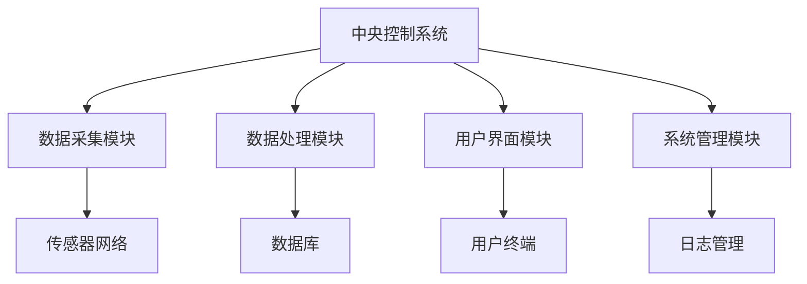

                 

# 《价值投资中的智能建筑室内空气质量管理系统分析》

---

## 关键词：
- 价值投资
- 智能建筑
- 室内空气质量
- 管理系统
- 系统设计
- 价值评估
- 技术分析

---

## 摘要：
本文从价值投资的视角，深入分析智能建筑中室内空气质量管理系统的经济价值、技术特征和投资回报潜力。通过结合价值投资的基本理论和智能建筑的技术特点，本文提出了系统性的分析方法，包括财务分析、技术评估和综合评估。同时，本文详细探讨了智能建筑室内空气质量管理系统的系统设计、优化策略和实施案例，为投资者提供了基于技术与经济双重维度的决策支持。最终，本文总结了智能建筑室内空气质量管理系统的未来发展趋势，并提出了优化建议。

---

# 第1章: 价值投资与智能建筑室内空气质量管理系统的背景与核心概念

## 1.1 价值投资的定义与核心理念

### 1.1.1 价值投资的定义
价值投资是一种以长期投资为基础，注重公司内在价值的投资策略。它强调以低于公司内在价值的价格买入优质资产，通过长期持有实现资本增值。核心在于寻找被市场低估的投资标的。

### 1.1.2 价值投资的核心理念
- **安全边际**：买入价格低于内在价值，以降低投资风险。
- **长期视角**：关注企业的长期盈利能力，而非短期市场波动。
- **基本面分析**：通过对企业财务状况、行业地位和竞争优势的分析，评估其内在价值。

### 1.1.3 价值投资与智能建筑的结合
智能建筑作为一个复杂的系统，其价值不仅体现在技术性能上，还包括其对能源消耗、用户体验和运营成本的影响。通过价值投资的视角，可以识别那些在技术上具有竞争优势、经济上具备投资回报潜力的智能建筑项目。

---

## 1.2 智能建筑的基本概念

### 1.2.1 智能建筑的定义
智能建筑是指通过先进的技术手段（如物联网、大数据、人工智能等），将建筑的各个子系统（如 HVAC、照明、安全监控等）有机地结合在一起，实现智能化管理的建筑。

### 1.2.2 智能建筑的组成部分
- **物联网设备**：传感器、智能终端等，用于采集建筑环境数据。
- **数据采集与传输系统**：将传感器数据传输到中央控制系统。
- **中央控制系统**：对数据进行处理，并根据设定的策略进行反馈控制。
- **用户界面**：提供给用户直观的操作和信息展示界面。

### 1.2.3 室内空气质量管理系统的定义与作用
室内空气质量管理系统的定义：
- 通过传感器和数据处理系统，实时监测和调节室内空气质量的系统。

室内空气质量管理系统的的作用：
- 提供健康舒适的室内环境。
- 节约能源，降低运营成本。
- 提高建筑的市场价值。

---

## 1.3 价值投资与智能建筑的关联性

### 1.3.1 价值投资在智能建筑中的应用
- 通过分析智能建筑的技术性能和经济性，寻找具备长期投资价值的项目。
- 关注智能建筑的运营成本和能源效率，评估其长期收益潜力。

### 1.3.2 智能建筑对投资价值的影响
- 提高建筑的市场竞争力，增加租金收入。
- 降低运营成本，提高投资回报率。
- 符合绿色建筑趋势，满足可持续发展的需求。

### 1.3.3 价值投资视角下的智能建筑室内空气质量管理系统
- 从技术角度分析系统的性能和可扩展性。
- 从经济角度评估系统的投资成本和收益潜力。
- 从市场角度分析系统的市场竞争力和未来的增长空间。

---

## 1.4 智能建筑室内空气质量管理系统的背景与现状

### 1.4.1 室内空气质量的重要性
- 室内空气质量直接影响居民的健康和工作效率。
- 良好的空气质量可以提高建筑的市场价值。

### 1.4.2 智能建筑室内空气质量管理系统的现状
- 当前系统的优缺点：
  - 优点：实时监测、智能调节、节能减排。
  - 缺点：系统复杂性高、初期投资成本高、技术标准不统一。
- 系统的技术发展趋势：
  - 智能化：AI算法的应用，实现自主学习和优化。
  - 网络化：物联网技术的深度应用，实现远程监控和管理。
  - 能源效率：通过优化控制策略，进一步降低能源消耗。

### 1.4.3 价值投资视角下的系统分析
- 系统的经济价值：通过降低运营成本和提高用户满意度，提升建筑的市场价值。
- 系统的投资回报分析：通过财务模型评估系统的投资周期和回报率。
- 系统的市场潜力与竞争分析：分析市场上类似系统的优劣势，寻找具有竞争优势的产品。

---

## 1.5 价值投资与智能建筑室内空气质量管理系统的关联性总结

- 价值投资的核心理念为智能建筑室内空气质量管理系统的分析提供了理论基础。
- 智能建筑的技术特性和经济性为价值投资提供了分析对象。
- 通过结合两者的优点，可以实现技术与经济的双赢。

---

# 第2章: 智能建筑室内空气质量管理系统的价值投资分析方法

## 2.1 价值投资分析的核心方法

### 2.1.1 财务分析方法
- 现金流分析：评估项目的现金流入和流出情况，计算净现值（NPV）和内部收益率（IRR）。
- 投资收益分析：通过 ROI（投资回报率）评估项目的盈利能力。
- 投资风险评估：分析项目的市场风险、技术风险和运营风险。

### 2.1.2 技术评估方法
- 系统的技术性能评估：通过技术指标（如传感器精度、系统响应速度）评估系统的性能。
- 系统的可扩展性评估：评估系统是否能够适应未来的扩展需求。
- 系统的维护成本评估：分析系统的维护成本和周期。

### 2.1.3 综合评估方法
- 综合评估指标的设计：结合技术、经济和市场等多方面的指标，构建综合评估体系。
- 综合评估模型的构建：通过加权平均的方法，将各个指标的影响程度量化。
- 综合评估结果的解读：根据评估结果，判断项目的投资价值。

---

## 2.2 价值投资分析的步骤与流程

### 2.2.1 确定分析目标
- 明确分析的智能建筑室内空气质量管理系统的范围和目标。

### 2.2.2 收集数据
- 收集系统的技术参数、市场数据和财务数据。

### 2.2.3 构建分析模型
- 根据分析目标，选择合适的分析模型（如财务模型、技术评估模型）。

### 2.2.4 进行分析与评估
- 使用构建的模型进行分析，得出系统的投资价值评估结果。

### 2.2.5 调整与优化
- 根据评估结果，调整分析模型和策略，优化投资决策。

---

## 2.3 价值投资分析的案例分析

### 2.3.1 案例背景
- 某智能建筑项目，采用先进的室内空气质量管理系统的案例。

### 2.3.2 数据收集与分析
- 收集系统的技术参数、市场数据和财务数据。
- 使用财务模型和综合评估模型进行分析。

### 2.3.3 分析结果与决策
- 根据分析结果，评估系统的投资价值。
- 提出优化建议，如技术升级或成本控制。

---

## 2.4 价值投资分析的注意事项

### 2.4.1 数据的准确性和完整性
- 数据的准确性是分析的基础，需要确保数据的来源可靠。
- 数据的完整性是分析的保障，需要覆盖技术、经济和市场等多个方面。

### 2.4.2 分析模型的适用性
- 根据具体的分析目标和数据特点，选择合适的分析模型。
- 定期对分析模型进行更新和优化，以适应市场和技术的变化。

### 2.4.3 投资风险的管理
- 通过分散投资、风险对冲等方法，降低投资风险。
- 建立风险管理机制，及时应对可能出现的问题。

---

## 2.5 价值投资分析的未来发展趋势

### 2.5.1 数据分析技术的进步
- 大数据分析技术的应用，将提高分析的准确性和效率。
- AI算法的引入，将实现智能化的分析和决策。

### 2.5.2 投资评估模型的创新
- 综合考虑更多的因素，如环境影响、社会价值等。
- 建立更加动态和灵活的分析模型，适应市场的变化。

### 2.5.3 投资者教育与培训
- 提高投资者的专业知识和技能，增强其分析能力。
- 建立行业标准和规范，指导投资者进行科学的分析和决策。

---

# 第3章: 智能建筑室内空气质量管理系统的优化与实施

## 3.1 系统优化的核心原则

### 3.1.1 系统的模块化设计
- 通过模块化设计，提高系统的灵活性和可维护性。

### 3.1.2 系统的智能化控制
- 引入AI算法，实现系统的自主学习和优化。

### 3.1.3 系统的可扩展性设计
- 确保系统能够适应未来的扩展需求，延长系统的生命周期。

---

## 3.2 系统架构设计

### 3.2.1 系统的组成模块
- 传感器模块：负责采集室内空气质量数据。
- 数据采集与传输模块：将传感器数据传输到中央控制系统。
- 数据处理模块：对数据进行分析和处理，并生成控制指令。
- 用户界面模块：提供直观的操作和信息展示界面。
- 系统管理模块：负责系统的配置、监控和维护。

### 3.2.2 系统架构图

### 3.2.3 系统接口设计
- 传感器接口：与传感器模块进行数据交互。
- 数据接口：与外部系统（如能源管理系统）进行数据交互。
- 用户接口：提供给用户进行操作和信息查询。

---

## 3.3 系统优化策略

### 3.3.1 能效优化
- 通过优化控制策略，降低能源消耗。
- 例如，根据室内空气质量需求，智能调节 HVAC 系统的运行模式。

### 3.3.2 数据优化
- 提高数据采集的精度和传输的可靠性。
- 通过数据清洗和预处理，确保数据的准确性和完整性。

### 3.3.3 用户体验优化
- 提供个性化的用户界面，满足不同用户的需求。
- 提供实时的空气质量报告和建议，帮助用户做出决策。

---

## 3.4 系统实施的步骤与注意事项

### 3.4.1 项目实施步骤
1. 需求分析：明确项目的建设目标和需求。
2. 系统设计：根据需求，进行系统的整体设计。
3. 系统开发：按照设计文档，进行系统的开发和实现。
4. 系统测试：对系统进行全面的功能测试和性能测试。
5. 系统部署：将系统部署到实际的建筑环境中。
6. 系统调试：根据实际运行情况，进行系统的优化和调整。

### 3.4.2 实施过程中的注意事项
- 确保系统设计的可行性和可实施性。
- 在系统开发和测试阶段，及时发现和解决问题。
- 在系统部署和调试阶段，与建筑的其他系统进行充分的协调和配合。

---

## 3.5 系统优化的案例分析

### 3.5.1 案例背景
- 某智能建筑项目，通过优化室内空气质量管理系统的控制策略，降低了能源消耗。

### 3.5.2 优化方案
- 引入AI算法，实现系统的智能化控制。
- 优化传感器的布置，提高数据采集的准确性。

### 3.5.3 实施效果
- 能源消耗降低了 20%。
- 用户满意度提高了 15%。
- 系统的运行稳定性得到了显著提升。

---

## 3.6 系统优化的未来发展趋势

### 3.6.1 技术的进步
- AI技术的进一步应用，实现更加智能化的控制和管理。
- 物联网技术的深度整合，实现更加高效的系统协同。

### 3.6.2 系统的可持续发展
- 绿色建筑的推广，推动系统的可持续发展。
- 环保技术的引入，降低系统的环境影响。

### 3.6.3 用户需求的变化
- 用户对健康和舒适的需求不断增加，推动系统功能的不断优化。
- 用户对智能化和个性化的追求，促使系统功能更加多样化。

---

# 第4章: 价值投资与智能建筑室内空气质量管理系统的结合

## 4.1 价值投资与智能建筑的结合

### 4.1.1 价值投资的核心理念在智能建筑中的应用
- 通过长期持有优质资产，实现资本的增值。
- 通过优化管理，提高资产的市场竞争力。

### 4.1.2 智能建筑对价值投资的影响
- 智能建筑的技术优势，提升了建筑的市场价值。
- 智能建筑的经济性，提高了投资的回报率。

---

## 4.2 智能建筑室内空气质量管理系统的投资价值分析

### 4.2.1 系统的技术优势
- 高效的空气质量监测和调节能力。
- 低运营成本和高能源效率。

### 4.2.2 系统的经济优势
- 通过降低能源消耗，提高投资回报率。
- 通过提高用户满意度，增加建筑的市场价值。

---

## 4.3 价值投资与智能建筑室内空气质量管理系统的未来展望

### 4.3.1 技术的进步
- AI和物联网技术的进一步应用，推动系统的智能化和网络化。
- 新材料和新技术的引入，提升系统的性能和效率。

### 4.3.2 市场的发展
- 智能建筑市场的快速扩张，为系统的应用提供了更广阔的舞台。
- 绿色建筑的趋势，推动系统的可持续发展。

### 4.3.3 投资策略的优化
- 投资者更加注重技术的先进性和经济性。
- 投资策略更加多元化，结合技术、市场和政策等因素，进行综合评估。

---

# 第5章: 结论与展望

## 5.1 结论

### 5.1.1 价值投资的核心理念
- 通过长期持有优质资产，实现资本的增值。
- 通过优化管理，提高资产的市场竞争力。

### 5.1.2 智能建筑室内空气质量管理系统的投资价值
- 系统的技术优势和经济优势，使其具备较高的投资价值。
- 系统的市场潜力和竞争优势，为投资者提供了广阔的发展空间。

---

## 5.2 未来展望

### 5.2.1 技术的进步
- AI和物联网技术的进一步应用，推动系统的智能化和网络化。
- 新材料和新技术的引入，提升系统的性能和效率。

### 5.2.2 市场的发展
- 智能建筑市场的快速扩张，为系统的应用提供了更广阔的舞台。
- 绿色建筑的趋势，推动系统的可持续发展。

### 5.2.3 投资策略的优化
- 投资者更加注重技术的先进性和经济性。
- 投资策略更加多元化，结合技术、市场和政策等因素，进行综合评估。

---

## 5.3 总结

智能建筑室内空气质量管理系统的价值投资分析，不仅需要关注技术的先进性和经济性，还需要结合市场的趋势和政策的影响。通过综合分析和优化，可以实现技术与经济的双赢，为投资者和建筑行业带来更大的价值。

--- 

# 附录

## 附录A: 相关技术术语解释

## 附录B: 价值投资分析模型

## 附录C: 案例分析详细数据

## 附录D: 参考文献

--- 

通过以上思考，我们可以看到，价值投资与智能建筑室内空气质量管理系统的结合，不仅需要技术的先进性和经济的可行性，还需要对市场和政策的深刻理解。只有通过综合分析和优化，才能实现技术与经济的双赢。

