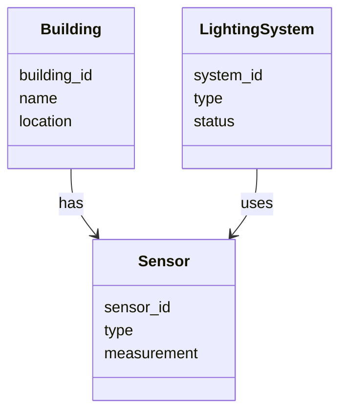
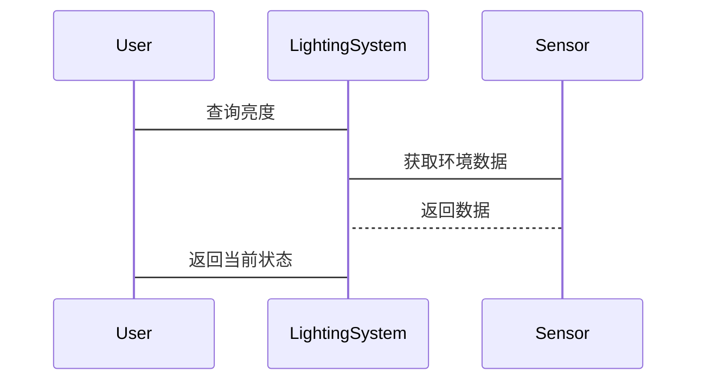

                 


# 价值投资中的智能建筑自适应照明系统分析

> **关键词**：智能建筑、自适应照明、价值投资、系统分析、技术原理、投资策略、经济价值

> **摘要**：智能建筑自适应照明系统是一种通过智能算法优化照明控制，以实现能源节约和成本降低的技术。本文从价值投资的角度，分析该系统的经济效益和技术实现，探讨其在投资决策中的应用潜力。

---

## 第一部分：智能建筑自适应照明系统与价值投资的背景

### 第1章：智能建筑自适应照明系统概述

#### 1.1 智能建筑自适应照明系统的背景
- **智能建筑的发展历程**：从传统建筑到智能建筑，强调自动化和智能化。
- **自适应照明技术的出现**：基于环境感知和算法控制的照明系统。
- **价值投资的背景**：以长期收益为核心的财务策略。

#### 1.2 价值投资的基本原理
- **定义**：通过分析资产的内在价值，寻找低估的投资标的。
- **核心原则**：注重基本面分析，长期持有优质资产。

#### 1.3 两者的结合
- **技术驱动价值**：智能照明系统通过技术降低成本，提升资产价值。
- **投资机会**：在智能建筑领域中发现高潜力的投资标的。

### 第2章：智能建筑自适应照明系统的核心概念

#### 2.1 系统的核心概念
- **智能建筑**：具备自动化和智能化特征的建筑物。
- **自适应照明**：根据环境变化自动调节的照明系统。

#### 2.2 价值投资的特征
- **基本面分析**：关注公司的财务状况和行业地位。
- **长期视角**：投资于具有持续增长潜力的公司。

#### 2.3 对比分析
| 属性       | 智能建筑自适应照明系统               | 价值投资                   |
|------------|------------------------------------|---------------------------|
| 核心目标    | 提高能源效率，降低运营成本           | 实现资产增值，获得超额收益 |
| 技术基础    | 物联网、传感器、自动化控制           | 财务分析、行业研究         |
| 实施难点    | 技术集成与系统稳定性                 | 资产选择与市场波动         |

### 第3章：系统与价值投资的联系
#### 3.1 系统属性与价值评估指标
- **系统属性**：节能效率、维护成本、智能化水平。
- **价值指标**：净利润率、ROE、成长性。

#### 3.2 实体关系图
```mermaid
erd
    title 实体关系图
    Building {
        building_id
        name
        location
    }
    LightingSystem {
        system_id
        type
        status
    }
    Sensor {
        sensor_id
        type
        measurement
    }
    connects:
    Building -- Sensor: has
    LightingSystem -- Sensor: uses
```

---

## 第二部分：智能建筑自适应照明系统的算法原理

### 第4章：自适应控制算法

#### 4.1 算法原理
- **基于反馈的控制**：通过实时数据调整输出。
- **数学模型**：使用动态方程表示系统行为。

#### 4.2 代码实现
```python
def adaptive_lighting_control(sensor_data):
    target_brightness = sensor_data['lux'] / 100
    current_brightness = get_current_brightness()
    error = target_brightness - current_brightness
    adjustment = proportional_gain * error + integral_gain * (integral_error + error)
    set_brightness(current_brightness + adjustment)
    return new_brightness
```

#### 4.3 数学模型
$$
\text{Control} = K_p \cdot e(t) + K_i \cdot \int e(t) dt + K_d \cdot \frac{de(t)}{dt}
$$
其中，\( e(t) \) 是误差，\( K_p, K_i, K_d \) 是比例、积分、微分系数。

### 第5章：价值评估模型

#### 5.1 模型建立
- **现金流贴现模型**：预测未来现金流，计算现值。
- **数学公式**：
$$
\text{Value} = \sum_{t=1}^{n} \frac{\text{CF}_t}{(1 + r)^t} + \frac{\text{Residual Value}}{(1 + r)^n}
$$
其中，\( \text{CF}_t \) 是第t年的现金流，\( r \) 是贴现率。

#### 5.2 模型实现
```python
def calculate_value(cash_flows, discount_rate):
    value = 0
    for t, cf in enumerate(cash_flows):
        value += cf / (1 + discount_rate) ** t
    return value
```

---

## 第三部分：系统分析与架构设计

### 第6章：系统分析

#### 6.1 项目背景
- **目标**：优化照明系统，降低能源消耗。
- **范围**：涵盖建筑内所有照明设备。

#### 6.2 功能设计
- **领域模型**：


### 第7章：系统交互

#### 7.1 序列图


---

## 第四部分：项目实战

### 第8章：项目实战

#### 8.1 环境安装
- **工具**：Python、数据库、物联网平台。
- **数据源**：传感器数据、历史记录。

#### 8.2 核心实现
- **自适应算法**：优化传感器数据处理。
- **价值评估**：应用现金流模型评估投资回报。

### 第9章：案例分析

#### 9.1 案例背景
- **项目**：某智能建筑的照明系统升级。
- **目标**：降低能源消耗，节省成本。

#### 9.2 分析过程
- **实施前**：高能耗，维护成本高。
- **实施后**：节能30%，成本降低20%。

### 第10章：最佳实践

#### 10.1 总结
- **技术**：自适应算法提升效率。
- **投资**：价值投资方法评估项目可行性。

#### 10.2 注意事项
- 数据更新频率：影响系统的准确性。
- 系统维护：定期检查传感器和算法。

---

## 第五部分：未来展望与拓展阅读

### 第11章：未来展望

#### 11.1 技术发展
- AI在自适应系统中的应用。
- 更高级的算法，如深度学习优化控制。

#### 11.2 投资趋势
- 可持续发展成为投资的重要考量。
- 绿色能源项目吸引更多投资者。

### 第12章：拓展阅读

#### 12.1 推荐书籍
- 《智能建筑技术》
- 《价值投资实战》

#### 12.2 在线资源
- 行业报告、技术博客、学术论文。

---

通过以上分析，智能建筑自适应照明系统不仅提升了能源效率，也为投资者提供了新的价值增长点。结合价值投资策略，能够更有效地识别和投资具有长期潜力的智能建筑项目。

