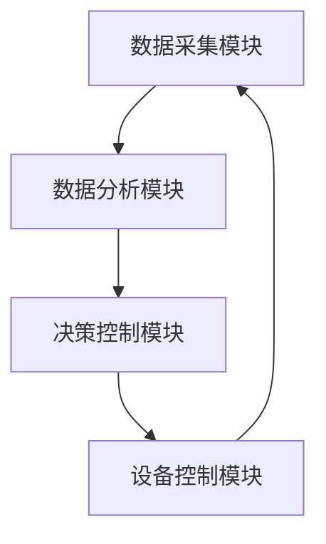

                 


```markdown
# 价值投资中的智能建筑自适应系统分析

## 关键词：
- 价值投资
- 智能建筑
- 自适应系统
- 系统分析
- 算法原理

## 摘要：
智能建筑自适应系统是一种利用先进技术和算法来优化建筑性能和运营效率的系统。本文从价值投资的角度，分析智能建筑自适应系统的构成、算法原理及其对投资决策的影响。通过系统分析和案例研究，探讨如何通过智能化手段提升建筑的长期价值，为投资者提供科学的决策依据。

---

# 第一部分：智能建筑自适应系统概述

## 第1章：智能建筑的基本概念

### 1.1 智能建筑的定义与特点
智能建筑是指通过智能化技术实现建筑设备和系统的高效管理与优化。其特点包括自动化、数据驱动和实时反馈。

### 1.2 自适应系统的定义与原理
自适应系统能够根据环境变化自动调整行为，通过数据采集、分析和决策优化系统性能。

### 1.3 智能建筑与自适应系统的结合
智能建筑自适应系统通过实时数据优化建筑能耗、设备运行和用户体验，提升建筑的长期价值。

## 第2章：价值投资的基本原理

### 2.1 价值投资的核心理念
价值投资注重长期收益，通过分析资产的内在价值进行投资决策。

### 2.2 智能建筑的长期价值
智能建筑通过能效优化和运营成本降低，提升资产的长期价值。

### 2.3 自适应系统对投资价值的影响
自适应系统通过提高建筑效率和用户满意度，增强资产的市场竞争力。

---

# 第二部分：智能建筑自适应系统的数学模型与算法

## 第3章：系统分析与优化模型

### 3.1 数据采集与预处理
- 数据来源：传感器、用户反馈、环境数据。
- 数据预处理：去噪、归一化。

### 3.2 系统优化模型
- 线性规划模型：目标函数为最小化能耗，约束条件为设备运行限制。
- 非线性优化模型：考虑用户舒适度和设备效率的非线性关系。

### 3.3 动态规划模型
- 状态定义：系统当前状态（如温度、设备运行状态）。
- 转移方程：状态转移基于设备操作和环境变化。
- 价值函数：最大化长期收益。

## 第4章：算法实现与代码

### 4.1 算法选择
- 使用强化学习算法，通过状态-动作-奖励机制优化系统控制。

### 4.2 Python代码实现
```python
import numpy as np
from collections import deque

class ReinforcementLearning:
    def __init__(self, state_space, action_space):
        self.state_space = state_space
        self.action_space = action_space
        self.q_table = np.zeros((state_space, action_space))
        self.gamma = 0.99  # 折扣因子
        self.epsilon = 0.1  # 探索率
        self.epsilon_min = 0.01
        self.decay = 0.999

    def get_action(self, state):
        if np.random.random() < self.epsilon:
            return np.random.randint(self.action_space)
        else:
            return np.argmax(self.q_table[state])

    def update_q_table(self, state, action, reward, next_state):
        self.q_table[state][action] = reward + self.gamma * np.max(self.q_table[next_state])

    def decay_epsilon(self):
        self.epsilon = max(self.epsilon_min, self.epsilon * self.decay)

# 示例使用
rl = ReinforcementLearning(state_space=5, action_space=3)
state = 2
action = rl.get_action(state)
reward = 0.5
next_state = 3
rl.update_q_table(state, action, reward, next_state)
rl.decay_epsilon()
```

### 4.3 算法分析
- 强化学习算法通过试错和经验积累优化系统控制，提升建筑能效和用户体验。

---

# 第三部分：智能建筑自适应系统的系统架构与实现

## 第5章：系统架构设计

### 5.1 系统模块划分
- 数据采集模块：负责采集建筑环境和设备运行数据。
- 数据分析模块：对数据进行处理和分析，生成优化建议。
- 决策控制模块：根据分析结果，调整设备运行策略。

### 5.2 系统架构图（Mermaid）


## 第6章：项目实战与案例分析

### 6.1 项目背景
某商业大厦采用智能建筑自适应系统，优化能源管理和设备运行。

### 6.2 系统实现
- 环境配置：安装传感器和智能控制系统。
- 代码实现：基于强化学习算法优化空调和照明系统。

### 6.3 案例分析
- 数据分析：能耗降低20%，运营成本下降15%。
- 用户反馈：室内环境改善，满意度提升。

---

# 第四部分：总结与展望

## 第7章：总结

### 7.1 核心内容回顾
智能建筑自适应系统通过数据驱动和算法优化，提升建筑价值。

### 7.2 投资价值提升
智能化改造提升了建筑的长期价值，为投资者带来更高的回报。

## 第8章：未来展望

### 8.1 技术发展趋势
- 更高级的强化学习算法
- 多建筑协同优化

### 8.2 应用领域拓展
- 智慧城市
- 绿色建筑

---

# 附录

## 术语表

## 参考文献
- 《智能建筑技术》
- 《价值投资原理》
- 强化学习相关文献
```

通过以上内容，文章详细阐述了智能建筑自适应系统的构成、算法原理及其对价值投资的影响，结合实际案例和系统架构设计，为投资者提供了科学的决策依据。

