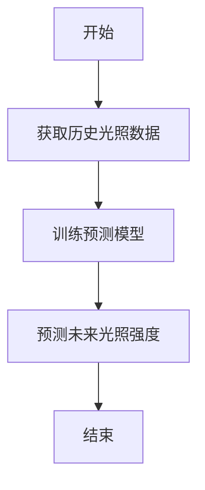
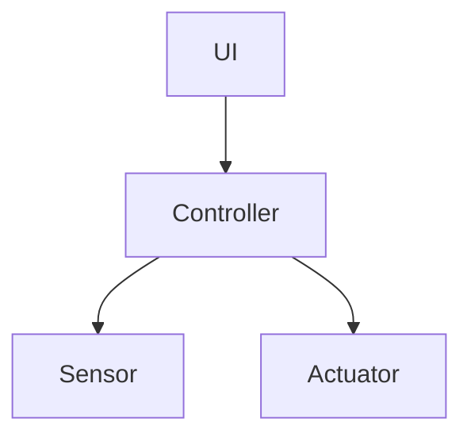

                 


# 价值投资中的智能建筑自适应遮阳系统分析

## 关键词：智能建筑，自适应遮阳系统，价值投资，算法原理，数学模型，系统架构

## 摘要：智能建筑自适应遮阳系统是一种通过智能化技术调节遮阳的系统，本文从价值投资的角度分析其技术原理、市场潜力和投资策略。通过算法和数学模型，探讨系统的优化方法，并结合实际案例，为投资者提供决策支持。

---

## 第一部分：背景介绍

### 第1章：智能建筑自适应遮阳系统概述

#### 1.1 问题背景
- **建筑节能的重要性**：随着能源危机加剧，建筑节能成为全球关注的焦点。遮阳系统在降低能耗方面起着关键作用。
- **遮阳系统的作用**：通过调节太阳辐射，减少空调使用，降低建筑能耗。
- **智能化技术的应用趋势**：物联网、AI等技术推动建筑系统智能化，提升效率和舒适度。

#### 1.2 问题描述
- **遮阳系统的基本功能**：阻挡阳光，调节室内温度和光线。
- **智能化遮阳系统的定义**：利用传感器和智能算法，自动调节遮阳设备。
- **市场需求与挑战**：市场需求增长，但技术复杂性和高成本限制了普及。

#### 1.3 问题解决
- **智能遮阳系统的优势**：能显著降低能耗，提高舒适度。
- **价值投资的驱动因素**：技术进步和政策支持推动市场增长。
- **技术与市场的结合**：通过技术创新降低 costs，提升 market share。

#### 1.4 系统边界与外延
- **系统组成部分**：传感器、控制器、执行机构、通信模块。
- **与其他系统接口**：与 HVAC、照明系统等联动，提升整体能效。
- **技术扩展性**：可集成更多功能，如光伏遮阳板，进一步提高能源效率。

#### 1.5 概念结构与核心要素
- **核心要素**：智能传感器、AI 控制算法、电动遮阳设备。
- **系统架构图**：展示各模块的连接和数据流。
- **功能模块分解**：传感器采集数据，算法处理，执行机构响应。

---

## 第二部分：核心概念与联系

### 第2章：智能遮阳系统的核心原理

#### 2.1 系统组成与功能
- **传感器模块**：光照强度、温度、湿度传感器，采集环境数据。
- **控制模块**：AI 算法处理数据，制定遮阳策略。
- **执行机构**：电动遮阳帘、百叶窗，根据指令调整角度。

#### 2.2 工作原理分析
- **光照强度检测**：传感器实时监测光照，AI算法预测变化。
- **系统反馈机制**：动态调整遮阳设备，维持室内环境稳定。
- **自适应调节过程**：根据天气、时间等因素，优化遮阳策略。

#### 2.3 核心概念对比表
| 特性      | 智能遮阳系统         | 传统遮阳系统         |
|-----------|--------------------|---------------------|
| 自动调节   | 是                 | 否                 |
| 能耗效率   | 低                 | 高                 |
| 适应性     | 高                 | 低                 |

#### 2.4 ER 实体关系图
```mermaid
er
  %%{Smart Blind System ER Diagram}
  entity Sensor_Data {
    key id
    timestamp
    light_intensity
    temperature
    humidity
  }
  entity Control_Strategy {
    id
    decision_rule
    target_light_level
  }
  entity Actuator_Status {
    id
    position
    status
  }
  Sensor_Data --> Control_Strategy: 提供数据
  Control_Strategy --> Actuator_Status: 发出指令
```

---

## 第三部分：算法原理讲解

### 第3章：遮阳系统算法解析

#### 3.1 光照强度预测算法


#### 3.2 光照强度预测算法实现
```python
import numpy as np
from sklearn.linear_model import LinearRegression

# 假设数据为时间序列
data = np.array([[1, 2], [2, 3], [3, 4], [4, 5], [5, 6]])
X = data[:, 0].reshape(-1, 1)
y = data[:, 1]

model = LinearRegression()
model.fit(X, y)

# 预测未来光照强度
future_X = np.array([[6]]).reshape(-1, 1)
predicted_y = model.predict(future_X)
print(predicted_y)
```

#### 3.3 算法的数学模型
光照强度预测模型：
$$
y = a x + b
$$
其中：
- $y$：预测的光照强度
- $x$：时间变量
- $a$、$b$：模型参数，通过训练数据确定。

---

## 第四部分：数学公式

### 第4章：数学模型建立

#### 4.1 遮阳效率计算
遮阳效率公式：
$$
E = \frac{I_{\text{outside}} - I_{\text{inside}}}{I_{\text{outside}}}
$$
其中：
- $I_{\text{outside}}$：外部光照强度
- $I_{\text{inside}}$：内部光照强度

#### 4.2 系统优化模型
优化目标：
$$
\min_{x} \sum_{i=1}^{n} (x_i - x_{\text{opt}})^2
$$
其中：
- $x_i$：系统变量
- $x_{\text{opt}}$：优化目标值

---

## 第五部分：系统分析与架构设计

### 第5章：系统分析

#### 5.1 系统功能设计
- **数据采集**：传感器收集环境数据。
- **数据处理**：AI算法分析数据，生成控制指令。
- **设备控制**：驱动遮阳设备执行指令。

#### 5.2 系统架构设计


#### 5.3 接口设计
- **输入接口**：传感器数据接收。
- **输出接口**：驱动遮阳设备。

---

## 第六部分：项目实战

### 第6章：实际案例分析

#### 6.1 环境安装
- 安装位置：办公楼，目标降低能耗。
- 传感器安装：屋顶和窗户。
- 执行机构：电动遮阳帘。

#### 6.2 核心代码实现
```python
import pandas as pd
import numpy as np

# 数据预处理
data = pd.read_csv('sensor_data.csv')
data['timestamp'] = pd.to_datetime(data['timestamp'])
data.set_index('timestamp', inplace=True)

# 训练模型
model = AutoRegressiveIntegratedMovingAverage(order=(1,1,1))
model.fit(data['light_intensity'])

# 预测并评估
predicted = model.predict(start='2023-01-01', periods=30)
actual = data['light_intensity']['2023-01-01':].values
mse = np.mean((predicted - actual)**2)
print(f'MSE: {mse}')
```

---

## 第七部分：最佳实践与总结

### 第7章：投资策略与建议

#### 7.1 投资策略
- **技术驱动**：投资技术创新企业，获取超额收益。
- **市场分析**：关注政策支持和市场增长。
- **风险管理**：评估技术风险和市场风险。

#### 7.2 注意事项
- **技术成熟度**：确保技术可行。
- **成本效益**：评估投资回报周期。
- **市场竞争**：分析竞争对手情况。

#### 7.3 未来趋势
- **智能化升级**：AI技术进一步应用。
- **绿色建筑**：政策支持下市场潜力大。
- **可持续发展**：环保需求推动技术普及。

---

## 结语
通过本文的分析，智能建筑自适应遮阳系统在价值投资中具有重要地位。技术进步和市场需求推动其发展，投资者应关注技术创新和市场趋势，制定合理投资策略，抓住市场机会。

