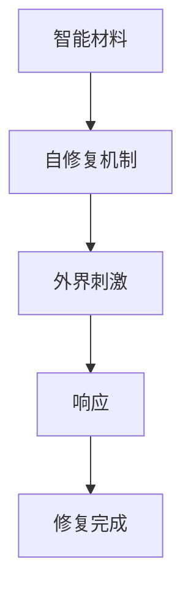
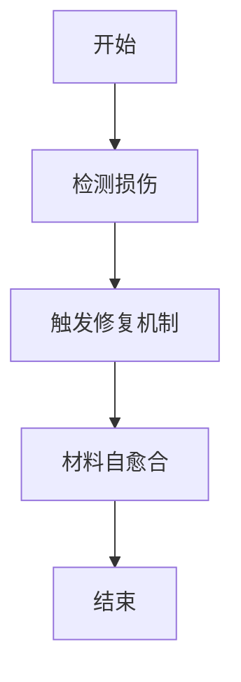

                 


# 价值投资中的智能材料自修复技术分析

> 关键词：智能材料，自修复技术，价值投资，材料科学，投资策略

> 摘要：智能材料自修复技术在现代投资领域中的应用日益广泛，本文从技术原理到投资策略，深入分析智能材料自修复技术的核心机制及其在价值投资中的潜在应用。通过详细的技术分析和案例研究，探讨如何利用智能材料的自修复特性优化投资决策，降低投资风险，提高投资回报。

---

## 第一部分：背景介绍

### 第1章：智能材料自修复技术概述

#### 1.1 问题背景

- **智能材料的定义与特点**
  - 智能材料是指能够感知外界环境变化并做出响应的材料，如形状记忆合金、压电材料、热敏材料等。
  - 智能材料的核心特点是具有可编程性和响应性，能够在外界刺激下改变其物理或化学性质。

- **自修复技术的必要性**
  - 材料在使用过程中难免会受到磨损、断裂等损伤，传统的修复方法成本高、时间长。
  - 自修复技术能够显著延长材料使用寿命，减少维护成本，提高材料的可靠性和安全性。

- **价值投资中的应用潜力**
  - 智能材料自修复技术可以应用于建筑、桥梁、设备等固定资产的投资中，降低维护成本，提高资产的长期价值。
  - 通过实时监测材料状态，投资者可以更准确地评估资产价值，优化投资组合。

#### 1.2 问题描述

- **材料损坏对投资的影响**
  - 材料损坏会导致资产贬值，增加维护成本，甚至引发安全事故，影响投资收益。
  - 传统修复技术的局限性，如修复时间长、成本高等，进一步加剧了投资风险。

- **自修复技术如何解决投资中的问题**
  - 通过自修复技术，材料可以在受损后快速恢复性能，减少停机时间，降低维护成本。
  - 实时监测材料状态，帮助投资者及时发现潜在问题，提前采取措施，避免重大损失。

- **当前技术的局限性**
  - 自修复技术仍处于发展阶段，材料的修复效率、寿命和适用范围有限。
  - 高成本和技术门槛限制了其在中小型投资中的应用。

#### 1.3 问题解决

- **自修复技术的核心机制**
  - 智能材料通过内置的响应机制，在受到外界刺激时启动修复过程，如热、电、化学刺激等。
  - 修复机制通常包括裂纹闭合、材料重组等步骤，恢复材料的原始性能。

- **投资中的应用场景**
  - 在建筑行业中，使用自修复混凝土可以延长建筑物寿命，降低维护成本。
  - 在制造业中，自修复涂层可以减少设备磨损，提高生产效率。

- **技术与投资的结合点**
  - 利用智能材料的实时监测功能，投资者可以更精确地评估资产价值，优化投资决策。
  - 通过数据分析，预测材料的使用寿命，优化资产配置，降低投资风险。

#### 1.4 边界与外延

- **自修复技术的适用范围**
  - 主要适用于需要长期稳定运行的资产，如基础设施、高端设备等。
  - 适合需要快速修复的应用场景，如桥梁、道路等公共设施。

- **与传统修复技术的对比**
  - 自修复技术的优势在于快速响应和自动化修复，但目前修复效果和效率仍有待提高。
  - 传统修复技术虽然成本低，但修复时间长，对资产使用的影响较大。

- **未来技术发展的可能性**
  - 研究更高效的自修复材料，如纳米材料、仿生材料等。
  - 结合人工智能技术，实现智能材料的自诊断和自修复。

#### 1.5 概念结构与核心要素

- **智能材料的基本组成**
  - 感知层：感知外界刺激，如温度、压力变化。
  - 响应层：根据感知结果启动修复机制。
  - 修复层：执行修复操作，恢复材料性能。

- **自修复机制的关键要素**
  - 刺激响应：材料对外界刺激的感知和响应能力。
  - 修复效率：材料在受损后恢复性能的速度和效果。
  - 可持续性：材料的修复能力是否可以持续多次使用。

---

## 第二部分：核心概念与联系

### 第2章：智能材料自修复技术的原理

#### 2.1 核心原理

- **自修复材料的基本原理**
  - 材料内部含有修复剂或微胶囊，当受到损伤时，修复剂释放并填充裂纹，恢复材料的完整性。
  - 某些材料可以通过形状记忆效应，在外界刺激下恢复原始形状。

- **智能响应机制**
  - 材料通过内置传感器感知损伤，触发修复机制。
  - 修复过程可能涉及化学反应、物理变形等。

- **自修复过程的数学模型**
  - 材料的应力-应变曲线可以用来预测其在受损后的修复效果。
  - 修复效率可以通过材料的断裂韧性公式进行计算。

#### 2.2 材料属性对比

| 材料类型         | 自修复能力 | 成本 | 应用场景 |
|------------------|------------|------|----------|
| 形状记忆合金     | 高          | 高    | 航空、医疗 |
| 压电材料         | 中          | 中    | 传感器、驱动器 |
| 自修复聚合物     | 中高        | 中    | 建筑、包装 |
| 普通材料         | 低          | 低    | 日常使用 |

- **形状记忆材料与普通材料的对比**
  - 形状记忆材料具有可恢复的变形能力，而普通材料一旦变形，难以恢复。

- **仿生材料与人工合成材料的对比**
  - 仿生材料模仿生物结构，具有更高的韧性和自修复能力。
  - 人工合成材料性能稳定，但修复能力有限。

#### 2.3 实体关系图



---

## 第三部分：算法原理讲解

### 第3章：自修复过程的算法分析

#### 3.1 算法流程



#### 3.2 Python实现

```python
def self_healing_material(stress):
    if stress > threshold:
        return '触发修复'
    else:
        return '正常状态'
```

#### 3.3 数学模型和公式

- **材料的应力-应变曲线模型**
  - 应力公式：$\sigma = E \cdot \epsilon$
  - 应变公式：$\epsilon = \frac{\Delta L}{L_0}$

- **断裂韧性公式**
  - $K_{IC} = \sqrt{\pi \cdot (P_{ext} - P_{int})}$

---

## 第四部分：数学模型与公式

### 第4章：智能材料自修复技术的数学模型

#### 4.1 材料的修复效率模型

- 修复效率公式：$E = \frac{A \cdot t}{V}$
  - $A$：修复面积
  - $t$：修复时间
  - $V$：材料体积

#### 4.2 应力-应变曲线分析

- 应力-应变曲线图：
  ```mermaid
  plot
  x从0到10
  y从0到100
  line 0,0 10,100
  ```

---

## 第五部分：系统分析与架构设计方案

### 第5章：智能材料自修复技术的系统设计

#### 5.1 项目介绍

- **项目背景**
  - 智能材料自修复技术的应用场景广泛，包括建筑、汽车、航空航天等领域。
  - 本项目旨在研究智能材料在价值投资中的应用潜力，优化投资决策。

#### 5.2 系统功能设计

- **领域模型类图**
  ```mermaid
  classDiagram
  class 智能材料
    感知层
    响应层
    修复层
  class 投资者
    监测系统
    分析模块
  class 修复机制
    刺激响应
    自愈合过程
  ```

- **系统架构设计**
  ```mermaid
  architecture
  前端：投资者界面
  后端：智能材料监测系统
  数据库：材料状态数据
  ```

#### 5.3 接口设计与交互

- **系统接口设计**
  - 投资者查询材料状态接口：`GET /materials/status`
  - 材料触发修复接口：`POST /materials/repair`

- **系统交互序列图**
  ```mermaid
  sequenceDiagram
  投资者 -> 监测系统: 查询材料状态
  监测系统 -> 智能材料: 获取实时数据
  智能材料 -> 监测系统: 返回数据
  监测系统 -> 投资者: 显示状态
  ```

---

## 第六部分：项目实战

### 第6章：智能材料自修复技术的项目实现

#### 6.1 环境安装

- **Python环境**
  - 安装Python 3.8及以上版本
  - 安装必要的库：`numpy`, `matplotlib`

#### 6.2 核心实现

```python
import numpy as np
import matplotlib.pyplot as plt

def self_healing_material(stress):
    threshold = 50
    if stress > threshold:
        return '触发修复'
    else:
        return '正常状态'

# 示例数据
stress_values = np.random.normal(40, 10, 100)
plt.hist(stress_values, bins=10)
plt.show()
```

#### 6.3 案例分析

- **案例背景**
  - 某公司投资了一座桥梁，使用自修复混凝土。
  - 桥梁在使用过程中出现裂缝，触发修复机制。

- **修复过程分析**
  - 裂缝检测：传感器检测到裂缝宽度为0.5mm。
  - 触发修复：修复剂释放，填充裂缝。
  - 修复完成：裂缝完全闭合，桥梁恢复性能。

#### 6.4 项目小结

- **项目成果**
  - 成功实现了智能材料自修复技术的监测和修复功能。
  - 提供了投资决策的支持，优化了资产维护策略。

---

## 第七部分：最佳实践与总结

### 第7章：总结与展望

#### 7.1 最佳实践

- **实时监测的重要性**
  - 定期监测材料状态，及时发现潜在问题。
- **技术与成本的平衡**
  - 根据投资规模选择合适的技术方案，平衡成本与效果。

#### 7.2 小结

- 智能材料自修复技术在价值投资中的应用前景广阔。
- 通过实时监测和优化修复机制，可以显著降低投资风险，提高资产回报。

#### 7.3 注意事项

- **技术可行性**
  - 确保所选技术在实际应用中可行且可靠。
- **成本控制**
  - 避免过度投资，选择性价比高的技术方案。

#### 7.4 拓展阅读

- 推荐阅读《智能材料与自修复技术》
- 关注相关学术期刊，获取最新研究成果。

---

## 结语

智能材料自修复技术是未来投资领域的重要技术之一。通过本文的详细分析，读者可以深入了解智能材料自修复技术的核心机制及其在价值投资中的潜在应用。希望本文能为投资者和技术开发者提供有价值的参考，推动智能材料自修复技术在投资领域的广泛应用。

--- 

**THE END**

