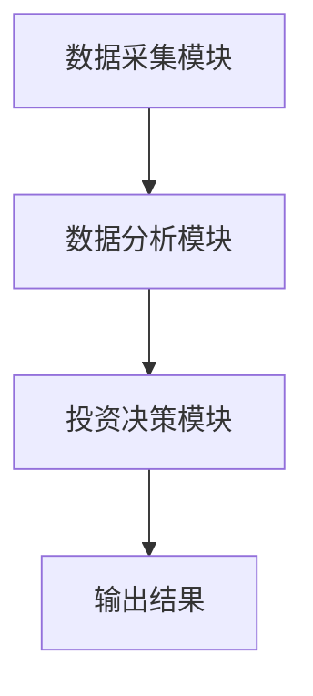

                 


# 价值投资中的智能材料自修复技术分析

> 关键词：智能材料，自修复技术，价值投资，算法模型，系统架构

> 摘要：本文将深入分析智能材料自修复技术在价值投资中的应用。通过结合材料科学与投资学的理论，探讨自修复材料的原理、评估方法以及在投资决策中的实际应用。文章从背景介绍、核心概念、算法原理、系统架构等多个维度展开，旨在为读者提供一个全面而深入的分析框架。

---

## 第1章: 价值投资与智能材料的背景介绍

### 1.1 智能材料的基本概念

智能材料是一种能够对外界环境变化（如温度、压力、光照等）做出响应，并通过内部机制调整自身性能的材料。其核心特点在于“智能性”，即材料能够根据外部条件的变化自动调节其物理、化学或机械性能。

#### 1.1.1 智能材料的分类

智能材料可以分为以下几类：
1. **形状记忆材料**：能够在外力作用下改变形状，并在特定条件下恢复原状。
2. **压电材料**：能够将机械能转化为电能，或反之将电能转化为机械能。
3. **响应性材料**：对特定刺激（如温度、湿度）产生化学或物理响应。

#### 1.1.2 智能材料的特性

智能材料具有以下特点：
- **灵敏性**：能够快速感知外界环境的变化。
- **适应性**：能够根据外界变化调整自身性能。
- **持久性**：能够在多次响应后保持性能稳定。

### 1.2 价值投资的核心理念

价值投资是一种长期投资策略，其核心在于寻找被市场低估的优质资产。以下是价值投资的几个核心理念：
1. **长期视角**：关注企业的长期盈利能力，而非短期市场波动。
2. **安全边际**：通过寻找市场价格低于内在价值的资产来降低投资风险。
3. **基本面分析**：通过对企业的财务状况、行业地位、竞争优势等进行深入分析，评估其内在价值。

### 1.3 智能材料自修复技术的应用前景

自修复技术能够显著延长材料的使用寿命，降低维护成本。在工程和制造业中，自修复材料的应用可以提高产品的可靠性和耐久性，从而为企业创造更大的经济价值。在价值投资中，这种技术的市场潜力和应用前景为投资者提供了新的投资机会。

---

## 第2章: 智能材料自修复技术的核心原理

### 2.1 自修复材料的修复机制

自修复材料的修复机制主要依赖于以下三种方式：
1. **微胶囊法**：材料中嵌入微胶囊，当材料受到损伤时，微胶囊破裂释放修复剂，从而实现自我修复。
2. **自愈合聚合物**：通过特定的化学反应，材料在受到损伤后能够自动重新键合，恢复其原有的性能。
3. **光催化修复法**：利用光能引发化学反应，使材料在光照条件下实现自我修复。

### 2.2 自修复材料的关键性能指标

以下是自修复材料的主要性能指标：
- **修复效率**：材料在受到损伤后能够快速恢复性能的能力。
- **修复次数**：材料能够承受的修复次数。
- **环境适应性**：材料在不同环境条件下的修复能力。

### 2.3 自修复材料的制备工艺

自修复材料的制备工艺主要包括以下步骤：
1. **材料选择**：选择合适的基体材料和修复剂。
2. **微胶囊制备**：通过化学反应制备微胶囊，将修复剂包裹在其中。
3. **材料复合**：将微胶囊与基体材料混合，形成复合材料。
4. **固化处理**：通过固化处理使材料形成稳定的结构。

---

## 第3章: 价值投资中的智能材料分析框架

### 3.1 价值投资的分析框架

价值投资的核心在于对企业的基本面进行深入分析。以下是常见的分析框架：
1. **财务指标分析**：评估企业的盈利能力、成长能力、偿债能力等。
2. **行业分析**：研究企业所处行业的竞争格局、发展趋势等。
3. **竞争优势分析**：评估企业在市场中的竞争优势，如成本优势、技术优势等。

### 3.2 自修复材料的市场分析

自修复材料的市场潜力巨大，尤其是在建筑、汽车、航空航天等领域。以下是市场分析的主要内容：
1. **市场规模**：估算自修复材料的市场规模及其未来增长潜力。
2. **市场需求**：分析不同行业对自修复材料的需求情况。
3. **竞争对手分析**：研究市场上主要竞争对手的产品和技术。

---

## 第4章: 智能材料自修复技术的数学模型与算法

### 4.1 自修复材料性能预测模型

为了预测自修复材料的性能，我们可以建立以下数学模型：

#### 线性回归模型

$$ y = \beta_0 + \beta_1 x + \epsilon $$

其中，$y$ 表示材料的性能指标，$x$ 表示影响性能的因素，$\beta_0$ 和 $\beta_1$ 是回归系数，$\epsilon$ 是误差项。

#### 时间序列分析

时间序列分析可以用于预测材料性能的变化趋势。常用的模型包括ARIMA（自回归积分滑动平均模型）。

### 4.2 价值投资中的算法实现

在价值投资中，我们可以利用算法对自修复材料的市场表现进行预测。以下是常见的算法实现：
1. **机器学习模型**：使用支持向量机（SVM）或随机森林（Random Forest）等算法对材料性能进行预测。
2. **深度学习模型**：利用神经网络对材料的复杂性能进行建模和预测。

---

## 第5章: 智能材料自修复技术的系统架构设计

### 5.1 系统功能设计

为了实现对自修复材料的性能评估和投资决策，我们需要设计一个功能完善的系统架构。以下是系统的主要功能模块：
1. **数据采集模块**：采集材料的性能数据和市场数据。
2. **数据分析模块**：对数据进行清洗、分析和建模。
3. **投资决策模块**：根据分析结果生成投资策略。

### 5.2 系统架构图

以下是系统的整体架构图：



---

## 第6章: 价值投资中的智能材料自修复技术实战

### 6.1 项目环境安装

为了实现对自修复材料的性能分析，我们需要安装以下工具：
1. **Python编程语言**：用于数据分析和建模。
2. **机器学习库**：如scikit-learn、TensorFlow等。
3. **数据可视化工具**：如Matplotlib、Seaborn等。

### 6.2 核心代码实现

以下是自修复材料性能预测的核心代码：

```python
import numpy as np
import pandas as pd
from sklearn.linear_model import LinearRegression

# 数据预处理
data = pd.read_csv('material_data.csv')
X = data[['factor1', 'factor2']]  # 自变量
y = data['performance']  # 因变量

# 建立线性回归模型
model = LinearRegression()
model.fit(X, y)

# 预测结果
y_pred = model.predict(X)
```

### 6.3 实际案例分析

以某类自修复材料为例，我们可以通过上述模型对其市场表现进行预测。以下是具体分析步骤：
1. **数据采集**：收集材料的性能数据和市场数据。
2. **数据清洗**：对数据进行去重、填充缺失值等处理。
3. **模型训练**：利用机器学习算法对数据进行建模和训练。
4. **结果分析**：根据模型预测结果制定投资策略。

---

## 第7章: 小结与展望

### 7.1 小结

本文从背景介绍、核心概念、算法原理、系统架构等多个维度，详细分析了智能材料自修复技术在价值投资中的应用。通过对自修复材料的性能预测和市场分析，我们可以为投资者提供科学的投资决策依据。

### 7.2 展望

随着材料科学和人工智能技术的不断发展，自修复材料的应用前景将更加广阔。未来的研究可以进一步探索自修复材料在其他领域的应用，如医疗、能源等，为投资者提供更多潜在的投资机会。

---

## 至此，文章结束。希望这篇文章能够为读者提供关于智能材料自修复技术在价值投资中的应用的深入分析和启发。

