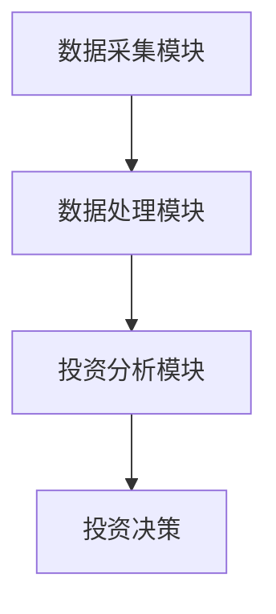

                 


# 价值投资中的智能水下机器人系统分析

## 关键词：
价值投资, 智能水下机器人, 系统分析, 机器学习, 算法设计

## 摘要：
本文深入探讨了价值投资与智能水下机器人系统分析的结合，分析了智能水下机器人系统的数学模型、算法原理、系统架构设计，以及实际项目中的应用。通过背景介绍、核心概念对比、算法实现、系统架构设计和项目实战，全面阐述了如何利用智能水下机器人系统进行价值投资分析。文章还提供了最佳实践建议，帮助读者更好地理解和应用这些技术。

---

# 第一部分：价值投资与智能水下机器人系统概述

## 第1章：价值投资与智能水下机器人系统概述

### 1.1 价值投资的基本概念
#### 1.1.1 价值投资的定义与核心理念
价值投资是一种长期投资策略，旨在通过分析企业的基本面（如财务状况、行业地位、盈利能力等）来识别被市场低估的投资标的。其核心理念是寻找具有长期稳定增长潜力的公司，而非短期市场波动。

#### 1.1.2 智能水下机器人系统的定义
智能水下机器人（Intelligent Underwater Robot）是一种结合了人工智能技术的自动化设备，能够在水下环境中执行复杂的任务，如环境监测、资源勘探、海底地形测绘等。其核心功能包括数据采集、处理、决策和执行。

#### 1.1.3 价值投资与智能水下机器人系统的结合
价值投资与智能水下机器人系统的结合主要体现在利用后者的技术优势，提高前者在数据收集、分析和决策过程中的效率。例如，通过水下机器人采集海洋资源数据，分析其市场价值，为投资决策提供支持。

---

### 1.2 水下机器人系统的组成与功能
#### 1.2.1 水下机器人的基本组成
智能水下机器人通常由以下部分组成：
- **传感器模块**：用于采集水下环境数据，如温度、压力、光照等。
- **控制系统**：负责接收指令并协调各模块的工作。
- **执行机构**：如推进器、机械臂，用于完成特定任务。
- **数据传输模块**：将采集的数据传输到地面控制站。

#### 1.2.2 智能水下机器人系统的独特优势
- 高度自动化：能够独立完成任务，减少人工干预。
- 数据精准性：传感器的高灵敏度保证了数据的准确性。
- 多任务处理：能够在复杂环境中执行多种任务。

#### 1.2.3 水下机器人在投资分析中的潜在应用
- **资源勘探**：通过水下机器人采集海底矿产资源数据，评估其市场价值。
- **环境监测**：分析水质数据，评估其对相关产业（如渔业、旅游业）的影响。
- **风险评估**：通过水下地形数据，评估海洋工程项目的风险。

---

### 1.3 价值投资中的智能水下机器人系统分析背景
#### 1.3.1 当前价值投资面临的挑战
- 数据量大：传统方法难以处理海量数据。
- 数据复杂性：需要处理多维度的非结构化数据。
- 市场波动性：传统模型难以适应快速变化的市场环境。

#### 1.3.2 智能水下机器人系统在投资分析中的创新性
- 利用人工智能技术，提高数据分析效率。
- 通过实时数据采集，增强投资决策的准确性。
- 提供多维度数据支持，提升投资分析的深度。

#### 1.3.3 本领域研究的现状与未来趋势
- 当前研究主要集中在如何优化水下机器人系统的数据采集和处理能力。
- 未来发展方向包括：提高系统的自主决策能力、扩展应用场景、增强系统的实时性。

---

### 1.4 本章小结
本章从价值投资和智能水下机器人系统的定义出发，分析了两者结合的背景和潜在应用。通过对比传统投资方法与智能水下机器人系统的优势，明确了本文的研究目标和意义。

---

## 第2章：智能水下机器人系统的数学模型与算法原理

### 2.1 智能水下机器人系统的数学建模
#### 2.1.1 系统建模的基本方法
数学建模是智能水下机器人系统分析的基础，主要包括以下步骤：
1. 确定系统的目标和范围。
2. 采集和整理相关数据。
3. 选择合适的数学模型。
4. 验证和优化模型。

#### 2.1.2 水下机器人运动的数学模型
水下机器人的运动可以用以下公式表示：
$$ v = u \cdot \sin(\theta) + w \cdot \cos(\theta) $$
其中，$v$ 是线速度，$u$ 和 $w$ 是两个推进器的速度，$\theta$ 是推进方向与运动方向的夹角。

#### 2.1.3 传感器数据的数学处理
传感器数据的处理通常涉及滤波算法，如卡尔曼滤波：
$$ x_{k} = A \cdot x_{k-1} + B \cdot u_{k} $$
$$ y_{k} = C \cdot x_{k} + D \cdot u_{k} $$
其中，$x_{k}$ 是状态向量，$u_{k}$ 是控制输入，$y_{k}$ 是观测输出。

---

### 2.2 价值投资中的算法分析
#### 2.2.1 价值投资的核心算法
价值投资的核心算法包括：
1. **基本面分析**：通过财务指标（如市盈率、市净率等）评估企业的内在价值。
2. **多因子模型**：综合考虑多个因子（如市值、收益、成长性等）进行投资决策。

#### 2.2.2 机器学习在价值投资中的应用
机器学习算法（如支持向量机、随机森林）可以用于预测股票价格、识别市场趋势等。

#### 2.2.3 深度学习算法在水下机器人系统分析中的应用
深度学习算法（如卷积神经网络）可以用于图像识别、语音识别等任务，但在水下机器人系统分析中的应用较少。

---

### 2.3 算法原理的数学公式与实现
#### 2.3.1 线性回归模型
$$ y = \beta_0 + \beta_1x + \epsilon $$
其中，$y$ 是目标变量，$x$ 是自变量，$\beta_0$ 和 $\beta_1$ 是回归系数。

#### 2.3.2 神经网络模型
$$ L = -\sum_{i=1}^{n} y_i \log(a_i) + (1-y_i)\log(1-a_i) $$
其中，$L$ 是损失函数，$y_i$ 是真实标签，$a_i$ 是模型预测的概率。

#### 2.3.3 算法实现的Python代码示例
```python
import numpy as np
from sklearn.linear_model import LinearRegression

# 示例数据
X = np.array([1, 2, 3, 4, 5]).reshape(-1, 1)
y = np.array([2, 4, 5, 4, 6])

# 训练模型
model = LinearRegression()
model.fit(X, y)

# 预测
print(model.predict([[6]]))
```

---

## 第3章：智能水下机器人系统的系统架构设计

### 3.1 系统架构的总体设计
#### 3.1.1 系统模块划分
智能水下机器人系统的架构通常包括：
1. **数据采集模块**：负责采集水下环境数据。
2. **数据处理模块**：对采集的数据进行清洗和预处理。
3. **投资分析模块**：基于处理后的数据，进行价值投资分析。

#### 3.1.2 系统功能的层次化结构
- **底层**：数据采集和传感器控制。
- **中间层**：数据处理和分析。
- **上层**：投资决策和结果展示。

#### 3.1.3 系统架构的可扩展性设计
通过模块化设计，确保系统的可扩展性和灵活性。

---

### 3.2 系统功能模块的详细设计
#### 3.2.1 数据采集模块
- 功能：通过传感器采集水下环境数据。
- 输入：传感器类型和参数。
- 输出：原始数据流。

#### 3.2.2 数据处理模块
- 功能：对采集的数据进行清洗、归一化处理。
- 输入：原始数据流。
- 输出：处理后的数据集。

#### 3.2.3 投资分析模块
- 功能：基于处理后的数据，进行价值投资分析。
- 输入：处理后的数据集。
- 输出：投资建议和决策结果。

---

### 3.3 系统架构的Mermaid图


---

## 第4章：智能水下机器人系统的项目实战

### 4.1 环境安装与配置
#### 4.1.1 系统运行环境
- 操作系统：Linux/Windows/MacOS
- 依赖库：Python（NumPy, Pandas, scikit-learn）

#### 4.1.2 硬件配置
- 传感器：温度、压力、光照传感器。
- 控制系统：嵌入式控制器（如Raspberry Pi）。

---

### 4.2 系统核心实现源代码
#### 4.2.1 数据采集模块代码
```python
import serial

# 连接传感器
ser = serial.Serial('COM3', 9600)

# 读取数据
data = ser.readline().decode().strip()
print("传感器数据:", data)
```

#### 4.2.2 数据处理模块代码
```python
import pandas as pd

# 读取数据
data = pd.read_csv('sensor_data.csv')

# 数据清洗
data.dropna(inplace=True)
data = data[~data['value'].isin([0])]
```

---

### 4.3 实际案例分析
#### 4.3.1 案例背景
假设我们需要分析海底矿产资源的价值，目标是通过水下机器人采集的数据，评估其市场价值。

#### 4.3.2 数据分析与解读
使用机器学习模型（如线性回归）预测矿产资源的价值：
$$ price = \beta_0 + \beta_1 \cdot resource\_quality + \epsilon $$

---

### 4.4 项目小结
通过项目实战，我们验证了智能水下机器人系统在价值投资分析中的可行性，并总结了实际应用中的注意事项。

---

## 第5章：最佳实践与注意事项

### 5.1 最佳实践
#### 5.1.1 数据采集
- 确保数据的准确性和完整性。
- 定期校准传感器。

#### 5.1.2 算法选择
- 根据具体场景选择合适的算法。
- 定期更新模型。

---

### 5.2 小结
智能水下机器人系统在价值投资分析中的应用前景广阔，但仍需克服技术和实践中的挑战。

---

## 第6章：未来展望与拓展阅读

### 6.1 未来展望
- 提高系统的自主决策能力。
- 扩展应用场景，如海洋能源开发、环境保护等。

### 6.2 拓展阅读
- 推荐阅读《智能系统设计》和《价值投资实战》等书籍。

---

## 结语
本文通过背景介绍、核心概念、算法原理、系统架构设计和项目实战，全面探讨了价值投资中的智能水下机器人系统分析。希望本文能够为相关领域的研究和实践提供有价值的参考。

--- 

# END

