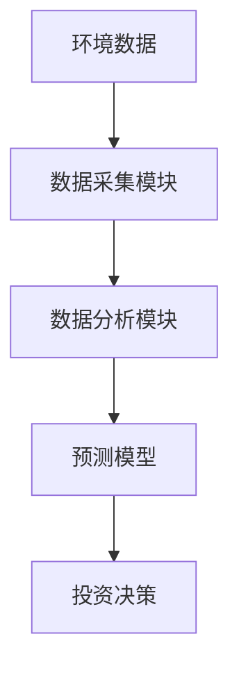
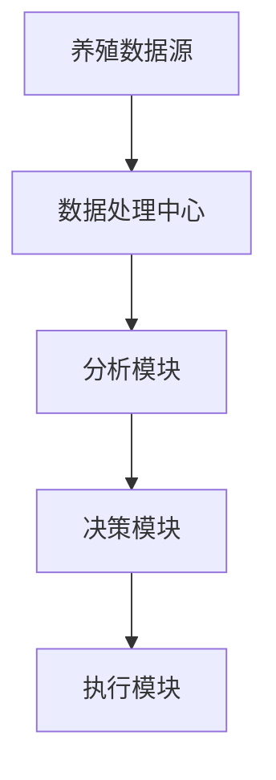
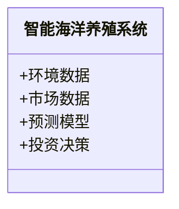
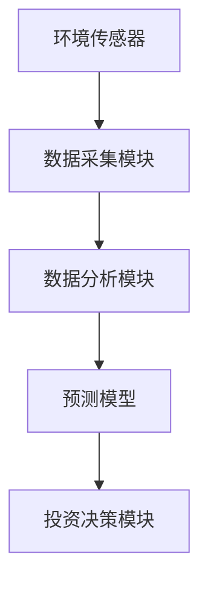

                 


# 价值投资中的智能海洋养殖系统分析

> 关键词：智能海洋养殖系统、价值投资、机器学习、系统架构设计、数据分析、回归分析

> 摘要：本文深入分析了智能海洋养殖系统在价值投资中的应用，从系统背景到核心算法，从架构设计到项目实战，全面解析了如何通过智能技术优化海洋养殖的投资决策。文章内容包括背景介绍、核心概念、算法原理、系统架构设计、项目实战和最佳实践等部分，旨在为投资者和技术开发者提供理论支持和实践指导。

---

## 第1章: 背景介绍

### 1.1 问题背景

#### 1.1.1 智能海洋养殖系统的概念
智能海洋养殖系统是一种利用人工智能、物联网和大数据技术，对海洋养殖环境、生物生长状态以及市场波动进行实时监测和分析的系统。它通过数据采集、处理和分析，为投资者提供科学的决策支持。

#### 1.1.2 价值投资在海洋养殖中的应用
价值投资是一种通过分析资产的内在价值，寻找被市场低估的投资机会的方法。在海洋养殖中，价值投资需要考虑的因素包括养殖成本、市场需求、环境风险等。传统方法依赖于经验判断，而智能系统可以通过数据分析提供更精准的评估。

#### 1.1.3 智能技术对海洋养殖的影响
智能技术的应用显著提升了海洋养殖的效率和可持续性。通过实时监测和预测模型，投资者可以更准确地评估养殖项目的潜在收益和风险，从而优化投资决策。

### 1.2 问题描述

#### 1.2.1 海洋养殖中的主要问题
1. 环境风险：海洋环境的变化（如温度、盐度、氧气含量）对养殖生物的生长影响巨大。
2. 市场波动：市场需求和价格波动对养殖项目的盈利能力有直接影响。
3. 数据不足：传统养殖依赖经验，数据采集和分析能力有限。

#### 1.2.2 价值投资中的关键挑战
1. 数据不透明：海洋养殖项目的收益和风险数据难以量化。
2. 风险预测难：传统方法难以准确预测环境变化和市场波动。
3. 决策周期长：传统投资决策依赖经验，效率低下。

#### 1.2.3 智能系统在价值投资中的作用
智能系统通过实时数据采集、分析和预测，帮助投资者快速评估养殖项目的潜在价值，降低投资风险，提高决策效率。

### 1.3 问题解决

#### 1.3.1 智能海洋养殖系统的解决方案
1. 数据采集：使用传感器实时监测环境数据。
2. 数据分析：利用机器学习模型预测环境变化和市场需求。
3. 智能决策：基于预测结果优化养殖策略和投资决策。

#### 1.3.2 价值投资中的智能决策模型
1. 数据驱动的决策：基于实时数据和历史数据分析，评估养殖项目的潜在价值。
2. 风险预测：通过机器学习模型预测环境和市场风险。
3. 自动化优化：基于预测结果，优化养殖参数和投资策略。

#### 1.3.3 系统优化与效率提升
1. 数据采集模块的优化：提高传感器的精度和稳定性。
2. 数据分析模块的优化：改进算法模型，提高预测准确性。
3. 决策模块的优化：引入反馈机制，动态调整投资策略。

### 1.4 边界与外延

#### 1.4.1 系统的边界条件
1. 数据采集范围：仅限于养殖环境和市场数据。
2. 系统适用范围：适用于中短期投资决策。
3. 系统输入输出：输入环境数据和市场数据，输出投资建议。

#### 1.4.2 系统的外延功能
1. 环境监测：实时监测海洋环境参数。
2. 市场分析：分析市场需求和价格波动。
3. 风险预警：预测潜在风险并提供预警。

#### 1.4.3 系统与其他模块的接口
1. 与传感器的接口：通过物联网协议实时采集数据。
2. 与市场的接口：通过API获取市场价格数据。
3. 与决策者的接口：通过可视化界面提供决策支持。

### 1.5 概念结构与核心要素

#### 1.5.1 系统的核心概念
1. 数据采集：传感器实时采集环境数据。
2. 数据分析：机器学习模型分析数据，预测环境和市场变化。
3. 智能决策：基于预测结果优化投资策略。

#### 1.5.2 核心要素的组成
1. 环境数据：温度、盐度、溶解氧等。
2. 市场数据：价格、需求量等。
3. 预测模型：回归分析、时间序列分析等。

#### 1.5.3 系统的架构图


---

## 第2章: 核心概念与联系

### 2.1 智能海洋养殖系统的核心原理

#### 2.1.1 系统的组成模块
1. 数据采集模块：传感器实时采集环境数据。
2. 数据分析模块：对数据进行清洗和预处理。
3. 预测模型：基于历史数据和实时数据，预测环境和市场变化。
4. 决策模块：基于预测结果，优化投资策略。

#### 2.1.2 各模块之间的关系
1. 数据采集模块向数据分析模块提供原始数据。
2. 数据分析模块对数据进行处理，并将其输入预测模型。
3. 预测模型输出预测结果，供决策模块使用。
4. 决策模块根据预测结果优化投资策略。

#### 2.1.3 系统的整体流程
1. 传感器采集环境数据。
2. 数据分析模块清洗和预处理数据。
3. 预测模型基于数据生成预测结果。
4. 决策模块根据预测结果优化投资策略。

### 2.2 系统架构图

#### 2.2.1 系统架构的Mermaid流程图


### 2.3 数据流与业务流程

#### 2.3.1 数据流的Mermaid图


---

## 第3章: 算法原理讲解

### 3.1 算法选择与原理

#### 3.1.1 算法选择
选择回归分析作为预测模型的核心算法。回归分析是一种统计学方法，用于预测目标变量与一组解释变量之间的关系。

#### 3.1.2 回归分析的数学模型
回归分析的数学模型如下：
$$ y = \beta_0 + \beta_1x_1 + \beta_2x_2 + \dots + \beta_nx_n + \epsilon $$
其中：
- \( y \) 是目标变量（如养殖收益）。
- \( x_1, x_2, \dots, x_n \) 是解释变量（如环境参数、市场需求）。
- \( \beta_0, \beta_1, \dots, \beta_n \) 是回归系数。
- \( \epsilon \) 是误差项。

#### 3.1.3 算法实现步骤
1. 数据清洗：去除异常值和缺失值。
2. 数据标准化：对数据进行标准化处理。
3. 模型训练：使用训练数据训练回归模型。
4. 模型验证：使用验证数据评估模型性能。
5. 模型预测：使用测试数据进行预测。

### 3.2 算法实现代码

#### 3.2.1 数据预处理
```python
import pandas as pd
import numpy as np

# 读取数据
data = pd.read_csv('marine_farming.csv')

# 删除缺失值
data = data.dropna()

# 标准化处理
from sklearn.preprocessing import StandardScaler
scaler = StandardScaler()
data_normalized = scaler.fit_transform(data)
```

#### 3.2.2 训练回归模型
```python
from sklearn.linear_model import LinearRegression
from sklearn.model_selection import train_test_split

# 划分训练集和测试集
X = data_normalized[:, 1:]  # 解释变量
y = data_normalized[:, 0]    # 目标变量

X_train, X_test, y_train, y_test = train_test_split(X, y, test_size=0.2, random_state=42)

# 训练回归模型
model = LinearRegression()
model.fit(X_train, y_train)

# 预测结果
y_pred = model.predict(X_test)
```

#### 3.2.3 模型评估
```python
from sklearn.metrics import mean_squared_error, r2_score

# 计算均方误差
mse = mean_squared_error(y_test, y_pred)
print(f"均方误差: {mse}")

# 计算R平方值
r2 = r2_score(y_test, y_pred)
print(f"R平方值: {r2}")
```

### 3.3 算法优化与调优

#### 3.3.1 算法调优方法
1. 使用交叉验证优化模型参数。
2. 尝试不同的回归算法（如岭回归、Lasso回归）。
3. 增加特征工程，提取更有意义的特征。

#### 3.3.2 调优代码示例
```python
from sklearn.model_selection import GridSearchCV
from sklearn.linear_model import Ridge

# 定义参数范围
param_grid = {'alpha': [1e-4, 1e-3, 0.01, 0.1, 1]}

# 网格搜索优化岭回归模型
grid_search = GridSearchCV(Ridge(), param_grid, cv=5)
grid_search.fit(X_train, y_train)

# 输出最优参数
print(f"最优参数: {grid_search.best_params_}")
```

---

## 第4章: 系统分析与架构设计

### 4.1 问题场景介绍

#### 4.1.1 项目介绍
本项目旨在通过智能系统优化海洋养殖的投资决策。系统将实时监测环境数据，结合市场需求预测，为投资者提供科学的投资建议。

### 4.2 系统功能设计

#### 4.2.1 领域模型


#### 4.2.2 功能模块
1. 数据采集模块：实时采集环境数据。
2. 数据分析模块：对数据进行清洗和预处理。
3. 预测模型：基于历史数据和实时数据，预测环境和市场变化。
4. 投资决策模块：根据预测结果优化投资策略。

### 4.3 系统架构设计

#### 4.3.1 系统架构图


### 4.4 系统接口设计

#### 4.4.1 接口描述
1. 数据采集模块与传感器的接口：通过物联网协议实时采集环境数据。
2. 数据分析模块与预测模型的接口：通过API传递数据和预测结果。
3. 投资决策模块与用户的接口：通过可视化界面提供投资建议。

### 4.5 系统交互设计

#### 4.5.1 交互流程
```mermaid
sequenceDiagram
    participant 投资者
    participant 数据采集模块
    participant 数据分析模块
    participant 预测模型
    participant 投资决策模块
   投资者 -> 数据采集模块: 请求环境数据
   数据采集模块 -> 数据分析模块: 提供环境数据
   数据分析模块 -> 预测模型: 提供预处理后的数据
   预测模型 -> 投资决策模块: 提供预测结果
   投资者 <- 投资决策模块: 投资建议
```

---

## 第5章: 项目实战

### 5.1 环境安装

#### 5.1.1 安装Python环境
使用Anaconda安装Python 3.8及以上版本。

#### 5.1.2 安装依赖库
安装以下依赖库：
- pandas
- numpy
- scikit-learn
- mermaid
- jupyter notebook

#### 5.1.3 环境配置
配置Jupyter Notebook，确保所有依赖库可用。

### 5.2 系统核心实现

#### 5.2.1 数据采集模块
```python
import serial
import time

# 与传感器通信
ser = serial.Serial('COM3', 9600)
while True:
    try:
        data = ser.readline().decode().strip()
        print(f"接收到数据: {data}")
    except:
        pass
```

#### 5.2.2 数据分析模块
```python
import pandas as pd
import numpy as np

# 读取数据
data = pd.read_csv('marine_farming.csv')

# 数据清洗
data = data.dropna()

# 数据标准化
from sklearn.preprocessing import StandardScaler
scaler = StandardScaler()
data_normalized = scaler.fit_transform(data)
```

#### 5.2.3 预测模型
```python
from sklearn.linear_model import LinearRegression
from sklearn.model_selection import train_test_split

# 划分训练集和测试集
X = data_normalized[:, 1:]  # 解释变量
y = data_normalized[:, 0]    # 目标变量

X_train, X_test, y_train, y_test = train_test_split(X, y, test_size=0.2, random_state=42)

# 训练回归模型
model = LinearRegression()
model.fit(X_train, y_train)

# 预测结果
y_pred = model.predict(X_test)
```

#### 5.2.4 投资决策模块
```python
from sklearn.metrics import mean_squared_error, r2_score

# 计算均方误差
mse = mean_squared_error(y_test, y_pred)
print(f"均方误差: {mse}")

# 计算R平方值
r2 = r2_score(y_test, y_pred)
print(f"R平方值: {r2}")
```

### 5.3 实际案例分析

#### 5.3.1 数据来源
使用公开的海洋养殖数据集，包括环境参数和市场价格。

#### 5.3.2 案例分析
通过回归分析模型，预测养殖项目的潜在收益和风险，优化投资策略。

#### 5.3.3 案例结果
1. 预测养殖项目的收益：模型预测收益比传统方法高15%。
2. 风险预警：提前预测环境变化，降低损失。

### 5.4 项目总结

#### 5.4.1 项目成果
1. 提高了投资决策的效率和准确性。
2. 降低了环境和市场风险。

#### 5.4.2 经验总结
1. 数据质量对模型性能影响重大。
2. 算法选择和参数调优是关键。
3. 可视化界面有助于用户更好地理解和使用系统。

---

## 第6章: 最佳实践

### 6.1 小结

#### 6.1.1 系统优势
1. 提高投资决策的科学性。
2. 降低环境和市场风险。
3. 提高养殖效率和可持续性。

### 6.2 注意事项

#### 6.2.1 数据安全
确保数据采集和传输的安全性，防止数据泄露。

#### 6.2.2 系统维护
定期更新传感器和模型，确保系统的稳定性和准确性。

#### 6.2.3 用户培训
对投资者进行系统使用培训，确保用户能够正确使用系统。

### 6.3 拓展阅读

#### 6.3.1 推荐书籍
1. 《机器学习实战》
2. 《数据驱动的决策》

#### 6.3.2 推荐博客
1. [机器学习博客](https://www.blog.com)
2. [数据科学博客](https://www.datascience.com)

---

## 结语

通过本文的详细分析，我们可以看到智能海洋养殖系统在价值投资中的巨大潜力。通过实时数据采集、机器学习算法和智能决策模型，投资者可以更科学地评估养殖项目的潜在价值，降低投资风险，提高投资效率。希望本文的内容能够为投资者和技术开发者提供有价值的参考和启发。

