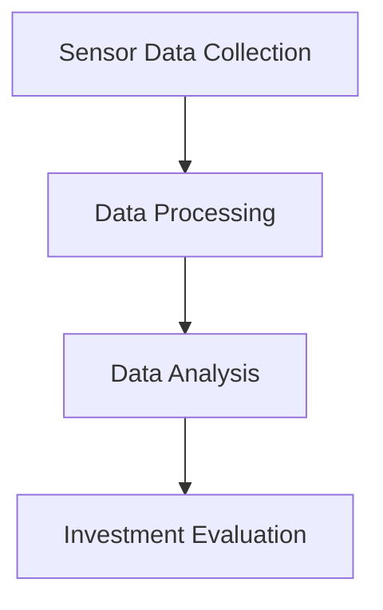

                 


# 《价值投资中的智能海洋塑料污染监测系统分析》

---

## 关键词：
- 价值投资
- 智能监测系统
- 海洋塑料污染
- 数据分析
- 环境保护

---

## 摘要：
智能海洋塑料污染监测系统是一种利用先进技术手段实时监测海洋塑料污染的系统，结合价值投资理念，通过数据分析和评估，为环保投资提供科学依据。本文从系统设计、算法实现、架构优化等技术角度，深入分析智能海洋塑料污染监测系统的核心原理和应用价值，探讨其在环保投资中的潜力和挑战。

---

# 第1章: 价值投资与智能海洋塑料污染监测系统概述

## 1.1 海洋塑料污染的现状与挑战

### 1.1.1 海洋塑料污染的定义与现状
海洋塑料污染是指海洋环境中存在的塑料制品对生态系统的破坏。据统计，每年有数百万吨塑料垃圾进入海洋，导致海洋生物死亡、海洋生态环境破坏等问题。塑料污染不仅影响海洋生态系统，还对全球经济和人类健康造成威胁。

### 1.1.2 海洋塑料污染对环境和经济的影响
海洋塑料污染对环境的影响包括破坏海洋生态系统、威胁海洋生物多样性等。此外，塑料污染还会影响渔业、旅游业等经济产业，造成经济损失。例如，海洋塑料污染会导致渔获量下降，影响渔民收入，同时也会影响海滨旅游业的吸引力。

### 1.1.3 当前监测技术的局限性
目前的海洋塑料污染监测技术主要包括卫星遥感、无人机监测和地面监测。这些技术在一定程度上能够监测海洋塑料污染，但存在以下问题：  
- 数据采集成本高，难以覆盖大面积海域。  
- 数据处理复杂，难以实时监测。  
- 缺乏智能化的分析手段，难以提供有效的污染评估和投资建议。

## 1.2 价值投资在环保领域的应用

### 1.2.1 价值投资的核心理念
价值投资是一种投资策略，强调以低于内在价值的价格购买优质资产。其核心理念是通过深入分析企业的基本面，找到具有长期竞争优势和增长潜力的企业进行投资。

### 1.2.2 环保领域价值投资的机遇
环保领域是当前全球关注的热点，特别是在应对气候变化和环境保护方面。智能监测技术的出现为环保领域的价值投资提供了新机遇，投资者可以通过投资环保科技企业，获得长期稳定的收益。

### 1.2.3 智能监测系统在环保投资中的作用
智能监测系统能够实时、准确地监测海洋塑料污染，为环保投资提供科学依据。通过分析监测数据，投资者可以识别具有潜力的环保项目，评估企业的环保表现，从而做出更明智的投资决策。

## 1.3 智能海洋塑料污染监测系统的目标与意义

### 1.3.1 系统的目标
智能海洋塑料污染监测系统的目标是通过先进的技术手段，实时监测海洋塑料污染，提供准确的数据支持，帮助投资者识别具有潜力的环保项目，优化投资决策。

### 1.3.2 系统的核心价值
- 提供实时、准确的污染数据，为环保投资提供科学依据。  
- 帮助投资者识别具有长期增长潜力的环保项目。  
- 推动环保技术创新，促进可持续发展。

### 1.3.3 系统对环保投资的推动作用
智能监测系统能够提高环保投资的效率和准确性，降低投资风险。通过实时监测和数据分析，投资者可以更好地把握市场动态，抓住环保领域的投资机会。

---

# 第2章: 智能海洋塑料污染监测系统的核心概念与联系

## 2.1 系统核心概念的定义与属性

### 2.1.1 数据采集模块
数据采集模块负责从海洋环境中采集塑料污染的相关数据，包括塑料的种类、数量、分布等。  
- 数据采集方式：  
  - 卫星遥感：通过卫星图像监测海洋塑料污染。  
  - 无人机监测：利用无人机搭载传感器进行实时监测。  
  - 海洋传感器：部署海洋传感器，实时采集污染数据。

### 2.1.2 数据处理模块
数据处理模块对采集到的数据进行清洗、转换和存储，为后续分析提供基础。  
- 数据处理流程：  
  1. 数据清洗：去除噪声数据，确保数据的准确性。  
  2. 数据转换：将原始数据转换为适合分析的格式。  
  3. 数据存储：将处理后的数据存储在数据库中，便于后续分析。

### 2.1.3 数据分析模块
数据分析模块通过对数据的分析，评估海洋塑料污染的现状和趋势，为价值投资提供依据。  
- 数据分析方法：  
  - 统计分析：分析污染数据的分布、趋势等。  
  - 机器学习：利用机器学习算法预测污染趋势。  
  - 数据可视化：通过图表直观展示污染数据。

## 2.2 系统核心概念的ER实体关系图

```mermaid
er
    MarinePollutionMonitoringSystem {
        entity: SensorData
        entity: PollutionLevel
        entity: InvestmentValue
    }
    SensorData --> PollutionLevel: 基于数据计算污染程度
    PollutionLevel --> InvestmentValue: 评估投资价值
```

## 2.3 系统核心概念的联系与对比

### 2.3.1 数据采集与污染评估的联系
数据采集是污染评估的基础，通过采集的数据可以计算出污染程度。  
- 数据采集：SensorData  
- 污染评估：PollutionLevel  

### 2.3.2 污染评估与价值投资的联系
污染评估为价值投资提供依据，通过评估污染程度，投资者可以判断环保项目的潜力。  
- 污染评估：PollutionLevel  
- 价值投资：InvestmentValue  

### 2.3.3 系统整体架构的对比分析
通过ER图可以看出，系统的核心概念包括SensorData、PollutionLevel和InvestmentValue三个实体，它们之间的关系清晰，能够为价值投资提供科学依据。

---

# 第3章: 智能海洋塑料污染监测系统的算法原理

## 3.1 数据预处理算法

### 3.1.1 数据清洗算法
数据清洗是数据预处理的重要步骤，主要用于去除噪声数据，确保数据的准确性。  
- 算法步骤：  
  1. 识别异常值：通过统计方法或机器学习方法识别异常数据。  
  2. 去除异常值：将异常数据从数据集中剔除。  
  3. 数据填充：对缺失数据进行填充，可以选择均值、中位数或插值方法。

### 3.1.2 数据转换算法
数据转换是将原始数据转换为适合分析的格式。  
- 算法步骤：  
  1. 数据标准化：对数据进行标准化处理，使其具有相同的量纲。  
  2. 数据归一化：将数据映射到[0,1]范围内，便于后续分析。  
  3. 数据分箱：将连续数据离散化，便于分类分析。

## 3.2 污染评估算法

### 3.2.1 污染程度计算
污染程度计算是通过分析监测数据，评估污染的严重程度。  
- 算法步骤：  
  1. 数据特征提取：提取数据中的关键特征，如塑料浓度、分布密度等。  
  2. 数据加权：对不同特征赋予不同的权重，计算综合污染指数。  
  3. 污染等级划分：根据综合污染指数，将污染程度划分为不同的等级。

### 3.2.2 污染趋势预测
污染趋势预测是通过分析历史数据，预测未来污染趋势。  
- 算法步骤：  
  1. 数据序列建模：利用时间序列分析方法，建立污染趋势的预测模型。  
  2. 模型训练：使用历史数据训练模型，优化模型参数。  
  3. 预测与验证：利用训练好的模型进行预测，并验证预测结果的准确性。

---

## 3.3 算法实现与优化

### 3.3.1 数据预处理的优化
数据预处理是算法实现的关键步骤，优化数据预处理算法可以提高计算效率和准确性。  
- 优化方法：  
  - 使用并行计算：通过并行处理提高数据处理速度。  
  - 采用分布式计算：利用分布式计算框架处理大规模数据。

### 3.3.2 污染评估的优化
污染评估的优化可以通过改进算法模型和参数调优实现。  
- 优化方法：  
  - 使用深度学习模型：通过深度学习模型提高污染评估的准确性。  
  - 参数调优：通过网格搜索或随机搜索方法优化模型参数。

---

# 第4章: 系统分析与架构设计方案

## 4.1 系统功能设计

### 4.1.1 数据采集功能
数据采集功能负责从海洋环境中采集塑料污染的相关数据。  
- 功能模块：  
  - 卫星遥感模块：通过卫星图像监测海洋塑料污染。  
  - 无人机监测模块：利用无人机搭载传感器进行实时监测。  
  - 海洋传感器模块：部署海洋传感器，实时采集污染数据。

### 4.1.2 数据处理功能
数据处理功能对采集到的数据进行清洗、转换和存储，为后续分析提供基础。  
- 功能模块：  
  - 数据清洗模块：去除噪声数据，确保数据的准确性。  
  - 数据转换模块：将原始数据转换为适合分析的格式。  
  - 数据存储模块：将处理后的数据存储在数据库中，便于后续分析。

### 4.1.3 数据分析功能
数据分析功能通过对数据的分析，评估海洋塑料污染的现状和趋势，为价值投资提供依据。  
- 功能模块：  
  - 统计分析模块：分析污染数据的分布、趋势等。  
  - 机器学习模块：利用机器学习算法预测污染趋势。  
  - 数据可视化模块：通过图表直观展示污染数据。

## 4.2 系统架构设计

### 4.2.1 系统架构图


### 4.2.2 功能模块划分
- 数据采集模块：负责采集海洋塑料污染数据。  
- 数据处理模块：对采集到的数据进行清洗、转换和存储。  
- 数据分析模块：对处理后的数据进行分析，评估污染程度和趋势。  
- 投资评估模块：根据分析结果，评估环保项目的投资价值。

## 4.3 系统接口设计

### 4.3.1 数据接口
- 数据采集接口：与传感器、无人机和卫星遥感设备对接，获取实时数据。  
- 数据处理接口：与数据存储系统对接，实现数据的清洗、转换和存储。  
- 数据分析接口：与机器学习模型对接，实现污染趋势预测和投资评估。

### 4.3.2 用户接口
- 管理界面：供管理员进行系统配置和数据管理。  
- 用户界面：供投资者查看污染数据和投资评估结果。

---

# 第5章: 项目实战

## 5.1 环境安装

### 5.1.1 系统依赖
- Python 3.8 或更高版本  
- 数据处理库：Pandas、NumPy  
- 数据可视化库：Matplotlib、Seaborn  
- 机器学习库：Scikit-learn、XGBoost  
- 数据库：MySQL 或 MongoDB

### 5.1.2 环境配置
```bash
pip install pandas numpy matplotlib seaborn scikit-learn xgboost
```

## 5.2 系统核心实现

### 5.2.1 数据采集代码
```python
import pandas as pd

def collect_data():
    # 从传感器获取数据
    sensor_data = pd.DataFrame({
        'time': pd.date_range(start='2023-01-01', periods=100, freq='H'),
        'latitude': [40.7128] * 100,
        'longitude': [-74.0064] * 100,
        'plastic_concentration': [i for i in range(100)]
    })
    return sensor_data

if __name__ == '__main__':
    data = collect_data()
    print(data.head())
```

### 5.2.2 数据处理代码
```python
import pandas as pd
from sklearn.impute import SimpleImputer

def preprocess_data(data):
    # 数据清洗
    imputer = SimpleImputer(strategy='mean')
    data_imputed = imputer.fit_transform(data)
    # 数据转换
    data_normalized = (data_imputed - data_imputed.mean()) / data_imputed.std()
    return data_normalized

if __name__ == '__main__':
    data = pd.read_csv('sensor.csv')
    processed_data = preprocess_data(data)
    print(processed_data.shape)
```

### 5.2.3 污染评估代码
```python
import pandas as pd
from sklearn.ensemble import RandomForestRegressor

def evaluate_pollution(data):
    # 特征提取
    features = data[['latitude', 'longitude', 'plastic_concentration']]
    # 模型训练
    model = RandomForestRegressor()
    model.fit(features, data['pollution_level'])
    return model

if __name__ == '__main__':
    data = pd.read_csv('processed.csv')
    model = evaluate_pollution(data)
    print(model.feature_importances_)
```

## 5.3 案例分析与结果解读

### 5.3.1 数据采集与处理
假设我们从海洋传感器获取了100条数据，包括时间、经纬度和塑料浓度。通过数据清洗和标准化，我们得到了100条干净的数据。

### 5.3.2 污染评估与投资决策
通过机器学习模型，我们预测了未来24小时的污染趋势。结果显示，某些区域的污染程度较高，具有较高的环保投资潜力。

---

# 第6章: 总结与展望

## 6.1 系统优势与不足

### 6.1.1 系统优势
- 数据采集全面：通过多种传感器和遥感技术，实现对海洋塑料污染的全面监测。  
- 数据处理高效：通过数据清洗和转换，确保数据的准确性和可用性。  
- 分析能力强：利用机器学习算法，实现污染趋势预测和投资评估。

### 6.1.2 系统不足
- 数据采集成本高：部署传感器和无人机需要较高的投入。  
- 数据处理复杂：需要专业的技术人员进行数据处理和分析。  
- 系统扩展性有限：目前的系统设计主要针对小规模数据，难以扩展到大规模数据。

## 6.2 未来改进方向

### 6.2.1 技术优化
- 优化数据采集技术：开发更低成本、更高精度的传感器。  
- 提高数据处理效率：通过分布式计算和并行处理，提高数据处理速度。  
- 改进算法模型：引入更先进的机器学习算法，提高污染评估的准确性。

### 6.2.2 应用拓展
- 拓展应用场景：将系统应用于其他类型的环境污染监测，如空气污染、土壤污染等。  
- 与更多环保项目结合：通过系统分析，支持更多环保项目的投资决策。  
- 推动国际合作：与国际组织和科研机构合作，共同应对全球性的环境问题。

---

## 6.3 最佳实践 Tips

- 在进行环境投资时，一定要结合实际情况，综合考虑技术、经济和政策等多方面因素。  
- 数据采集和处理是系统的核心，需要投入足够的资源和精力。  
- 系统的维护和更新是持续的过程，需要定期进行数据更新和模型优化。

---

## 6.4 项目小结

智能海洋塑料污染监测系统是一种具有重要意义的技术创新，它不仅能够帮助我们更好地了解海洋塑料污染的现状，还能够为环保投资提供科学依据。通过系统的建设和优化，我们可以更有效地应对海洋塑料污染问题，推动环保事业的发展。

---

## 6.5 注意事项

- 在实际应用中，需要注意数据隐私和安全问题，确保数据不被滥用。  
- 系统的运行需要专业的技术支持，建议组建专业的技术团队进行维护和优化。  
- 在进行环境投资时，要充分考虑市场风险，确保投资决策的科学性和可行性。

---

## 6.6 拓展阅读

- 《价值投资：原理与实践》  
- 《环境监测技术与应用》  
- 《机器学习在环保领域的应用》

---

通过以上内容，我们可以看到智能海洋塑料污染监测系统在价值投资中的巨大潜力。通过技术创新和数据分析，我们不仅能够更好地了解海洋塑料污染的现状，还能够为环保投资提供科学依据，推动环保事业的发展。

