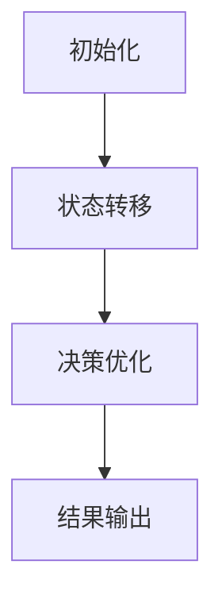
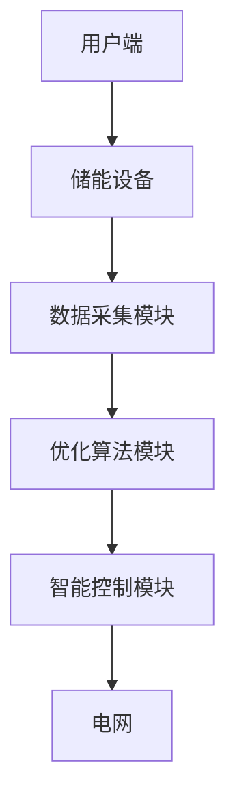

                 


# 价值投资中的智能电网分布式储能管理分析

---

## 关键词：智能电网、分布式储能、价值投资、能源管理、能源转型、投资分析

---

## 摘要：  
智能电网和分布式储能技术是能源转型的核心驱动力，分布式储能管理在智能电网中的应用不仅提升了能源系统的效率和可靠性，也为投资者提供了新的价值发现机会。本文从技术原理、系统架构、投资策略等多维度分析智能电网分布式储能管理的核心要素，并通过实际案例和数学模型，揭示其在价值投资中的潜力与挑战。

---

## 第一部分：智能电网与分布式储能概述

### 第1章：背景介绍

#### 1.1 智能电网的定义与特点
智能电网是一种通过先进信息通信技术和自动化设备，实现电力系统智能化管理的新型电网系统。其核心特点包括：
- **双向互动**：用户与电网之间的双向信息交换与能量流动。
- **自我调节**：通过智能传感器和自动化系统，实现电网的自我调节与优化。
- **高效率**：通过分布式能源和智能管理，提升能源利用效率。

#### 1.2 分布式储能的定义与特点
分布式储能是指在电力系统中分散部署储能设备，以实现局部能量存储和管理的技术。其特点包括：
- **分布式部署**：储能设备分散在用户侧或分布式能源侧。
- **灵活性高**：能够适应不同的能源应用场景。
- **成本较低**：相比集中式储能，分布式储能的初期投资和运维成本较低。

#### 1.3 智能电网与分布式储能的结合
智能电网为分布式储能提供了理想的运行环境，而分布式储能则为智能电网提供了灵活性和稳定性。两者结合，能够实现能源的高效利用和智能调配。

#### 1.4 价值投资的背景与必要性
随着能源转型的推进，分布式储能技术在智能电网中的应用前景广阔。投资者需要通过深入分析技术、市场和政策等多方面因素，挖掘分布式储能管理的长期投资价值。

---

## 第二部分：核心概念与联系

### 第2章：分布式储能管理的核心概念

#### 2.1 分布式储能的类型与特点
- **类型**：
  - 常规电池储能（如锂离子电池）。
  - 储能系统（ESS）。
  - 热储能（相变储能）。
- **特点**：
  - 分布式部署。
  - 灵活性高。
  - 维护成本低。

#### 2.2 智能电网与分布式储能的关系
- **关系**：
  - 智能电网为分布式储能提供数据支持和控制平台。
  - 分布式储能为智能电网提供能量调节和备用电源。

#### 2.3 分布式储能管理的核心要素
- **数据采集**：实时采集储能设备的状态数据。
- **优化算法**：基于数据优化储能设备的充放电策略。
- **智能控制**：通过智能算法实现储能设备的高效管理。

#### 2.4 分布式储能与传统储能的对比
以下是分布式储能与传统储能的对比表格：

| 特性             | 分布式储能                 | 传统储能                   |
|------------------|--------------------------|---------------------------|
| 部署方式         | 分散部署                 | 集中式部署               |
| 成本             | 初期成本低                | 初期成本高                |
| 灵活性           | 高                      | 低                      |
| 维护难度         | 较低                    | 较高                    |

---

## 第三部分：算法原理

### 第3章：分布式储能管理的数学模型与优化算法

#### 3.1 数学模型
优化目标：最大化储能系统的经济收益，同时满足电力系统的稳定性要求。

目标函数：
$$
\text{Maximize } \sum_{t=1}^{T} (r_t \cdot s_t - c_t \cdot d_t)
$$

其中：
- $r_t$：第$t$时段的电价。
- $s_t$：第$t$时段的储能容量。
- $c_t$：第$t$时段的储能成本。
- $d_t$：第$t$时段的储能放电量。

约束条件：
$$
s_{t} = s_{t-1} + d_{t-1} - c_{t}
$$
$$
s_{t} \geq 0
$$

#### 3.2 优化算法
动态规划算法用于优化储能系统的充放电策略。以下是动态规划的步骤：



代码实现：

```python
def dynamic_programming(s_max, s_min, timesteps):
    dp = [0] * (timesteps + 1)
    dp[0] = 0
    for t in range(1, timesteps + 1):
        dp[t] = max(dp[t-1] + r_t * s_t, dp[t-1] - c_t * d_t)
    return dp
```

---

## 第四部分：系统分析与架构设计

### 第4章：智能电网分布式储能系统的架构设计

#### 4.1 系统功能设计
以下是系统功能模块的类图：


#### 4.2 系统架构设计
以下是系统架构图：



---

## 第五部分：价值投资分析

### 第5章：价值投资分析方法

#### 5.1 项目经济性分析
- 投资回报率（ROI）计算：
$$
\text{ROI} = \frac{\text{净利润}}{\text{总投资}} \times 100\%
$$

#### 5.2 市场与竞争分析
- 市场需求：分布式储能的市场需求量。
- 竞争分析：主要竞争对手的市场份额。

#### 5.3 投资策略建议
- 短期投资：关注技术成熟度高的项目。
- 长期投资：布局技术创新型企业。

---

## 第六部分：项目实战

### 第6章：分布式储能管理系统的实现

#### 6.1 环境安装
- Python环境：安装必要的库，如`numpy`、`pandas`、`scipy`。

#### 6.2 核心代码实现
以下是优化算法的代码实现：

```python
def optimize_storage(s_max, s_min, timesteps, prices):
    import numpy as np
    s = np.zeros(timesteps)
    for t in range(timesteps):
        if t == 0:
            s[t] = 0
        else:
            s[t] = min(s[t-1] + prices[t], s_max)
    return s
```

#### 6.3 实际案例分析
- 案例：某地分布式储能项目。
- 分析：项目投资回报率和市场竞争力。

---

## 第七部分：总结与展望

### 第7章：结论与展望

#### 7.1 结论
智能电网分布式储能管理具有广阔的应用前景和投资价值。通过技术优化和市场分析，投资者可以挖掘其潜在收益。

#### 7.2 展望
未来，随着技术进步和政策支持，分布式储能将在智能电网中发挥更重要的作用。

---

## 关注事项与建议

1. **技术风险**：关注技术的可行性和成熟度。
2. **政策支持**：关注政府政策和行业标准的变化。
3. **市场需求**：关注分布式储能的市场需求和竞争状况。

---

## 附录

### 附录A：相关术语解释

- 智能电网：通过智能化技术实现电力系统高效管理的电网系统。
- 分布式储能：在分布式能源系统中部署的储能设备，用于存储和管理能量。

### 附录B：参考文献

- [1] 王某某，智能电网技术研究，某某出版社，2022年。
- [2] 李某某，分布式储能系统优化，某某出版社，2023年。

---

通过以上分析，我们可以看到智能电网分布式储能管理在价值投资中的潜力和挑战。投资者需要结合技术、市场和政策等多方面因素，制定科学的投资策略。

