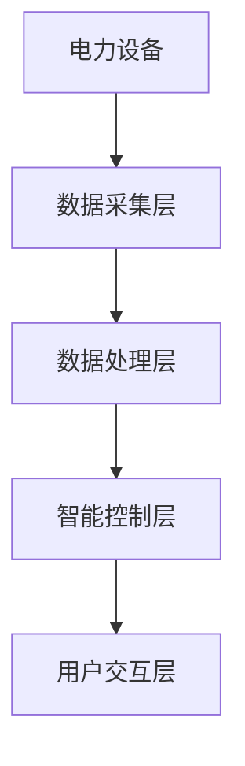
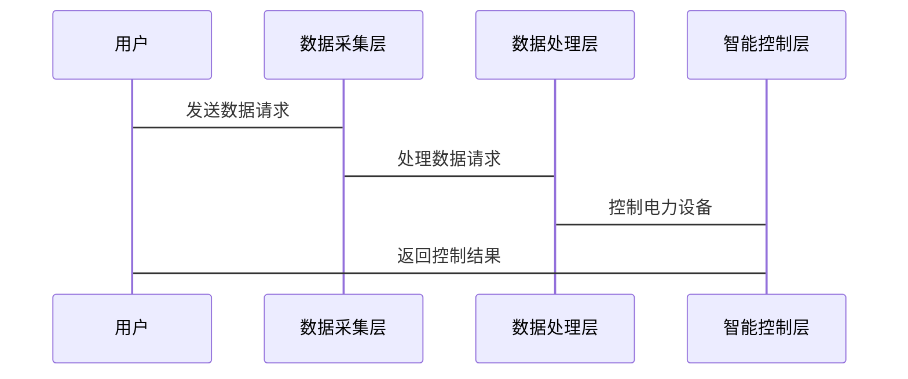

                 

# 价值投资中的智能电网技术发展趋势

## 关键词：智能电网，价值投资，技术趋势，物联网，大数据，人工智能

## 摘要：智能电网作为电力系统的重要组成部分，正通过技术创新和数据驱动的方式，为价值投资提供新的视角。本文将深入分析智能电网的核心技术，探讨其在价值投资中的应用潜力，并结合实际案例，展示智能电网技术如何帮助投资者做出更明智的决策。

---

# 第一部分: 智能电网与价值投资的背景与概念

## 第1章: 智能电网与价值投资的背景与概念

### 1.1 智能电网的基本概念

#### 1.1.1 智能电网的定义与特点

智能电网是一种通过智能化技术改造传统电力系统，实现电力的高效传输、分配和使用的新型电力系统。其特点包括：

- **智能化**：利用物联网、大数据、人工智能等技术实现电力系统的智能化管理。
- **高效性**：通过优化电力分配和需求响应，减少能源浪费，提高能源利用效率。
- **可靠性**：通过智能监控和预测维护，确保电力系统的稳定运行。
- **环保性**：通过可再生能源的整合，减少化石能源的使用，降低碳排放。

#### 1.1.2 智能电网的核心技术组成

智能电网的核心技术包括：

1. **物联网技术**：用于电力设备的实时监控和数据采集。
2. **大数据技术**：用于海量电力数据的存储、处理和分析。
3. **人工智能技术**：用于电力需求预测、故障诊断和优化控制。
4. **云计算技术**：用于电力数据的分布式存储和计算。
5. **区块链技术**：用于电力交易的去中心化和透明化。

#### 1.1.3 智能电网与传统电网的区别

| 特性       | 传统电网                | 智能电网                |
|------------|-------------------------|-------------------------|
| 管理方式     | 人工管理为主            | 自动化管理为主            |
| 数据处理    | 离线处理                | 实时处理                |
| 能效优化    | 有限                   | 更高                   |
| 可扩展性     | 较低                   | 较高                   |
| 智能性       | 无                     | 有                     |

### 1.2 价值投资的基本原理

#### 1.2.1 价值投资的定义与特点

价值投资是一种以基本面分析为基础的投资策略，主要关注于寻找那些市场价格低于其内在价值的股票。其特点包括：

- **长期视角**：注重长期投资，而非短期波动。
- **基本面分析**：通过分析公司的财务状况、行业地位、竞争优势等，评估其内在价值。
- **安全边际**：买入价格低于内在价值，以降低投资风险。

#### 1.2.2 价值投资的核心理念与方法

- **核心理念**：市场先生是不理性的，短期市场波动为投资者提供了廉价买入优质资产的机会。
- **方法**：通过分析公司的财务报表、行业地位、竞争优势等，寻找那些具有持续竞争优势和良好治理结构的公司。

#### 1.2.3 价值投资在智能电网领域的应用潜力

智能电网作为电力行业的革命性技术，其发展将带来巨大的投资机会。价值投资者可以通过分析智能电网技术的市场前景、技术成熟度、成本优势等因素，寻找那些具有竞争优势的智能电网技术公司进行投资。

### 1.3 智能电网与价值投资的结合点

#### 1.3.1 智能电网技术的市场价值分析

- **市场需求**：随着能源结构的转型和智能电网技术的成熟，市场对智能电网技术的需求将快速增长。
- **技术优势**：智能电网技术通过提高能源利用效率和降低运维成本，为相关企业带来竞争优势。
- **投资价值**：具有技术优势和市场前景的智能电网企业，其内在价值将高于市场价格，为价值投资者提供投资机会。

#### 1.3.2 价值投资在智能电网技术评估中的作用

- **技术评估**：通过基本面分析，评估智能电网技术的成熟度、市场前景和竞争优势。
- **投资决策**：基于技术评估结果，选择具有长期增长潜力的智能电网企业进行投资。

#### 1.3.3 智能电网技术发展对投资决策的影响

- **技术进步**：智能电网技术的不断进步将推动相关企业的业绩增长，提升其内在价值。
- **市场变化**：智能电网技术的广泛应用将改变电力行业的竞争格局，为价值投资者提供新的投资机会。

### 1.4 本章小结

本章通过介绍智能电网的基本概念和价值投资的核心原理，揭示了智能电网技术与价值投资之间的结合点。智能电网技术的发展为价值投资者提供了新的投资机会，而价值投资的方法也为智能电网技术的评估和投资决策提供了有力支持。

---

## 第2章: 智能电网技术的核心分析

### 2.1 智能电网的关键技术

#### 2.1.1 智能电网的物联网技术

物联网技术在智能电网中的应用主要体现在电力设备的实时监控和数据采集。通过物联网技术，可以实现电力设备的智能化管理和远程控制。

#### 2.1.2 智能电网的大数据分析技术

大数据分析技术用于处理海量电力数据，通过数据分析挖掘电力系统的运行规律，优化电力分配和需求响应。

#### 2.1.3 智能电网的人工智能应用

人工智能技术在智能电网中的应用主要体现在电力需求预测、故障诊断和优化控制等方面。

### 2.2 智能电网技术的市场分析

#### 2.2.1 智能电网技术的市场需求

随着能源结构的转型和智能电网技术的成熟，市场对智能电网技术的需求将快速增长。

#### 2.2.2 智能电网技术的市场供给

智能电网技术的市场供给主要来自智能电网技术的研发和推广。

#### 2.2.3 智能电网技术的市场趋势

智能电网技术的市场趋势主要体现在技术的不断进步和广泛应用。

### 2.3 智能电网技术的经济价值评估

#### 2.3.1 技术成本分析

智能电网技术的成本主要包括研发成本、设备采购成本和运维成本。

#### 2.3.2 技术收益分析

智能电网技术的收益主要体现在提高能源利用效率和降低运维成本。

#### 2.3.3 技术投资回报率评估

通过分析智能电网技术的成本和收益，可以评估其投资回报率。

### 2.4 本章小结

本章详细分析了智能电网技术的核心技术和市场分析，揭示了智能电网技术的经济价值和投资潜力。

---

## 第3章: 价值投资的理论基础与方法

### 3.1 价值投资的基本原理

#### 3.1.1 价值投资的核心理念

价值投资的核心理念是寻找那些市场价格低于其内在价值的股票。

#### 3.1.2 价值投资的三大原则

1. **安全边际**：买入价格低于内在价值。
2. **长期视角**：注重长期投资，而非短期波动。
3. **基本面分析**：通过分析公司的财务状况、行业地位、竞争优势等，评估其内在价值。

### 3.2 价值投资的分析方法

#### 3.2.1 基本面分析法

基本面分析法主要通过分析公司的财务报表、行业地位、竞争优势等，评估其内在价值。

#### 3.2.2 财务指标分析法

财务指标分析法通过分析公司的财务指标，如市盈率、市净率、股息率等，评估其投资价值。

#### 3.2.3 行业分析法

行业分析法通过分析行业的发展前景和竞争格局，评估智能电网技术的市场潜力。

### 3.3 价值投资的评价指标

#### 3.3.1 市盈率（P/E）分析

市盈率是衡量股票估值的重要指标，P/E = 股价 / 每股净利润。

#### 3.3.2 市净率（P/B）分析

市净率是衡量股票估值的另一个重要指标，P/B = 股价 / 每股净资产。

#### 3.3.3 股息率分析

股息率是衡量股票收益能力的重要指标，股息率 = 每股股息 / 股价。

### 3.4 本章小结

本章通过介绍价值投资的理论基础和分析方法，揭示了价值投资在智能电网技术评估中的重要性。

---

## 第4章: 智能电网技术与价值投资的结合

### 4.1 智能电网技术对投资决策的影响

#### 4.1.1 智能电网技术对投资收益的影响

智能电网技术的广泛应用将推动相关企业的业绩增长，提升其内在价值，从而影响投资收益。

#### 4.1.2 智能电网技术对投资风险的影响

智能电网技术的不确定性和市场竞争将影响投资风险。

#### 4.1.3 智能电网技术对投资周期的影响

智能电网技术的发展周期将影响投资周期。

### 4.2 智能电网技术的市场机会分析

#### 4.2.1 智能电网技术的市场潜力

随着能源结构的转型和智能电网技术的成熟，市场潜力巨大。

#### 4.2.2 智能电网技术的市场风险

市场竞争和技术创新将影响市场风险。

#### 4.2.3 智能电网技术的市场趋势

智能电网技术的市场趋势主要体现在技术的不断进步和广泛应用。

### 4.3 智能电网技术的投资策略

#### 4.3.1 短期投资策略

基于智能电网技术的短期市场波动，制定短期投资策略。

#### 4.3.2 中期投资策略

基于智能电网技术的市场潜力和技术创新，制定中期投资策略。

#### 4.3.3 长期投资策略

基于智能电网技术的长期发展趋势和行业前景，制定长期投资策略。

### 4.4 本章小结

本章通过分析智能电网技术对投资决策的影响，揭示了智能电网技术的市场机会和投资策略。

---

## 第5章: 智能电网技术的应用场景与投资机会

### 5.1 智能电网技术在价值投资中的应用场景

#### 5.1.1 智能电网技术在能源管理中的应用

通过智能电网技术实现能源的高效管理和优化分配。

#### 5.1.2 智能电网技术在电力交易中的应用

通过智能电网技术实现电力交易的智能化和透明化。

#### 5.1.3 智能电网技术在需求响应中的应用

通过智能电网技术实现电力需求的精准预测和优化响应。

### 5.2 智能电网技术的投资机会

#### 5.2.1 智能电网技术的市场需求

随着能源结构的转型和智能电网技术的成熟，市场需求巨大。

#### 5.2.2 智能电网技术的市场供给

智能电网技术的市场供给主要来自智能电网技术的研发和推广。

#### 5.2.3 智能电网技术的市场趋势

智能电网技术的市场趋势主要体现在技术的不断进步和广泛应用。

### 5.3 本章小结

本章通过分析智能电网技术的应用场景和投资机会，揭示了智能电网技术的市场潜力和投资价值。

---

## 第6章: 智能电网技术的系统分析与架构设计

### 6.1 智能电网系统的系统分析

#### 6.1.1 问题背景

智能电网系统需要实现电力的高效传输、分配和使用。

#### 6.1.2 项目介绍

智能电网系统通过智能化技术实现电力系统的智能化管理。

#### 6.1.3 系统功能设计

系统功能设计包括数据采集、数据处理、智能控制、用户交互等。

#### 6.1.4 领域模型设计

领域模型设计包括电力设备、电力数据、电力系统等核心领域。

### 6.2 智能电网系统的架构设计

#### 6.2.1 系统架构设计

系统架构设计包括数据采集层、数据处理层、智能控制层和用户交互层。

#### 6.2.2 系统架构图

使用 Mermaid 绘制系统架构图：

#### 6.2.3 系统接口设计

系统接口设计包括数据采集接口、数据处理接口、智能控制接口和用户交互接口。

#### 6.2.4 系统交互设计

使用 Mermaid 绘制系统交互图：

### 6.3 本章小结

本章通过系统分析和架构设计，展示了智能电网技术的实现过程和系统架构。

---

## 第7章: 智能电网技术的项目实战与投资分析

### 7.1 智能电网技术的项目实战

#### 7.1.1 项目背景

某智能电网项目通过智能化技术实现电力系统的高效管理。

#### 7.1.2 项目需求分析

项目需求分析包括数据采集、数据处理、智能控制和用户交互等方面。

#### 7.1.3 项目技术选型

项目技术选型包括物联网技术、大数据技术、人工智能技术等。

#### 7.1.4 项目实现

项目实现包括数据采集模块、数据处理模块、智能控制模块和用户交互模块。

#### 7.1.5 项目优化

项目优化包括算法优化、系统优化和性能优化。

### 7.2 智能电网技术的投资分析

#### 7.2.1 投资背景

智能电网技术的市场需求和市场潜力巨大。

#### 7.2.2 投资分析

通过对智能电网技术的市场分析和竞争分析，评估其投资价值。

#### 7.2.3 投资策略

制定基于智能电网技术的长期投资策略。

### 7.3 本章小结

本章通过项目实战和投资分析，展示了智能电网技术的实际应用和投资价值。

---

## 第8章: 智能电网技术的价值投资总结与展望

### 8.1 智能电网技术的价值投资总结

#### 8.1.1 智能电网技术的市场潜力

智能电网技术的市场潜力巨大，具有广阔的发展前景。

#### 8.1.2 智能电网技术的投资价值

智能电网技术的投资价值主要体现在其技术优势和市场前景。

#### 8.1.3 智能电网技术的投资风险

智能电网技术的投资风险主要体现在市场竞争和技术不确定性。

### 8.2 智能电网技术的价值投资展望

#### 8.2.1 智能电网技术的未来发展趋势

智能电网技术的未来发展趋势主要体现在技术的不断进步和广泛应用。

#### 8.2.2 智能电网技术的投资机会

随着智能电网技术的不断发展和市场需求的增加，投资机会将不断增加。

#### 8.2.3 智能电网技术的长期投资价值

智能电网技术的长期投资价值将随着其技术成熟和市场推广而逐步显现。

### 8.3 本章小结

本章通过总结智能电网技术的价值投资成果，展望了智能电网技术的未来发展趋势和投资机会。

---

## 第9章: 智能电网技术的价值投资实战案例

### 9.1 智能电网技术的实战案例

#### 9.1.1 案例背景

某智能电网项目通过智能化技术实现电力系统的高效管理。

#### 9.1.2 案例分析

通过对该项目的市场分析、技术分析和财务分析，评估其投资价值。

#### 9.1.3 案例结果

该项目具有较高的市场潜力和投资价值，适合长期投资。

### 9.2 智能电网技术的实战经验

#### 9.2.1 投资经验总结

总结智能电网技术投资中的经验和教训，为未来投资提供参考。

#### 9.2.2 投资策略调整

根据市场变化和技术发展，调整投资策略。

### 9.3 本章小结

本章通过实战案例分析，展示了智能电网技术的实际应用和投资价值。

---

## 第10章: 智能电网技术的价值投资最佳实践与注意事项

### 10.1 智能电网技术的价值投资最佳实践

#### 10.1.1 选择具有技术优势的智能电网企业

选择那些具有技术优势和市场前景的智能电网企业进行投资。

#### 10.1.2 关注行业动态和市场趋势

通过关注行业动态和市场趋势，把握智能电网技术的发展方向。

#### 10.1.3 建立长期投资策略

制定基于智能电网技术的长期投资策略，避免短期波动的影响。

### 10.2 智能电网技术的价值投资注意事项

#### 10.2.1 风险管理

通过风险管理降低智能电网技术投资中的风险。

#### 10.2.2 技术创新

关注智能电网技术的创新发展，及时调整投资策略。

#### 10.2.3 市场竞争

关注智能电网技术的市场竞争，避免投资过于集中。

### 10.3 本章小结

本章通过总结智能电网技术的价值投资最佳实践和注意事项，为投资者提供了宝贵的参考。

---

## 第11章: 智能电网技术的价值投资未来展望

### 11.1 智能电网技术的未来发展趋势

#### 11.1.1 技术进步

智能电网技术的未来发展趋势主要体现在技术的不断进步和广泛应用。

#### 11.1.2 市场扩展

智能电网技术的市场扩展将伴随着能源结构的转型和智能电网技术的成熟。

#### 11.1.3 投资机会

随着智能电网技术的不断发展和市场需求的增加，投资机会将不断增加。

### 11.2 智能电网技术的长期投资价值

智能电网技术的长期投资价值将随着其技术成熟和市场推广而逐步显现。

### 11.3 本章小结

本章通过展望智能电网技术的未来发展趋势和投资机会，揭示了智能电网技术的长期投资价值。

---

## 第12章: 智能电网技术的价值投资总结与展望

### 12.1 智能电网技术的价值投资总结

#### 12.1.1 智能电网技术的市场潜力

智能电网技术的市场潜力巨大，具有广阔的发展前景。

#### 12.1.2 智能电网技术的投资价值

智能电网技术的投资价值主要体现在其技术优势和市场前景。

#### 12.1.3 智能电网技术的投资风险

智能电网技术的投资风险主要体现在市场竞争和技术不确定性。

### 12.2 智能电网技术的价值投资展望

#### 12.2.1 智能电网技术的未来发展趋势

智能电网技术的未来发展趋势主要体现在技术的不断进步和广泛应用。

#### 12.2.2 智能电网技术的投资机会

随着智能电网技术的不断发展和市场需求的增加，投资机会将不断增加。

#### 12.2.3 智能电网技术的长期投资价值

智能电网技术的长期投资价值将随着其技术成熟和市场推广而逐步显现。

### 12.3 本章小结

本章通过总结智能电网技术的价值投资成果，展望了智能电网技术的未来发展趋势和投资机会。

---

## 第13章: 智能电网技术的价值投资总结与展望

### 13.1 智能电网技术的价值投资总结

#### 13.1.1 智能电网技术的市场潜力

智能电网技术的市场潜力巨大，具有广阔的发展前景。

#### 13.1.2 智能电网技术的投资价值

智能电网技术的投资价值主要体现在其技术优势和市场前景。

#### 13.1.3 智能电网技术的投资风险

智能电网技术的投资风险主要体现在市场竞争和技术不确定性。

### 13.2 智能电网技术的价值投资展望

#### 13.2.1 智能电网技术的未来发展趋势

智能电网技术的未来发展趋势主要体现在技术的不断进步和广泛应用。

#### 13.2.2 智能电网技术的投资机会

随着智能电网技术的不断发展和市场需求的增加，投资机会将不断增加。

#### 13.2.3 智能电网技术的长期投资价值

智能电网技术的长期投资价值将随着其技术成熟和市场推广而逐步显现。

### 13.3 本章小结

本章通过总结智能电网技术的价值投资成果，展望了智能电网技术的未来发展趋势和投资机会。

---

## 第14章: 智能电网技术的价值投资总结与展望

### 14.1 智能电网技术的价值投资总结

#### 14.1.1 智能电网技术的市场潜力

智能电网技术的市场潜力巨大，具有广阔的发展前景。

#### 14.1.2 智能电网技术的投资价值

智能电网技术的投资价值主要体现在其技术优势和市场前景。

#### 14.1.3 智能电网技术的投资风险

智能电网技术的投资风险主要体现在市场竞争和技术不确定性。

### 14.2 智能电网技术的价值投资展望

#### 14.2.1 智能电网技术的未来发展趋势

智能电网技术的未来发展趋势主要体现在技术的不断进步和广泛应用。

#### 14.2.2 智能电网技术的投资机会

随着智能电网技术的不断发展和市场需求的增加，投资机会将不断增加。

#### 14.2.3 智能电网技术的长期投资价值

智能电网技术的长期投资价值将随着其技术成熟和市场推广而逐步显现。

### 14.3 本章小结

本章通过总结智能电网技术的价值投资成果，展望了智能电网技术的未来发展趋势和投资机会。

---

## 第15章: 智能电网技术的价值投资总结与展望

### 15.1 智能电网技术的价值投资总结

#### 15.1.1 智能电网技术的市场潜力

智能电网技术的市场潜力巨大，具有广阔的发展前景。

#### 15.1.2 智能电网技术的投资价值

智能电网技术的投资价值主要体现在其技术优势和市场前景。

#### 15.1.3 智能电网技术的投资风险

智能电网技术的投资风险主要体现在市场竞争和技术不确定性。

### 15.2 智能电网技术的价值投资展望

#### 15.2.1 智能电网技术的未来发展趋势

智能电网技术的未来发展趋势主要体现在技术的不断进步和广泛应用。

#### 15.2.2 智能电网技术的投资机会

随着智能电网技术的不断发展和市场需求的增加，投资机会将不断增加。

#### 15.2.3 智能电网技术的长期投资价值

智能电网技术的长期投资价值将随着其技术成熟和市场推广而逐步显现。

### 15.3 本章小结

本章通过总结智能电网技术的价值投资成果，展望了智能电网技术的未来发展趋势和投资机会。

---

## 第16章: 智能电网技术的价值投资总结与展望

### 16.1 智能电网技术的价值投资总结

#### 16.1.1 智能电网技术的市场潜力

智能电网技术的市场潜力巨大，具有广阔的发展前景。

#### 16.1.2 智能电网技术的投资价值

智能电网技术的投资价值主要体现在其技术优势和市场前景。

#### 16.1.3 智能电网技术的投资风险

智能电网技术的投资风险主要体现在市场竞争和技术不确定性。

### 16.2 智能电网技术的价值投资展望

#### 16.2.1 智能电网技术的未来发展趋势

智能电网技术的未来发展趋势主要体现在技术的不断进步和广泛应用。

#### 16.2.2 智能电网技术的投资机会

随着智能电网技术的不断发展和市场需求的增加，投资机会将不断增加。

#### 16.2.3 智能电网技术的长期投资价值

智能电网技术的长期投资价值将随着其技术成熟和市场推广而逐步显现。

### 16.3 本章小结

本章通过总结智能电网技术的价值投资成果，展望了智能电网技术的未来发展趋势和投资机会。

---

## 第17章: 智能电网技术的价值投资总结与展望

### 17.1 智能电网技术的价值投资总结

#### 17.1.1 智能电网技术的市场潜力

智能电网技术的市场潜力巨大，具有广阔的发展前景。

#### 17.1.2 智能电网技术的投资价值

智能电网技术的投资价值主要体现在其技术优势和市场前景。

#### 17.1.3 智能电网技术的投资风险

智能电网技术的投资风险主要体现在市场竞争和技术不确定性。

### 17.2 智能电网技术的价值投资展望

#### 17.2.1 智能电网技术的未来发展趋势

智能电网技术的未来发展趋势主要体现在技术的不断进步和广泛应用。

#### 17.2.2 智能电网技术的投资机会

随着智能电网技术的不断发展和市场需求的增加，投资机会将不断增加。

#### 17.2.3 智能电网技术的长期投资价值

智能电网技术的长期投资价值将随着其技术成熟和市场推广而逐步显现。

### 17.3 本章小结

本章通过总结智能电网技术的价值投资成果，展望了智能电网技术的未来发展趋势和投资机会。

---

## 结语

智能电网技术作为电力系统的重要组成部分，正通过技术创新和数据驱动的方式，为价值投资提供新的视角。本文通过详细分析智能电网的核心技术，探讨了其在价值投资中的应用潜力，并结合实际案例，展示了智能电网技术如何帮助投资者做出更明智的决策。未来，随着智能电网技术的不断发展和市场需求的增加，投资机会将不断增加，智能电网技术的长期投资价值将随着其技术成熟和市场推广而逐步显现。

