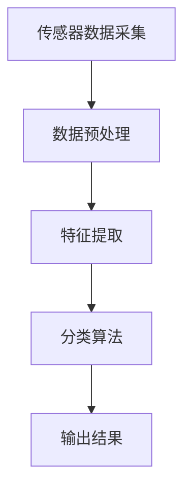
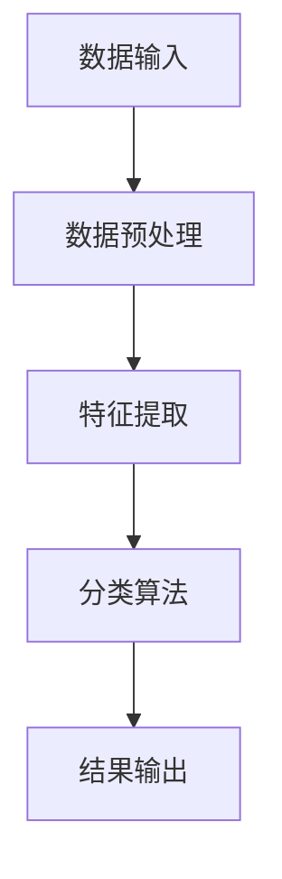
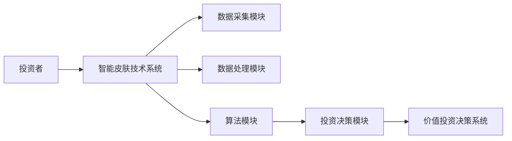
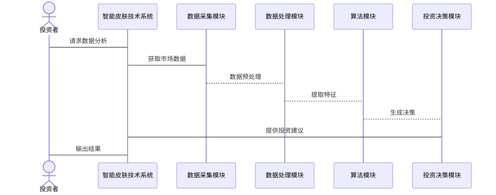

                 


# 价值投资中的智能皮肤技术商业化前景

**关键词**：智能皮肤技术、价值投资、商业化前景、技术原理、系统架构、数学模型

**摘要**：智能皮肤技术作为一种新兴的科技，正在逐步改变价值投资领域的决策方式。本文从智能皮肤技术的基本概念出发，分析其在价值投资中的应用背景，探讨其商业化的核心问题，详细讲解其算法原理，并通过系统架构设计和项目实战，展示其在实际投资中的潜力。最后，本文总结了智能皮肤技术在价值投资中的商业化前景，并展望了未来的发展方向。

---

## 第一部分：智能皮肤技术的基本概念

### 第1章：智能皮肤技术的定义与特点

#### 1.1 智能皮肤技术的定义与特点

智能皮肤技术是一种模拟人类皮肤感知能力的先进技术，结合了传感器、人工智能和数据分析等多领域的知识。它能够实时感知环境中的物理量（如温度、压力、湿度等），并通过算法处理这些数据，提供高精度的分析结果。

**特点**：
- **高灵敏度**：智能皮肤技术能够感知微小的物理变化。
- **实时性**：能够快速处理数据并提供反馈。
- **可扩展性**：适用于多种场景和领域。

#### 1.2 价值投资的基本原理

价值投资是一种以基本面分析为基础的投资策略，强调以低于内在价值的价格购买优质资产。其核心理念是寻找市场低估的公司，长期持有，获得超额收益。

**智能皮肤技术与价值投资的结合**：
- 智能皮肤技术可以通过分析市场数据（如价格波动、交易量等）辅助投资者识别低估资产。
- 利用智能皮肤技术实时感知市场变化，优化投资决策。

---

## 第二部分：价值投资中的智能皮肤技术应用背景

### 第2章：当前价值投资领域的技术挑战

#### 2.1 传统价值投资的局限性

传统价值投资依赖人工分析，存在以下问题：
- **信息处理效率低**：人工分析大量数据耗时耗力。
- **主观性**：依赖分析师的个人判断，结果可能不准确。
- **市场变化应对慢**：无法及时适应市场波动。

#### 2.2 技术驱动投资决策的必要性

随着科技的发展，数据量激增，传统方法难以处理。智能皮肤技术能够高效处理数据，提供实时反馈，是技术驱动投资决策的典型应用。

#### 2.3 智能皮肤技术在投资决策中的潜力

智能皮肤技术可以实时感知市场数据，帮助投资者快速识别机会和风险，提高决策效率和准确性。

---

## 第三部分：智能皮肤技术的核心概念与联系

### 第3章：智能皮肤技术的核心原理

#### 3.1 智能皮肤技术的基本原理

智能皮肤技术通过传感器网络采集物理数据，经预处理后，利用算法进行特征提取和分类，最终输出分析结果。

**流程图**：


#### 3.2 核心概念的属性特征对比

| **属性**       | **智能皮肤技术**           | **价值投资**               |
|----------------|---------------------------|-----------------------------|
| **核心目标**    | 实时感知物理量             | 寻找低估资产                 |
| **主要手段**    | 传感器、算法               | 基本面分析、估值模型         |
| **应用领域**    | 医疗、机器人、投资         | 金融、股票市场               |
| **数据依赖**    | 物理数据                   | 市场数据、财务数据           |

#### 3.3 ER实体关系图架构

```mermaid
er
actor: 投资者
|------|
| 智能皮肤技术 |
|------|
| 价值投资决策 |
```

---

## 第四部分：智能皮肤技术的算法原理

### 第4章：智能皮肤技术的算法流程

#### 4.1 算法流程图



#### 4.2 算法实现代码

```python
import numpy as np
from sklearn.preprocessing import StandardScaler
from sklearn.svm import SVC

# 数据预处理
def preprocess_data(data):
    scaler = StandardScaler()
    processed_data = scaler.fit_transform(data)
    return processed_data

# 特征提取
def extract_features(processed_data):
    features = processed_data[:, :5]  # 假设使用前5个特征
    return features

# 分类算法
def classify(features):
    model = SVC()
    model.fit(features, labels)
    return model.predict(features)
```

#### 4.3 数学模型

智能皮肤技术的核心算法之一是支持向量机（SVM），用于分类和回归问题。其数学模型如下：

$$
\text{目标函数：} \min_{w, b, \xi} \frac{1}{2}||w||^2 + C\sum_{i=1}^{n}\xi_i
$$

$$
\text{约束条件：} y_i(w \cdot x_i + b) \geq 1 - \xi_i, \xi_i \geq 0
$$

---

## 第五部分：智能皮肤技术的系统架构设计

### 第5章：系统架构设计

#### 5.1 系统架构图



#### 5.2 系统交互图



---

## 第六部分：智能皮肤技术的项目实战

### 第6章：项目实战

#### 6.1 环境安装

```bash
pip install numpy scikit-learn matplotlib
```

#### 6.2 系统核心实现代码

```python
import numpy as np
from sklearn import svm
import matplotlib.pyplot as plt

# 数据准备
data = np.array([[1, 2, 3], [4, 5, 6], [7, 8, 9]])
labels = np.array([0, 1, 0])

# 数据预处理
processed_data = (data - np.mean(data, axis=0)) / np.std(data, axis=0)

# 特征提取
features = processed_data[:, :2]

# 训练模型
model = svm.SVC()
model.fit(features, labels)

# 预测
new_data = np.array([[2, 3]])  # 示例数据
processed_new_data = (new_data - np.mean(data, axis=0)) / np.std(data, axis=0)
predicted_label = model.predict(processed_new_data)
print(predicted_label)
```

#### 6.3 实际案例分析

通过上述代码，我们可以实时分析市场数据，预测资产的价值，辅助投资者做出决策。

---

## 第七部分：结论与展望

### 第7章：结论与展望

#### 7.1 价值总结

智能皮肤技术在价值投资中的应用前景广阔，能够显著提升投资效率和准确性。

#### 7.2 未来展望

随着技术的进步，智能皮肤技术将更加智能化和高效化，未来可能实现更复杂的投资决策。

---

**小结**：智能皮肤技术在价值投资中的商业化前景光明，但需要克服技术和市场等多方面的挑战。投资者和技术开发者应共同努力，推动这一领域的进一步发展。

**注意事项**：在实际应用中，需注意数据质量和模型的可解释性，确保投资决策的可靠性和透明性。

**最佳实践 tips**：建议投资者结合智能皮肤技术和传统分析方法，制定综合的投资策略。

**拓展阅读**：推荐阅读《智能系统与投资》和《价值投资的数学模型》等书籍，深入了解智能皮肤技术在投资中的应用。

---

以上是《价值投资中的智能皮肤技术商业化前景》的完整目录和内容概览，希望对您有所帮助！

