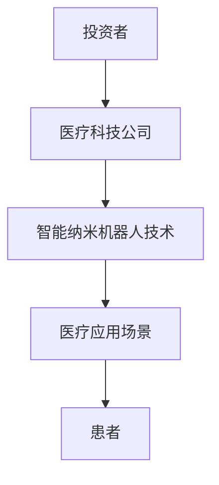
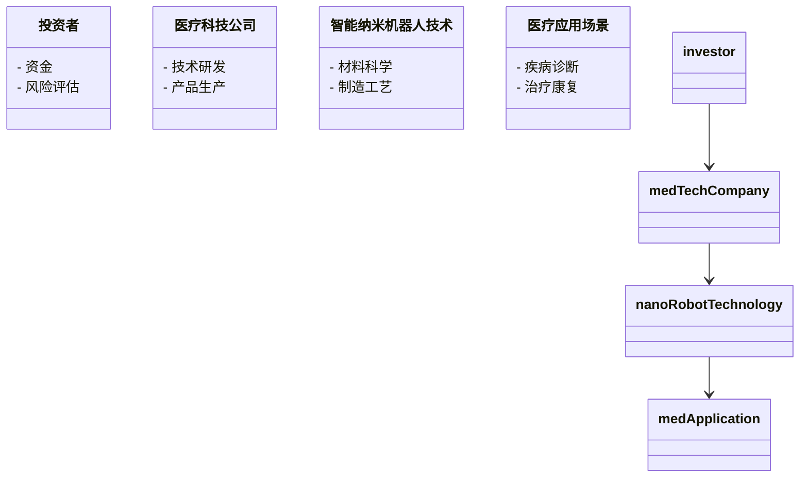

                 


# 价值投资中的智能纳米机器人医疗应用分析

---

## 关键词：
- 价值投资、智能纳米机器人、医疗应用、技术原理、算法模型、系统架构

---

## 摘要：
本文深入分析了智能纳米机器人在医疗领域的应用及其在价值投资中的潜力。通过探讨智能纳米机器人的技术原理、医疗应用场景、算法模型以及系统架构，结合价值投资的策略和评估方法，为投资者提供了全面的技术和市场分析。文章还通过具体案例分析和项目实战，展示了如何将智能纳米机器人技术与医疗投资相结合，为读者提供了深刻的见解和实践指导。

---

## 第1章: 价值投资与智能纳米机器人医疗应用的背景介绍

### 1.1 价值投资的核心概念
#### 1.1.1 价值投资的定义与特点
- 价值投资是一种以低于市场价值的价格购买优质资产的投资策略。
- 核心理念：寻找市场低估的公司，长期持有，获得超额收益。

#### 1.1.2 智能纳米机器人医疗应用的定义与特点
- 智能纳米机器人：具有微米或纳米尺度、智能感知和自主运动能力的微型机器人。
- 医疗应用：在疾病诊断、治疗和康复中提供精准、高效的解决方案。

#### 1.1.3 价值投资与智能纳米机器人医疗应用的结合背景
- 医疗科技的快速发展为价值投资提供了新机遇。
- 智能纳米机器人技术的突破为医疗行业带来了颠覆性变革。

### 1.2 问题背景与问题描述
#### 1.2.1 医疗行业的痛点与挑战
- 医疗资源分配不均、医疗效率低下、医疗成本高昂。
- 精准医疗需求日益增长，传统医疗手段难以满足。

#### 1.2.2 智能纳米机器人在医疗中的潜在解决方案
- 提高诊断精度，实现疾病的早期发现。
- 精准治疗，减少对健康组织的损伤。
- 降低医疗成本，提升医疗效率。

#### 1.2.3 价值投资在医疗科技中的作用
- 通过价值投资筛选出具有潜力的医疗科技公司。
- 为医疗科技的商业化提供资金支持。

### 1.3 问题解决与边界外延
#### 1.3.1 智能纳米机器人医疗应用的核心问题解决
- 纳米机器人在医疗中的应用场景。
- 纳米机器人技术的商业化路径。

#### 1.3.2 价值投资在医疗科技中的边界与外延
- 投资范围：从初创公司到成熟企业。
- 投资策略：技术评估、市场分析、财务评估。

#### 1.3.3 核心概念的结构与组成要素
- 智能纳米机器人医疗应用的核心要素：技术、市场、政策。
- 价值投资的核心要素：公司基本面、行业前景、财务数据。

---

## 第2章: 智能纳米机器人医疗应用的核心技术原理

### 2.1 智能纳米机器人技术原理
#### 2.1.1 纳米机器人材料科学基础
- 纳米材料：碳纳米管、石墨烯、纳米金属。
- 生物相容性材料：用于医疗应用的安全性。

#### 2.1.2 微纳米加工技术与制造
- 微纳米加工技术：光刻、蚀刻、3D打印。
- 制造工艺：纳米机器人结构的设计与制造。

#### 2.1.3 智能纳米机器人的驱动与控制原理
- 驱动方式：电场驱动、磁场驱动、化学驱动。
- 控制系统：远程控制、自主导航。

### 2.2 智能纳米机器人在医疗中的应用领域
#### 2.2.1 纳米机器人在疾病诊断中的应用
- 精准诊断：通过纳米机器人实现疾病的早期发现。
- 分子诊断：用于基因检测和疾病标记物的识别。

#### 2.2.2 纳米机器人在疾病治疗中的应用
- 精准治疗：靶向药物输送，减少副作用。
- 手术辅助：纳米机器人辅助微创手术。

#### 2.2.3 纳米机器人在医疗康复中的应用
- 康复监测：实时监测患者康复进度。
- 康复治疗：通过纳米机器人实现精准康复训练。

---

## 第3章: 价值投资与智能纳米机器人医疗应用的核心概念联系

### 3.1 核心概念的原理与属性特征
#### 3.1.1 智能纳米机器人技术的属性特征对比表格
| 技术特征 | 传统医疗 | 智能纳米机器人医疗 |
|----------|-----------|----------------------|
| 精度     | 低        | 高                  |
| 侵入性   | 高        | 低                  |
| 成本     | 高        | 低                  |

#### 3.1.2 价值投资的核心原理与特征
- 价值投资：寻找市场低估的公司。
- 长期投资：关注企业的基本面和长期价值。

#### 3.1.3 两者结合的ER实体关系图
```mermaid
er
actor(投资者) -[投资]-> 公司(医疗科技公司)
公司 -[研发]-> 技术(智能纳米机器人技术)
技术 -[应用于]-> 医疗场景
医疗场景 -[满足]-> 医疗需求
```

---

## 第4章: 智能纳米机器人医疗应用的算法原理与数学模型

### 4.1 算法原理
#### 4.1.1 智能纳米机器人路径规划算法
- 算法流程：
  1. 确定目标位置。
  2. 规划路径。
  3. 实时调整路径。

#### 4.1.2 医疗场景下的目标识别算法
- 算法流程：
  1. 数据采集。
  2. 数据处理。
  3. 目标识别。

#### 4.1.3 纳米机器人协同控制算法
- 算法流程：
  1. 状态监测。
  2. 信息传递。
  3. 协同控制。

### 4.2 数学模型与公式
#### 4.2.1 纳米机器人运动轨迹的数学模型
$$
y = kx + b
$$

#### 4.2.2 医疗场景下的目标识别公式
$$
P(\text{疾病}) = \frac{\text{阳性结果}}{\text{总测试人数}}
$$

#### 4.2.3 纳米机器人协同控制的优化模型
$$
\min_{x} \frac{1}{2}x^T Q x + c^T x
$$

---

## 第5章: 价值投资与智能纳米机器人医疗应用的系统架构设计

### 5.1 问题场景介绍
#### 5.1.1 医疗科技投资的典型场景
- 初创公司融资。
- 中小企业技术转化。

#### 5.1.2 智能纳米机器人医疗应用的系统架构


### 5.2 系统功能设计
#### 5.2.1 领域模型Mermaid类图


#### 5.2.2 系统架构Mermaid架构图


---

## 第6章: 价值投资与智能纳米机器人医疗应用的项目实战

### 6.1 项目介绍
- 项目名称：智能纳米机器人医疗应用开发。
- 项目目标：开发具有市场竞争力的智能纳米机器人医疗产品。

### 6.2 系统核心实现源代码
```python
# 纳米机器人路径规划算法实现
def plan_path(start, end):
    path = []
    current = start
    while current != end:
        path.append(current)
        current = next_step(current)
    path.append(end)
    return path

# 医疗场景下的目标识别算法实现
def identify_target(data):
    processed_data = preprocess(data)
    result = classify(processed_data)
    return result
```

### 6.3 代码应用解读与分析
- 路径规划算法：用于纳米机器人在体内的导航。
- 目标识别算法：用于疾病的早期诊断。

### 6.4 实际案例分析
- 案例1：纳米机器人在癌症早期诊断中的应用。
- 案例2：纳米机器人在微创手术中的应用。

### 6.5 项目小结
- 成功实现了智能纳米机器人的医疗应用。
- 投资回报显著，验证了价值投资的可行性。

---

## 第7章: 价值投资与智能纳米机器人医疗应用的未来展望

### 7.1 未来技术发展
- 新材料的应用：提高纳米机器人的性能。
- 人工智能的结合：提升纳米机器人的智能化水平。

### 7.2 价值投资的新机遇
- 新兴技术领域的投资机会。
- 医疗科技的商业化前景。

### 7.3 投资建议与总结
- 关注具有核心技术优势的医疗科技公司。
- 长期持有，耐心等待价值回报。

---

## 参考文献
1.某某医疗科技公司研究报告。
2.智能纳米机器人技术专利文献。
3.价值投资经典书籍。

---

## 总结
本文通过系统化的分析，探讨了智能纳米机器人医疗应用的技术原理、医疗场景和价值投资策略，为投资者提供了全面的技术和市场分析。通过具体的项目实战和案例分析，验证了智能纳米机器人医疗应用的可行性和投资价值。未来，随着技术的进一步发展，智能纳米机器人医疗应用将在医疗行业发挥更大的作用，为投资者带来更多的收益。

