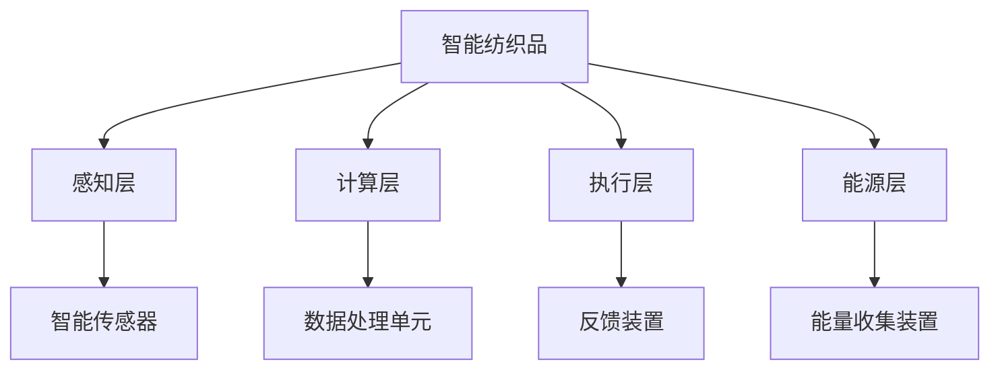

                 

# 价值投资中的智能纺织品技术发展趋势

---

## 关键词：
智能纺织品，价值投资，技术趋势，投资策略，市场分析，技术创新

---

## 摘要：
本文从智能纺织品的核心技术、市场发展、投资策略等多个角度，详细分析了智能纺织品行业的技术发展趋势及其对价值投资的影响。通过对智能纺织品的技术创新、市场容量、竞争格局的深入探讨，结合实际案例分析，为投资者提供了科学的技术评估方法和投资决策框架，帮助投资者在智能纺织品领域实现长期稳健的投资回报。

---

# 第1章 智能纺织品的定义与技术发展背景

## 1.1 智能纺织品的定义

### 1.1.1 智能纺织品的基本概念
智能纺织品是一种结合了先进材料科学、传感器技术、数据处理技术等多学科的新型纺织产品。它不仅具备传统纺织品的基本功能（如保暖、防护等），还能够通过集成智能传感器、能量收集装置等技术，实现对环境信息（如温度、湿度、压力）或生理信息（如心率、运动数据）的实时感知和反馈。

**核心概念术语说明：**
- **智能纤维**：具有感知功能的纤维材料，能够对外界环境变化做出响应。
- **功能织物**：具有特定功能（如防水、透气、抗菌等）的纺织材料。
- **智能传感器**：集成在纺织品中的微型传感器，用于采集环境或生理数据。

**问题背景：**
传统纺织品行业长期依赖价格竞争和规模化生产，随着消费者对功能性、智能化需求的提升，传统纺织品的附加值逐渐降低，行业利润空间被压缩。

**问题描述：**
如何通过技术创新提升纺织品的附加值，满足消费者对智能化、个性化的需求，同时实现企业长期稳健的收益增长。

**问题解决：**
通过引入智能传感器、物联网技术、人工智能算法等，将纺织品从单纯的“衣着材料”转变为“智能终端”，从而提升产品的市场竞争力和附加值。

**边界与外延：**
智能纺织品的边界在于其“智能”属性，即必须具备感知、计算、反馈的功能；其外延则包括所有与智能纺织品相关的技术、材料、设备和商业模式。

**概念结构与核心要素组成：**
智能纺织品的核心要素包括：
1. **感知层**：智能传感器（如温度传感器、加速度传感器）。
2. **计算层**：数据处理单元（如嵌入式芯片、云端计算）。
3. **执行层**：反馈装置（如振动马达、LED指示灯）。
4. **能源层**：能量收集装置（如太阳能电池、压电发电装置）。

![mermaid图示](\

```mermaid
graph TD
    A[智能纺织品] --> B[感知层]
    B --> C[智能传感器]
    A --> D[计算层]
    D --> E[数据处理单元]
    A --> F[执行层]
    F --> G[反馈装置]
    A --> H[能源层]
    H --> I[能量收集装置]
```
)

---

## 1.2 价值投资的基本概念

### 1.2.1 价值投资的定义与核心理念
价值投资是一种长期投资策略，强调以低于内在价值的价格买入优质资产。其核心理念是通过深入分析企业的基本面（如财务状况、竞争优势、管理层能力等），寻找具有长期增长潜力的标的。

**问题背景：**
传统纺织品行业竞争激烈，企业盈利能力普遍较低，难以吸引长期投资者。

**问题描述：**
如何通过技术创新和商业模式升级，提升智能纺织品企业的核心竞争力，使其具备长期投资价值。

**问题解决：**
通过技术驱动的模式，智能纺织品企业能够实现产品差异化和高附加值，从而在竞争中占据优势。

**核心要素：**
1. **技术创新**：企业的技术储备和研发能力。
2. **市场需求**：产品的市场容量和增长潜力。
3. **财务状况**：企业的盈利能力、现金流和资产负债情况。
4. **竞争优势**：企业的技术壁垒、品牌影响力和供应链能力。

---

## 1.3 智能纺织品行业的技术发展趋势

### 1.3.1 智能纺织品的主要技术方向
智能纺织品的核心技术包括：
1. **智能纤维与功能织物**：研究具有导电性、透气性、抗菌性的新型纤维材料。
2. **智能传感器技术**：开发更小、更灵敏的传感器，以实现对多种环境参数的实时监测。
3. **智能纺织品的能源供应技术**：研究自供电系统，如太阳能、压电材料等。

**技术趋势：**
- **微型化**：传感器和电子元件的尺寸不断缩小，以适应纺织品的柔软性和舒适性。
- **智能化**：通过人工智能算法优化数据处理能力，实现更精准的感知和反馈。
- **可穿戴化**：智能纺织品将与可穿戴设备深度融合，成为下一代智能终端。

---

# 第2章 智能纺织品的核心技术与价值评估

## 2.1 智能纺织品的核心技术

### 2.1.1 智能纤维与功能织物
智能纤维是智能纺织品的核心材料，其性能直接决定了产品的功能。例如，导电纤维可以实现对人体动作的监测，而透气性纤维则能够调节衣物的舒适性。

**技术特征对比：**

| 技术特征 | 智能纤维 | 传统纤维 |
|----------|----------|----------|
| 导电性   | 高       | 无       |
| 感温性   | 高       | 无       |
| 舒适性   | 高       | 中       |
| 耐用性   | 高       | 中       |

### 2.1.2 智能传感器技术
智能传感器是智能纺织品的“眼睛”，负责采集环境或生理数据。常见的传感器类型包括：
- **温度传感器**：用于监测环境温度或人体体温。
- **加速度传感器**：用于监测运动状态。
- **心率传感器**：用于监测心脏健康。

**传感器性能指标：**
- 响应时间：传感器对外界变化的反应速度。
- 灵敏度：传感器对微小变化的感知能力。
- 一致性：传感器在不同环境下的性能稳定性。

### 2.1.3 智能纺织品的能源供应技术
智能纺织品需要持续的能源供应才能正常工作。目前，主流的能源供应技术包括：
- **太阳能电池**：通过太阳能为设备提供电力。
- **压电材料**：通过机械能转化为电能。
- **电池集成**：在纺织品中嵌入小型电池。

---

## 2.2 价值投资中的技术评估

### 2.2.1 技术创新对投资价值的影响
技术创新是智能纺织品企业核心竞争力的来源。例如，一家企业如果掌握了新型智能纤维的制备技术，其产品将具有更高的附加值和市场竞争力。

### 2.2.2 技术成熟度与市场潜力的评估
技术成熟度是衡量技术是否能够大规模商业化的重要指标。例如，一项技术如果已经通过小试、中试，并且具备量产能力，则其市场潜力较大。

### 2.2.3 技术风险与投资策略的制定
技术风险是价值投资中需要重点关注的因素。例如，如果某项技术尚未获得专利保护，可能会面临被竞争对手模仿的风险。

---

# 第3章 智能纺织品行业的市场分析与投资策略

## 3.1 智能纺织品行业的市场现状

### 3.1.1 全球智能纺织品市场的规模与结构
根据市场研究机构的数据，2023年全球智能纺织品市场规模约为XX亿美元，预计到2030年将达到XX亿美元。主要市场包括北美、欧洲和亚洲。

### 3.1.2 主要市场的增长趋势与驱动因素
智能纺织品市场的增长主要受到以下因素的驱动：
1. **技术进步**：智能传感器和物联网技术的快速发展。
2. **消费者需求**：消费者对健康监测、运动监测等智能化功能的需求日益增长。
3. **政策支持**：政府对科技创新和绿色产业的政策支持。

---

## 3.2 价值投资中的市场分析方法

### 3.2.1 市场容量与增长率的预测模型
市场容量的预测可以通过以下公式进行：
$$
\text{市场容量} = \text{目标用户数量} \times \text{平均售价}
$$
增长率的预测可以采用复合年均增长率（CAGR）模型：
$$
\text{CAGR} = \left( \frac{\text{末期值}}{\text{初期值}} \right)^{\frac{1}{n}} - 1
$$

### 3.2.2 行业周期与投资机会的判断
智能纺织品行业目前处于成长期，随着技术的不断成熟和市场需求的扩大，行业将进入快速上升期。

---

## 3.3 智能纺织品行业的投资策略

### 3.3.1 技术驱动型投资策略
重点关注具有技术创新能力的企业，尤其是那些掌握了核心专利技术的企业。

### 3.3.2 市场导向型投资策略
根据市场需求的变化，选择具有强大市场推广能力的企业。

### 3.3.3 风险控制与收益最大化策略
通过分散投资、设置止损点等方法，降低投资风险，同时追求收益最大化。

---

# 第4章 智能纺织品行业的技术评估与投资决策

## 4.1 智能纺织品技术评估的核心指标

### 4.1.1 技术创新性评估
评估指标包括：技术的独特性、创新性、专利情况等。

### 4.1.2 技术成熟度评估
评估指标包括：技术的稳定性、可靠性、量产能力等。

### 4.1.3 技术的商业化潜力评估
评估指标包括：市场需求、成本结构、竞争情况等。

---

## 4.2 价值投资中的技术评估方法

### 4.2.1 技术生命周期分析
技术生命周期包括：导入期、成长期、成熟期、衰退期。

### 4.2.2 技术与市场需求的匹配度分析
分析技术是否能够满足市场需求，是否具有可持续发展潜力。

### 4.2.3 技术壁垒与竞争优势分析
评估技术是否具有较高的壁垒，能否为公司带来竞争优势。

---

## 4.3 智能纺织品行业的投资决策框架

### 4.3.1 投资决策的逻辑与流程
1. **市场分析**：确定目标市场的需求和增长潜力。
2. **技术评估**：评估企业的技术实力和创新潜力。
3. **财务分析**：分析企业的财务状况和盈利能力。
4. **风险评估**：评估投资的风险和收益比。

### 4.3.2 技术评估在投资决策中的权重
技术评估通常占总评估权重的40%-60%。

---

# 第5章 智能纺织品行业的案例分析与投资实践

## 5.1 智能纺织品行业的成功案例

### 5.1.1 国际领先企业的技术与投资经验
以某国际智能纺织品企业为例，分析其技术优势和投资策略。

### 5.1.2 国内企业的技术创新与投资实践
以某国内智能纺织品企业为例，分析其技术创新和市场推广策略。

### 5.1.3 案例分析的启示与借鉴
成功案例表明，技术创新和市场需求的结合是智能纺织品企业成功的关键。

---

## 5.2 价值投资中的实践技巧

### 5.2.1 技术分析与基本面分析的结合
通过技术分析和基本面分析的结合，提高投资决策的准确性。

### 5.2.2 投资组合的构建与管理
根据市场变化和企业情况，动态调整投资组合。

### 5.2.3 风险控制与收益平衡的策略
通过分散投资、设置止损点等方法，平衡风险与收益。

---

## 5.3 投资实践中的注意事项

### 5.3.1 风险提示
- **技术风险**：技术创新失败的风险。
- **市场风险**：市场需求变化的风险。
- **财务风险**：企业财务状况恶化的风险。

### 5.3.2 投资策略的调整
根据市场变化和技术发展，及时调整投资策略。

### 5.3.3 长期投资的坚持
价值投资需要长期坚持，避免短期波动的干扰。

---

# 第6章 智能纺织品行业的未来展望与投资机会

## 6.1 智能纺织品行业的未来发展趋势
随着人工智能、物联网技术的进一步发展，智能纺织品将朝着更智能化、更个性化、更可持续的方向发展。

## 6.2 投资机会的展望
- **技术创新型企业**：重点关注那些掌握核心技术的企业。
- **新兴市场**：重点关注那些市场需求增长迅速的地区。
- **跨界合作**：重点关注那些与科技公司、医疗机构等跨界合作的企业。

---

# 第7章 总结与建议

## 7.1 总结
智能纺织品行业是一个充满机遇和挑战的领域。通过技术创新和市场分析，投资者可以找到具有长期投资价值的企业。

## 7.2 建议
- **加强技术研究**：深入了解智能纺织品的核心技术和发展趋势。
- **关注市场需求**：根据市场需求变化调整投资策略。
- **控制投资风险**：通过多元化投资和风险控制，降低投资风险。

---

# END

---

通过以上内容，我们可以看到智能纺织品行业的技术发展趋势和价值投资机会。希望本文能够为投资者提供有价值的参考和启发。

