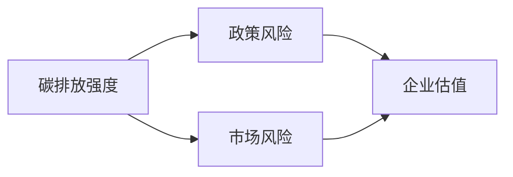
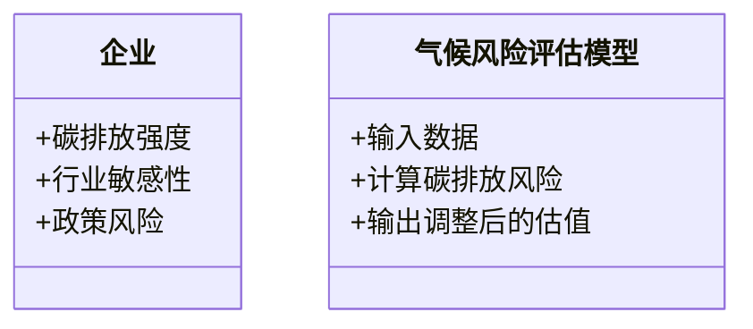
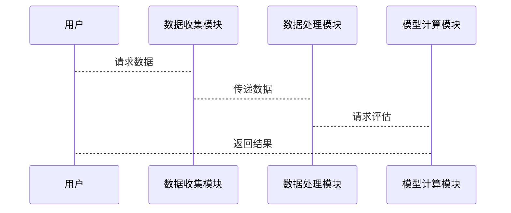

                 


# 价值投资中的气候变化风险考量

> 关键词：价值投资，气候变化风险，风险评估模型，企业碳排放，投资策略

> 摘要：本文探讨了在价值投资中如何考量气候变化带来的风险。通过分析气候变化对全球经济和企业的影响，提出了构建气候变化风险评估模型的方法，并结合实际案例展示了如何将模型应用于投资决策中。文章还讨论了在价值投资中应对气候变化风险的最佳实践策略。

---

# 第1章: 气候变化对全球经济的影响

## 1.1 气候变化的背景与挑战

### 1.1.1 气候变化的定义与现状
气候变化是指地球气候系统的长期变化，主要由人类活动（如化石燃料的使用、森林砍伐等）导致的温室气体排放增加引起。当前，全球气温上升、极端天气事件增多，对全球经济和社会稳定构成严重威胁。

**图表：气候变化的主要驱动因素**


### 1.1.2 气候变化对全球经济的影响
气候变化不仅影响自然生态系统，还会对农业、能源、交通等经济部门造成深远影响。例如，极端天气可能导致农作物减产、基础设施损毁，进而影响全球经济稳定性。

### 1.1.3 企业与投资者面临的挑战
企业需要适应气候变化带来的物理风险（如自然灾害）和转型风险（如政策变化）。投资者需要重新评估其投资组合中资产的风险敞口，避免因气候变化导致的财务损失。

---

## 1.2 价值投资中的气候变化风险

### 1.2.1 价值投资的基本概念
价值投资是一种投资策略，旨在通过分析企业的基本面（如财务状况、盈利能力）来识别被低估的资产。投资者相信市场短期波动不影响长期价值。

### 1.2.2 气候变化对投资决策的影响
气候变化可能导致企业成本增加、利润下降，进而影响其内在价值。投资者需要将气候变化因素纳入估值模型，以更准确地评估资产的长期风险。

### 1.2.3 气候风险在投资中的表现形式
气候风险可以表现为物理风险（如自然灾害导致的资产损失）和转型风险（如政策变化导致的行业调整）。这些风险会影响企业的盈利能力和估值。

---

## 1.3 气候变化与投资风险的关联性

### 1.3.1 气候变化对行业的影响
不同行业对气候变化的敏感性不同。例如，能源行业可能面临政策监管压力，而农业行业可能面临产量波动。

### 1.3.2 气候风险的分类与特征
气候风险可以分为物理风险、法律风险和市场风险。物理风险直接由极端天气事件引起，法律风险源于政策变化，市场风险则由市场对气候变化的反应引起。

### 1.3.3 气候风险与投资回报的关系
高气候风险的行业可能面临更高的财务风险，从而影响投资回报。因此，在价值投资中，投资者需要识别和评估这些风险，以优化投资组合。

---

## 1.4 本章小结
本章介绍了气候变化的基本概念、对全球经济的影响，以及其在价值投资中的重要性。投资者需要认识到气候变化对不同行业的影响，并将这些因素纳入投资决策中。

---

# 第2章: 气候变化风险评估的核心概念

## 2.1 气候变化风险评估的框架

### 2.1.1 风险评估的基本步骤
1. 数据收集：获取企业的碳排放数据、行业相关信息。
2. 风险分析：评估气候变化对企业的潜在影响。
3. 估值调整：根据风险调整企业估值。

### 2.1.2 气候变化风险评估的关键要素
- 企业的碳排放强度
- 行业的政策风险
- 市场对气候变化的敏感性

### 2.1.3 风险评估的指标体系
- 碳排放强度（CO2 per单位收入）
- 气候风险敞口（资产对气候变化的敏感性）
- 气候风险管理能力（企业应对气候变化的策略）

---

## 2.2 企业碳排放分析

### 2.2.1 碳排放的定义与计算方法
碳排放是指企业在生产过程中直接或间接产生的温室气体排放。计算方法包括范围1（直接排放）和范围2（间接排放）。

**公式：**
$$ \text{碳排放总量} = \text{直接排放} + \text{间接排放} $$

### 2.2.2 碳排放对企业价值的影响
高碳排放企业可能面临更高的合规成本和政策风险，从而影响其估值。

### 2.2.3 碳排放的行业差异性分析
高碳行业（如化石能源）的碳排放风险较高，而低碳行业（如可再生能源）的风险较低。

---

## 2.3 气候变化对行业的影响分析

### 2.3.1 高碳行业的风险
高碳行业可能面临政策限制和市场排斥，导致资产贬值。

### 2.3.2 低碳行业的机遇
低碳行业可能因政策支持和市场需求增长而受益。

### 2.3.3 行业间的相互影响
不同行业可能因气候变化而产生连锁反应，例如能源价格上涨可能影响制造业成本。

---

## 2.4 本章小结
本章详细介绍了气候变化风险评估的核心概念，包括框架、碳排放分析和行业影响。这些分析为投资者提供了评估企业气候风险的工具。

---

# 第3章: 气候变化风险评估的算法原理

## 3.1 气候变化风险评估模型

### 3.1.1 模型的基本原理
气候风险评估模型通过量化气候变化对企业财务状况的影响，调整企业估值。

### 3.1.2 模型的输入变量与输出结果
- 输入：企业的碳排放数据、行业敏感性、政策风险。
- 输出：调整后的企业估值。

### 3.1.3 模型的适用范围与限制
适用于高碳行业，不适用于完全不受气候变化影响的行业。

---

## 3.2 数据预处理与特征提取

### 3.2.1 数据清洗与标准化
清洗数据中的缺失值和异常值，标准化处理不同单位的数据。

### 3.2.2 特征选择与降维
选择与气候变化相关的特征（如碳排放强度），使用主成分分析（PCA）降维。

### 3.2.3 时间序列数据的处理方法
使用滑动窗口方法分析历史数据，识别气候变化对行业的长期影响。

---

## 3.3 风险评估的数学模型

### 3.3.1 线性回归模型
$$ \text{企业价值} = \beta_0 + \beta_1 \times \text{碳排放强度} + \epsilon $$

### 3.3.2 非线性回归模型
$$ \text{企业价值} = \beta_0 + \beta_1 \times \text{碳排放强度}^2 + \epsilon $$

### 3.3.3 贝叶斯网络模型
贝叶斯网络用于分析气候变化对企业的多因素影响，例如：

**图表：贝叶斯网络示意图**



---

## 3.4 本章小结
本章介绍了气候变化风险评估的算法原理，包括数据预处理、特征提取和数学模型的应用。这些方法为投资者提供了量化气候风险的工具。

---

# 第4章: 气候变化风险评估的系统分析

## 4.1 系统功能设计

### 4.1.1 领域模型
**图表：领域模型类图**



### 4.1.2 系统架构设计
**图表：系统架构图**


### 4.1.3 系统接口设计
- 数据接口：获取企业碳排放数据。
- 模型接口：调用风险评估模型进行计算。

### 4.1.4 系统交互
**图表：系统交互序列图**



---

## 4.2 本章小结
本章从系统设计的角度，介绍了气候变化风险评估的实现方法。通过模块化设计，确保系统功能的可扩展性和可维护性。

---

# 第5章: 气候变化风险评估的项目实战

## 5.1 项目背景与目标
选择一个高碳行业（如煤炭行业）进行案例分析，评估气候变化对企业的潜在影响。

## 5.2 数据收集与处理
### 5.2.1 数据来源
- 公司财务报表
- 碳排放数据
- 行业报告

### 5.2.2 数据清洗
删除缺失值，标准化处理。

## 5.3 模型实现

### 5.3.1 Python代码实现
```python
import pandas as pd
import numpy as np
from sklearn.linear_model import LinearRegression

# 数据加载
data = pd.read_csv('carbon_emission.csv')

# 数据清洗
data.dropna(inplace=True)

# 模型训练
model = LinearRegression()
model.fit(data[['碳排放强度']], data['企业价值'])

# 预测结果
predicted_value = model.predict([[data['碳排放强度'].mean()]])
print(predicted_value)
```

### 5.3.2 结果分析
模型显示，碳排放强度与企业价值呈负相关关系，说明高碳排放企业估值可能被高估。

## 5.4 投资策略调整
根据模型结果，建议投资者减少对高碳行业的投资，增加对低碳行业的配置。

---

## 5.5 本章小结
通过案例分析，验证了气候变化风险评估模型的实用性。投资者可以根据模型结果优化投资组合，降低气候风险。

---

# 第6章: 气候变化风险评估的最佳实践

## 6.1 最佳实践
### 6.1.1 数据质量的重要性
确保数据的准确性和完整性。

### 6.1.2 模型的局限性
气候变化的影响复杂多变，模型可能无法完全捕捉所有风险。

### 6.1.3 投资者的教育
投资者需要了解气候变化对投资的影响，提高风险意识。

## 6.2 小结
气候变化是价值投资中不可忽视的因素，投资者需要结合模型和实际分析，制定科学的投资策略。

---

# 总结
本文系统地探讨了价值投资中气候变化风险的评估方法和应用。通过理论分析和实际案例，展示了如何将气候变化因素纳入投资决策中。未来，随着气候变化的加剧，投资者需要更加重视这一风险，以实现长期稳健的投资回报。

