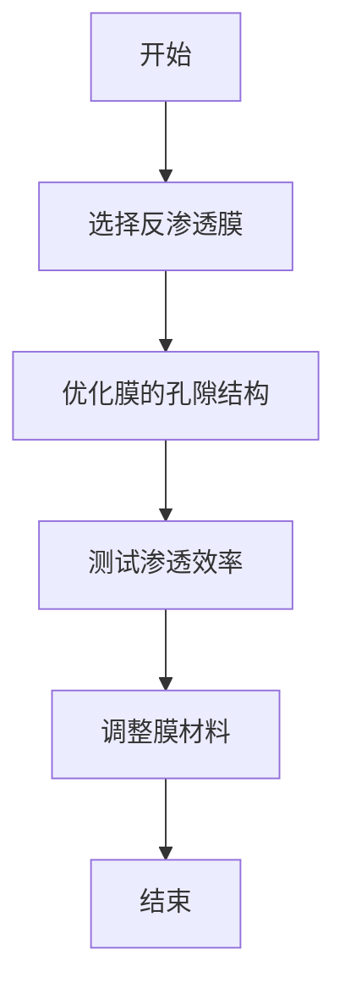
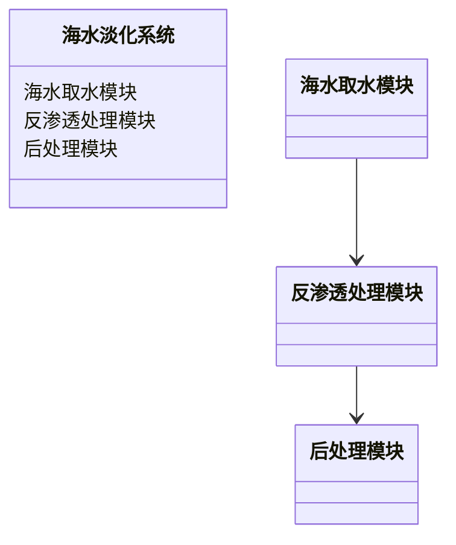
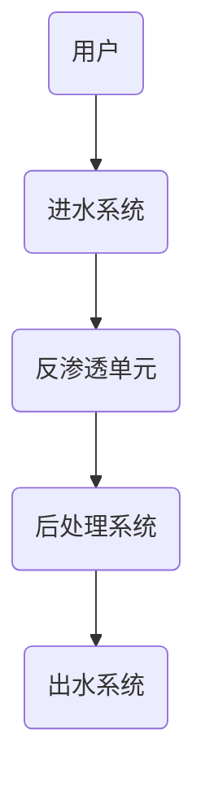

                 


# 价值投资中的海水淡化技术前景

## 关键词：海水淡化、反渗透、价值投资、技术前景、投资策略、经济效益、可持续发展

## 摘要：  
本文深入分析了海水淡化技术的市场潜力及未来发展方向，结合价值投资的基本原理，探讨了如何通过技术分析和市场研究来评估海水淡化领域的投资价值。文章从海水淡化技术的核心原理、价值投资的策略分析、系统架构设计、项目实战案例以及最佳实践等方面展开，为投资者提供了全面的分析框架和决策支持。

---

## 第一部分：背景介绍

### 第1章：海水淡化技术的背景与价值投资概述

#### 1.1 海水淡化技术的背景
- **问题背景**：全球水资源短缺问题日益严峻，海水淡化作为解决淡水短缺的重要手段之一，受到各国政府和企业的广泛关注。
- **问题描述**：海水淡化技术的核心是通过物理、化学或生物方法将海水转化为可利用的淡水，主要技术包括反渗透（RO）、蒸馏、电渗析等。
- **问题解决**：海水淡化技术的应用可以缓解水资源短缺问题，同时为干旱地区提供稳定的水源。
- **边界与外延**：海水淡化技术的边界包括前端的海水取水、中端的淡化处理和后端的淡水输送与利用；外延则涉及能源消耗、环境影响、经济成本等因素。
- **核心要素组成**：主要包括技术选择、成本控制、能源效率、市场需求和政策支持。

#### 1.2 价值投资的基本概念
- **价值投资的核心理念**：寻找被市场低估的优质资产，通过长期持有实现收益。
- **海水淡化领域的投资机会**：随着技术进步和市场需求增长，海水淡化相关企业具有较高的投资价值。
- **海水淡化与价值投资的结合点**：通过技术分析和市场研究，评估海水淡化企业的竞争优势、财务状况和成长潜力。

---

## 第二部分：核心概念与联系

### 第2章：海水淡化技术的核心原理

#### 2.1 海水淡化技术的核心原理
- **反渗透技术**：通过半透膜分离海水中的盐分，是当前应用最广泛的海水淡化技术之一。
- **蒸馏技术**：通过加热蒸发海水，冷凝收集淡水，适用于大规模海水淡化项目。
- **电渗析技术**：利用电场作用分离海水中的离子，适用于处理含盐量较低的水源。

#### 2.2 海水淡化技术的对比分析

| 技术类型 | 优缺点 | 适用场景 | 成本分析 |
|----------|--------|----------|----------|
| 反渗透   | 高效、低能耗、模块化 | 大规模海水淡化 | 中等成本，适合长期投资 |
| 蒸馏     | 处理能力大、技术成熟 | 大型工业项目 | 高成本，适合特定场景 |
| 电渗析   | 适用于中小规模项目 | 低含盐量水源 | 低成本，适合特定需求 |

#### 2.3 ER实体关系图
```mermaid
er
    项目
    {
        类别: 海水淡化技术;
        属性: 技术类型, 优缺点, 适用场景, 成本分析;
    }
    关系
    {
        项目 -[ ]-> 技术类型
    }
```

---

### 第3章：价值投资中的核心概念

#### 3.1 价值投资的核心要素
- **企业基本面分析**：包括收入、利润、资产负债率等财务指标。
- **市场估值与内在价值**：通过市盈率、市净率等指标评估企业估值是否合理。
- **长期投资策略**：关注企业的持续增长潜力和竞争优势。

#### 3.2 海水淡化领域的投资机会
- **市场需求**：随着水资源短缺问题加剧，海水淡化技术的需求将持续增长。
- **技术优势**：掌握核心技术的企业具有竞争优势。
- **政策支持**：政府对海水淡化的政策支持为行业发展提供了保障。

---

## 第三部分：算法原理讲解

### 第4章：海水淡化技术中的优化算法

#### 4.1 反渗透技术优化的算法流程



#### 4.2 反渗透技术优化的数学模型
反渗透技术的水通量公式为：
$$ J = \frac{A \cdot (\Delta P - B \cdot \sigma)}{1 + C \cdot \sigma} $$
其中：
- \( J \) 是水通量，
- \( A \) 是膜的渗透性系数，
- \( \Delta P \) 是膜两侧的压差，
- \( B \) 和 \( C \) 是与膜材料相关的常数，
- \( \sigma \) 是溶液的盐浓度。

---

## 第四部分：系统分析与架构设计方案

### 第5章：海水淡化系统的架构设计

#### 5.1 系统功能设计


#### 5.2 系统架构设计


---

## 第五部分：项目实战

### 第6章：海水淡化项目实施与分析

#### 6.1 项目环境安装
- **硬件**：反渗透膜、高压泵、控制系统。
- **软件**：SCADA系统用于数据监控。

#### 6.2 核心代码实现
```python
def optimize_ro_membrane(P, A, B, C, sigma):
    # 计算最优膜结构参数
    delta_P = P - B * sigma
    optimal_A = A * delta_P / (1 + C * sigma)
    return optimal_A
```

---

## 第六部分：最佳实践

### 第7章：价值投资中的最佳实践

#### 7.1 小结
- 海水淡化技术具有广阔的市场前景。
- 价值投资者应关注技术创新和市场需求。

#### 7.2 注意事项
- 选择具有技术优势和财务健康的企业。
- 关注政策变化和技术进步。

#### 7.3 拓展阅读
- 建议阅读《海水淡化技术与投资分析》和《价值投资经典案例》。

---

通过以上分析，海水淡化技术作为解决水资源短缺的重要手段，具有巨大的市场潜力。价值投资者应结合技术分析和市场研究，寻找具有竞争优势的企业进行长期投资。

