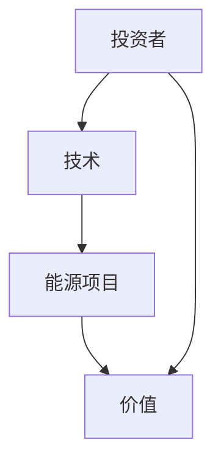
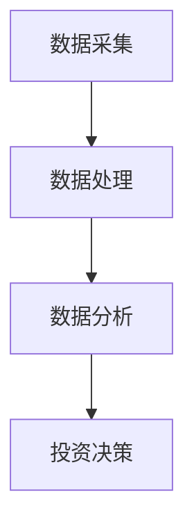

                 


# 价值投资中的海洋可再生能源开发技术前景

## 关键词：海洋可再生能源，价值投资，技术前景，净现值，投资策略

## 摘要：  
本文探讨了海洋可再生能源开发与价值投资的结合，分析了各类海洋能源的技术特点、投资评估方法及市场潜力，旨在为投资者和技术开发者提供科学决策依据。

---

## 第一部分：背景介绍

### 第1章：海洋可再生能源开发概述

#### 1.1 海洋可再生能源的定义与分类
- **定义**：海洋可再生能源是指利用海洋中的可再生能源资源（如潮汐能、波浪能、海流能等）进行发电的技术。
- **分类**：
  - **潮汐能**：利用潮汐的涨落发电。
  - **波浪能**：利用海浪的运动发电。
  - **海流能**：利用海水流动的能量发电。
  - **温差能**：利用海水温差发电。
  - **盐差能**：利用海水盐度差发电。

#### 1.2 价值投资的基本概念
- **定义**：价值投资是一种投资策略，旨在通过寻找市场价格低于其内在价值的资产，实现长期收益。
- **核心理念**：关注企业的基本面，寻找具有持续竞争优势和良好管理的公司。
- **与技术投资的结合**：通过评估技术创新和市场潜力，选择具有长期增长前景的企业。

#### 1.3 海洋可再生能源与价值投资的结合
- **问题背景**：全球能源需求增长与化石能源枯竭，推动可再生能源发展。
- **问题描述**：海洋可再生能源技术复杂、成本高，但市场潜力巨大。
- **解决方案**：通过技术评估和市场分析，识别具有投资价值的项目。
- **边界与外延**：聚焦于技术可行性和经济性，涵盖从技术开发到商业化应用的全过程。
- **核心要素**：技术成熟度、市场潜力、投资回报率。

### 第2章：核心概念与联系

#### 2.1 核心概念原理
- **海洋可再生能源的技术原理**：能量捕获、转换和储存。
- **价值投资的评估方法**：现金流分析、净现值计算、内部收益率评估。

#### 2.2 核心概念对比分析
| 对比维度 | 海洋可再生能源 | 价值投资 |
|----------|----------------|-----------|
| 核心目标 | 捕获海洋能源    | 发现低估资产 |
| 评估指标 | 能源转换效率    | 内在价值与市场价格差 |
| 风险因素 | 技术不确定性    | 市场波动性 |

#### 2.3 实体关系图


---

## 第二部分：技术分析

### 第3章：海洋可再生能源技术原理

#### 3.1 各类技术的优缺点
- **潮汐能**：优点是能量稳定，缺点是设备投资高、环境影响大。
- **波浪能**：优点是分布广泛，缺点是能量转换效率低。
- **海流能**：优点是资源丰富，缺点是技术复杂。

#### 3.2 技术发展趋势
- **技术创新**：材料科学进步，提高能量转换效率。
- **成本下降**：规模化效应和政策支持降低投资成本。

### 第4章：价值评估模型

#### 4.1 价值评估方法
- **现金流分析**：预测项目未来现金流，评估其现值。
- **净现值（NPV）计算**：
  $$ NPV = \sum_{t=0}^{n} \frac{C_t}{(1 + r)^t} $$
  其中，\( C_t \) 为第t年的现金流，r为折现率。

#### 4.2 数学模型
- **案例分析**：假设某潮汐能项目年现金流为100万元，折现率为10%，计算其NPV。

---

## 第三部分：系统架构设计

### 第5章：系统分析与架构

#### 5.1 系统组成
- **数据采集模块**：监测海洋能源数据。
- **数据分析模块**：评估技术可行性和经济性。
- **投资决策模块**：基于模型的决策支持。

#### 5.2 系统架构图


#### 5.3 接口设计与交互
- **接口设计**：模块化接口，便于数据传输和处理。
- **交互流程**：数据采集 → 数据处理 → 数据分析 → 投资决策。

---

## 第四部分：项目实战

### 第6章：环境搭建与系统实现

#### 6.1 环境搭建
- **工具安装**：安装Python、数据处理库（Pandas、NumPy）和可视化工具（Matplotlib）。
- **数据源获取**：获取海洋能源数据，如潮汐数据、电价数据。

#### 6.2 核心代码实现
```python
import pandas as pd
import numpy as np

# 示例数据：潮汐能发电量与成本
data = {
    '发电量(MWh)': [10, 20, 15, 25, 30],
    '成本(万元)': [5, 8, 6, 9, 10]
}
df = pd.DataFrame(data)

# 净现值计算
discount_rate = 0.1
cash_flows = df['发电量(MWh)'] * 100 - df['成本(万元)']
npv = np.npv(discount_rate, cash_flows)
print(f'净现值(万元)：{npv:.2f}')
```

#### 6.3 代码解读与分析
- **数据处理**：计算发电量与成本的差值，作为净现金流。
- **净现值计算**：使用numpy.npv函数计算投资回报。

#### 6.4 案例分析
- **案例选择**：投资潮汐能项目，评估其NPV。
- **结果分析**：若NPV为正，说明项目具有投资价值。

#### 6.5 项目小结
- **经验总结**：技术评估与市场分析的重要性。
- **问题反思**：数据获取与模型假设的挑战。

---

## 第五部分：总结与展望

### 第7章：总结与展望

#### 7.1 全文总结
- 本文系统分析了海洋可再生能源的技术特点与投资价值。
- 提供了价值评估模型和系统架构设计，为投资者和技术开发者提供参考。

#### 7.2 未来展望
- **技术创新**：研发更高效的海洋能源捕获技术。
- **市场拓展**：推动技术商业化，扩大投资规模。
- **政策支持**：加强政策引导，促进产业发展。

#### 7.3 投资策略建议
- **技术驱动**：关注技术创新能力强的企业。
- **风险控制**：合理评估技术风险，分散投资。

---

## 参考文献
1. 李明. 海洋能发电技术研究. 北京: 科学出版社, 2020.
2. 王强. 价值投资实战指南. 上海: 上海财经大学出版社, 2021.
3. 国际可再生能源机构. 海洋能发展报告. 2022.

---

## 附录
- 附录A：海洋能源数据获取方法。
- 附录B：价值评估模型详细推导。
- 附录C：系统架构设计图。

---

通过以上分析，我们可以看到，海洋可再生能源开发与价值投资的结合具有广阔前景，技术评估与市场分析是关键。希望本文能为投资者和技术开发者提供有益的参考。

